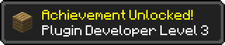

# Preface

## Who is this book for?

This book is for anyone who is curious about Minecraft Modding and Programming. It teaches how to create Minecraft Server Plugins and assumes the reader has no previous programming experience. This book is for beginners of all ages. 

## Introduction

This book shows you how to create your own Minecraft Server Plugins using Javascript. In this book I will sometimes use the word 'mod' and sometimes use the term 'plugin'. For the purpose of this book, these words mean the same thing. Mojang - the makers of Minecraft - prefer to use the term 'Plugin API' rather than 'Modding API' when refering to their forthcoming official API which will make extending Minecraft easier.

Before we begin I better explain some of the words I'll use throughout this book. 

 * Plugin - A Plugin is a file you add to Minecraft which extends the game in some way. 
 * Mod - Mod is short for Modification. In this book, Plugin and Mod are used interchangebly (they mean the same thing).
 * Modding - The practice of writing modifications or plugins for Minecraft. Modding requires some programming knowledge which we will learn about in this book.
 * Mojang - Mojang is the name of the company which makes Minecraft.
 * API - API is short for Application Programming Interface - an official way to write Minecraft Plugins using a guide. Players and regular users of software don't need to care about APIs but they are essential for programmers, because they make it easier to change the software. An API is like a list of Recipes - you probably crafted your first pick-axe by refering to an online guide - how much more difficult would it be to have tried creating one without knowing where all the materials show go in the crafting grid? Similarly, programmers need APIs to provide help and guidance in building plugins. The API we will use in this book is the Bukkit API. We'll learn more about this later.
 * Multiplayer - The mode of playing minecraft with other players all connected to the same server.
 * Server - A computer which is running the minecraft server software. In this book I will show you how to setup and run your own minecraft server.
 * Client Mod - A modification for Minecraft which only works with the Minecraft Client. TODO: Example
 * Server Mod - A modification for Minecraft which works on the Minecraft Server so that the extensions to the game are available for all players who connect to that server. Example: Hunger Games Mod.

## Why I wrote this book

I've been playing Minecraft since 2010 and have been playing Multiplayer Minecraft with my 2 kids on a shared server at our kitchen table since 2011. I work in IBM as a software developer and have been developing software for over 20 years. I took my Kids to local CoderDojo sessions where they learned to use Scratch and create simple web pages using HTML and Javascript. I thought "Wouldn't it be cool if kids could learn to program using Minecraft?". When I first looked into developing Minecraft plugins I was a littled bewildered (read: confused) by the different options available. 

All of the options available also required you to write code in Java. Java is the programming language which Minecraft is written in. It is a fine general purpose language used for many different purposes. It is especially suited to developing large complex business applications. However, it is not ideal as a first language to learn. Learning Java can take some time and you need to write a lot of Java code to get things done. On top of that, even for a seasoned Java developer, the options available for modding minecraft were bewildering. That's when I came up with the idea of making modding easier by letting plugin developers use Javascript instead. 

In late 2012 I launched ScriptCraft - a way of writing Minecraft plugins using Javascript, a much simpler language than its close cousin Java. In early 2014 PeachPit publishing talked to me about writing a book to help beginners learn to program Minecraft Plugins using Javascript. 

I wrote this book to make learning to program fun and easy. I believe that learning even a little about software - how it's made and how it works - is good. Developing Minecraft Plugins is a great way to learn programming and create something fun for yourself and your friends. Maybe you want to create your own Minecraft mini-game or you can't find a Plugin that does exactly what you want or need it to do. This book will teach you how to create your own plugins and mini-games. Playing games is fun. Creating mini-games for others to play is a whole different level of fun.

I hope you'll enjoy reading and exploring the world of programming and Minecraft modding. 

Walter Higgins

April 2014

## Why JavaScript?

In this book I will teach you how to program using the Javascript programming language. Javascript is just one of many programming languages. When I set out with the goal of making Minecraft Plugin development easier I chose Javascript for a few reasons:

 * Javascript is an easy language to learn. 
 * I like Javascript. I enjoy writing code in Javascript and hope you will too.
 * Javascript is expressive. You can do more with less. A little bit of Javascript code can do quite a lot compared to other programming languages such as Java. The shorter your programs are, the easier they are to understand. 
 * Javascript is bundled with Java. The latest versions of Java include Javascript. This means you won't need to install any additional software to use ScriptCraft. 
 * Anything you can do using Java, you can do using Javascript. In this book we'll learn about the Bukkit API - a set of guidelines for creating Minecraft Plugins. The Bukkit API is Java-based but we can use Javascript too!
 * Javascript isn't a toy. Javascript is a proper programming language used professionally by thousands of programmers around the world. Although originally only used for adding simple extensions to web pages, it's now used for developing all kinds of software and has become one of the most popular programming languages. 
 * Javascript is cross-platform. What this means is Javascript is available on Macintosh, Windows and Linux.

### About the Upcoming Minecraft API

When I created ScriptCraft (this was late 2012) there was no one true way to write Minecraft Plugins because there was no official way provided by Mojang. At the time of writing (April 2014) Mojang announced an upcoming official way to write Minecraft Plugins using the Plugin API. The Plugin API will provide a standard way for Plugin Developers to extend the Minecraft game. There is still no official release date for the Plugin API but I'll be watching closely and will make any necessary changes to ScriptCraft when the API is released.
 

# Part I A modding workbench

## Overview
Welcome to the exciting world of Minecraft Modding. In this first section of the book I'll introduce you to the tools you'll need to start modding. Just as in the Minecraft game you need to first create a Workbench (also sometimes called a Crafting Table) before you can craft more sophisticated tools, so too in real life we'll need to first gather some resources and setup a work area where we can create sophisticated minecraft plugins. This first section describes the resources you'll need, how to get them and how to setup your 'modding workbench'. All of the resource you'll need are freely available online. The ingredients you'll need to construct your modding workbench are...

 * CraftBukkit - A freely-available open-source Minecraft Server.
 * ScriptCraft - A Plugin for CraftBukkit.
 * Gedit, TextWrangler, or any other text editor suitable for programming.

... The following chapters will show you how to install and setup each of the above.

## Running your own Minecraft server

I began playing Minecraft in 2010 in Single Player mode. It was fun and a relaxing way to pass the time. One year later, one afternoon I installed the Minecraft Server software and ran it on one of the computers on our kitchen table. My youngest son Sean had just finished his homework so I asked him if he wanted to join the home server. Seeing each other in the game was quite a novelty. Soon my eldest daughter Kate joined in and we began some serious building together. Building in Minecraft is much more fun with others. 

When you play Minecraft in Multi-Player mode and chat, build and mine with other players, you do so on a Minecraft "Server". The Minecraft Server is just a computer program (like Minecraft Client, Microsoft Word or Internet Explorer) which when running provides a shared virtual place for minecraft players to connect, build and chat. You don't need to buy any special type of computer to run a Minecraft Server. You can run a Minecraft Server on your laptop computer (assuming it's not too old). Minecraft server software won't run on an iPad or Android Tablet or phone. It only runs on Windows, Macintosh or Linux computers. 

Minecraft Multi-Player is "Client-Server". That means that one or more "client" computers - computers running the minecraft game - can connect to a central "server" - a computer which is responsible for storing all of the Minecraft World information so that players can play together in the same world. The following diagram is shows a simple Client/Server network with just one client (Player) connected to a Server.

The Client must be connected to the Server over some kind of Network. The line between the Client and the Server in the above diagram represents the network. The client and the server chat with each other using a language which would be gobbledigook to you and I. A Server with just one Client computer isn't much fun though. Servers really become fun when many players are connected to the same server like in the following diagram.

")

In the above diagram, the server must chat with all of the connected clients. For example, if it starts raining in the game, the server must send a message to each client that it's begun raining. In Minecraft Multiplayer, the server is responsible for an awful lot. The server decides what the weather will be like in the in-game world, what time of day it is and so on. This is so that the time of day and weather will be the same for all connected players. 

You'll notice that in the above diagrams, the server is shown a separate computer. This is just for illustration. While very often, Server software *does* run on a separate computers, you won't need a separate computer to run Minecraft Server or following the tutorials in this book. In fact, for learning how to create Minecraft Plugins and to get the best from this book I recommend running Minecraft Server on the same computer you play Minecraft on. **This means your computer will act as both a Client and a Server**. This is by far the most convenient and cost-effective way to run a server and learn how to create Minecraft Server Plugins.

When you play Minecraft in Multi-Player mode, before you can connect to a server you have to enter the Server details into the game. The Server details are a 'hostname' or an 'IP Address', either one of these provides a way for Minecraft Client (the game) to connect to a computer running the Minecraft Server. The 'hostname' or 'IP Adress' are how computers uniquely identify one another on the internet, much like how we identify each other by name and/or address. When you run Minecraft Server on your own computer, you will use a special hostname called `localhost` or IP address `127.0.0.1`. I'll talk more about these in the following sections.

If you haven't already considered running your own Minecraft Server, maybe you've thought it would be too difficult to do. Servers - those are computers in big air-conditioned data-centers looked after by people with computer science degrees - right? Wrong! Servers aren't scary at all. Anyone can run a server. In the following sections I'll show you how. 

### Why run your own server?

Why should you run your own server? Running your own server means you have total control over the Minecraft world you want to create and share with your friends. You can decide what type of server and world you and your friends will play in; what server plugins to install, what rules will govern the server and world, and who can and cannot join the server. In short, you get to play god in the Minecraft world when you administer your own server. As a server 'operator' you will have access to commands that normal players don't. You can control the weather using Minecraft commands, start and stop thunderstorms, even change the time of day. You can also install popular Minecraft Server mods like HungerGames and MobArena. The real power of running your own server comes when you add ScriptCraft which makes it easier to create your own Minecraft Server Plugins. If you have an idea for a new Minecraft mod or would like to do something which current Mods don't support, you can create your own mod and test it on your own server. 

Minecraft Server Plugin developers run their own servers because they need to be able to test their creations before releasing them into the wild for others to use. No serious Modder would consider releasing a plugin which they hadn't first tested on their own private servers. Last but not least, running your own Minecraft server will impress your friends :-)

### Which Minecraft Server Software should I use?

There are a couple of different flavours of Minecraft Server. Mojang provide their own server software which can be downloaded from the Minecraft.net website. This was the very first server software released for Minecraft. This is often refered to as 'Vanilla' Minecraft Server. At the time of writing it doesn't provide any way to add plugins although this will probably change once Mojang release an official Plugin API. The Minecraft Server provided by Mojang is fine if you want to run a server with no modifications. The problems with running such a server are that there's no reliable way to protect against 'griefing'. 

#### Term: Griefing 
A griefer is a player in a multiplayer video game who deliberately irritates and harasses other players within the game, using aspects of the game in unintended ways. A griefer enjoys annoying other users by destroying other player's work, cursing and harrassing players and server administrators.

The standard (Vanilla) Minecraft Server has only limited ways to protect against griefing. Because of this other more popular Minecraft Server Software arose - Server software which allowed server administrators to more stricty control who could and could not join the server, and enforce penalties and bans on players who misbehaved. Popular alternatives such as CraftBukkit - which we'll use in this book - let administrators add any number of anti-griefing plugins to make the server as safe and secure and player-friendly as possible.

### CraftBukkit

> Your server, your way. More for less. The possibilities are endless...
>
> [http://dl.bukkit.org/](http://dl.bukkit.org/)

CraftBukkit has become the most popular Minecraft Server Software. It has a thriving community of Plugin developers. In 2012 Mojang hired the CraftBukkit team to work on Minecraft and the Minecraft API. In this book we'll use CraftBukkit as our Minecraft Server software. CraftBukkit is the Server software but it has an API ( a system which Plugin developers can use to exend the server ) which is called 'Bukkit'. We'll look at the Bukkit API in more detail later. For now, all you need to know is that CraftBukkit is the name of the server Software and Bukkit is the API on top which it's built.

CraftBukkit has become so popular because of its underlying API (Bukkit) which makes it easy for Plugin Developers to extend the Minecraft multiplayer server. There are hundreds of plugins available for CraftBukkit include all of the poplular mulit-player mini-games such as HungerGames and CaptureTheFlag. Chances are, if you've ever played Minecraft Multiplayer on one of the popular public servers, it's been running CraftBukkit. The CraftBukkit Wiki Website provides a wealth of informatoin for both Administrators (the people who run CraftBukkit Servers) and Developers (the people who create plugins for CraftBukkit - you) and I highly recommend checking it out [http://wiki.bukkit.org/](http://wiki.bukkit.org/) .

### Installing CraftBukkit

The first step in constructing your Modding Workbench is to install CraftBukkit. Unlike many games, Minecraft is in ongoing development. This means that new versions of Minecraft are released quite often. When you purchase and download the Minecraft Client you automatically get new versions of the game when they are released. This is great for players because you get the latest and greatest version for free, which often includes bug fixes and new features. If you've played Minecraft Multi-Player before on one of the popular public servers, you'll know that there's just one downside to Mojang's commitment to improving Minecraft - Server software upgrades does not happen as often as Client software upgrades. This can lead to Client software and Server software which is "incompatible". When the Client and Server versions are incompatible it means is that the client and the server cannot chat with one another. 

#### Term: Bug
"Bugs" in software are errors or mistakes in the software code which can cause problems. Nobody quite knows for sure why errors in software are called bugs but one story goes that a problem with an early mechanical computer in the 1940s was caused by a Moth which somehow found its way inside. The term "Bug" had been used to describe errors long before computers came along, so when the engineers captured the Moth they kept it with a note that said "First actual case of bug being found." 

Usually, a compatible version of the Minecraft Server software is released shortly after the Minecraft Client is upgraded. One thing to keep in mind is that CraftBukkit is an open-source and voluntary project - this means that the people who develop CraftBukkit don't get paid to do so. They do it for fun. Upgrading Server software takes a lot of work and the software needs to be tested (by volunteers) before it can be released. That's why sometimes it may take a while for a new version of the Minecraft Server Software to be released which is compatible with the latest and greatest client. Be patient and remember that the developers who work on CraftBukkit do it for fun and don't get paid so posting questions on the CraftBukkit forums asking when will the new version be ready won't speed things up :-)

At the time of writing the Minecraft Client Version 1.7.8 is the most current version. This is what the CraftBukkit website's Home page looks like at that time.

The large Download button will download the CraftBukkit Recommended Build. The Recommended Build is the version of the Craftbukkit server software which is considered to be the most reliable version because it has undergone the most testing. However, the Recommended Build is not always the most current or up-to-date version of the software. Fortunately the developers of CraftBukkit also let you download up-to-date versions of the software with the warning that the most up-to-date version may not always be the most reliable version. 

Just beneath the prominent "Recommended Build" Button, you'll see "Beta Build" link. "Beta" software is software which is "nearly" ready for release. It's software which is functionally complete - that is - the developers have added all of the features they're going to add but the software still needs to be tested for quality assurance. It's usually OK to run Beta software but you may come across one or two software "Bugs". If the "Beta Build" version does not match the current version of Minecraft then click on the "Alternate Versions" link beneath the "Beta Build" link. This will take you to the CraftBukkit Builds page where you will see a list of "Builds" or versions. The following screenshot shows what the download page looks like at the time of writing.

Along the right-hand side of the page are three big color-coded download buttons. The Green button is for the most recent stable release. Note that though this is the most stable version, it may not be the most up-to-date version or a version which is compatible with the current Client. The Amber button is for the most recent Beta build. This is a version which is not as stable as the released version but will have undergone some testing and will most likely be in use already on some servers. The Red button is for the most recent development build. It's colored red because it is the least stable version. Development builds will not have undergone the same rigorous testing as Beta or Release software. On the other hand, development builds will be the most up-to-date and chances are, there will be a development build of the Server Software for the latest version of the Client software.

Choosing which version of the Server Software to use - Recommended, Beta or Development - is a big decision and one I unfortunately can't make for you. That decision is entirely up to you. However, If you feel safer using only the Recommended build of CraftBukkit, and that build version is not for the most up-to-date Client, then there's a way you can safely and temporarily (for the short-term) "Downgrade" your Minecraft Client Software so that it will be compatible with your Server software. 

Since version 1.6, the Minecraft Launcher (the software you run on your computer to start Minecraft Client and to upgrade to new versions when they become available) lets you choose which verison of the Client software to run. By default the Launcher is configured to always download and run the Latest Version but you can easily change this using the new "Profiles" feature. The following are step-by-step instructions for changing your Launcher profile to use a different version of Minecraft Client...

1. Launch Minecraft 
2. Click on the 'New Profile' button in the bottom right of the Launch Screen.
3. Fill in the Profile Name field. For example you should call it something like 'Version 1.7.8' (replacing 1.7.8 with the version you've chosen). I find it helpful to include the version name in a new Profile so I can see at-a-glance which Client version the profile will use.
4. Choose the appropriate version from the 'Use Version' drop-down list.
5. Click the Save Profile button.

The newly created profile should now be automatically selected in the Profile drop-down list on the main launcher page. Click the Play button to begin playing using the chosen version of Minecraft Client software.

By using the profile editor to "Downgrade" your Minecraft Client Software, you can ensure that your Client and Server are compatible and that you can play Multi-Player minecraft even when the Server Software is not as up-to-date as the current latest version of Minecraft Client. This means you can always use the most stable Recommended build of CraftBukkit, you just (temporarily) sacrifice some of the latest features in the Client. 

Once you've chosen between the Recommended, Beta and Development versions of CraftBukkit (If you're unsure, choose the Recommended Version), click on the appropriate color-coded button to begin downloading the software. Depending on which Browser software you use (Chrome, Safari, Internet Explorer or Firefox) the instructions for downloading will differ. Please read the instructions for the Browser you use. 

#### Term: JAR File

The CraftBukkit software is downloadable as a `.jar` file. Programs which are created using the Java Programming Language are often distributed as JAR files and will have a name which ends with `.jar`. JAR is short for **J**ava **AR**chive file. It's an archive of all of the code and resources needed by Java to run the software. CraftBukkit is distributed as a JAR file. So too are all of the plugins for CraftBukkit.

#### Download Instructions: Chrome

1. Click on the appropriate color-coded button on the Bukkit Downloads page (Remember: Green for Recommended/Stable, Amber for Beta and Red for Development/Unstable).
2. A warning prompt will appear at the bottom of the Chrome window with the following text: "This type of file can harm your computer. Do you want to keep craftbukkit.jar anyway?"
3. Alongside the above message there will be two buttons "Discard" and "Keep". Make sure to click the "Keep" button to start downloading.
4. Press the CTRL key (on the bottom left side of your keyboard) and the 'J' key together to open the Downloads view in Chrome.

5. You will see a list of recently downloaded files. Underneath the craftbukkit jar file you just downloaded, you'll see a 'Show in Folder' link. Click this link to open the folder containing the recently downloaded file.

6. Select the craftbukkit jar file you just downloaded, right-click and choose 'Copy' from the popup menu. 
7. Create a new folder on your computer and call it 'CraftBukkit'. Make sure you create the folder somewhere convenient so you don't forget where it is.
8. Paste the file from step 6. into the newly created Folder. 

#### Download Instructions: Safari

1. Click on the appropriate color-coded button on the Bukkit Downloads page (Remember: Green for Recommended/Stable, Amber for Beta and Red for Development/Unstable).
2. Once the download is complete click the Download button (A button with a Down arrow) in the top right corner of the Safari screen. 

3. Next to the file you will see a 'Show in Finder' link. Click this link to open the folder containing the recently downloaded file.
4. Select the craftbukkit jar file you just downloaded, ctrl-click (hold down the Ctrl key while clicking) and choose 'Copy' from the popup menu. 
5. Create a new folder on your computer and call it 'CraftBukkit'. Make sure you create the folder somewhere convenient so you don't forget where it is.
6. Paste the file from step 4. into the newly created Folder. 

#### Download Instructions: Internet Explorer

1. Click on the appropriate color-coded button on the Bukkit Downloads page (Remember: Green for Recommended/Stable, Amber for Beta and Red for Development/Unstable).
2. When prompted, you should click the 'Save' button to save the file.
3. When the download has completed, you can view the downloads by pressing Ctrl+J

4. Next to the file you will see a 'Downloads' link. Click this link to open the folder containing the recently downloaded file.
5. Select the craftbukkit jar file you just downloaded, right-click and choose 'Copy' from the popup menu. 
6. Create a new folder on your computer and call it 'CraftBukkit'. Make sure you create the folder somewhere convenient so you don't forget where it is.
7. Paste the file from step 5. into the newly created Folder. 

#### Download Instructions: Firefox

1. Click on the appropriate color-coded button on the Bukkit Downloads page (Remember: Green for Recommended/Stable, Amber for Beta and Red for Development/Unstable).
2. When prompted, you should click the 'Save' button to save the file.
3. Once the download is complete click the Download button (A button with a Down arrow) in the top right corner of the Firefox screen. 

4. Next to the file you will see a 'Open Containing Folder' link. Click this link to open the folder containing the recently downloaded file.
5. Select the craftbukkit jar file you just downloaded, right-click and choose 'Copy' from the popup menu. 
6. Create a new folder on your computer and call it 'CraftBukkit'. Make sure you create the folder somewhere convenient so you don't forget where it is.
7. Paste the file from step 5. into the newly created Folder. 

Once downloaded, the next step is to install CraftBukkit on your computer. The instructions are slightly different for each operating system so skip directly to the instructions for your operating system ...

#### Installing Bukkit on Windows

1. Open Notepad (You can find it by clicking the 'Start' or Windows button in the bottom left of the screen then typing 'Notepad' in the search box.
2. Type the following into Notepad...

         java -Xmx1024M -jar craftbukkit.jar -o true
         PAUSE

   ... depending on the name of the file you downloaded earlier, you may need to change `craftbukkit.jar` to match the exact name of the file.
   
3. Save the document as run.bat in the Folder you created earlier (the same Folder where you copied the craftbukkit jar file). It's important that you change the 'Save as type:' option from `Text Documents` to `All Files` otherwise Notepad will try to save the document as run.bat.txt. 

4. Double click the run.bat file you saved in the previous step and CraftBukkit should start running. If you see an error message along the lines of "Java is not recognized as an internal or external command, operable program or batch file" then you need to reinstall Java. Java is the programming language Minecraft is written in. It's also the programming language the CraftBukkit Minecraft Server is written in. You can download Java by visiting `http://www.java.com/` and following the instructions. If after installing Java you still get the same error then follow the instructions at `http://www.java.com/en/download/help/path.xml`.

5. Assuming the server has started up (you didn't see any errors), you can shut down the server by issuing the `stop` command at the server console (type `stop` then hit ENTER).

#### Installing Bukkit on Mac OS

1. The first thing you'll need to do is install Java. Since OS X 10.7 Java no longer comes bundled with OS X so you will need to install Java from Apple's Java Install page `http://support.apple.com/kb/DL1421` .

2. Open TextEdit (you can find it by typing `TextEdit` in the Spotlight field in the top right of the screen. Click the Magnifying Glass Icon to bring up Spotlight)

3. Under the `Format` menu, choose `Make Plain Text` then type the following...

        #!/bin/bash
        cd "$( dirname "$0" )"
        java -Xmx1024M -jar craftbukkit.jar -o true    

   ... depending on the name of the file you downloaded earlier, you may need to change `craftbukkit.jar` to match the exact name of the file.

4. Save the file in your CraftBukkit folder as start_server.command

5. You will need to be able to run this newly created file so...

    1. Open the Terminal Application (to find it, click the Magnifying Glass icon and type `Terminal` in the Spotlight field)
    2. Type `chmod a+x` (don't hit enter yet)
    3. Find the file you just created in the Finder and drag and drop it into the Terminal window.
	4. The name of the file you just dropped into the terminal window will be appended to the `chmod a+x` command so you can now hit ENTER.
    
6. Start the server by double clicking the start_server.command file. 

7. To stop the server issue the `stop` command in the terminal window (type `stop` then hit ENTER).

If you run into trouble installing CraftBukkit you can find plenty of useful tips and troubleshooting on the CraftBukkit Wiki website `http://wiki.bukkit.org/Setting_up_a_server`. 
    
#### Installing Bukkit on Linux (Ubuntu)

1. Open `Text Editor` by clicking the `Dash Home` button in the top left corner of the screen, then type `Edit` to see a list of editors (you can choose `Text Editor` or another editor of your choice)

2. Type the following into the editor...

        #!/bin/sh
        BINDIR=$(dirname "$(readlink -fn "$0")")
        cd "$BINDIR"
        java -Xmx1024M -jar craftbukkit.jar -o true

   ... depending on the name of the file you downloaded earlier, you may need to change `craftbukkit.jar` to match the exact name of the file.

3. Save the file as `craftbukkit.sh` in the folder you created earlier (the same Folder where you copied the craftbukkit jar file).

4. You will need to make this new file executable. In Nautilus (Linux's File browser) right-click on the file and select properties. In the properties dialog, click the 'Permissions' tab then ensure that the 'Execute' checkbox is ticked. (You can also make the file executable by issuing the unix command `chmod +x craftbukkit.sh` from the folder where you saved the file.

5. Launch the Terminal Application and type `~/craftbukkit/craftbukkit.sh` (assuming you created a folder called `craftbukkit` in your home folder).

6. Once the Craftbukkit server console has launched, you can stop it by issuing the Craftbukkit `stop` command (type `stop` then hit ENTER).

### Configuring your server
Once you've installed CraftBukkit, the next step is configuration. This is where you decide what kind of Minecraft Server you want to run. Will it have Monsters? Will it be Survival mode or Creative mode? Will it be Player vs Player, and so on. While configuration is something you'll probably only do once, you can later change the server configuration at any time you like. The server configuration isn't set in stone, just bear in mind you will need to restart your server if you change the configuration. I'll show you how to do that later.

#### The server.properties file
When you first launch CraftBukkit a couple of configuration files and folders will be created in the CraftBukkit folder (the folder where you store the craftbukkit jar file and startup script). When configuring your server, the most important file is `server.properties`. This is a plain-text file (meaning it can be edited using any text editor) containing all of the configuration for your server. The first few lines of my own `server.properties` look like this:

    #Minecraft server properties
    #Sun Apr 20 11:11:20 IST 2014
    generator-settings=
    op-permission-level=4
    allow-nether=false
    level-name=world
    enable-query=false
    allow-flight=false
    announce-player-achievements=true
    server-port=25565
    level-type=FLAT

The first two lines - the lines which begin with a `#` character (also known as the Hash symbol) - are comments, they are ignored by the server. The configuration begins properly on line 3 `generator-settings=` which is used for generating worlds (this has a default value of blank - no value). The settings for the server are specified using `Name Value Pairs`. A Name Value pair is programmer-speak for how settings are written. For example in the setting `allow-flight=false`, `allow-flight` is the Name of the property and `false` is the value. `allow-flight=false` is a Name Value Pair where the name is `allow-flight` and the value is `false`. In property files the name and value are separated by the `=` (equals) symbol. Let's look at just some of the properties you might want to change.

##### World Type
Later in the book I'll show you how to use Javascript to create castles, forts, roads and skyscrapers. If you plan to eventually put your newfound programming prowess to use building large-scale places for others to visit, you'll probably want to change the `level-type` property from `DEFAULT` (Minecraft's standard setting where worlds are made of varied landscapes of hills, valleys, and oceans) to `FLAT`. In a `FLAT` world, everything is - as you can probably imagine - flat. There are no hills, no valleys, just flat terrain for as far as you can see. While this might be considered boring, it does have the advantage of being easier to build upon. If you plan to build roads, houses and other large-scale constructions, a `FLAT` world might be the best place to start. It's not essential that the `level-type` is set to `FLAT`, you can always leave this setting at `DEFAULT` and just flatten the area you want to build on first. **If you later decide to change the level-type, the setting only applies when creating new worlds. Existing worlds will not be modified.**

If you decide to create a new world and want to use a `level-type` other than `DEFAULT` you have two options:

1. Change both the `level-name` and `level-type` properties to create a brand new world while keeping the old world (The old world will not be wiped out - it will still be on your computer stored in the `world` folder). This is the best option if you want to keep your existing world data. You need to change the `level-name` setting to something other than `world` (the default value). Call your new world something memorable like `walter-flat-world`. 

2. If you don't care about keeping the existing world, delete the `world` Folder from the CraftBukkit Folder and change the `level-type` property. The next time the server starts, a brand new world and a new `world` folder will be created.

##### Monsters
The next setting you'll probably want to change is the `spawn-monsters` setting. This determines if monsters will be spawned. By default it's set to `true` which means monsters will appear at night and in the dark. I recommend changing this setting from `true` to `false` because the last thing you need while learning to program is to be attacked by giant spiders. You can change this setting any time you like. The setting won't take effect until you restart the server. I'll talk about starting and stopping the server very shortly.

##### Game Mode
For the same reason I suggest making your server a monster-free zone, I also suggest changing your server's `gamemode` property from 0 (Survival) to 1 (Creative). In Survival mode, you will need to constantly seek food and be careful not to fall. In Creative mode you can give your full attention to learning to program and master your surroundings through the power of Javascript.

#### The ops.json file

The ops.json file is a configuration file listing all of the 'Operators' for the server. Operators are players who have special privileges on the server. Operators (also sometimes called 'Administrators' or 'Admins') are responsible for keeping the server running and ensuring that players play nice and don't grief. If players don't play nice, Operators have to power to ban or kick players off the server using special commands only available to them. 

There may already be an ops.json file present in your CraftBukkit folder. If there isn't, then one will be created automatically when you run the `op` command from the server console. You will need to be an Operator to issue Javascript commands in the game so one of the first things you should do once you've installed the Minecraft Server is 'op' yourself - that is - make yourself an operator by issuing the `op username` command replacing `username` with your own Minecraft user name. For example, I would issue the command `op walterh` because `walterh` is my minecraft user name. ScriptCraft - the plugin we'll install later - only allows operators to issue javascript commands.

We're done with all of the server configuration we'll need for now. If you want to delve deeper into server configuration, a good place to start is by reading the http://minecraft.gamepedia.com/Server.properties page.

### Basic Server administration commands
CraftBukkit's usefulness as a minecraft server comes from its extensibility - that is - its ability to be extended and made more interesting by adding plugins. Many of the high-profile public minecraft servers actually run CraftBukkit because of the wide range of server plugins available for it. Popular Minecraft Mini-games like 'Hunger Games' and 'Spleef' are all CraftBukkit plugins. In this book we'll use just one plugin - ScriptCraft which lets operators extend the game using Javascript. There are just a few things you'll need to know about server administrator to get the most from this book. 

#### Starting and stopping your server
To start your minecraft server, double click on the startup script you created earlier in this chapter. This launches the minecraft server in a terminal window. The terminal window will look something like this:

Don't worry if your terminal window doesn't look exactly like this or has slightly different content. The important thing is that after starting up, your server should display a server console prompt - `>` (right arrow symbol) in the bottom left of the screen along with a blinking cursor. This is called the server console and you can issue administration commands here even if you aren't an operator. Try it: issue the `help` command to see the full list of commands you can use as the Server Console user.

In the Server Console window, you don't need to put a `/` (forward slash symbol) in front of commands the way you do in the Minecraft Client. So you simply type the command name instead of `/` followed by the command name. So remember `help` instead of `/help`, `toggledownfall` instead of `/toggledownfall` and so on. 

Another thing to note about the server console is that when you enter commands there, you do so as a special player called 'CONSOLE'. In Minecraft the `/me` command is used to send a message to other players in the form of 'Yourname Action'. For example, if *I* issue the command `/me sneezes` in the Minecraft client, all other players on the server will see `walterh sneezes`. However, if you or I issue the same command in the server console, you will see `CONSOLE sneezes` instead of your own name. When you issue commands in the Server Console, you do so as a special player called 'CONSOLE'. CONSOLE is not visible to other players and does not inhabit the minecraft world. Normally only the person who starts the server can issue commands as CONSOLE.

To stop the server, you should issue the `stop` command at the server console. If you plan to administer a minecraft server for others to play, the `stop` command will come in handy whenever you want to shutdown the server for maintenance or troubleshooting.

#### Reloading plugins

Another useful command you should know about is the `reload` command. This command will unload all of the server's plugins and then load them up again. This is a faster and more convenient way of reloading plugins than shutting down the server and restarting it. If you manage a server with many players connected and want to install a new version of a plugin then the `reload` command lets you load the plugin without shutting down your server and disconnecting players.

### Achievement Unlocked!

By now you should have your very own Minecraft server installed and running. **Congratulations, you're well on your way to becoming a Minecraft Modder!**

### Other Server Options
There are other Minecraft Server options available but installing and running your own server is the only sensible option if you want to start modding. 

#### Commercial Minecraft Hosting
Once you've mastered Server Administration and Modding you might eventually decide to use one of the many commercial minecraft hosting plans available online. These Minecraft hosting providers usually charge a monthly fee, so they are not free. For your money, they provide you with a Minecraft server you and your friends can connect to and play. They usually offer managed install of plugins through a web-based Administration portal (A web page where you can choose which plugins your server should use). Commercial Minecraft Hosting isn't cheap and it's not as flexible as running your own server. You certainly don't need to sign up to commercial minecraft hosting to get the most from this book. You can find a list of minecraft hosting providers by searching 'Minecraft Hosting' on Google.

#### Minecraft Realms
Mojang are rolling out their own Minecraft Hosting solution - Minecraft Realms - throughout the world. It's available in some countries right now and will be available in more soon. Minecraft Realms does not currently support plugins of any kind though that may change in the future. 

## ScriptCraft

In the previous chapter we downloaded and installed CraftBukkit; a customizable Minecraft Server. In this chapter we'll install ScriptCraft - a server plugin which lets you write your own plugins using the Javascript programming language. 

### What is ScriptCraft?

ScriptCraft is a plugin for Minecraft which lets you create plugins using Javascript instead of Java. It is a server plugin which means it is installed on a server (CraftBukkit) but once installed can be used by all players connected to that server. I created ScriptCraft for a couple of reasons:

1. To make it easier for myself to create Minecraft mods.
2. To make it easier for my kids (and others) to create Minecraft mods.
3. To make it easier to teach programming to kids using Javascript and Minecraft as tools.

Most Minecraft Plugins are written in a language called 'Java'. Java was invented back in the 1990s as a simpler way to program. Before Java, programmers used languages like C and C++ which were difficult to learn and use. C and C++ were difficult because if you wrote a program that wanted to grab some space in the computer's memory, you had to remember to free up that space when you no longer needed it, otherwise the computer would quickly run out of memory and the program would crash. Java solved this problem by having automatic `Garbage Collection` (yes - that's what we programmers actually call it) which automatically frees up memory when it was no longer needed. Java has many other advantages too. It has a large library of functions to do common tasks so you don't have to write those functions yourself and Java is `cross-platform` which mean it runs on Windows, Linux and Mac OS. Minecraft is written in Java and so too are Minecraft servers. 

Java is a fine language and is widely used. However, it can be a little difficult to learn - especially if you are completely new to programming. Java can be verbose - meaning you need to write a lot of Java code to do even simple things. Java code can't be executed right away either. You need to first "compile" it. Compiling is the process of converting Java source code into a form the computer can understand. 

Javascript came along shortly after Java. It was invented in the mid 1990s just when the Internet was becoming really popular. Although their names sound alike they are very different languages. JavaScript is simpler than Java in many ways. In recent years it has become popular as a language not just for web programming but for all kinds of uses. 

ScriptCraft is a Minecraft Server plugin which makes it possible to write your own plugins using Javascript. As well as writing your own plugins, you can also use ScriptCraft to build large-scale structures (Skyscrapers, Temples, Roads, Castles and Forts) in the game.

### Installing ScriptCraft

To download and install ScriptCraft follow these steps...

1. Visit http://scriptcraftjs.org/download/latest/
2. Right-click on the scriptcraft.jar file and select 'Save Link As...' from the popup menu. 
3. Save the file to the CraftBukkit plugins folder. If there is no `plugins` folder in your craftbukkit folder it's probably because you haven't yet launched CraftBukkit. The first time CraftBukkit is launched it creates a couple of configuration files and a plugins folder so make sure you've launched CraftBukkit at least once before attempting to download ScriptCraft. 

If there is already a scriptcraft.jar file in your CraftBukkit plugins folder (if this isn't the first time you've installed ScriptCraft) , make sure to remove it first before saving the new file.

If CraftBukkit is running, stop it by issuing the `stop` command in the server console. 

Launch Craftbukkit by double clicking the launch script you created earlier. When CraftBukkit starts up you should see an `Enabling scriptcraft` message appear in the server console. The first time it's loaded, the ScriptCraft plugin will unzip a lot of files into a new `plugins/scriptcraft` folder inside your CraftBukkit folder. Your server console output might look something like this...

    Enabling scriptcraft v2.0.6-2014-04-20
    Directory /home/walter/cb179/plugins/scriptcraft does not exist.
    Initializing /home/walter/cb179/plugins/scriptcraft directory with contents from plugin archive.
    Unzipping /home/walter/cb179/plugins/scriptcraft/lib/command.js (NE)
    Unzipping /home/walter/cb179/plugins/scriptcraft/lib/console.js (NE)
    Unzipping /home/walter/cb179/plugins/scriptcraft/lib/events.js (NE)

... There will be many more entries as there are many files bundled with ScriptCraft. 

The 'plugins' sub-folder in CraftBukkit is important. It's where all Minecraft Server plugins should be stored. This is true not just for ScriptCraft.jar but for all server plugins. If you save a Server plugin jar file to any other location except the plugins folder, then it will not be loaded when the minecraft server starts up. The minecraft server only looks in the plugins sub-folder for plugins to load at startup.

### Verifying ScriptCraft is installed.

You can verify that ScriptCraft has been successfully installed by issuing the following command at the server console:

    js 2 + 3

Make sure to type the above text exactly as you see it and then hit the ENTER key. The response you get from the server console should of course be `5` . 

#### Achievement Unlocked!

Congratulations! You've just installed ScriptCraft and executed your first line of Javascript code. 

ScriptCraft adds just 2 new server commands to the Minecraft server `js` and `jsp` - we'll talk about `jsp` later in the book. The `js` command is short for `JavaScript` and it lets you execute javascript code right away. More on this in the next chapter...

## A Javascript command prompt

Once you've installed ScriptCraft, you can use the `js` command to evaluate Javascript. The `js` command will try to evaluate any of the text which follows it, as Javascript. You must type a `SPACE` between the `js` and the javascript you want to evaluate. The `js` command will evaluate the javascript and print out the result of the expression. So if you type `js 2 + 7`, the `js` command will take `2 + 7`, try to evaluate it, and if it can, will print the result. Let's practice with a few simple Javascript expressions.

### Basic Math operations

The expressions we've used so far are simple addition operations. Javascript has a number of mathematical operations. I want you to type each of the following expressions into the server console as you read them. It will be good practice for you. As a general rule you should try executing the code yourself. The best way to learn programming is to try stuff out rather than just reading. Try executing each of the following mathematical operations:

There's addition which uses the `+` operator. 

    js 2 + 2
    
There's division which uses the `/` symbol (there's no &divide; key on your keyboard so `/` is used instead)

    js 2 / 3
	
There's subtraction;

    js 2 - 3
    
And there's multiplication which uses the `*` symbol (this is called the asterisk symbol - it's usually typed by holding down the SHIFT key and 8)

    js 2 * 3
    
Javascript can also be used to compare numbers so you can ask 'Is 3 greater than 5?` like this...

    js 3 > 5 

The answer to the above is `false` (3 is not greater than 5). I can ask 'Is 3 less than 5?' like this...

    js 3 < 5
    
... and the answer of course is `true`. I can also ask 'Is 3 equal to 5?' like this...

    js 3 == 5 
    
... notice that I use *two* `=` symbols not just a single one and that's very important. The result of the above expression should of course be `false`. I'll talk about what a single `=` symbol means shortly. The `true` and `false` values are really important because they are used in computer programming to make the computer behave differently in different circumstances. For instance, in the Minecraft game, there is code which asks 'Does the player have any health points left?' and if the answer to that question is `true` then the player can continue playing.

### Variables

You can't type just anything after the `js` command and expect an answer. You have to use expressions that Javascript understands. For example if I type:

    js hearts
    
The server responds with an error message `javax.script.ScriptException: ReferenceError: "hearts" is not defined` which is Javascript's way of saying "I don't understand what you mean by 'hearts' ".

Right now Javascript does not know what you mean by `hearts`. If you want to tell the computer what `hearts` is you do so like this...

    js hearts = 8;
    
... which basically says that hearts is equal to 8. There's a couple of things worth noting about the above expression. Firstly `hearts` is now a variable. A variable is just something javascript uses to store things in. Variables are used in all programming languages to store information. When we want the computer to remember something and to keep track of it we use a variable. You can think of a variable as a named storage location. It's like a storage chest in minecraft. You can put stuff in a variable, come back to it later and it will still be there.

Now when you type `js hearts`, Javascript understands what `hearts` and remembers its value and prints it out. Try it:

    js hearts
    
It should print out `8`. Secondly what I've done in the `js hearts = 8` expression is made an 'assignment'. I've 'assigned' the value 8 to the variable 'hearts' which I've done using a *single* `=` sign. I can reassign the variable 'hearts' a different value like this:

    js hearts = 9
    
That's why variables are called 'variables' - they can vary (or change) . Now when I issue the command:

    js hearts
    
It prints out `9`. Just as you can do math with numbers in Javascript, you can also do math with variables. Try this command:

    js hearts + 1
    
... should print out `10` as the result. That's because the computer now knows that 'hearts' is equal to 9 and that 9 + 1 is 10. Try each of the following commands yourself:

* `js hearts + 5`
* `js hearts - 2`
* `js hearts * 2`
* `js hearts / 3`

After executing all of the above commands issue the command:

    js hearts
    
You'll notice that the value of the 'hearts' variable is unchanged. It's still `9`. If you want to change the value of `hearts` by some amount you need to reassign it the new value. You can do so like this:

    js hearts = hearts + 1
    
What we've done here is combine a math operation and an assignment in a single statement. Now issue the command `js hearts` and you'll see that hearts is now `10`.

Let's create another variable called 'healthMessage' and assign it a value:

    js healthMessage = 'You have ' + hearts + ' health remaining'
    
What I've done here is create a new variable, and assigned it a value. The value is some text plus the value of the 'hearts' variable, plus some more text. Everything between `' '` (single quote symbols) or `" "` (double quote symbols) in javascript is treated as text. The result of this expression is:

    You have 10 health remaining
	
Javascript creates a new variable called `healthMessage`, then joins together the 3 values `'You have '` (which is text) , `hearts` (which is a number) and `' health remaining'` (more text) and constructs a new value `'You have 10 health remaining'` and assigns it to the `healthMessage` variable.

In javascript, text is also called 'Strings'. A String is the word Programmers use when talking about text. Here are some examples of Strings (text) in javascript:

* `js "Hello"`
    
* `js 'Goodbye'`
    
* `js "Minecraft 1.7.9"`
    
* `js "123"`

That last one might surprise you. Javascript treats anything between quotes as a string even if it's a number! In our first string example `js healthMessage = 'You have ' + hearts + ' health remaining'` I used the `+` operator to add strings together. The `+` operator can be used to add numbers or strings. When used to add strings, the `+` operator behaves differently. Adding Strings in javascript is also called 'Concatenation'. We concatenate 2 or more strings together to form bigger, longer strings. This is a technique you will use quite often in programming minecraft plugins when you want to display information to players. 

You can create as many variables as you like in Javascript. There's no limit on the number of variables you can create. You'll notice that both the 'hearts' and 'healthMessage' variables use one-word names. I could not call the 'healthMessage' variable 'health message' because variable name cannot have space characters. There are a few other rules about what javascript will accept as a valid variable name. It doesn't like variable names that begin with numbers so `2player` is not a valid variable name but `player2` is. 

Javascript programmers - as a habit - generally use lowercase letters for variable names and if the variable name is made of two words joined together (as in `healthMessage`) then the first letter of the second word is usually uppercase. This style of variable naming is called Camel-Case and is considered 'Good Practice' among javascript programmers. What this means is that using this naming convention makes it easier for programmers to read and understand each others (and their own) code.

You can read more about CamelCase on WikiPedia http://en.wikipedia.org/wiki/CamelCase

Feel free to experiment at this point. Create your own variables using your own numbers, strings and operators. If you make a mistake you'll see a long-winded error message in your console window. These error messages are called stack traces and they're the computers way of telling you something went wrong. Stack traces can be very useful for Java programmers but not so useful for Javascript. Remember - the Minecraft Server software is written in Java not Javascript. You can think of ScriptCraft (the plugin you use when you type the `js` command in the server console) as a translator. It translates the Javascript code you type into Java code so that the server can understand it. If the javascript code doesn't make sense then the translation won't work. 

Don't worry about making mistakes. Making mistakes is an essential part of learning something new. Computers are finicky about code and will point-blank refuse to execute code that isn't correct. We humans are good at conversation because we allow for errors and can make pretty good guesses at what someone else means even if we are talking and there's background noise. Computers on the other hand are pretty dumb and aren't able to guess at what you really meant if your code isn't correct. The good news is every time you make a mistake you learn something new. Each of the following statements will cause an error:

 * `js help`

   `ReferenceError: "help" is not defined`
   
   This is javascript's way of saying I don't know what 'help' is.
   
 * `js 'steve`
 
   `EvaluatorException: unterminated string literal`
   
   This means javascript encountered a string `'steve` which didn't have a closing quote symbol. Strings must begin and end with either a single-quote (') or a double-quote (") character. What's more, you can't mix them - that is - you can't start a string with a single quote and end it with a double quote. The Strings `'this is good'` and `"so is this"` are both valid but the Strings `'this is bad"` and `"another bad one'` are not.  

 * `js :-)` 
 
   `EvaluatorException: syntax error` 
   
   Javascript will respond with a `syntax error` if it simply doesn't understand what your code. It's clear from this example Javascript doesn't know what a smiley is :-)
   
As you learn to program, you will encounter errors. One misplaced comma, quote or full-stop and the Computer will complain by 'throwing an Exception'. Just remember to be patient, Computers aren't as smart as us so we have to be extra careful when typing code. 

#### Term: Exception
An Exception is something the computer did not expect - that's what makes it 'exceptional'. In Javascript, 'throwing an exception' is Javascript's way of saying something unexpected happened. An exception will often include a 'Stack Trace'. The 'Stack Trace' is a map of where the computer was when the exception occurred.

#### The 'var' keyword

I said earlier that we can create a new variable by typing a name and assigning it a value. In the earlier example...

    js hearts = 8

... two things happen with this statement. 

1. A new variable called 'hearts' is created. In programming we call this 'declared'. To declare a variable is to create a variable.
2. The variable is also 'assigned' a new value (8). 'Assigning' a value to a variable means storing the value in the variable. 

So in the above statement we both 'declare' and 'assign' a new variable. It's considered good practice to declare variables using the `var` keyword. `var` as you can probably guess is short for 'variable'. So a btter way to declare the variable is like this:

    js var hearts = 8

We should always declare variables using the `var` keyword. If variables aren't declared using the `var` keyword, they become what are called 'global' variables. That is; variables which can be seen everywhere in the program. Global variables can lead to confusion because different parts of your program can access and change the variable which can lead to unexpected results. Global variables often end up becoming a source of bugs in the program. Using the `var` keyword to create a new variable is another good habit you should adopt when programming. 

Another thing to note is that we don't always have to both declare and assign a variable in the same statement. We can create a variable just by issuing this command:

    js var hungerBar

Notice that hungerBar doesn't yet have a value. We haven't assigned it one, we've just created the variable. Right now the 'hungerBar' variable has a special value called `undefined`. 'undefined' is another keyword in Javascript - it means there's nothing there. We can test this using the following code:

    js hungerBar == undefined

The result of this expression will be `true` . Note that I used two equals symbols which means I'm comparing. I want to see if hungerBar is equal to the special value 'undefined'. Now that I know that I know 'hungerBar' is undefined, I can assign it a value:

    js hungerBar = 10

Note that I didn't need to use the `var` keyword here because the 'hungerBar' variable has *already* been declared. All I'm doing is assigning the variable a new value. You should only use the `var` keyword once for any new variables you create. 

#### Declaring multiple variables 

You can use the `var` keyword to declare just one variable or you can use it to declare any number of variables in a single statement. For example, to declare 2 variables 'gameMode' and 'allowFlight', we could use two separate statements like this...

    js var gameMode = 1

    js var allowFlight = true

... or we could declare both in a single statement like this:

    js var gameMode = 1, allowFlight = true

It has become commonplace to declare many variables using a single statement. 

#### Play with your 'food'

Has anyone ever told you not to play with your food? Well we're going to play with the 'hungerBar' variable while exploring some more javascript math operations. In Minecraft your hunger bar is the bar along the bottom of the screen next to your health bar which tells you how hungry you are. The hunger bar drains as you become exhausted and is replenished when you eat. This is done using simple Math; Addition and Subtraction. In javascript there's more than one way to do addition with variables. We can 'increment' (increment means add 1) using the following operation:

    js hungerBar = hungerBar + 1

This increases the hungerBar variable by 1. The result (assuming the hungerBar's previous value was 10) will be 11. In most programming languages, this kind of operation is so common that the language designers provide shorthand ways to do it...

    js hungerBar += 1

Which does the same thing using fewer characters. This statement can be made shorter again and can be written as:

    js ++hungerBar

The `++` (2 '+' signs next to each other) is a convention used in many programming languages - including Javascript - to 'increment' values. Similarly, the same rules apply for subtracting values from a variable. All 3 of the following statements do the same thing - they each subtract 1.

    js hungerBar = hungerBar - 1

    js hungerBar -= 1

    js --hungerBar

Which statement you use is a matter of personal taste and style. While `--hungerBar` is easier to type, I personally prefer `hungerBar = hungerBar - 1` because I think it reads better.

#### Data types

Variables are used to store values. Those values can be numbers, text or one of the many other data types available in Javascript. You can ask Javascript what 'type of' data a variable has using the `typeof` operator. For example to find out what type of data the hungerBar variable holds:

    js typeof hungerBar

The result is 'number'. The typeof operator doesn't tell us what the value is, only its type. These are the different data types in Javascript:

* number
* string
* boolean
* object
* undefined
* function

To get some practice using the `typeof` operator, try each of the following examples in your server console window:

    js typeof false
    
    js typeof true
   
    js typeof 5
  
    js typeof 9.99

    js typeof 'Hello'
  
    js typeof "Goodbye"

    js typeof "5"

    js typeof console

    js typeof Herobrine

    js typeof parseInt

The values `true` and `false` are both 'boolean' values. A boolean type can only ever have the values `true` or `false`. Boolean values are really important in programming because as we'll learn later, they are the values the computer uses when making decisions. When deciding what to do, the computer uses only these two values - there's no gray area or 'maybe' when it comes to programming computers. 

The result of the expression `typeof "5"` might surprise you. Even though 5 is a number, because it is inside quote characters, Javascript thinks of it as a string. Everything inside of quote characters is considered a string in javascript - even if there is a number inside the quotes.

The 'console' variable is one of the built-in variables in ScriptCraft and its type is 'object' - We'll talk about objects later. The `typeof Herobrine` returns `undefined` because there is no variable or value called 'Herobrine' in the system. We can safely use the `typeof` operator to test for the existence of variables in the system. If the variable doesn't exist then `typeof` will return `false`. If we were to try to access the undefined 'Herobrine' variable we'd get ReferenceError exception. Try it to see for yourself:

    js Herobrine

The type of a variable is very important because it determines what you can do with it and how it behaves. 
Finally the `typeof parseInt` expression returns `function`. We'll dive into functions next.

#### Functions
Functions in javascript are very powerful because they contain code which can be called any number of times. Let's look at one of the built-in functions in Javascript - the `parseInt()` function.

##### Term: Built-in 
Javascript comes with many 'built-in' functions. These are useful bits of code which can be used by programmers. A 'built-in' function is simply a function which comes bundled with Javascript. 

##### Using functions

The 'parseInt()' function is a useful function which will take any piece of text and try to extract (or 'parse') a number from it. Say you have some text '4 hours until sunset'. If you pass this text to the parseInt() function, it will try to figure out what number is in the text. Let's try it out:

    js parseInt('4 hours until sunset')

The result should be 4. What we did here was 'pass' the '4 hours until sunset' text to the parseInt function which processed the text and returned a value: 4.

We are effectively saying to parseInt "here's some text - give me the number (and only the number) from it". We pass the text to the parseInt() function by putting it between the round brackets - that is - the ( and ) characters. Any values between the `(` and `)` symbols are passed into the function and are called 'parameters'. Parameters are values which are passed into functions. Functions typically process (or do something) with the parameters and return a value. The great thing about functions is they can be called over and over again with different parameters. Try the following examples yourself:

    js parseInt('5 hearts left');
    js parseInt('This is not a number');
    js parseInt('3 blind mice');

##### Writing your own functions
One of the really cool things about programming is that you're not limited to using only the built-in functions provided by the language. You can create your own functions. In this book we're going to create a lot of functions to do cool things you wouldn't normally be able to do in Minecraft. For now let's create a simple new function that adds two numbers together. 

    js var add = function( firstNumber, secondNumber ) { return firstNumber + secondNumber }

When you enter this command nothing happens. That's because what we've just done is declared a new function. The function won't do anything until we call it. Let's do that:

    js add( 1, 2 )

The result is 3. Try calling it with different values to test that the function works. 

    js add( 5, 6 )
    js add( 9, 1 )

Now let's look at the earlier function declaration in more detail. First we declare a new variable called 'add' but instead of assigning it a number or a string, we assign it a function. A function is a way to package up code so that it can be reused over and over. When you create a new function you must say what parameters the function will expect. We do that by putting names between the round brackets (the `(` and `)` symbols). A function can take one or more parameters. If it takes more than one parameter then each parameter must be separated with the comma character ( , ). So the first part of the function definition `function( firstNumber, secondNumber )` says what the function should expect. The next step in definining the function is to say what the function should actually do. Everthing between the opening and closing curly brackets (the `{` and `}` symbols) is code which will be executed whenever the function is called. The diagram below illustrates the different parts of the function definition statement:

You can name the function parameters however you like. They don't have to be called firstNumber and secondNumber. You should give your parameters names which are memorable so you don't forget what the parameters are for. The same is true of the variable name you create for your function. Give it a name which is meaningful and memorable. 

In the example function above, there's just one statement: `return firstNumber + secondNumber` which will be executed every single time this function is called. The `return` keyword is another special work in Javascript. It's used inside of functions to return something back to the caller. In this case we return the sum of the 2 numbers passed in. The `return` keyword should only ever be used inside functions.

### Achievement Unlocked!

You've created and invoked your very first Javascript function. Functions are an important part of Javascript and you'll create many more functions in the course of this book.

We've only scratched the surface of functions in javascript. We'll explore functions more in later chapters.

### Summary
In this chapter we learned about how to execute javascript at the server console prompt. We learned about math operations, variables and strings and the kinds of errors you'll encounter when learning Javascript. We also touched on functions - how to call them and how to create them. In the next chapter we'll learn about programming editors - the last piece of the puzzle in constructing your modding workbench.
 
## Choosing and Using a Text Editor

Up to now we've been typing javascript into the server console window by putting a `js ` command before every javascript statement and executing the code by hitting the ENTER key. This is a perfectly good way to try out javascript. It's nice to have a command-line interpreter when trying things out and exploring a new language. However, once you want to start doing some real work with Javascript, you'll want to be able to save your work and to be able to load it and run it without having to type lots of javascript at the server console window each time your server starts up. 

ScriptCraft lets you load javascript files you've saved and can either run them automatically when the server starts up or can run your code 'on-demand' (that is: depending on where you save your javascript files, you can have your code execute automatically at startup or when you type certain commands in the server-console or in-game command prompt. I'll explain this in more detail later ). If you plan on saving your work, you'll need to write your code into a text editor. Any text editor could do but I strongly recommend using a text editor dedicated to programming. A programming text editor will have a few extra bells and whistles to make writing code easier than it would be in a plain old text editor like Notepad. Most programming editors have what's called 'Syntax Highlighting' which colors different parts of your code to make it easier to read. Compare the following screenshots from a plain text editor and a programming editor ( gedit ). I think you'll agree syntax highlighting in the second example makes the code more pleasant to read. 

### Choosing an editor

There are many programming editors to choose from. Which editor you choose is ultimately up to you. I've been using Emacs - an Open Source editor - for many years but I don't recommend it to beginning programmers because while very powerful, it takes some time to learn. Programmers get very attached to their programming editors after time. You should start with an editor that's easy to use and learn. In this chapter I'll talk about gedit but you can use any of the following Programming Editors to get started programming.

* Notepad++ is a free editor for Windows you can download at http://notepad-plus-plus.org/ 
* TextWrangler from BareBones Software is a free editor for Mac OS X you can download at http://www.barebones.com/products/textwrangler/ 
* Sublime Text is a cross-platform ( it runs on Mac OS, Windows and Linux ) editor which you can evaluate for free for as long as you like.
* Brackets is a cross-platorm Free, Open Source code editor for the web. You can download it at http://brackets.io/ .

Let's get started installing gedit. You can skip this section if you've already installed and use a programing editor on your computer. Mac OS users can skip the following section and go straight to 'Installing TextWrangler on Mac OS'.

### gedit

The editor I use for screenshots in this book is called gedit. I chose GEdit for use in this book because:

* It is cross-platform - that is - it runs on Windows and Linux. gedit also runs on older versions of Mac OS (up to version 10.5) but I recommend using TextWrangler for Mac OS.
* It is light-weight and easy to use. It installs quickly, doesn't take up much disk space and doesn't have a whole lot of features you'll need to learn. It's got just enough features to get started in programming.
* It has a Sidebar (the area on the left in the earlier screenshot) which shows the folders with which you'll be working. This can be really handy when you want to quickly browse the folders for files to edit.
* It is free to use. It won't cost you to download and it won't nag you to upgrade to a paid version. 

You don't have to use gedit. Any programming editor will do. All Programming Editors have similar features, they let you create new files, open files and save files. 

You can download gedit at https://wiki.gnome.org/Apps/Gedit/ . Follow the download instructions for your platform. 

#### Installing gedit on Linux
If you use Linux then gedit is probably already installed on your computer (Click the Dash Home button in the top left of your linux screen and type `GEdit` to find it). If not already installed you can install it by opening the Ubuntu Software Center application and searching for 'gedit' or by issuing the following command in a terminal window...

    sudo apt-get install gedit

Once installed, you can launch gedit by typing gedit into the Dash Home search window (Click the Dash Home button).

#### Installing gedit on Windows
Follow these steps to install gedit on Windows.

1. Open your browser and go to https://wiki.gnome.rog/Apps/Gedit
2. Go to the Download section of the page and click the 'Windows Binaries' link.
3. Click on the link for the latest version ( at the time of writing this was 2.30 ).
4. Click the gedit-setup.exe link (it might be called a slightly different name).
5. Once it's downloaded, open the gedit-setup.exe file to begin the install.
6. Follow all of the install wizard steps. You can use the default values.

Once installed, gedit should appear in your Start Menu. If it doesn't appear in your Start Menu, you can search for it by typing 'gedit' in the Start Menu's Search field.

#### gedit Preferences

The first thing you should do once you've installed gedit is set some preferences. Most modern programming editors provide a file Browsing view where you can see at a glance all of your folders and files. The disk browser is super useful when you want to quickly navigate around your javascript folders and files. To enable the File browsing view in Gedit, choose View => Side Panel to open the Side Panel view. In the bottom of the Side Panel view there is a File Browser tab which you should click to switch to the File Browser. From the File Browser (Disk Browser in TextWrangler on Mac OS) you can quickly open files, view folder contents, and create new files and sub-folders. Once you enable the Side Panel view it will always be displayed the next time you launch because GEdit remembers your view settings.

The next step is to set some preferences for how the editor should behave. You do this by choosing Edit => Preferences to open the Preferences dialog. Let's look at each of the preferences sections in turn.

#### View preferences

It's useful to have gedit display line numbers alongside your code. The line numbers appear in the left margin of the window and are not part of your actual code. 
gedit will display a feint margin along the right side of the window in column 80. This margin is just a guide to indicate that perhaps your line of code is too long. It's only a guide though and can be safely ignored. It's generally considered good practice to keep lines of code shorter than 80 characters long to help readability, but there will always be exceptions to this rule.

The 'Enable text wrapping' setting should be turned off for programming. It's useful if you're writing a letter, essay or other non-programming text but it can be confusing if turned on while programming. 

'Highlight current line' makes it easier to see where you currently are in the code. If looking at a large javascript file, it can be difficult to see the cursor (the blinking block that appears next to letters as you type).

'Highlight matching brackets' is a super useful programming feature. As you move the cursor around your javascript source, when the cursor is next to any of the following characters it will match the opening or closing character.

* Round brackets : (  )
* Curly brackets : {  }
* Square brackets : [  ]

This can really help when writing or editing code. In the screenshot below, you can see the cursor on line 1 next to the `{` character with both the opening and closing curly brackets highlighted in gray. 

#### Editor preferences

I recommend using either 2 or 4 spaces for tabs to make your code more readable. This is largely a matter of style and personal taste. When starting out, you should probably use 4 spaces. 

Automatic Indentation is a handy feature which saves you having to type TAB and SPACE characters when you start a new line of code.

gedit can create a backup of your your files before you save them. This is usually a good idea.

#### Fonts & Colors

You can change the font and color scheme to suit your own tastes. Some people prefer dark text on a light background, some prefer light text on a dark background. Pick the color scheme you like. You can always change it later.

#### Plugins

gedit comes with a couple of editing plugins. You should make sure that the 'File Browser Panel' plugin is selected.

### Installing TextWrangler on Mac OS
Follow these steps to install TextWrangler on Mac OS.

1. Open the App Store application and search for 'TextWrangler' in the search box in the top right.
2. Click the Free/Install App button to begin installing.

Once installed, you can launch TextWrangler by typing 'textw' in the Spotlight search field in the top right of the screen and clicking the TextWrangler result.

Whenever you Launch TextWrangler you should open a 'Disk Browser' window by choosing File => New => Disk Browser. The Disk Browser in TextWrangler lets you quickly navigate around different files in the ScriptCraft folder and sub-folders. 

### First steps with your editor

To get used to working with a programming editor, we're going to create a new folder and file in the ScriptCraft plugins folder and save the new file. You can skip this section if you've used a programming editor before.

#### Create a new Folder

In the File Browser Pane ( the Disk Browser in TextWrangler on Mac OS ) locate and select the folder where you installed CraftBukkit earlier. Then navigate to the plugins/scriptcraft/plugins sub-folder. Once selected, right-click on the folder and choose 'New Folder' from the menu. Call your new folder 'learning' for now. You can call it something else as long as it's memorable - we'll come back to this folder later.

Your new folder will now appear in the File/Disk Browser Pane. 

#### Create a new javascript file

The next step is to create a new javascript file in the sub-folder we just created. The file won't do much just yet but we'll work some more on it soon. Right-click on the Folder you just created and choose 'New File' from the menu. Call the new file 'helloWorld.js'.

The file has just been created but hasn't been opened. If using TextWrangler click the file to open it. If using gedit double-click the file to open it. The file contents now appear in the editing pane on the right. The file is - as you'd expect - empty. Type in the following code exactly as you see it.

    // TO DO : Add some code later

The above code isn't actually real code. It's just a note we've added to remind ourselves that we must add some proper code later. This 'note' isn't actually understandable to the computer so we can write whatever we like here, the computer will not try to interpret and execute it. Notes like this can be very useful for programmers because they make understanding code easier. Writing code is like any kind of writing - you should try to make your code readable by yourself and others so if you look at your code later you can figure out what you did. 

These notes are called 'comments' and most programming languages provide a way to add comments. In javascript there are different ways you can add comments. You can add a single-line comment like the one above by inserting 2 forward-slash ( / ) characters and then any text after is a comment and will be ignored by the computer until the next line. We'll talk more about comments later. 

#### Saving your work.

Save the file by choosing 'Save' from the File menu or by pressing CTRL + S ( CMD + S on Mac OS ). The file is now saved. You can verify this by closing the file and opening it once more. To close the file choose 'Close' from the File menu or press the close icon next to the file name at the top of the editor pane.

Reopen the file by double-clicking it in the File/Disk Browser pane. The text you entered previously should still be present. Saving your work is really important because code you edit will not take effect unless you first save it. You'd be surprised how often even experienced programmers forget this simple rule and are left wondering why their code isn't working as expected.

When using scriptcraft, the folder where you save your work is important. You can't just save your files anywhere and hope they'll be executed by scriptcraft. For now we've saved the newly created 'helloWorld.js' file in the plugins/scriptcraft/plugins sub-folder. Just as the Minecraft Server looks for .jar files in its plugins sub-folder to load Java-based plugins, ScriptCraft too looks for .js files in its own scriptcraft/plugins folder to load Javascript-based plugins.

### Summary

We've installed a programming editor and have taken our first steps creating and editing a new javascript file. In the next section of the book we'll dive into creating working javascript plugins for Minecraft. 

This is where the fun begins.
	
# Part II Basic Modding 
## Overview
In the previous section we assembled all of the parts we needed to construct our modding workbench. Now we're ready to begin developing Minecraft plugins. In this section of the book you'll learn about how to create plugins and you'll also learn more about Javascript. This section is presented as a list of Recipes because crafting a plugin is similar to crafting any new item in Minecraft. You need to know what parts are required and how to put them together. Programming isn't too different. 

## Recipe 0: Your first minecraft plugin
So let's dive in and create our first Minecraft plugin. A plugin is a program which is a small program which is loaded and executed by a larger program. The larger program we'll be using is of course Minecraft Server. This first plugin will be short - just a couple of lines of code - so you won't have to type too much but you should read through this first recipe and try to understand the code and the notes. We'll build on the knowledge learned here in later Recipes.

Launch your Editor and open the helloWorld.js file you created in the previous section. Once opened, you can now remove the comment entered previously and type the following text:

    console.log('Hello World');

We haven't used the console.log() function before. It's a built-in function which will print out a message for display in the server console window. You can also use the 'console.log()' function in interactive mode at the server console window. Issue `js console.log( 8 + 3 )` and you'll see it prints the result. We'll use console.log() quite a lot in upcoming examples. This function is also super useful for debugging code - that is - putting statements in your code so you know it's being executed. 

You may be wondering what the `;` (semi-colon) is doing at the end of the line. The semi-colon is used to end each statement in javascript. It's not strictly needed but you should use it anyway. 

Another thing you might notice is there is no `js ` command in the helloWorld.js file. The `js ` prefix (text which is placed in front of other text) is only needed when executing javascript at the server console or in-game prompt. It's never used or needed inside javascript files.

After you've changed the helloWorld.js file, make sure to save it (choose Save from the File menu).

If your server isn't already started, then start it by running the script you created earlier. If the server is already started then restart your server by issuing the `reload` command in the server console window. After starting or restarting your server you should see the text 'Hello World' appear in your server console window. In fact you will see it every time the server starts. 

### Achievement Unlocked!

Believe it or not, you've just written your first Minecraft Plugin!

Well that was easy wasn't it? This might be a trivially simple plugin but it demonstrates essentially what a plugin is - some code which is 'embedded' in a larger program and is loaded every time the host program loads. The plugin code never runs on its own - it can only be run as part of some bigger 'host' program (Minecraft Server). You've just added new code to Minecraft Server! Now is a good time to do a happy dance or phone your pals to let them know you've joined the ranks of Minecraft Modders. :-)

### Making your function reusable

So far the plugin we've written works fine in that it is loaded and executed when the Minecraft Server starts. Sometimes that's all you might want or need but what if you want to be able to execute the code later on? Let's start by putting the code inside a function.
   
    var helloWorld = function( ) { 
      console.log('Hello World');
    };
   
Now restart the server. 
   
What just happened? *The message no longer displays at startup!* That's because we've put the code inside a function but we haven't called the function yet! Declaring a new function and invoking the function are two different things. Just because you declare a function, it does not mean the function is automatically invoked when the file is loaded. Let's change the code once more, this time adding a call to the function we just created.

    var helloWorld = function( ) { 
      console.log('Hello World');
    };
    helloWorld();

Now restart the server again. Once again, the message will appear every time the server starts up. The helloWorld() function you wrote will be loaded and executed by the Minecraft Server every time it starts.
   
OK. So we've wrapped the original code inside a function of our own and we call that function. So far so good. Sometimes you'll want to write functions to use at the in-game or server console prompt. Try running the helloWorld function at the in-game or server console prompt.
   
    js helloWorld()
	
This command fails with an error `ReferenceError: helloWorld is not defined`. That's odd - no? The function obviously exists and works because it successfully executed when the server started up. How can it now clim the function isn't there? That's because functions which are loaded from the plugins/scriptcraft/plugins directory aren't automatically made available for use by others. The helloWorld.js file loads and all code in the file is evaluated and executed at startup. However, once it's loaded and executed, the code is basically invisible to others and can't be run again. You can make your code visible to others using a special variable called 'exports'. The 'exports' variable (as its name implies) "exports" code for use by others. It's how we provide code for use outside of the plugin itself. Let's revisit the helloWorld.js file one more time...

    var helloWorld = function( ) { 
      console.log('Hello World');
    };
    helloWorld();
    exports.helloWorld = helloWorld;

Restart the server again. Now the message appears in the server console. Let's look at the last statement in the code:

    exports.helloWorld = helloWorld;
	
What we are doing here is 'exporting' the helloWorld variable/function for use outside of the plugin. 

The 'exports' variable isn't part of the Javascript core language. It's provided by ScriptCraft which uses a module loading convention called 'CommonJS'. CommonJS is a set of rules which say how modules (and other things not provided by Javascript itself) should work. The CommonJS rules for modules are easy to understand and adopt so have become very popular lately, especially with the rising popularity of a Javascript-based system called Node.js which is used by professional programmers for all sorts of things. 

### Private and Public Variables
When you create a new variable in a javascript file, it is 'private'. That means that no other parts of the system can see it. Only code within the file itself can see variables declared in a file. That's why - earlier - we couldn't execute the helloWorld() function even though it was defined and used within the file itself. Having variables be private by default is a good thing. If every variable you created was visible everywhere in the system it would lead to confusion. Imagine you created a file called 'MySuperDooperPlugin.js' and another called 'MyExplodingZombiesPlugin.js' and in both these files you have a variable called 'livesRemaining' . If the livesRemaining variable wasn't private then both MySuperDooperPlugin and MyExplodingZombiesPlugin would end up using the same variable which may not be what was intended at all. 

Making variables private by default means that 2 or more plugins don't have to worry about stepping on each others toes when updating or reading variables. In short - private variables are good. 

There are times when you want to make a variable public so it can be used by other parts of the system. To do this, you attach the variable to the special `exports` variable as we did earlier. As a general rule you should not make all of your variables public unless you really think they'll be needed elsewhere. We'll talk more about public and private variables later.

### A short note about Objects
The exports variable is a special type of variable - it is an 'object'. An object in javascript is something that can hold or contain other variables. So we can create a new variable that belongs to the exports object much like we'd normally create a new variable ...

    exports.favoriteGame = 'Minecraft';

... The difference is, because we're attaching a new variable `favoriteGame` to an existing object `exports` we don't need to use the `var` keyword. Variables which belong to objects are also called 'properties'. For example, every player in Minecraft is essentially (from the game's point of view) an object with certain properties. Each player has a health-level, experience points, the ability to fly (or not) and so on. In fact everything in Minecraft is an Object, - Players, Blocks, Tools, Animals, Biomes, Worlds, Recipes and even the Server itself. Everything is an object because Minecraft is written in Java and Java is an Object-Oriented programming language. All of these objects in turn have properties. Each world has a 'time' property which dictates what time it is in the game. Primed TNT blocks have an 'yield' property which says how wide the explosion will be. Players have dozens of properties. For example to give yourself the ability to fly, issue `js self.allowFlight = true` at the in-game command prompt. To give yourself super-human speed issue `js self.walkSpeed = 1`. To reset your walkspeed to normal issue `js self.walkSpeed = 0` . The point is - everything in the game is an object and every object has properties. Knowing how to use these objects and properties is the key to creating cool plugins for minecraft. I'll talk more about objects in later chapters. 

### Summary
In this recipe you've written your very first plugin and have used the special `exports` variable to export your code so it can be reused elsewhere at the in-game or server console prompt.

## Recipe 1: Rolling Dice

Traditional board-games such as Ludo, Monopoly and Snake & Ladders all have an element of chance. Success is sometimes down solely to luck and the roll of the dice. In this first recipe we're going to create a Javascript module which mimics a 6-sided dice (the standard dice that comes with most board-games). We'll use this module in later recipes to give random greetings to players who join the game.

In this recipe, I'll walk you through creating your very first Javascript module using the gedit programming editor.

### Randomness
When you throw a 6-sided dice, there's no way of knowing what the throw will be, it can be any number between 1 and 6 but it's impossible to know ahead of time what the number will be. The number which is thrown is said to be 'Random'. Computers can also provide random numbers. In the Javascript programming language there's a special method of getting a random number `Math.random()` . In this recipe we'll use this method to get a random number. 

### Think of a number between 0 and 1
Before we begin writing the module, let's do some command-prompt exploration. At the in-game prompt type the following and hit ENTER...

/js Math.random()

... you should see something like the following returned ...

0.7184312066528946

The number you see will be different but it will be a number between 0 and 1. Try it again: type the same command at the in-game prompt and hit ENTER. This time you'll see a different number than the previous number but it too will be between 0 and 1. You can do this as many times as you like and the number will be different each time. 

Tip: You can quickly perform the previous command at the in-game prompt by pressing the / key and then pressing the UP Arrow key.

The numbers which Math.random() returns are called floating point numbers. You might not think there are any numbers between 0 and 1 but there are many, many, numbers between them. It's this range of numbers which Javascript uses. The actual range of numbers is 0. 0000000000000000 to 0. 9999999999999999. That's 9 Quadrillion, 999 Trillion, 999 billion, 999 million, 999 thousand and 999 possible numbers. 

### A special 6-sided dice.
A regular 6-sided dice has numbers from 1 through 6 printed or etched on each of the 6 sides. That's because we typically count up from 1. The number 1 is usually the starting point when we want to count up to something. Javascript (like many programming languages) is different. In Javascript counting begins at the number 0. So if you want to count 10 numbers, where normally you'd count from 1 to 10 ...

1, 2, 3, 4, 5, 6, 7, 8, 9, 10

In Javascript the count would look like this...

0, 1, 2, 3, 4, 5, 6, 7, 8, 9

This can be confusing for beginning and experienced programmers and takes some getting used to. I'll explain why counting from 0 is important in the following recipes. Our virtual 6-sided dice will have the numbers 0, 1, 2, 3, 4, 5 rather than the usual 1, 2, 3, 4, 5, 6.

### Playing with Numbers
We have a problem to solve. Math.random() will give us a number between 0.0 and 0. 9999999999999999 which isn't useful for most everyday uses. We're only interested in 6 possible numbers so we need to do some Math to get the result we need. We'll explore some basic Math you can do in Javascript and some operations you can perform on floating point numbers but first let's think about what we want to be able to do once our first recipe is complete. 

Ideally we'd like to be able to issue the following command at the in-game prompt and have a useful number returned...

/js dice.roll()

That is; calling dice.roll() should return a random number between 0 and 5 behaving much like a real world dice. If you try to run the above command now, it will fail because we haven't yet created this function. That's what we're going to do in the following steps.

Step 1: Launch gedit  
Step 2: Open ScriptCraft Directory
Step 3: Create a new Javascript file 
Step 4: The Code
Type the following code into the newly created file...

exports.roll = function( ) { 
  var result = Math.random();
  result = result * 6;
  result = Math.floor(result);
  return result;
};
Listing 1 dice.js

We'll talk about this code later. For now, type the code as you see it above.

Step 5: Save your work.
Step 6: Try it out

Once you've saved your work go back to Minecraft and at the in-game command prompt (remember, you can bring up the prompt by pressing the / key on your computer's keyboard) type the following...

/js refresh()

The refresh() function is a ScriptCraft function which reloads all of the javascript code. Bukkit has a /reload command which will reload all of the server plugins but for our purposes we only need to reload ScriptCraft to reload our Javascript. /js refresh() is like reload but it only reloads ScriptCraft and Javascript code.

The refresh() function is important, you should execute it every time you change your Javascript code because changes to your code won't be activated in the game until you do so.

Tip: While working on a Minecraft plugin, if the plugin isn't working as you expect, make sure you've run the /js refresh() function first.

Once you've executed the /js refresh() function, you can try out your new Javascript module. Type the following at the in-game prompt then hit ENTER...

/js var dice = require('dice')

The above statement loads your newly created dice.js module into the computer's memory. The require() function is how ScriptCraft loads Javascript modules. The resulting module is assigned to a variable called dice which can be used as follows...

/js dice.roll()

A random number between 0 and 5 should be displayed. Try running the above command a couple of times. Each time you should see a different number returned. Remember, you can run the previous command quickly by typing / then pressing the UP Arrow key.

Troubleshooting: If you don't see a number or if the /js var dice = require('dice') command didn't work (you saw an error), take a look at the Server console window to see what kind of error occurred. More than likely there was a typing error when entering the code. Double-check the code to make sure it's exactly the same as the code in Listing 1 dice.js

### Code Breakdown
Let's look at the code we've just added to Minecraft. The code is reprinted below, this time with line numbers...

1.    exports.roll = function( ) { 
2.      var result = Math.random();
3.      result = result * 6;
4.      result = Math.floor(result);
5.      return result;
6.    };

A Javascript module is a file with one or more related functions. In the above file is one single function called roll. We let others use functions by exporting them. We'll take a closer look at the exports object and modules in later recipes, for now let's look at the function body (lines 2 through 5). 

### Goal
The goal of this chapter is to gently introduce some basic
javascript concepts by way of creating a simple minecraft mod which
simulates the roll of a dice. The goal of this recipe/chapter (as
with all recipes/chapters) is to engage young readers in
programming by way of useful examples which they can incorporate in
their minecraft servers. Getting young readers up to speed on
modding is the primary goal, learning javascript is a side-effect.
     
At the end of this recipe, readers will have a working minecraft
mod which they can use at the in-game prompt to generate random
numbers. This plugin will be used in the recipe #3.

### Programming Concepts Introduced:

Creating, Editing and Saving Files.
A few illustrative screenshots of gedit will be required.

### Javascript Concepts Introduced:
    
#### Variables
Numbers: Integers and Floats

#### Functions
(Built-in functions - parseInt, Math.random)
Writing your own function.

#### Objects 
Math, 

### Minecraft Concepts Introduced:

Plugins
The ScriptCraft directory tree.

## Recipe 2: Multi-sided dice
### more on comments
    /* */ 
	// 
	
## Recipe 3: Greeting Players

### Goal
Each player who joins the server will be greeted using a random
international greeting, Hola, Hello, Dia Dhuit, Bonjour,
Konnichiwa.  The greeting will be different each time the player
joins. This is a fun twist on the standard 'Hello World' example
used by most programming tutorials. It builds upon the 'Dice Roll'
recipe.

### Programming Concepts Introduced:

Re-use. (using functions/modules we've already written)

### Javascript Concepts Introduced:

1. Arrays
2. Accessing Arrays

### Minecraft Concepts Introduced:

1. Events

## Recipe 4: Farts in Minecraft

### Minecraft Concepts Introduced:

1. Sounds
2. Effects
3. Events (more)

## Recipe 5: Building a Skyscraper
## Recipe 6: Create a Fireworks Show

### Goal
A recipe for creating spectacular fireworks shows.

### Programming Concepts Introduced:
1. Deferred Execution

### Javascript Concepts introduced:
1. This recipe introduces the setTimeout() function.
2. The 'if' statement is introduced.

## Recipe 7: Don't stray too far

### Goal
A recipe which periodically checks each player's location and automatically moves them back into an area close to the spawn location. 

### Javascript Concepts introduced:
1. for loops 
2. Conditionals are examined in more detail.

## Recipe 8: A number-guessing game

### Goal

Readers learn how to create a simple number-guessing mini-game. The computer generates a random number (using the same function created in Recipe 1). Players try to guess the number and are told if the number they guessed is too high or too low.

    var input = require('input');
    function onGuess( guess, repeat ) {
      if (guess == 'quit'){
        return;
      }
      guess = parseInt(guess);
      if (+guess === number){
        sender.sendMessage('Correct!');
      } else { 
        repeat();
      }
    };
    exports.numberGuess = function( sender ) { 
      var number = Math.ceil(Math.random() * 10);
      input( sender, 'Pick a number between 1 and 10', onGuess);
    };

### Javascript Concepts introduced:
     
1. while loops
2. conditionals (reinforced)
3. comparisons and operators
4. Prompting for input.

### for loop
### while loop

# Part III Advanced Modding

The latter half of the book will focus on Event-Driven Programming and using Bukkit's API - in particular, how Bukkit's Java-based API maps to Javascript.

## Arrows that Teleport you.

### Goal

In this recipe, event-driven programming is explained in more detail. At the end of the chapter the reader will have created a simple mod which teleports players when they fire arrows. Players are teleported to wherever the arrow lands.

## A TNT-Free Zone

### Goal 

In this recipe, readers learn about more events and will explore Bukkit's event package. They'll learn how to browse JavaDoc documentation and how to map Bukkit event classes to Javascript. This recipe provides a mod which will prevent players from placing TNT, Lava and other destructive blocks in the game.

## Protecting areas against griefing.

### Goal

In this recipe, players will learn how to listen for and cancel block-breaking events.

## It's a small world

### Goal
Readers learn how to limit the size of the game world and so make more memory-efficient game worlds. This is an event-driven refinement of recipe 5.

### Concepts introduced

Computer Memory.

## Horse-Clicker, A simple mini-game

### Goal
This is the first recipe in a series of recipes which will introduce mini-games. In this recipe, basic game mechanics are introduced.  Keeping score.
    
## Snowball Fight, A player-vs-player mini-game

### Goal
This recipe and the followin recipe will go into much greater detail in developing and presenting a javascript mini-game within Minecraft. Each part of the mini-game source code will be explained. The goal of these two recipes will be to reinforce what the reader has learnt in the preceding recipes/chapters.

## Using ScriptCraft with other Plugins

 
