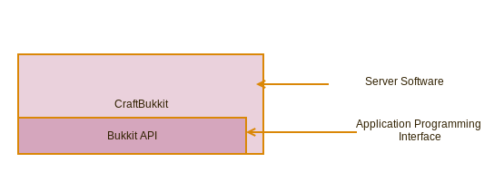
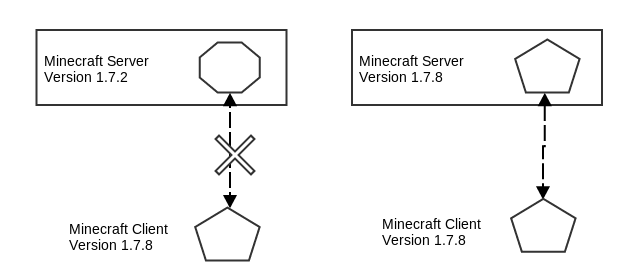

# Preface

## Who is this book for?

This book is for anyone who is curious about Minecraft Modding and Programming. It teaches how to create Minecraft Server Plugins and assumes the reader has no previous programming experience. This book is for beginners of all ages. 

## Introduction

This book shows you how to create your own Minecraft Server Plugins using Javascript. In this book I will sometimes use the word 'mod' and sometimes use the term 'plugin'. For the purpose of this book, these words mean the same thing. Mojang - the makers of Minecraft - prefer to use the term 'Plugin API' rather than 'Modding API' when refering to their forthcoming official API which will make extending Minecraft easier.

Before we begin I better explain some of the words I'll use throughout this book. 

 * Plugin - A Plugin is a file you add to Minecraft which extends the game in some way. 
 * Mod - Mod is short for Modification. In this book, Plugin and Mod are used interchangebly (they mean the same thing).
 * Modding - The practice of writing modifications or plugins for Minecraft. Modding requires some programming knowledge which we will learn about in this book.
 * Mojang - Mojang is the name of the company which makes Minecraft.
 * API - API is short for Application Programming Interface - an official way to write Minecraft Plugins using a guide provided by Mojang.
 * Multiplayer - The mode of playing minecraft with other players all connected to the same server.
 * Server - A computer which is running the minecraft server software. In this book I will show you how to setup and run your own minecraft server.
 * Client Mod - A modification for Minecraft which only works with the Minecraft Client. TODO: Example
 * Server Mod - A modification for Minecraft which works on the Minecraft Server so that the extensions to the game are available for all players who connect to that server. Example: Hunger Games Mod.

## Why I wrote this book

I've been playing Minecraft since 2010 and have been playing Multiplayer Minecraft with my 2 kids on a shared server at our kitchen table since 2011. I work in IBM as a software developer and have been developing software for over 20 years. I took my Kids to local CoderDojo sessions where they learned to use Scratch and create simple web pages using HTML and Javascript. I thought "Wouldn't it be cool if kids could learn to program using Minecraft?". When I first looked into developing Minecraft plugins I was a littled bewildered (read: confused) by the different options available. 

All of the options available also required you to write code in Java. Java is the programming language which Minecraft is written in. It is a fine general purpose language used for many different purposes. It is especially suited to developing large complex business applications. However, it is not ideal as a first language to learn. Learning Java can take some time and you need to write a lot of Java code to get things done. On top of that, even for a seasoned Java developer, the options available for modding minecraft were bewildering. That's when I came up with the idea of making modding easier by letting plugin developers use Javascript instead. 

In late 2012 I launched ScriptCraft - a way of writing Minecraft plugins using Javascript, a much simpler language than its close cousin Java. In early 2014 PeachPit publishing talked to me about writing a book to help beginners learn to program Minecraft Plugins using Javascript. 

I wrote this book to make learning to program fun and easy. I believe that learning even a little about software - how it's made and how it works - is good. Developing Minecraft Plugins is a great way to learn programming and create something fun for yourself and your friends. Maybe you want to create your own Minecraft mini-game or you can't find a Plugin that does exactly what you want or need it to do. This book will teach you how to create your own plugins and mini-games. Playing games is fun. Creating mini-games for others to play is a whole different level of fun.

I hope you'll enjoy reading and exploring the world of programming and Minecraft modding. 

Walter Higgins

April 2014

## Why JavaScript?

In this book I will teach you how to program using the Javascript programming language. Javascript is just one of many programming languages. When I set out with the goal of making Minecraft Plugin development easier I chose Javascript for a few reasons:

 * Javascript is an easy language to learn. 
 * I like Javascript. I enjoy writing code in Javascript and hope you will too.
 * Javascript is expressive. You can do more with less. A little bit of Javascript code can do quite a lot compared to other programming languages such as Java. The shorter your programs are, the easier they are to understand. 
 * Javascript is bundled with Java. The latest versions of Java include Javascript. This means you won't need to install any additional software just to use ScriptCraft. 
 * Anything you can do using Java, you can do using Javascript. In this book we'll learn about the Bukkit API - a set of guidelines for creating Minecraft Plugins. The Bukkit API is Java-based but we can use Javascript too!
 * Javascript isn't a toy. Javascript is a proper programming language used professionally by thousands of programmers around the world. Although originally only used for adding simple extensions to web pages, it's now used for developing all kinds of software and has become one of the most popular programming languages. 
 * Javascript is cross-platform. What this means is Javascript is available on Macintosh, Windows and Linux.

### About the Upcoming Minecraft API

When I created ScriptCraft (this was late 2012) there was no one true way to write Minecraft Plugins because there was no official way provided by Mojang. At the time of writing (April 2014) Mojang announced an upcoming official way to write Minecraft Plugins using the Plugin API. The Plugin API will provide a standard way for Plugin Developers to extend the Minecraft game. There is still no official release date for the Plugin API but I'll be watching closely and will make any necessary changes to ScriptCraft when the API is released.
 
# Part I A modding workbench

## Overview
Welcome to the exciting world of Minecraft Modding. In this first section of the book I'll introduce you to the tools you'll need to start modding. Just as in the Minecraft game you need to first create a Workbench (also sometimes called a Crafting Table) before you can craft more sophisticated tools, so too in real life we'll need to first gather some resources and setup a work area where we can create sophisticated minecraft plugins. This first section describes the resources you'll need, how to get them and how to setup your 'modding workbench'. All of the resource you'll need are freely available online. The ingredients you'll need to construct your modding workbench are...

 * CraftBukkit - A freely-available open-source Minecraft Server.
 * ScriptCraft - A Plugin for CraftBukkit.
 * SublimeText - Or any other text editor suitable for programming.

... The following chapters will show you how to install and setup each of the above.

## Running your own Minecraft server

I began playing Minecraft in 2010 in Single Player mode. It was fun and a relaxing way to pass the time. One year later, one afternoon I installed the Minecraft Server software and ran it on one of the computers on our kitchen table. My youngest son Sean had just finished his homework so I asked him if he wanted to join the home server. Seeing each other in the game was quite a novelty. Soon my eldest daughter Kate joined in and we began some serious building together. Building in Minecraft is much more fun with others. 

When you play Minecraft in Multi-Player mode and chat, build and mine with other players, you do so on a Minecraft "Server". The Minecraft Server is just a computer program (like Minecraft Client, Microsoft Word or Internet Explorer) which when running provides a shared virtual place for minecraft players to connect, build and chat. You don't need to buy any special type of computer to run a Minecraft Server. You can run a Minecraft Server on your laptop computer (assuming it's not too old). Minecraft server software won't run on an iPad or Android Tablet or phone. It only runs on Windows, Macintosh or Linux computers. 

Minecraft Multi-Player is "Client-Server". That means that one or more "client" computers - computers running the minecraft game - can connect to a central "server" - a computer which is responsible for storing all of the Minecraft World information so that players can play together in the same world. The following diagram is shows a simple Client/Server network with just one client (Player) connected to a Server.

The Client must be connected to the Server over some kind of Network. The line between the Client and the Server in the above diagram represents the network. The client and the server chat with each other using a language which would be gobbledigook to you and I. A Server with just one Client computer isn't much fun though. Servers really become fun when many players are connected to the same server like in the following diagram.

")

In the above diagram, the server must chat with all of the connected clients. For example, if it starts raining in the game, the server must send a message to each client that it's begun raining. In Minecraft Multiplayer, the server is responsible for an awful lot. The server decides what the weather will be like in the in-game world, what time of day it is and so on. This is so that the time of day and weather will be the same for all connected players. 

You'll notice that in the above diagrams, the server is shown a separate computer. This is just for illustration. While very often, Server software *does* run on a separate computers, you won't need a separate computer to run Minecraft Server or following the tutorials in this book. In fact, for learning how to create Minecraft Plugins and to get the best from this book I recommend running Minecraft Server on the same computer you play Minecraft on. **This means your computer will act as both a Client and a Server**. This is by far the most convenient and cost-effective way to run a server and learn how to create Minecraft Server Plugins.

When you play Minecraft in Multi-Player mode, before you can connect to a server you have to enter the Server details into the game. The Server details are a 'hostname' or an 'IP Address', either one of these provides a way for Minecraft Client (the game) to connect to a computer running the Minecraft Server. The 'hostname' or 'IP Adress' are how computers uniquely identify one another on the internet, much like how we identify each other by name and/or address. When you run Minecraft Server on your own computer, you will use a special hostname called `localhost` or IP address `127.0.0.1`. I'll talk more about these in the following sections.

If you haven't already considered running your own Minecraft Server, maybe you've thought it would be too difficult to do. Servers - those are computers in big air-conditioned data-centers looked after by people with computer science degrees - right? Wrong! Servers aren't scary at all. Anyone can run a server. In the following sections I'll show you how. 

### Why run your own server?

Why should you run your own server? Running your own server means you have total control over the Minecraft world you want to create and share with your friends. You can decide what type of server and world you and your friends will play in; what server plugins to install, what rules will govern the server and world, and who can and cannot join the server. In short, you get to play god in the Minecraft world when you administer your own server. As a server 'operator' you will have access to commands that normal players don't. You can control the weather using Minecraft commands, start and stop thunderstorms, even change the time of day. You can also install popular Minecraft Server mods like HungerGames and MobArena. The real power of running your own server comes when you add ScriptCraft which makes it easier to create your own Minecraft Server Plugins. If you have an idea for a new Minecraft mod or would like to do something which current Mods don't support, you can create your own mod and test it on your own server. 

Minecraft Server Plugin developers run their own servers because they need to be able to test their creations before releasing them into the wild for others to use. No serious Modder would consider releasing a plugin which they hadn't first tested on their own private servers. Last but not least, running your own Minecraft server will impress your friends :-)

### Which Minecraft Server Software should I use?

There are a couple of different flavours of Minecraft Server. Mojang provide their own server software which can be downloaded from the Minecraft.net website. This was the very first server software released for Minecraft. This is often refered to as 'Vanilla' Minecraft Server. At the time of writing it doesn't provide any way to add plugins although this will probably change once Mojang release an official Plugin API. The Minecraft Server provided by Mojang is fine if you want to run a server with no modifications. The problems with running such a server are that there's no reliable way to protect against 'griefing'. 

#### Term: Griefing 
A griefer is a player in a multiplayer video game who deliberately irritates and harasses other players within the game, using aspects of the game in unintended ways. A griefer enjoys annoying other users by destroying other player's work, cursing and harrassing players and server administrators.

The standard (Vanilla) Minecraft Server has only limited ways to protect against griefing. Because of this other more popular Minecraft Server Software arose - Server software which allowed server administrators to more stricty control who could and could not join the server, and enforce penalties and bans on players who misbehaved. Popular alternatives such as CraftBukkit - which we'll use in this book - let administrators add any number of anti-griefing plugins to make the server as safe and secure and player-friendly as possible.

### CraftBukkit

> Your server, your way. More for less. The possibilities are endless...
>
> [http://dl.bukkit.org/](http://dl.bukkit.org/)

CraftBukkit has become the most popular Minecraft Server Software. It has a thriving community of Plugin developers. In 2012 Mojang hired the CraftBukkit team to work on Minecraft and the Minecraft API. In this book we'll use CraftBukkit as our Minecraft Server software. CraftBukkit is the Server software but it has an API ( a system which Plugin developers can use to exend the server ) which is called 'Bukkit'. We'll look at the Bukkit API in more detail later. For now, all you need to know is that CraftBukkit is the name of the server Software and Bukkit is the API on top which it's built.

CraftBukkit has become so popular because of its underlying API (Bukkit) which makes it easy for Plugin Developers to extend the Minecraft multiplayer server. There are hundreds of plugins available for CraftBukkit include all of the poplular mulit-player mini-games such as HungerGames and CaptureTheFlag. Chances are, if you've ever played Minecraft Multiplayer on one of the popular public servers, it's been running CraftBukkit. The CraftBukkit Wiki Website provides a wealth of informatoin for both Administrators (the people who run CraftBukkit Servers) and Developers (the people who create plugins for CraftBukkit - you) and I highly recommend checking it out [http://wiki.bukkit.org/](http://wiki.bukkit.org/) .

### Installing CraftBukkit

The first step in constructing your Modding Workbench is to install CraftBukkit. Unlike many games, Minecraft is in ongoing development. This means that new versions of Minecraft are released quite often. When you purchase and download the Minecraft Client you automatically get new versions of the game when they are released. This is great for players because you get the latest and greatest version for free, which often includes bug fixes and new features. If you've played Minecraft Multi-Player before on one of the popular public servers, you'll know that there's just one downside to Mojang's commitment to improving Minecraft - Server software upgrades does not happen as often as Client software upgrades. This can lead to Client software and Server software which is "incompatible". When the Client and Server versions are incompatible it means is that the client and the server cannot chat with one another. 

Usually, a compatible version of the Minecraft Server software is released shortly after the Minecraft Client is upgraded. One thing to keep in mind is that CraftBukkit is an open-source and voluntary project - this means that the people who develop CraftBukkit don't get paid to do so. They do it for fun. Upgrading Server software takes a lot of work and the software needs to be tested (by volunteers) before it can be released. That's why sometimes it may take a while for a new version of the Minecraft Server Software to be released which is compatible with the latest and greatest client. Be patient and remember that the developers who work on CraftBukkit do it for fun and don't get paid so posting questions on the CraftBukkit forums asking when will the new version be ready won't speed things up :-)

At the time of writing the Minecraft Client Version 1.7.8 is the most current version. This is what the CraftBukkit website's Home page looks like at that time.

The large Download button will download the CraftBukkit Recommended Build. The Recommended Build is the version of the Craftbukkit server software which is considered to be the most reliable version because it has undergone the most testing. However, the Recommended Build is not always the most current or up-to-date version of the software. Fortunately the developers of CraftBukkit also let you download up-to-date versions of the software with the warning that the most up-to-date version may not always be the most reliable version. 

Just beneath the prominent "Recommended Build" Button, you'll see "Beta Build" link. "Beta" software is software which is "nearly" ready for release. It's software which is functionally complete - that is - the developers have added all of the features they're going to add but the software still needs to be tested for quality assurance. It's usually OK to run Beta software but you may come across one or two software "Bugs". "Bugs" in software are errors or mistakes in the software code which can cause problems. 

http://dl.bukkit.org/
### Configuring your server
#### Permissions
#### Operators
#### World Type
#### Monsters
#### Game Mode

### Other Server Options
#### Minecraft Realms
#### Commercial Minecraft Hosting

## ScriptCraft
### What is ScriptCraft?

### Downloading ScriptCraft
### Installing ScriptCraft
### Verifying ScriptCraft is installed.

## A Javascript command prompt
### First steps with Javascript
### Variables
### Printing results

## Your Modding Workbench.
### Choosing an editor
#### SublimeText
#### Notepad++
#### TextWrangler
#### Other options

# Part II Basic Modding 

## Rolling Dice

Traditional board-games such as Ludo, Monopoly and Snake & Ladders all have an element of chance. Success is sometimes down solely to luck and the roll of the dice. In this first recipe we're going to create a Javascript module which mimics a 6-sided dice (the standard dice that comes with most board-games). We'll use this module in later recipes to give random greetings to players who join the game.

In this recipe, I'll walk you through creating your very first Javascript module using the SublimeText programming editor.

### Randomness
When you throw a 6-sided dice, there's no way of knowing what the throw will be, it can be any number between 1 and 6 but it's impossible to know ahead of time what the number will be. The number which is thrown is said to be 'Random'. Computers can also provide random numbers. In the Javascript programming language there's a special method of getting a random number `Math.random()` . In this recipe we'll use this method to get a random number. 

### Think of a number between 0 and 1
Before we begin writing the module, let's do some command-prompt exploration. At the in-game prompt type the following and hit ENTER...

/js Math.random()

... you should see something like the following returned ...

0.7184312066528946

The number you see will be different but it will be a number between 0 and 1. Try it again: type the same command at the in-game prompt and hit ENTER. This time you'll see a different number than the previous number but it too will be between 0 and 1. You can do this as many times as you like and the number will be different each time. 

Tip: You can quickly perform the previous command at the in-game prompt by pressing the / key and then pressing the UP Arrow key.

The numbers which Math.random() returns are called floating point numbers. You might not think there are any numbers between 0 and 1 but there are many, many, numbers between them. It's this range of numbers which Javascript uses. The actual range of numbers is 0. 0000000000000000 to 0. 9999999999999999. That's 9 Quadrillion, 999 Trillion, 999 billion, 999 million, 999 thousand and 999 possible numbers. 

### A special 6-sided dice.
A regular 6-sided dice has numbers from 1 through 6 printed or etched on each of the 6 sides. That's because we typically count up from 1. The number 1 is usually the starting point when we want to count up to something. Javascript (like many programming languages) is different. In Javascript counting begins at the number 0. So if you want to count 10 numbers, where normally you'd count from 1 to 10 ...

1, 2, 3, 4, 5, 6, 7, 8, 9, 10

In Javascript the count would look like this...

0, 1, 2, 3, 4, 5, 6, 7, 8, 9

This can be confusing for beginning and experienced programmers and takes some getting used to. I'll explain why counting from 0 is important in the following recipes. Our virtual 6-sided dice will have the numbers 0, 1, 2, 3, 4, 5 rather than the usual 1, 2, 3, 4, 5, 6.

### Playing with Numbers
We have a problem to solve. Math.random() will give us a number between 0.0 and 0. 9999999999999999 which isn't useful for most everyday uses. We're only interested in 6 possible numbers so we need to do some Math to get the result we need. We'll explore some basic Math you can do in Javascript and some operations you can perform on floating point numbers but first let's think about what we want to be able to do once our first recipe is complete. 

Ideally we'd like to be able to issue the following command at the in-game prompt and have a useful number returned...

/js dice.roll()

That is; calling dice.roll() should return a random number between 0 and 5 behaving much like a real world dice. If you try to run the above command now, it will fail because we haven't yet created this function. That's what we're going to do in the following steps.

Step 1: Launch SublimeText  
Step 2: Open ScriptCraft Directory
Step 3: Create a new Javascript file 
Step 4: The Code
Type the following code into the newly created file...

exports.roll = function( ) { 
  var result = Math.random();
  result = result * 6;
  result = Math.floor(result);
  return result;
};
Listing 1 dice.js

We'll talk about this code later. For now, type the code as you see it above.

Step 5: Save your work.
Step 6: Try it out

Once you've saved your work go back to Minecraft and at the in-game command prompt (remember, you can bring up the prompt by pressing the / key on your computer's keyboard) type the following...

/js refresh()

The refresh() function is a ScriptCraft function which reloads all of the javascript code. Bukkit has a /reload command which will reload all of the server plugins but for our purposes we only need to reload ScriptCraft to reload our Javascript. /js refresh() is like reload but it only reloads ScriptCraft and Javascript code.

The refresh() function is important, you should execute it every time you change your Javascript code because changes to your code won't be activated in the game until you do so.

Tip: While working on a Minecraft plugin, if the plugin isn't working as you expect, make sure you've run the /js refresh() function first.

Once you've executed the /js refresh() function, you can try out your new Javascript module. Type the following at the in-game prompt then hit ENTER...

/js var dice = require('dice')

The above statement loads your newly created dice.js module into the computer's memory. The require() function is how ScriptCraft loads Javascript modules. The resulting module is assigned to a variable called dice which can be used as follows...

/js dice.roll()

A random number between 0 and 5 should be displayed. Try running the above command a couple of times. Each time you should see a different number returned. Remember, you can run the previous command quickly by typing / then pressing the UP Arrow key.

Troubleshooting: If you don't see a number or if the /js var dice = require('dice') command didn't work (you saw an error), take a look at the Server console window to see what kind of error occurred. More than likely there was a typing error when entering the code. Double-check the code to make sure it's exactly the same as the code in Listing 1 dice.js

### Code Breakdown
Let's look at the code we've just added to Minecraft. The code is reprinted below, this time with line numbers...

1.	exports.roll = function( ) { 
2.	  var result = Math.random();
3.	  result = result * 6;
4.	  result = Math.floor(result);
5.	  return result;
6.	};

A Javascript module is a file with one or more related functions. In the above file is one single function called roll. We let others use functions by exporting them. We'll take a closer look at the exports object and modules in later recipes, for now let's look at the function body (lines 2 through 5). 

### Goal
The goal of this chapter is to gently introduce some basic
javascript concepts by way of creating a simple minecraft mod which
simulates the roll of a dice. The goal of this recipe/chapter (as
with all recipes/chapters) is to engage young readers in
programming by way of useful examples which they can incorporate in
their minecraft servers. Getting young readers up to speed on
modding is the primary goal, learning javascript is a side-effect.
     
At the end of this recipe, readers will have a working minecraft
mod which they can use at the in-game prompt to generate random
numbers. This plugin will be used in the recipe #3.

### Programming Concepts Introduced:

Creating, Editing and Saving Files.
A few illustrative screenshots of SublimeText will be required.

### Javascript Concepts Introduced:
    
#### Variables
Numbers: Integers and Floats

#### Functions
(Built-in functions - parseInt, Math.random)
Writing your own function.

#### Objects 
Math, 

### Minecraft Concepts Introduced:

Plugins
The ScriptCraft directory tree.

## Multi-sided dice

## Greeting Players

### Goal
Each player who joins the server will be greeted using a random
international greeting, Hola, Hello, Dia Dhuit, Bonjour,
Konnichiwa.  The greeting will be different each time the player
joins. This is a fun twist on the standard 'Hello World' example
used by most programming tutorials. It builds upon the 'Dice Roll'
recipe.

### Programming Concepts Introduced:

Re-use. (using functions/modules we've already written)

### Javascript Concepts Introduced:

1. Arrays
2. Accessing Arrays

### Minecraft Concepts Introduced:

1. Events

## Create a Fireworks Show

### Goal
A recipe for creating spectacular fireworks shows.

### Programming Concepts Introduced:
1. Deferred Execution

### Javascript Concepts introduced:
1. This recipe introduces the setTimeout() function.
2. The 'if' statement is introduced.

## Don't stray too far

### Goal
A recipe which periodically checks each player's location and automatically moves them
back into an area close to the spawn location. 

### Javascript Concepts introduced:
1. for loops 
2. Conditionals are examined in more detail.

## A number-guessing game

### Goal

Readers learn how to create a simple number-guessing
mini-game. The computer generates a random number (using the same
function created in Recipe 1). Players try to guess the number
and are told if the number they guessed is too high or too low.

    var number = Math.ceil(Math.random() * 10);
    var guess = prompt( sender, 'Pick a number between 1 and 10');
    guess.input( function( value, sender ) {
      if (value == 'quit'){
         return;
      }
      value = parseInt(value);
      if (value === number){
         sender.sendMessage('Correct!');
         return;
      }
      guess.repeat();    
    });
    

### Javascript Concepts introduced:
     
1. while loops
2. conditionals (reinforced)
3. comparisons and operators
4. Prompting for input.

# Part III Advanced Modding

The latter half of the book will focus on Event-Driven Programming and
using Bukkit's API - in particular, how Bukkit's Java-based API maps
to Javascript.

## Arrows that Teleport you.

### Goal

In this recipe, event-driven programming is explained in more
detail. At the end of the chapter the reader will have created a
simple mod which teleports players when they fire arrows. Players are
teleported to wherever the arrow lands.

## A TNT-Free Zone

### Goal 

In this recipe, readers learn about more events and will explore
Bukkit's event package. They'll learn how to browse JavaDoc
documentation and how to map Bukkit event classes to
Javascript. This recipe provides a mod which will prevent players
from placing TNT, Lava and other destructive blocks in the game.

## Protecting areas against griefing.

### Goal

In this recipe, players will learn how to listen for and cancel block-breaking events.

## It's a small world

### Goal
Readers learn how to limit the size of the game world and thus
make more memory-efficient game worlds. This is an event-driven
refinement of recipe 5.

### Concepts introduced

Computer Memory.

## Horse-Clicker, A simple mini-game

### Goal
This is the first recipe in a series of recipes which will
introduce mini-games. In this recipe, basic game mechanics are
introduced.  Keeping score.
    
## Snowball Fight, A player-vs-player mini-game

### Goal
This recipe and the followin recipe will go into much greater
detail in developing and presenting a javascript mini-game within
Minecraft. Each part of the mini-game source code will be
explained. The goal of these two recipes will be to reinforce
what the reader has learnt in the preceding recipes/chapters.

## Piggie Pandemonium, A pig-herding mini-game
 
