# Preface

## Who is this book for?

This book is for anyone who is curious about Programming and creating Minecraft Plugins. It teaches how to create Minecraft Server Plugins and assumes the reader has no previous programming experience. This book is for beginners of all ages. 

## Introduction

This book shows you how to create your own Minecraft Server Plugins using Javascript. There's often confusion about the words 'Mod' and 'Plugin'. For the purpose of this book, they mean the same thing. Mojang - the makers of Minecraft - prefer to use the term 'Plugin API' rather than 'Modding API' when refering to their forthcoming official API which will make extending Minecraft easier.

Before we begin I better explain some of the words I'll use throughout this book. 

 * Plugin - A modification you add to Minecraft which changes the game in some way. The plugin is usually in the form of one or more files.
 * Mod - Mod is short for Modification. In this book, Plugin and Mod are used interchangebly (they mean the same thing).
 * Modding - The practice of writing modifications or plugins for Minecraft. Modding requires some programming knowledge which we will learn in this book.
 * API - API is short for Application Programming Interface - an official way to write Minecraft Plugins using a guide. Players and regular users of software don't need to care about APIs but they are essential for programmers, because they make it easier to develop plugins. An API is like a list of Recipes - you probably crafted your first pick-axe by refering to an online guide - how much more difficult would it be to have tried creating one without knowing where all the materials should go in the crafting grid? Similarly, programmers need APIs to provide help and guidance in building plugins. The API we will use in this book is the Bukkit API. We'll learn more about this later.
 * Multiplayer - The mode of playing minecraft with other players all connected to the same server.
 * Server - A computer which is running the minecraft server software. In this book I will show you how to setup and run your own minecraft server.

## Why I wrote this book

I've been playing Minecraft since 2010 and have been playing Multiplayer Minecraft with my 2 kids on a shared server at our kitchen table since 2011. I work in IBM as a software developer and have been developing software for over 20 years. I took my Kids to local CoderDojo sessions where they learned to use Scratch and create simple web pages using HTML and Javascript. I thought "Wouldn't it be cool if kids could learn to program using Minecraft?". When I first looked into developing Minecraft plugins I was bewildered by the number of options available. 

All of the options available required you to write code in Java. Java is the programming language which Minecraft is written in. It is a fine general purpose language especially suited to developing large complex business applications. However, it is not ideal as a first language to learn. Learning Java can take some time and you need to write a lot of Java code to get things done. Even for a seasoned Java developer, the options available for modding minecraft were bewildering. That's why I came up with the idea of making modding easier by letting plugin developers use Javascript instead. 

In late 2012 I launched ScriptCraft - a way of writing Minecraft plugins using Javascript, a much simpler language than Java.  

I wrote this book to make learning to program, fun and easy. I believe that learning even a little about software - how it's made and how it works - is good. Developing Minecraft Plugins is a great way to learn programming and create something fun for yourself and your friends. Maybe you want to create your own Minecraft mini-game or you can't find a Plugin that does exactly what you want. This book will teach you how to create your own plugins and mini-games. Playing Minecraft is fun. Creating Minecraft Plugins is a whole different level of fun.

I hope you'll enjoy reading and exploring the world of programming and Minecraft Plugin Development. 

Walter Higgins

April 2014

## Why Javascript?

In this book I will teach you how to program using the Javascript programming language. Javascript is just one of many programming languages. When I set out with the goal of making Minecraft Plugin development easier, I chose Javascript for a few reasons:

 * Javascript is an easy language to learn. 
 * I like Javascript. I enjoy writing code in Javascript and hope you will too.
 * Javascript is expressive. You can do more with less. A little bit of Javascript code can do quite a lot compared to other programming languages such as Java. The shorter your programs are, the easier they are to understand. 
 * Javascript is bundled with Java. The latest versions of Java include Javascript. This means you won't need to install any additional software to use ScriptCraft. 
 * Anything you can do using Java, you can do using Javascript. In this book we'll learn about the Bukkit API - a set of guidelines for creating Minecraft Plugins. The Bukkit API is Java-based but we can use Javascript too!
 * Javascript isn't a toy. Javascript is a proper programming language used professionally by thousands of programmers around the world. Although originally only used for adding simple extensions to web pages, it's now used for developing all kinds of software and has become one of the most popular programming languages. 
 * Javascript is cross-platform. What this means is Javascript is available on Macintosh, Windows and Linux.

The Javascript programming Language is a simple language to get started with but it can be quite flexible in how you do things. In Javascript there's usually more than one way to do it. This book is not intended as a comprehensive tour of all of Javascript's features. Its aim is to focus on the fun parts of Javascript and to help those who are curious about programming get a taste for what programming in Javascript is like.

### About the Upcoming Minecraft API

When I created ScriptCraft in 2012 there was no one true way to write Minecraft Plugins because there was no official API provided by Mojang. At the time of writing (April 2014) Mojang announced an upcoming official way to write Minecraft Plugins using the Plugin API. The Plugin API will provide a standard way for Plugin Developers to extend the Minecraft game. There is still no official release date for the Plugin API but I'll be watching closely and will make any necessary changes to ScriptCraft when the API is released.
 

# Part I A modding workbench

## Overview
Welcome to the exciting world of Minecraft Plugin Development. In this first section of the book I'll introduce you to the tools you'll need to start programming. In Minecraft, you need to first create a Workbench (also sometimes called a Crafting Table) before you can craft more sophisticated tools. So too in real life we'll need to first gather some resources and setup a work area where we can create sophisticated minecraft plugins. This first section describes the resources you'll need, how to get them and how to setup your 'modding workbench'. All of the resource you'll need are freely available online. The ingredients you'll need to construct your modding workbench are:

 * CraftBukkit - A freely-available open-source Minecraft Server.
 * ScriptCraft - A Plugin for CraftBukkit.
 * gedit, TextWrangler, or any other text editor suitable for programming.

The following chapters will show you how to install and setup each of the above.

## @@nextChapter{chapter-01}: Running your own Minecraft server
### Introduction
I began playing Minecraft in 2010 in Single Player mode. It was fun and a relaxing way to pass the time. Later I installed the Minecraft Server software on one of the computers on our kitchen table. My youngest son Sean had just finished his homework so I asked him if he wanted to join the home server. Seeing each other in the game was quite a novelty. Soon my eldest daughter Kate joined in and we began some serious building together. Building in Minecraft is much more fun with others. 

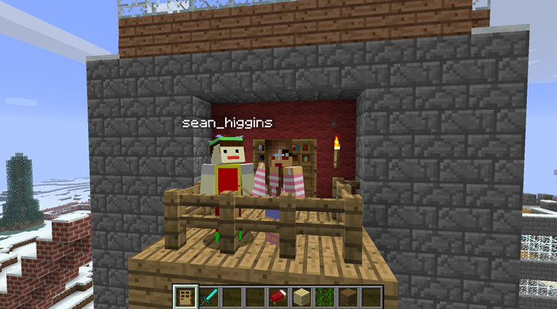

When You play Minecraft in multiplayer mode, chatting, building and mining with other players, you do so on a Minecraft *Server*. The Minecraft Server is just a computer program (like Minecraft Client, Microsoft Word or Internet Explorer) which provides a shared virtual place for minecraft players to connect, build and chat. You don't need to buy any special type of computer to run a Minecraft Server. You can run one on your laptop computer - assuming it's not too old. Minecraft server software won't run on an iPad, Android Tablet or phone. It only runs on Windows, Macintosh or Linux computers. 

### Client Server Networking
Minecraft multiplayer is "Client-Server". That means that one or more "client" computers - computers running the minecraft game - can connect to a central "server" - a computer which is responsible for storing all of the Minecraft World information so that players can play together in the same world. The following diagram shows a simple Client/Server network with just one client (Player) connected to a Server.

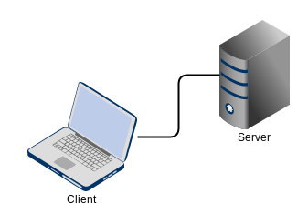

The Client must be connected to the Server over some kind of Network. The line between the Client and the Server in the above diagram represents the network. A Server with just one Client computer isn't much fun though. Servers really become fun when many players are connected to the same server as in the following diagram:

")

In the above diagram, the server must chat with all of the connected clients. For example, if it starts raining in the game, the server must send a message to each client that it's begun raining. In Minecraft Multiplayer, the server is responsible for many things. The server decides what the weather will be like in the in-game world, what time of day it is and so on. This is so that the time of day and weather *will be the same for all connected players*. 

You'll notice that in the above diagrams, the server is shown as separate computer. This is just for illustration. While very often, Server software *does* run on a separate computers, *you won't need a separate computer to run Minecraft Server* or to follow the tutorials in this book. In fact, for learning how to create Minecraft Plugins and to get the best from this book, I recommend running Minecraft Server on the same computer you play Minecraft on. **This means your computer will act as both a Client and a Server**. This is by far the most convenient and cost-effective way to run a server and learn how to create Minecraft Server Plugins.

When you play Minecraft in multiplayer mode, before you can connect to a server you have to enter the Server details into the game. The Server details are a 'hostname' or an 'IP Address', either one of these provides a way for Minecraft Client (the game) to connect to a computer running the Minecraft Server. The 'hostname' or 'IP Adress' are how computers uniquely identify one another on the internet, much like how we identify each other by name and/or address. When you run Minecraft Server on your own computer, you will use a special hostname called `localhost` or IP address `127.0.0.1`. I'll talk more about these in the following sections.

Anyone can run a server. In the following sections I'll show you how to setup and run your own Minecraft server.

### Why run your own server?

Why should you run your own server? Running your own server means you have total control over the Minecraft world you want to create and share with your friends. You can decide what type of server and world you and your friends will play in; what server plugins to install, what rules will govern the server and world, and who can and cannot join the server. As a server 'operator' you will have access to commands that normal players don't. You can control the weather using Minecraft commands, start and stop thunderstorms, even change the time of day. You can also install popular Minecraft Server mods like HungerGames and MobArena. The real power of running your own server comes when you add ScriptCraft which makes it easier to create your own Minecraft Server Plugins. If you have an idea for a new Minecraft mod or would like to do something which current Mods don't support, you can create your own mod and test it on your own server. 

Running your own server is essential for plugin development. Minecraft Server Plugin developers run their own servers because they need to be able to test their creations before releasing them into the wild for others to use. No serious Modder would consider releasing a plugin which they hadn't first tested on their own private servers. 

### Which Minecraft Server Software should I use?

There are a couple of different flavors of Minecraft Server. Mojang provide their own server software which can be downloaded from the Minecraft.net website. This was the very first server software released for Minecraft. This is often refered to as 'Vanilla' Minecraft Server. At the time of writing it doesn't provide any way to add plugins although this will probably change once Mojang release an official Plugin API. The Minecraft Server provided by Mojang is fine if you want to run a server with no modifications. The problems with running such a server are that there's no reliable way to protect against 'griefing'. 

#### Term: Griefing 
Griefing is when a player in a multiplayer video game deliberately irritates and harasses other players within the game, using aspects of the game in unintended ways. A griefer enjoys annoying other users by destroying other player's work, cursing and harrassing players and server administrators.

The standard (Vanilla) Minecraft Server has only limited ways to protect against griefing. Because of this other more popular Minecraft Server Software arose - Server software which allowed server administrators to more stricty control who could and could not join the server, and enforce penalties and bans on players who misbehaved. Popular alternatives such as CraftBukkit - which we'll use in this book - let administrators add any number of anti-griefing plugins to make the server as safe, secure and player-friendly as possible.

### CraftBukkit

> Your server, your way. More for less. The possibilities are endless...
>
> [http://dl.bukkit.org/](http://dl.bukkit.org/)

CraftBukkit has become the most popular Minecraft Server Software with a thriving community of Plugin developers. In 2012 Mojang hired the CraftBukkit team to work on Minecraft and the Minecraft API. In this book we'll use CraftBukkit as our Minecraft Server software. CraftBukkit is the Server software but it has an API ( a system which Plugin developers can use to exend the server ) which is called 'Bukkit'. We'll look at the Bukkit API in more detail later. For now, all you need to know is that CraftBukkit is the name of the server Software and Bukkit is the API on top which it's built.

CraftBukkit has become so popular because of its underlying API (Bukkit) which makes it easy for Plugin Developers to extend the Minecraft multiplayer server. There are hundreds of plugins available for CraftBukkit including all of the popular mulit-player mini-games such as HungerGames and CaptureTheFlag. Chances are, if you've ever played Minecraft Multiplayer on one of the popular public servers, it's been running CraftBukkit. The CraftBukkit Wiki Website provides a wealth of information for both Administrators (the people who run CraftBukkit Servers) and Developers (the people who create plugins for CraftBukkit). I highly recommend checking it out [http://wiki.bukkit.org/](http://wiki.bukkit.org/) .

### Installing CraftBukkit

The first step in constructing your Modding Workbench is to install CraftBukkit. Unlike many games, Minecraft is in ongoing development. This means that new versions of Minecraft are released quite often. When you purchase and download the Minecraft Client you automatically get new versions of the game when they are released. This is great for players because you get the latest and greatest version for free, which often includes bug fixes and new features. If you've played Minecraft multiplayer before on one of the popular public servers, you'll know that there's a downside to Mojang's commitment to improving Minecraft - Server software upgrades do not happen as often as Client software upgrades. This can lead to Client software and Server software which are *incompatible*. When the Client and Server versions are incompatible they cannot communicate. 

#### Term: Bug
"Bugs" in software are errors or mistakes in the software code which can cause problems. Nobody quite knows for sure why errors in software are called bugs but one story goes that a problem with an early mechanical computer in the 1940s was caused by a Moth which somehow found its way inside. The term "Bug" had been used to describe errors long before computers came along, so when the engineers captured the Moth they kept it with a note that said "First actual case of bug being found." 

Usually, a compatible version of the Minecraft Server software is released shortly after the Minecraft Client is upgraded. One thing to keep in mind is that CraftBukkit is an open-source and voluntary project - this means that the people who develop CraftBukkit don't get paid to do so. They do it for fun. Upgrading Server software takes a lot of work and the software needs to be tested (by volunteers) before it can be released. That's why sometimes it may take a while for a new version of the Minecraft Server Software to be released which is compatible with the latest and greatest client. Be patient and remember that the developers who work on CraftBukkit do it for fun and don't get paid so posting questions on the CraftBukkit forums asking when will the new version be ready won't speed things up :-)

At the time of writing, 1.7.8 is the most current version of Minecraft. This is what the CraftBukkit website's Home page looks like at that time.

The large Download button will download the CraftBukkit Recommended Build. The Recommended Build is the version of the Craftbukkit server software which is considered to be the most reliable version because it has undergone the most testing. However, the Recommended Build is not always the most current or up-to-date version of the software. Fortunately the developers of CraftBukkit also let you download up-to-date versions of the software with the warning that the most up-to-date version may not always be the most reliable version. 

Just beneath the prominent "Recommended Build" Button, you'll see "Beta Build" link. "Beta" software is software which is "nearly" ready for release. It's software which is functionally complete - that is - the developers have added all of the features they're going to add, but the software still needs to be tested for quality assurance. It's usually OK to run Beta software but you may come across one or two *Bugs*. If the "Beta Build" version does not match the current version of Minecraft then click on the "Alternate Versions" link beneath the "Beta Build" link. This will take you to the CraftBukkit Builds page where you will see a list of "Builds" or versions. The following screenshot shows what the download page looks like at the time of writing.

Along the right-hand side of the page are three big color-coded download buttons. The Green button is for the most recent stable release. Note that though this is the most stable version, it may not be the most up-to-date version or a version which is compatible with the current Client. The Amber button is for the most recent Beta build. This is a version which is not as stable as the released version but will have undergone some testing and will most likely be in use already on some servers. The Red button is for the most recent development build. It's colored red because it is the least stable version. Development builds will not have undergone the same rigorous testing as Beta or Release software. On the other hand, development builds will be the most up-to-date and chances are, there will be a development build of the Server Software for the latest version of the Client software.

Choosing which version of the Server Software to use - Recommended, Beta or Development - is a big decision and one I unfortunately can't make for you. That decision is entirely up to you. However, If you feel safer using only the Recommended build of CraftBukkit, and that build version is not for the most up-to-date Client, then there's a way you can safely and temporarily *Downgrade* your Minecraft Client Software so that it will be compatible with your Server software. 

Since version 1.6, the Minecraft Launcher (the software you run on your computer to start Minecraft Client and to upgrade to new versions when they become available) lets you choose which verison of the Client software to run. By default the Launcher is configured to always download and run the Latest Version but you can easily change this using the new "Profiles" feature. The following are step-by-step instructions for changing your Launcher profile to use a different version of Minecraft Client...

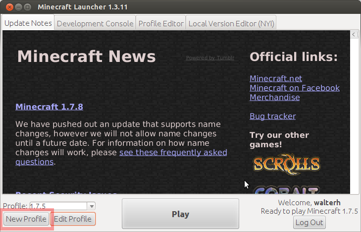

1. Launch Minecraft 
2. Click on the 'New Profile' button in the bottom right of the Launch Screen.
3. Fill in the Profile Name field. For example you should call it something like 'Version 1.7.8' (replacing 1.7.8 with the version you've chosen). I find it helpful to include the version name in a new Profile so I can see at-a-glance which Client version the profile will use.
4. Choose the appropriate version from the 'Use Version' drop-down list.
5. Click the Save Profile button.

The newly created profile should now be automatically selected in the Profile drop-down list on the main launcher page. Click the Play button to begin playing using the chosen version of Minecraft Client software.

By using the profile editor to "Downgrade" your Minecraft Client Software, you can ensure that your Client and Server are compatible and that you can play multiplayer minecraft even when the Server Software is not as up-to-date as the current latest version of Minecraft Client. This means you can always use the most stable Recommended build of CraftBukkit. 

#### Term: JAR File

The CraftBukkit software is downloadable as a `.jar` file. Programs which are created using the Java Programming Language are often distributed as JAR files and will have a name which ends with `.jar`. JAR is short for **J**ava **AR**chive file. It's an archive of all of the code and resources needed by Java to run the software. CraftBukkit is distributed as a JAR file. So too are all of the plugins for CraftBukkit.

Once You've chosen between the Recommended, Beta and Development versions of CraftBukkit (If you're unsure, choose the Recommended Version), click on the appropriate color-coded button to begin downloading the software. Depending on which Browser software you use (Chrome, Safari, Internet Explorer or Firefox) the instructions for downloading will differ. Please read the instructions for the Browser you use. 

#### Download Instructions

1. Create a new folder on your computer called *CraftBukkit*.
2. Choose either the *Recommended*, *Beta Build* or *Development Build* at http://dl.bukkit.org/downloads/craftbukkit/ to begin downloading CraftBukkit.
3. Save the craftbukkit *.jar* file in the folder created in step 1. 
4. Rename the .jar file to *craftbukkit.jar*.

Once downloaded, the next step is to install CraftBukkit on your computer. The instructions are slightly different for each operating system so skip directly to the instructions for your operating system.

#### Installing Bukkit on Windows

1. Open Notepad (You can find it by clicking the 'Start' or Windows button in the bottom left of the screen then typing 'Notepad' in the search box.
2. Type the following into Notepad...

         java -Xmx1024M -jar craftbukkit.jar -o true
         PAUSE

   ... depending on the name of the file you downloaded earlier, you may need to change `craftbukkit.jar` to match the exact name of the file.
   
3. Save the document as run.bat in the Folder you created earlier (the same Folder where you copied the craftbukkit jar file). It's important that you change the 'Save as type:' option from `Text Documents` to `All Files` otherwise Notepad will try to save the document as run.bat.txt and it will not be executable.

4. Double click the run.bat file you saved in the previous step and CraftBukkit should start running. If you see an error message: "Java is not recognized as an internal or external command, operable program or batch file" then you need to reinstall Java. Java is the programming language Minecraft is written in. It's also the programming language the CraftBukkit Minecraft Server is written in. You can download Java by visiting `http://www.java.com/` and following the instructions. If after installing Java you still get the same error then follow the instructions at `http://www.java.com/en/download/help/path.xml`.

5. Assuming the server has started (you didn't see any errors), you can shut down the server by issuing the `stop` command at the server console (type `stop` then hit ENTER).

#### Installing Bukkit on Mac OS

1. The first thing you'll need to do is install Java. Since OS X 10.7 Java no longer comes bundled with OS X so you will need to install Java from Apple's Java Install page `http://support.apple.com/kb/DL1421` .

2. Open TextEdit (you can find it by typing `TextEdit` in the Spotlight field in the top right of the screen. Click the Magnifying Glass Icon to bring up Spotlight)

3. Under the `Format` menu, choose `Make Plain Text` then type the following...

        #!/bin/bash
        cd "$( dirname "$0" )"
        java -Xmx1024M -jar craftbukkit.jar -o true    

   ... depending on the name of the file you downloaded earlier, you may need to change `craftbukkit.jar` to match the exact name of the file.

4. Save the file in your CraftBukkit folder as start_server.command

5. You will need to be able to run this newly created file so...

    1. Open the Terminal Application (to find it, click the Magnifying Glass icon and type `Terminal` in the Spotlight field)
    2. Type `chmod a+x` (don't hit enter yet)
    3. Find the file you just created in the Finder and drag and drop it into the Terminal window.
	4. The name of the file you just dropped into the terminal window will be appended to the `chmod a+x` command so you can now hit ENTER.
    
6. Start the server by double clicking the start_server.command file. 

7. To stop the server issue the `stop` command in the terminal window (type `stop` then hit ENTER).

If you run into trouble installing CraftBukkit you can find plenty of useful tips and troubleshooting on the CraftBukkit Wiki website `http://wiki.bukkit.org/Setting_up_a_server`. 
    
#### Installing Bukkit on Linux (Ubuntu)

1. Open `Text Editor` by clicking the `Dash Home` button in the top left corner of the screen, then type `Edit` to see a list of editors (you can choose `Text Editor` or another editor of your choice)

2. Type the following into the editor...

        #!/bin/sh
        BINDIR=$(dirname "$(readlink -fn "$0")")
        cd "$BINDIR"
        java -Xmx1024M -jar craftbukkit.jar -o true

   ... depending on the name of the file you downloaded earlier, you may need to change `craftbukkit.jar` to match the exact name of the file.

3. Save the file as `craftbukkit.sh` in the folder you created earlier (the same Folder where you copied the craftbukkit jar file).

4. You will need to make this new file executable. In Nautilus (Linux's File browser) right-click on the file and select properties. In the properties dialog, click the 'Permissions' tab then ensure that the 'Execute' checkbox is ticked. (You can also make the file executable by issuing the unix command `chmod +x craftbukkit.sh` from the folder where you saved the file.

5. Launch the Terminal Application and type `~/craftbukkit/craftbukkit.sh` (assuming you created a folder called `craftbukkit` in your home folder).

6. Once the Craftbukkit server console has launched, you can stop it by issuing the Craftbukkit `stop` command (type `stop` then hit ENTER).

### Configuring your server
Once you've installed CraftBukkit, the next step is configuration. This is where you decide what kind of Minecraft Server you want to run. Will it have Monsters? Will it be Survival mode or Creative mode? Will it be Player vs. Player, and so on. While configuration is something you'll probably only do once, you can later change the server configuration at any time you like. The server configuration isn't set in stone, just bear in mind you will need to restart your server if you change the configuration. I'll show you how to do that later.

#### The server.properties file
When you first launch CraftBukkit, a couple of configuration files and folders will be created in the CraftBukkit folder (the folder where you store the craftbukkit jar file and startup script). When configuring your server, the most important file is `server.properties`. This is a plain-text file (meaning it can be edited using any text editor) containing all of the configuration for your server. The first few lines of my own `server.properties` look like this:

    #Minecraft server properties
    #Sun Apr 20 11:11:20 IST 2014
    generator-settings=
    op-permission-level=4
    allow-nether=false
    level-name=world
    enable-query=false
    allow-flight=false
    announce-player-achievements=true
    server-port=25565
    level-type=FLAT

The first two lines - the lines which begin with a `#` character (also known as the Hash symbol) - are comments, they are ignored by the server. The configuration begins properly on line 3 `generator-settings=` which is used for generating worlds (this has a default value of blank - no value). The settings for the server are specified using *Name-Value* pairs. A *Name-Value* pair is programmer-speak for how settings are written. For example `allow-flight=false` is a Name-Value Pair where the name is `allow-flight` and the value is `false`. In property files the name and value are separated by the `=` (equals) symbol. Let's look at just some of the properties you might want to change.

##### World Type
Later in the book I'll show you how to use Javascript to create roads and skyscrapers. If you plan to eventually put your newfound programming prowess to use building large-scale places for others to visit, you'll probably want to change the `level-type` property from `DEFAULT` (Minecraft's standard setting where worlds are made of varied landscapes of hills, valleys, and oceans) to `FLAT`. In a `FLAT` world there are no hills, no valleys, just flat terrain for as far as you can see. While this might be considered boring, it does have the advantage of being easier to build upon. If you plan to build roads, houses and other large-scale constructions, a `FLAT` world might be the best place to start. It's not essential that the `level-type` is set to `FLAT`, you can always leave this setting at `DEFAULT` and just flatten the area you want to build on first. **If you later decide to change the level-type, the setting only applies when creating new worlds. Existing worlds will not be modified.**

If you decide to create a new world and want to use a `level-type` other than `DEFAULT` you have two options:

1. Change both the `level-name` and `level-type` properties to create a brand new world while keeping the old world (The old world will not be wiped out - it will still be on your computer stored in the `world` folder). This is the best option if you want to keep your existing world data. You need to change the `level-name` setting to something other than `world` (the default value). Call your new world something memorable like `flat-world`. 

2. If you don't care about keeping the existing world, delete the `world` Folder from the CraftBukkit Folder and change the `level-type` property. The next time the server starts, a brand new world and a new `world` folder will be created.

##### Monsters
The next setting you'll probably want to change is the `spawn-monsters` setting. This determines if monsters will be spawned. By default it's set to `true` which means monsters will appear at night. I recommend changing this setting from `true` to `false` because the last thing you need while learning to program is to be attacked by giant spiders. You can change this setting any time you like. The setting won't take effect until you restart the server. I'll talk about starting and stopping the server very shortly.

##### Game Mode
For the same reason I suggest making your server a monster-free zone, I also suggest changing your server's `gamemode` property from 0 (Survival) to 1 (Creative). In Survival mode, you will need to constantly seek food and be careful not to fall. In Creative mode you can give your full attention to learning to program.

#### The ops.json file

The ops.json file is a configuration file listing all of the 'Operators' for the server. Operators are players who have special privileges on the server. Operators (also sometimes called 'Administrators' or 'Admins') are responsible for keeping the server running and ensuring that players play nice and don't grief. If players don't play nice, Operators have to power to ban or kick players off the server using special commands only available to them. 

There may already be an ops.json file present in your CraftBukkit folder. If there isn't, then one will be created automatically when you run the `op` command from the server console. You will need to be an Operator to issue Javascript commands in the game so one of the first things you should do once you've installed the Minecraft Server is 'op' yourself - that is - make yourself an operator by issuing the `op username` command replacing `username` with your own Minecraft user name. For example, I would issue the command `op walterh` because `walterh` is my minecraft user name. ScriptCraft - the plugin we'll install later - only allows operators to issue Javascript commands.

We're done with all of the server configuration we'll need for now. If you want to delve deeper into server configuration, a good place to start is by reading the http://minecraft.gamepedia.com/Server.properties page.

### Basic Server administration commands
CraftBukkit's usefulness as a minecraft server comes from its extensibility - that is - its ability to be extended and made more interesting by adding plugins. Many of the high-profile public minecraft servers actually run CraftBukkit because of the wide range of server plugins available for it. Popular Minecraft Mini-games like 'Hunger Games' and 'Spleef' are all CraftBukkit plugins. In this book we'll use just one plugin - ScriptCraft which lets operators extend the game using Javascript. There are just a few things you'll need to know about server administrator to get the most from this book. 

#### Starting and stopping your server
To start your minecraft server, double click on the startup script you created earlier in this chapter. This launches the minecraft server in a terminal window. The terminal window will look something like this:

Don't worry if your terminal window doesn't look exactly like this or has slightly different content. The important thing is that after starting up, your server should display a server console prompt - `>` (right arrow symbol) in the bottom left of the screen along with a blinking cursor. This is called the server console and you can issue administration commands here even if you aren't an operator. Try it: issue the `help` command to see the full list of commands you can use as the Server Console user.

In the Server Console window, you don't need to put a `/` (forward slash symbol) in front of commands the way you do in the Minecraft Client. So you simply type the command name instead of `/` followed by the command name. So remember `help` instead of `/help`, `toggledownfall` instead of `/toggledownfall` and so on. 

Another thing to note about the server console is that when you enter commands there, you do so as a special player called 'CONSOLE'. In Minecraft the `/me` command is used to send a message to other players in the form of 'Yourname Action'. For example, if *I* issue the command `/me sneezes` in the Minecraft client, all other players on the server will see `walterh sneezes`. However, if you issue the same command in the server console, you will see `* @ sneezes` instead of your own name. CONSOLE is not visible to other players and does not inhabit the minecraft world. Normally only the person who starts the server can issue commands as CONSOLE.

To stop the server, you should issue the `stop` command at the server console. If you plan to administer a minecraft server for others to play, the `stop` command will come in handy whenever you want to shutdown the server for maintenance or troubleshooting.

#### Reloading plugins

Another useful command you should know about is the `reload` command. This command will unload all of the server's plugins and then load them up again. This is a faster and more convenient way of reloading plugins than shutting down the server and restarting it. If you manage a server with many players connected and want to install a new version of a plugin then the `reload` command lets you load the plugin without shutting down your server and disconnecting players.

### Connnecting to your server
To check that your server is running and accepting connections follow these steps:

1. Launch the Minecraft game as you would normally. 
2. Once Minecraft has launched and you have logged in, click on the 'Multiplayer' button.
3. If this is the first time you're connecting to your own server click the 'Add Server' button. If it's not the first time you've connected to your own server skip to step 8.
4. Fill in the Server Name field. You can call the server any name you like. The default name, Minecraft Server, will do if you can't think of something imaginative right now.
5. In the Server Address field you should type `localhost` . As mentioned earlier, `localhost` is a special server address meaning 'the same computer'. You could also type `127.0.0.1` which is the IP Address of localhost (servers usually have a name and/or address and it's usually possible to connect to them using either name or address). Type either `localhost` *or* `127.0.0.1` but not both; either one will do fine.
6. Once you've entered the Server Address, click the 'Done' button. 
7. The new server you just added should appear in the list of servers. If it's not visible, use the scroll bar to scroll down. If you have already added other servers it may not appear at the top of the list. Because you've added this server using the 'Add Server' button rather than the 'Direct Connect' button, it should appear in the list of multiplayer servers every time you launch Minecraft.
8. Select the server and click the 'Join Server' button. 

If you get an error when trying to connect, ensure that your server is first running (See the earlier section on starting your server). If your server is not running you will see an error *Failed to connect to the server. java.net.ConnectException: Connection refused:'. If you see this error, click the 'Back to Title Screen' button then start your server and try again. 

Once you've logged into your server take a look around. It's important that you have operator (Administrator) privileges on your own server. You can check that you have the right privileges by issuing the `/time set 4000` command. If you can run this command without error then you're all set up. If you see a warning message *You do not have permission to perform this command.* then you'll need to make yourself an operator at the server console window. Switch to the Server console window (ALT + TAB on windows, CMD + TAB on OS X) and type `op <player>` replacing <player> with your own username, then switch back to the Minecraft game and try issuing the `/time set 4000` command from the in-game prompt. Once you've verified you have operator permissions, kick back and relax or if you have a spare computer on your home network, invite a friend or family member to join you on your server. If this is the first time you've played Minecraft multiplayer with friends or family you'll have great fun.

### Achievement Unlocked!

By now you should have your very own Minecraft server installed and running. **Congratulations, you're well on your way to becoming a Minecraft Modder!**

### Other Server Options
There are other Minecraft Server options available, but installing and running your own server is the only sensible option if you want to start modding. 

#### Commercial Minecraft Hosting
Once you've mastered Server Administration and Modding you might eventually decide to use one of the many commercial minecraft hosting plans available online. These Minecraft hosting providers usually charge a monthly fee, so they are not free. For your money, they provide you with a Minecraft server you and your friends can connect to and play. They usually offer managed install of plugins through a web-based Administration portal (A web page where you can choose which plugins your server should use). Commercial Minecraft Hosting isn't cheap and it's not as flexible as running your own server. You certainly don't need to sign up to commercial minecraft hosting to get the most from this book. You can find a list of minecraft hosting providers by searching 'Minecraft Hosting' on Google.

#### Minecraft Realms
Mojang have rolled out their own Minecraft Hosting solution - Minecraft Realms - throughout the world. Minecraft Realms does not currently support plugins of any kind though that may change in the future. 

## @@nextChapter{chapter-02}: ScriptCraft
### Introduction
In the previous chapter we downloaded and installed CraftBukkit; a customizable Minecraft Server. In this chapter we'll install ScriptCraft - a server plugin which lets you write your own plugins using the Javascript programming language. 

### What is ScriptCraft?

ScriptCraft is a plugin for Minecraft which lets you create plugins using Javascript instead of Java. It is a server plugin which means it is installed on a server (CraftBukkit) but once installed can be used by all players connected to that server. I created ScriptCraft for a couple of reasons:

1. To make it easier for myself to create Minecraft mods.
2. To make it easier for my kids (and others) to create Minecraft mods.
3. To make it easier to teach programming to kids using Javascript and Minecraft as tools.

Most Minecraft Plugins are written in a language called 'Java'. Java was invented back in the 1990s as a simpler way to program. Before Java, programmers used languages like C and C++ which were difficult to learn and use. C and C++ were difficult because if you wrote a program that wanted to grab some space in the computer's memory, you had to remember to free up that space when you no longer needed it, otherwise the computer would quickly run out of memory and the program would crash. Java solved this problem by having automatic `Garbage Collection` (yes - that's what programmers actually call it) which automatically frees up memory when it was no longer needed. Java has many other advantages too. It has a large library of functions to do common tasks so you don't have to write those functions yourself. Java is `cross-platform` which mean it runs on Windows, Linux and Mac OS. Minecraft is written in Java and so too are Minecraft servers. 

Java is a fine language and is widely used. However, it can be a little difficult to learn - especially if you are completely new to programming. Java can be verbose - meaning you need to write a lot of Java code to do even simple things. Java code can't be executed right away either. You need to first "compile" it. Compiling is the process of converting Java source code into a form the computer can understand. 

Javascript came along shortly after Java. It was invented in the mid 1990s just when the Internet was becoming really popular. Although their names sound alike they are very different languages. Javascript is simpler than Java in many ways. In recent years it has become popular as a language not just for web programming but for all kinds of uses. 

ScriptCraft is a Minecraft Server plugin which makes it possible to write your own plugins using Javascript. You can also use ScriptCraft to build large-scale structures (Skyscrapers, Temples, Roads, Castles and Forts) in the game.

### Installing ScriptCraft

To download and install ScriptCraft follow these steps...

1. Visit http://scriptcraftjs.org/download/latest/
2. Right-click on the scriptcraft.jar file and select 'Save Link As...' from the popup menu. 
3. Save the file to the CraftBukkit plugins folder. If there is no `plugins` folder in your craftbukkit folder it's probably because you haven't yet launched CraftBukkit. The first time CraftBukkit is launched it creates a couple of configuration files and a plugins folder so make sure you've launched CraftBukkit at least once before attempting to download ScriptCraft. 

If there is already a scriptcraft.jar file in your CraftBukkit plugins folder (if this isn't the first time you've installed ScriptCraft) , make sure to remove it first before saving the new file.

If CraftBukkit is running, stop it by issuing the `stop` command in the server console. 

Launch Craftbukkit by double clicking the launch script you created in chapter 1. When CraftBukkit starts up you should see an `Enabling scriptcraft` message appear in the server console. The first time it's loaded, the ScriptCraft plugin will unzip a lot of files into a new `plugins/scriptcraft` folder inside your CraftBukkit folder. Your server console output might look something like this...

    Enabling scriptcraft v2.0.6-2014-04-20
    Directory /home/walter/cb179/plugins/scriptcraft does not exist.
    Initializing /home/walter/cb179/plugins/scriptcraft directory with contents from plugin archive.
    Unzipping /home/walter/cb179/plugins/scriptcraft/lib/command.js (NE)
    Unzipping /home/walter/cb179/plugins/scriptcraft/lib/console.js (NE)
    Unzipping /home/walter/cb179/plugins/scriptcraft/lib/events.js (NE)

... There will be many more entries as there are many files bundled with ScriptCraft. 

The *plugins* sub-folder in CraftBukkit is important. It's where all Minecraft Server plugins should be stored. This is true not just for ScriptCraft.jar but for all server plugins. If you save a Server plugin jar file to any other location except the plugins folder, then it will not be loaded when CraftBukkit starts. CraftBukkit only looks in the *plugins* folder for plugins to load at startup.

### Verifying ScriptCraft is installed.

You can verify that ScriptCraft has been successfully installed by issuing the following command at the server console:

    js 2 + 3

Make sure to type the above text exactly as you see it and then hit the ENTER key. The response you get from the server console should of course be `5` . 

#### Achievement Unlocked!

Congratulations! You've just installed ScriptCraft and executed your first line of Javascript code. 

ScriptCraft adds just 2 new server commands to the Minecraft server `js` and `jsp` - we'll talk about `jsp` later in the book. The `js` command is short for `Javascript` and it lets you execute Javascript code right away. More on this in the next chapter...

## @@nextChapter{chapter-03}: A Javascript command prompt
### Introduction
Once you've installed ScriptCraft, you can use the `js` command to evaluate Javascript code. The `js` command will try to evaluate any of the text which follows it, as Javascript. You must type a `SPACE` between the `js` and the Javascript you want to evaluate. The `js` command will evaluate the Javascript and print out the result of the expression. So if you type `js 2 + 7`, the `js` command will take `2 + 7`, try to evaluate it, and if it can, will print the result. Let's practice with a few simple Javascript expressions.

### Basic Math operations

The expressions we've used so far are simple addition operations. Javascript has a number of mathematical operations. I want you to type each of the following expressions into the server console as you read them. It will be good practice for you. As a general rule you should try executing the code yourself. The best way to learn programming is to try stuff out rather than just reading. Try executing each of the following mathematical operations.

Addition uses the `+` operator:

    js 2 + 2
    
Division uses the `/` symbol (there's no &divide; key on your keyboard so `/` is used instead):

    js 2 / 3
	
To Subtract numbers:

    js 2 - 3
    
Multiplication uses the `*` symbol (this is called the asterisk symbol - it's usually typed by holding down the SHIFT key and 8):

    js 2 * 3
    
### Comparing numbers

Javascript can also be used to compare numbers so you can ask *Is 3 greater than 5?* like this...

    js 3 > 5 

The answer to the above is `false` (3 is not greater than 5). I can ask *Is 3 less than 5?* like this...

    js 3 < 5
    
... and the answer of course is `true`. I can also ask *Is 3 equal to 5?* like this...

    js 3 == 5 
    
... notice that I use *two* `=` symbols not just a single one and that's very important. The result of the above expression should of course be `false`. I'll talk about what a single `=` symbol means shortly. The `true` and `false` values are really important because they are used in computer programming to make the computer behave differently in different circumstances. For instance, in the Minecraft game, there is a section of code which asks '*Does the player have any health points left?*' and if the answer to that question is `true` then the player can continue playing.

### Variables
#### Creating Variables

You can't type just anything after the `js` command and expect an answer. You have to use expressions that Javascript understands. For example if I type:

    js hearts
    
The server responds with an error message `javax.script.ScriptException: ReferenceError: "hearts" is not defined`, which is Javascript's way of saying "I don't understand what you mean by 'hearts' ".

Right now Javascript does not know what you mean by `hearts`. If you want to tell the computer what `hearts` is, you do so like this:

    js hearts = 8;
    
... which basically says that hearts is equal to 8. There's a couple of things worth noting about the above expression. Firstly `hearts` is now a variable. A variable is just something Javascript uses to store things in. Variables are used in all programming languages to store information. When we want the computer to remember something and to keep track of it we use a variable. You can think of a variable as a named storage location. It's like a storage chest in minecraft. You can put stuff in a variable, come back to it later and it will still be there.

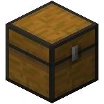

Now when you type `js hearts`, Javascript understands what `hearts` is, remembers its value and prints it out. Try it:

    js hearts
    
It should print out `8`. Secondly what I've done in the `js hearts = 8` expression is made an *assignment*. I've *assigned* the value 8 to the variable *hearts* using a *single* `=` sign. I can reassign the variable *hearts* a different value like this:

    js hearts = 9
    
That's why variables are called 'variables' - they can vary (or change) . Now when I issue the command:

    js hearts
    
It prints out `9`. Just as you can do math with numbers in Javascript, you can also do math with variables. Try this command:

    js hearts + 1
    
... should print out `10` as the result. That's because the computer now knows that 'hearts' is equal to 9 and that 9 + 1 is 10. Try each of the following commands yourself:

* `js hearts + 5`
* `js hearts - 2`
* `js hearts * 2`
* `js hearts / 3`

After executing all of the above commands issue the command:

    js hearts
    
You'll notice that the value of the 'hearts' variable is unchanged. It's still `9`. If you want to change the value of `hearts` by some amount you need to reassign it the new value. You can do so like this:

    js hearts = hearts + 1
    
What we've done here is combine a math operation and an assignment in a single statement. Now issue the command `js hearts` and you'll see that hearts is now `10`.

#### String variables
Let's create another variable called 'healthMessage' and assign it a value:

    js healthMessage = 'You have ' + hearts + ' health remaining'
    
What I've done here is create a new variable, and assigned it a value. The value is the text 'You have', plus the value of the 'hearts' variable, plus the text ' health remaining'. Everything between `' '` (single quote symbols) or `" "` (double quote symbols) in Javascript is treated as text. The result of this expression is:

    You have 10 health remaining
	
Javascript creates a new variable called `healthMessage`, then joins together the 3 values `'You have '` (which is text) , `hearts` (which is a number) and `' health remaining'` (more text) and constructs a new value `'You have 10 health remaining'` and assigns it to the `healthMessage` variable.

In Javascript, a piece of text is also called a *String*. In Minecraft a *String* is the material Spiders sometimes drop when slain. A String is also the word Programmers use when talking about text. Here are some examples of Strings (text) in Javascript:

* `js "Hello"`
    
* `js 'Goodbye'`
    
* `js "Minecraft 1.7.9"`
    
* `js "123"`

That last one might surprise you. Javascript treats anything between quotes as a string even if it's a number! In our first string example `js healthMessage = 'You have ' + hearts + ' health remaining'` I used the `+` operator to add strings together. The `+` operator can be used to add numbers or strings. When used to add strings, the `+` operator behaves differently. Adding Strings in Javascript is also called 'Concatenation'. We concatenate 2 or more strings together to form bigger, longer strings. This is a technique you will use quite often in programming minecraft plugins when you want to display information to players. 

The letters, numbers and other symbols which form a string are known as *Characters*. A *Character* is any single letter, number or symbol. 'a','B','9', '-', '.', '/' and ':' are all examples of *Characters*.

#### Escaping Quotes
In Javascript you can enclose a String in either single quotes ('') or double quotes ("") but what if your string needs to include these characters? In Javascript there are a couple of ways to do this. 

1. If your string contains only single quotes you can enclose the string in double quotes:

   `js "I'm a String!"`

2. If your string contains only double quotes you can enclose the string in single quotes:

   `js 'He said "No"'`

3. You can escape each single or double quote character by putting a back-slash character `\` in front of it:
 
   `js 'He said "I\'m a String!".'`

   `js "He said \"No\""` 

#### Naming variables
You can create as many variables as you like in Javascript. There's no limit on the number of variables you can create. You'll notice that both the 'hearts' and 'healthMessage' variables use one-word names. I could not call the 'healthMessage' variable 'health message' because variable names cannot have space characters. There are a few other rules about what Javascript will accept as a valid variable name. It doesn't like variable names that begin with numbers so `2player` is not a valid variable name but `player2` is. 

Javascript programmers - as a habit - generally use lowercase letters for variable names and if the variable name is made of two words joined together (as in `healthMessage`) then the first letter of the second word is usually uppercase. This style of variable naming is called Camel-Case and is considered 'Good Practice' among Javascript programmers. What this means is that using this naming convention makes it easier for programmers to read and understand each others (and their own) code.

You can read more about CamelCase on WikiPedia http://en.wikipedia.org/wiki/CamelCase

#### Making mistakes
Feel free to experiment at this point. Create your own variables using your own numbers, strings and operators. If you make a mistake you'll see a long-winded error message in your console window. These error messages are called stack traces and they're the computers way of telling you something went wrong. Stack traces can be very useful for Java programmers but not so useful for Javascript. Remember - the Minecraft Server software is written in Java not Javascript. You can think of ScriptCraft (the plugin you use when you type the `js` command in the server console) as a translator. It translates the Javascript code you type into Java code so that the server can understand it. If the Javascript code doesn't make sense then the translation won't work. 

Don't worry about making mistakes. Making mistakes is an essential part of learning something new. Computers are finicky about code and will point-blank refuse to execute code that isn't correct. We humans are good at conversation because we allow for errors and can make pretty good guesses at what someone else means even when there's background noise. Computers on the other hand are pretty dumb and aren't able to guess at what you really meant if your code isn't correct. The good news is every time you make a mistake you learn something new. Each of the following statements will cause an error:

 * `js help`

   `ReferenceError: "help" is not defined`
   
   This is Javascript's way of saying I don't know what 'help' is.
   
 * `js 'steve`
 
   `EvaluatorException: unterminated string literal`
   
   This means Javascript encountered a string `'steve` which didn't have a closing quote symbol. Strings must begin and end with either a single-quote (') or a double-quote (") character. What's more, you can't mix them - that is - you can't start a string with a single quote and end it with a double quote. The Strings `'this is good'` and `"so is this"` are both valid, but the Strings `'this is bad"` and `"another bad one'` are not.  

 * `js :-)` 
 
   `EvaluatorException: syntax error` 
   
   Javascript will respond with a `syntax error` if it simply doesn't understand what your code. It's clear from this example Javascript doesn't know what a smiley is :-)
   
As you learn to program, you will encounter errors. One misplaced comma, quote or full-stop and the Computer will complain by 'throwing an Exception'. Just remember to be patient, Computers aren't as smart as us so we have to be extra careful when typing code. 

#### Term: Exception
An Exception is something the computer did not expect - that's what makes it 'exceptional'. In Javascript, 'throwing an exception' is Javascript's way of saying something unexpected happened. An exception will often include a 'Stack Trace'. The 'Stack Trace' is a breadcrumb trail of where the computer was when the exception occurred.

#### The *var* keyword

I said earlier that we can create a new variable by typing a name and assigning it a value. In the earlier example...

    js hearts = 8

... two things happen with this statement. 

1. A new variable called 'hearts' is *declared*. To declare a variable is to create a variable.
2. The variable is also 'assigned' a new value (8). 'Assigning' a value to a variable means storing the value in the variable. 

So in the above statement we both 'declare' and 'assign' a new variable. It's considered good practice to declare variables using the `var` keyword. `var` as you can probably guess is short for 'variable'. So a better way to declare the variable is like this:

    js var hearts = 8

We should always declare variables using the `var` keyword. If variables aren't declared using the `var` keyword, they become what are called 'global' variables. That is; variables which can be seen everywhere in the program. Global variables can lead to confusion because different parts of your program can access and change the variable which can lead to unexpected results. Global variables often end up becoming a source of bugs in the program. Using the `var` keyword to create a new variable is another good habit you should adopt when writing Javascript code. 

Another thing to note is that we don't always have to both declare and assign a variable in the same statement. We can create a variable just by issuing this command:

    js var hungerBar

Notice that hungerBar doesn't yet have a value. We haven't assigned it one, we've just created the variable. Right now the 'hungerBar' variable has a special value called `undefined`. 'undefined' is another keyword in Javascript - it means there's nothing there. We can test this using the following code:

    js hungerBar == undefined

The result of this expression will be `true` . Note that I used two equals symbols which means I'm comparing. I want to see if hungerBar is equal to the special value 'undefined'. Now that I know that I know 'hungerBar' is undefined, I can assign it a value:

    js hungerBar = 10

Note that I didn't need to use the `var` keyword here because the 'hungerBar' variable has *already* been declared. All I'm doing is assigning the variable a new value. You should only use the `var` keyword when declaring a variable. 

#### Declaring multiple variables 

You can use the `var` keyword to declare just one variable or you can use it to declare any number of variables in a single statement. For example, to declare 2 variables 'gameMode' and 'allowFlight', we could use two separate statements like this...

    js var gameMode = 1

    js var allowFlight = true

... or we could declare both in a single statement like this:

    js var gameMode = 1, allowFlight = true

It has become commonplace to declare many variables using a single statement. 

#### Adding and Subtracting

We're going to play with the 'hungerBar' variable while exploring some more Javascript math operations. In Minecraft your hunger bar is the bar along the bottom of the screen next to your health bar which tells you how hungry you are. The hunger bar drains as you become exhausted and is replenished when you eat. This is done using simple Math; Addition and Subtraction. In Javascript there's more than one way to do addition with variables. We can 'increment' (increment means add 1) using the following operation:

    js hungerBar = hungerBar + 1

This increases the hungerBar variable by 1. The result (assuming the hungerBar's previous value was 10) will be 11. In most programming languages, this kind of operation is so common that the language designers provide shorthand ways to do it...

    js hungerBar += 1

Which does the same thing using fewer characters. This statement can be made shorter again and can be written as:

    js ++hungerBar

The `++` (2 '+' signs next to each other) is a convention used in many programming languages - including Javascript - to 'increment' values. Similarly, the same rules apply for subtracting values from a variable. All 3 of the following statements do the same thing - they each subtract 1.

    js hungerBar = hungerBar - 1

    js hungerBar -= 1

    js --hungerBar

Which statement you use is a matter of personal taste and style. While `--hungerBar` is easier to type, I personally prefer `hungerBar = hungerBar - 1` because I think it reads better.

#### Data types

Variables are used to store values. Those values can be numbers, text or one of the many other data types available in Javascript. You can ask Javascript what 'type of' data a variable has using the `typeof` operator. For example to find out what type of data the hungerBar variable holds:

    js typeof hungerBar

The result is 'number'. The typeof operator doesn't tell us what the value is, only its type. These are the different data types in Javascript:

* number
* string
* boolean
* object
* undefined
* function

To get some practice using the `typeof` operator, try each of the following examples in your server console window:

    js typeof false
    
    js typeof true
   
    js typeof 5
  
    js typeof 9.99

    js typeof 'Hello'
  
    js typeof "Goodbye"

    js typeof "5"

    js typeof console

    js typeof Herobrine

    js typeof parseInt

The values `true` and `false` are both *boolean* values. A boolean type can only ever have the values `true` or `false`. Boolean values are really important in programming because as we'll learn later, they are the values the computer uses when making decisions. When deciding what to do, the computer uses only these two values - there's no gray area or 'maybe' when it comes to boolean logic. 

The result of the expression `typeof "5"` might surprise you. Even though 5 is a number, because it is inside quote characters, Javascript thinks of it as a string. Everything inside of quote characters is considered a string in Javascript - even if there is a number inside the quotes.

The 'console' variable is one of the built-in variables in ScriptCraft and its type is 'object' - We'll talk about objects later. The `typeof Herobrine` returns `undefined` because there is no variable or value called 'Herobrine' in the system. We can safely use the `typeof` operator to test for the existence of variables in the system. If the variable doesn't exist then `typeof` will return `false`. If we were to try to access the undefined 'Herobrine' variable we'd get a *ReferenceError* exception. Try it to see for yourself:

    js Herobrine

The type of a variable is very important because it determines what you can do with it and how it behaves. Finally the `typeof parseInt` expression returns `function`. We'll dive into functions next.

### Functions
Functions in Javascript are very powerful because they are containers for code which can be called any number of times. In Javascript you can write your own functions or use any of the *built-in* functions provided by the language. A *built-in* function is simply a function which comes bundled with Javascript. Let's look at one of the built-in functions in Javascript - the *parseInt()* function.

##### Using functions
The *parseInt()* function is a useful function which will take any piece of text and try to extract (or 'parse') a number from it. Say you have some text '4 hours until sunset'. If you pass this text to the parseInt() function, it will try to figure out what number is in the text. Let's try it out:

    js parseInt('4 hours until sunset')

The result should be 4. What we did here was 'pass' the '4 hours until sunset' text to the parseInt function which processed the text and returned a value: 4.

We are effectively saying to parseInt "here's some text - give me the number (and only the number) from it". We pass the text to the parseInt() function by putting it between the round brackets - the `(` and `)` symbols. Any values between the `(` and `)` symbols are passed into the function and are called *Parameters*. Functions typically process (or do something) with the parameters and return a value. The great thing about functions is they can be called over and over again with different parameters. Try the following examples yourself:

    js parseInt('5 hearts left');
    js parseInt('This is not a number');
    js parseInt('3 blind mice');

#### Writing your own functions
One of the really cool things about programming is that you're not limited to using only the built-in functions provided by the language. You can create your own functions. In this book we're going to create a lot of functions to do cool things you wouldn't normally be able to do in Minecraft. For now let's create a simple new function that adds two numbers together. 

    js function add( firstNumber, secondNumber ) { return firstNumber + secondNumber }

When you enter this command nothing happens. That's because what we've just done is declared a new function called *add*. The function won't do anything until we call it. Let's do that:

    js add( 1, 2 )

The result is 3. Try calling it with different values to test that the function works. 

    js add( 5, 6 )
    js add( 9, 1 )

Now let's look at the earlier function declaration in more detail. A function is a way to package up code so that it can be reused over and over. When you create a new function you must say what *parameters* the function will expect. We do that by putting names between the round brackets - the `(` and `)` symbols. A function can take one or more parameters. If it takes more than one parameter then each parameter must be separated with the comma character ( , ). So the first part of the function declaration `function add( firstNumber, secondNumber )` gives the function a name (*add*) and says what the function should expect. The next step in definining the function is to say what the function should do. Everthing between the opening and closing curly brackets - the `{` and `}` symbols - is code which will be executed whenever the function is called. The diagram below illustrates the different parts of the function definition statement:

When you create a new function of your own, you should give the function a meaningful and memorable name. You can name the function parameters however you like. They don't have to be called firstNumber and secondNumber but you should give your parameters names which are memorable so you don't forget what the parameters are for. 

### Term: Reuse
Reuse is important in programming. While programming, you'll often find that a problem you're working on is similar to a problem you already solved some time ago. In that case, it's always good to be able to use code you've already written to solve new problems. There are two ways to do this: You can copy and paste the code you've already written, but a better way is to change the code you wrote earlier so that it works in both the earlier program and the new program you're currently working on. There are a couple of ways to write reusable code - packaging up code in functions is just one of them. We'll explore more ways to create reusable code throughout this book. 

In the example function above, there's just one statement: `return firstNumber + secondNumber` which will be executed every time this function is called. The `return` keyword is another special work in Javascript. It's used inside of functions to return something back to the caller. In this case we return the sum of the 2 numbers passed in. The `return` keyword should only ever be used inside functions.

### Achievement Unlocked!

You've created and invoked your very first Javascript function. Functions are an important part of Javascript and you'll create many more functions in the course of this book.

We've only scratched the surface of functions in Javascript. We'll explore functions more in later chapters.

### Summary
In this chapter we learned about how to execute Javascript at the server console prompt. We learned about math operations, variables and strings and the kinds of errors you'll encounter when learning Javascript. We also touched on functions - how to call them and how to create them. In the next chapter we'll learn about programming editors - the last piece of the puzzle in constructing your modding workbench.
 
## @@nextChapter{chapter-04}: Choosing and Using a Text Editor
### Introduction
Up to now we've been executing Javascript at the server console window using the `js ` command. This is a perfectly good way to try out Javascript. It's nice to have a command-line interpreter when trying things out and exploring a new language. However, once you want to start doing some real work with Javascript, you'll want to be able to save your work and run it, without issuing many `js` commands at the server console window each time your server starts up. 

ScriptCraft lets you load Javascript files you've saved and can either run them automatically when the server starts up or can run your code *on-demand*. If you plan on saving your work, you'll need to write your code using a text editor. Any text editor could do but I strongly recommend using a text editor dedicated to programming. A programming text editor will have a few extra bells and whistles to make writing code easier than it would be in a plain old text editor like Notepad. Most programming editors have what's called 'Syntax Highlighting' which colors different parts of your code to make it easier to read. Compare the following screenshots from a plain text editor and a programming editor ( gedit ). I think you'll agree syntax highlighting in the second example makes the code more pleasant to read. 

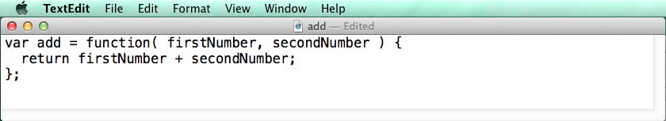

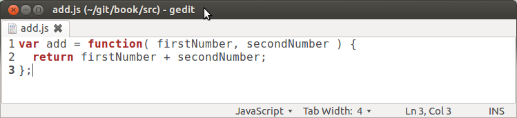

### Choosing an editor

There are many programming editors to choose from. Which editor you choose is ultimately up to you. I've been using Emacs - an Open Source editor - for many years but I don't recommend it to beginning programmers because while very powerful, it takes some time to learn. Programmers get very attached to their programming editors after time. You should start with an editor that's easy to use and learn. In this chapter I'll talk about gedit but you can use any of the following Programming Editors to get started programming.

* Notepad++ is a free editor for Windows you can download at http://notepad-plus-plus.org/ 
* TextWrangler from BareBones Software is a free editor for Mac OS X you can download at http://www.barebones.com/products/textwrangler/ 
* Sublime Text is a cross-platform editor which you can evaluate for free for as long as you like.

Let's get started installing gedit. You can skip this section if you've already installed and use a programing editor on your computer. Mac OS users can skip the following section and go straight to 'Installing TextWrangler on Mac OS'.

### gedit

The editor I use for screenshots in this book is called gedit. I chose gedit for use in this book because:

* It is cross-platform - that is - it runs on Windows and Linux. gedit also runs on older versions of Mac OS (up to version 10.5) but I recommend using TextWrangler for Mac OS.
* It is light-weight and easy to use. It installs quickly, doesn't take up much disk space and doesn't have a whole lot of features you'll need to learn. It's got just enough features to get started in programming.
* It has a Disk Explorer Pane which shows the folders with which you'll be working. This can be really handy when you want to quickly browse the folders for files to edit.
* It is free to use. It won't cost you to download and it won't nag you to upgrade to a paid version. 

You don't have to use gedit. Any programming editor will do. All Programming Editors have similar features, they let you create new files, edit, and save files. 

You can download gedit at https://wiki.gnome.org/Apps/Gedit/ . Follow the download instructions for your platform. 

#### Installing gedit on Linux
If you use Linux then gedit is probably already installed on your computer (Click the Dash Home button in the top left of your linux screen and type `gedit` to find it). If not already installed you can install it by opening the Ubuntu Software Center application and searching for 'gedit' or by issuing the following command in a terminal window...

    sudo apt-get install gedit

Once installed, you can launch gedit by typing gedit into the Dash Home search window (Click the Dash Home button).

#### Installing gedit on Windows
Follow these steps to install gedit on Windows.

1. Open your browser and go to https://wiki.gnome.rog/Apps/Gedit
2. Go to the Download section of the page and click the 'Windows Binaries' link.
3. Click on the link for the latest version ( at the time of writing this was 2.30 ).
4. Click the gedit-setup.exe link (it might be called a slightly different name).
5. Once it's downloaded, open the gedit-setup.exe file to begin the install.
6. Follow all of the install wizard steps. You can use the default values.

Once installed, gedit should appear in your Start Menu. If it doesn't appear in your Start Menu, you can search for it by typing 'gedit' in the Start Menu's Search field. 

#### The File Browser

Most modern programming editors provide a file Browsing view where you can see - at a glance - all of your folders and files. The disk browser is super useful when you want to quickly navigate around your Javascript folders and files. To enable the File browsing view in gedit, choose View => Side Panel to open the Side Panel view. In the bottom of the Side Panel view there is a File Browser tab which you should click to switch to the File Browser. From the File Browser (Disk Browser in TextWrangler on Mac OS) you can quickly open files, view folder contents, and create new files and sub-folders. Once you enable the Side Panel view it will be displayed the next time you launch gedit.

#### The gedit File Browser on Microsoft Windows
The first time you launch gedit for windows, you will need to change one of the default settings so that all files and folders appear in the File Browser window. By default only folders are shown in the Windows File Browser. This isn't very useful as we'll want to work with Folders and Javascript files. To ensure you can see all types of files do the following: In the File Browser window, right-click anywhere (click the right mouse button) and make sure that the *Show Binary* option is selected under the *Filter* menu. This will ensure all file types are visible.

#### gedit Preferences
The next step is to set some preferences for how the editor should behave. You do this by choosing Edit => Preferences to open the Preferences dialog. Let's look at each of the preferences sections in turn.

#### View preferences

It's useful to have gedit display line numbers alongside your code. The line numbers appear in the left margin of the window and are not part of your actual code. 
gedit will display a feint margin along the right side of the window in column 80. This margin is just a guide to indicate that perhaps your line of code is too long. It's only a guide though and can be safely ignored. It's generally considered good practice to keep lines of code shorter than 80 characters long to help readability, but there will always be exceptions to this rule.

The 'Enable text wrapping' setting should be turned off for programming. It's useful if you're writing a letter, essay or other non-programming text but it can be confusing if turned on while programming. 

'Highlight current line' makes it easier to see where you currently are in the code. When looking at a large Javascript file, it can be difficult to see the cursor (the blinking block that appears next to letters as you type).

'Highlight matching brackets' is a super useful programming feature. As you move the cursor around your Javascript source, when the cursor is next to any of the following characters it will match the opening or closing character.

* Round brackets : (  )
* Curly brackets : {  }
* Square brackets : [  ]

This can really help when writing or editing code. In the screenshot below, you can see the cursor on line 1 next to the `{` character with both the opening and closing curly brackets highlighted in gray. 

#### Editor preferences
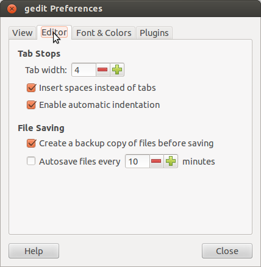

I recommend using either 2 or 4 spaces for tabs to make your code more readable. This is largely a matter of style and personal taste. When starting out, you should probably use 4 spaces. 

Automatic Indentation is a handy feature which saves you having to type TAB and SPACE characters when you start writing a new line of code.

gedit can create a backup of your your files before you save them. This is usually a good idea.

#### Fonts & Colors
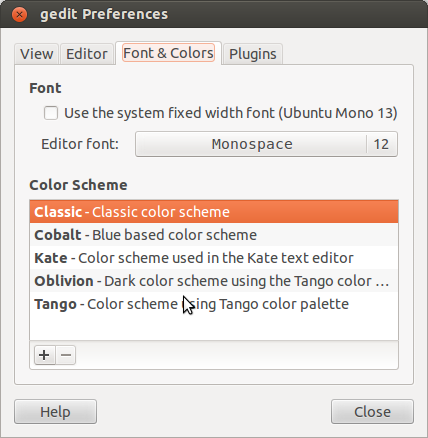

You can change the font and color scheme to suit your own tastes. Some people prefer dark text on a light background, some prefer light text on a dark background. Pick the color scheme you like. You can always change it later.

#### Plugins

gedit comes with a couple of editing plugins. You should make sure that the 'File Browser Panel' plugin is selected.

### Installing TextWrangler on Mac OS
Follow these steps to install TextWrangler on Mac OS.

1. Open the App Store application and search for 'TextWrangler' in the search box in the top right.
2. Click the Free/Install App button to begin installing.

Once installed, you can launch TextWrangler by typing 'textw' in the Spotlight search field in the top right of the screen and clicking the TextWrangler result.

Whenever you Launch TextWrangler you should open a 'Disk Browser' window by choosing File => New => Disk Browser. The Disk Browser in TextWrangler lets you quickly navigate around different files in the ScriptCraft folder and sub-folders. 

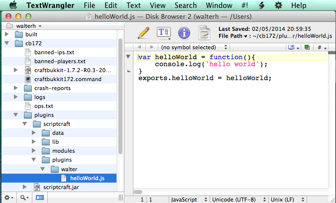

### First steps with your editor

To get used to working with a programming editor, we're going to create a new folder and file in the ScriptCraft plugins folder and save the new file. 

#### Create a new Folder

In the File Browser Pane ( the Disk Browser in TextWrangler on Mac OS ) locate and select the folder where you installed CraftBukkit earlier. Then navigate to the plugins/scriptcraft/plugins sub-folder. Once selected, right-click on the folder and choose 'New Folder' from the menu. Call your new folder 'learning' for now. You can call it something else as long as it's memorable - we'll come back to this folder later.

Your new folder will now appear in the File/Disk Browser Pane. 

#### Create a new Javascript file

The next step is to create a new Javascript file in the sub-folder we just created. The file won't do much just yet but we'll work some more on it soon. Right-click on the Folder you just created and choose 'New File' from the menu. Call the new file 'helloWorld.js'.

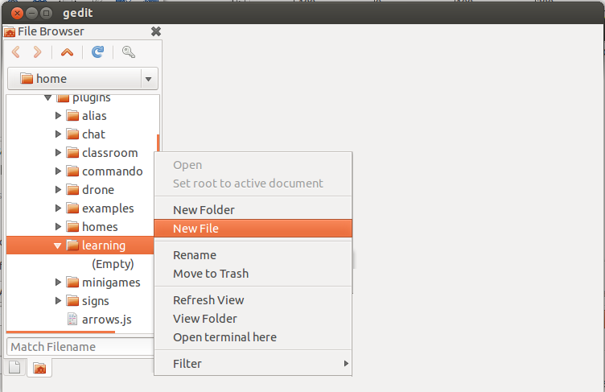

The file has just been created but hasn't been opened. If using TextWrangler click the file to open it. If using gedit double-click the file to open it. The file contents now appear in the editing pane on the right. The file is - as you'd expect - empty. Type in the following code exactly as you see it.

    // TO DO : Add some code later

The above code is just a *comment* we've added to remind ourselves that we must add some proper code later. This 'comment' isn't understandable to the computer so we can write whatever we like on a line beginning with `//`, the computer will not try to interpret and execute it. Comments like this can be very useful for programmers because they make understanding code easier. Writing code is like any kind of writing - you should try to make your code readable by yourself and others so if you look at your code later you can figure out what you did. 

Most programming languages provide a way to add comments. In Javascript there are different ways you can add comments. You can add a single-line comment like the one above by inserting 2 forward-slash ( / ) characters and then any text after is a comment and will be ignored by the computer until the next line. We'll talk more about comments later. 

#### Saving your work.

Save the file by choosing 'Save' from the File menu or by pressing CTRL + S ( CMD + S on Mac OS ). The file is now saved. You can verify this by closing the file and opening it once more. To close the file choose 'Close' from the File menu or press the close icon next to the file name at the top of the editor pane.

Reopen the file by double-clicking it in the File/Disk Browser pane. The text you entered previously should still be present. Saving your work is really important because code you edit will not take effect unless you first save it. You'd be surprised how often even experienced programmers forget this simple rule and are left wondering why their code isn't working as expected.

When using scriptcraft, the folder where you save your work is important. You can't just save your files anywhere and hope they'll be executed by scriptcraft. For now we've saved the newly created 'helloWorld.js' file in the plugins/scriptcraft/plugins sub-folder. Just as the Minecraft Server looks for .jar files in its plugins sub-folder to load Java-based plugins, ScriptCraft too looks for .js files in its own scriptcraft/plugins folder to load Javascript-based plugins.

### Summary

We've installed a programming editor and have taken our first steps creating and editing a new Javascript file. In the next section of the book we'll dive into creating working Javascript plugins for Minecraft. 

This is where the fun begins.

# Part II Basic Modding 
## Overview
In the previous section we assembled all of the parts we needed to construct our modding workbench. Now we're ready to begin developing Minecraft plugins. In this section of the book you'll learn about how to create plugins and you'll also learn more about Javascript. In aach chapter in this section we'll develop a working plugin and learn about Javascript along the way.

## @@nextChapter{chapter-05}: Your first minecraft plugin
### Introduction
So let's dive in and create our first Minecraft plugin. A plugin is a program which is a small program which is loaded and executed by a larger program. The larger program we'll be using is of course Minecraft Server. This first plugin will be short - just a couple of lines of code - so you won't have to type too much but you should read through this first chapter and try to understand the code and the notes. We'll build on the knowledge learned here in later Chapters.
### Hello World
Launch your Editor and open the helloWorld.js file you created in the @@chapter{chapter-04} of the previous section. Once opened, you can now remove the comment entered previously and type the following text:

    console.log('Hello World');

We haven't used the console.log() function before. It's a built-in function which will print out a message for display in the server console window. You can also use the 'console.log()' function in interactive mode at the server console window. Issue `js console.log( 8 + 3 )` and you'll see it prints the result:

    [scriptcraft] 11

Whenever you use the *console.log()* function, the output will start with `[scriptcraft]` because *console.log()* writes to the server's log file which is used by the core server and all plugins. The server software prepends the plugin name to make it easy for server administrators to tell which plugin is responsible for messages in the log file. We'll use console.log() quite a lot in upcoming examples. This function is also super useful for debugging code - that is - putting statements in your code so you know it's being executed. 

You may be wondering what the `;` (semicolon) is doing at the end of the line. The semicolon is used to end each statement in Javascript. If you think of a statement as a sentence, then the semicolon ';' is to statements what the full stop '.' is to sentences. In Javascript the semicolon isn't strictly needed but you should use it anyway. 

Another thing you might notice is there is no `js ` command in the helloWorld.js file. The `js ` prefix (text which is placed in front of other text) is only needed when executing Javascript at the server console or in-game prompt. It's never used or needed inside Javascript files.

After you've changed the helloWorld.js file, make sure to save it (choose Save from the File menu).

If your server isn't already started, then start it by running the script you created earlier. If the server is already started then restart your server by issuing the `reload` command in the server console window. After starting or restarting your server you should see the text 'Hello World' appear in your server console window. In fact you will see it every time the server starts. 

### Achievement Unlocked!

Believe it or not, you've just written your first Minecraft Plugin!

Well that was easy wasn't it? This might be a trivially simple plugin but it demonstrates essentially what a plugin is - some code which is 'embedded' in a larger program and is loaded every time the host program loads. The plugin code never runs on its own - it can only be run as part of some bigger 'host' program (Minecraft Server). You've just added new code to Minecraft Server! Now is a good time to do a happy dance or phone your pals to let them know you've joined the ranks of Minecraft Modders. :-)

### Making your function reusable

So far the plugin we've written works fine in that it is loaded and executed when the Minecraft Server starts. Sometimes that's all you might want or need but what if you want to be able to execute the code later on? Let's start by putting the code inside a function.
   
@@listing helloWorld_v1.js helloWorld() Function Declaration
   
Now restart the server. 
   
What just happened? *The message no longer displays at startup!* That's because we've put the code inside a function but we haven't called the function yet! Declaring a new function and invoking the function are two different things. Just because you declare a function, it does not mean the function is automatically invoked when the file is loaded. Let's change the code once more, this time adding a call to the function we just created.

@@listing helloWorld_v2.js helloWorld() Function Declaration and Execution

Now restart the server again. Once again, the message will appear every time the server starts up. The helloWorld() function you wrote will be loaded and executed by the Minecraft Server every time it starts.
   
OK. So we've wrapped the original code inside a function of our own and we call that function. So far so good. Sometimes you'll want to write functions to use at the in-game or server console prompt. Try running the helloWorld function at the in-game or server console prompt.
   
    js helloWorld()
    
This command fails with an error `ReferenceError: helloWorld is not defined`. That's odd - no? The function obviously exists and works because it successfully executed when the server started up. How can it now clim the function isn't there? That's because functions which are loaded from the plugins/scriptcraft/plugins directory aren't automatically made available for use by others. The helloWorld.js file loads and all code in the file is evaluated and executed at startup. However, once it's loaded and executed, the code is basically invisible to others and can't be run again. You can make your code visible to others using a special variable called 'exports'. The 'exports' variable (as its name implies) "exports" code for use by others. It's how we provide code for use outside of the plugin itself. Let's revisit the helloWorld.js file one more time...

@@listing helloWorld_v3.js Making helloWorld() public

Restart the server again. Now the message appears in the server console. Let's look at the last statement in the code:

    exports.helloWorld = helloWorld;
    
What we are doing here is 'exporting' the helloWorld variable/function for use outside of the plugin. 

The 'exports' variable isn't part of the Javascript core language. It's provided by ScriptCraft which uses a module loading convention called 'CommonJS'. CommonJS is a set of rules which say how modules (and other things not provided by Javascript itself) should work. The CommonJS rules for modules are easy to understand and adopt so have become very popular lately, especially with the rising popularity of a Javascript-based system called Node.js which is used by professional programmers for all sorts of things. 

### Private and Public Variables
When you create a new variable in a Javascript file, it is 'private'. That means that no other parts of the system can see it. Only code within the file itself can see variables declared in a file. That's why - earlier - we couldn't execute the helloWorld() function even though it was defined and used within the file itself. Having variables be private by default is a good thing. If every variable you created was visible everywhere in the system it would lead to confusion. Imagine you created a file called 'MySuperDooperPlugin.js' and another called 'MyExplodingZombiesPlugin.js' and in both these files you have a variable called 'livesRemaining' . If the livesRemaining variable wasn't private then both MySuperDooperPlugin and MyExplodingZombiesPlugin would end up using the same variable which may not be what was intended at all. 

Making variables private by default means that 2 or more plugins don't have to worry about stepping on each others toes when updating or reading variables. In short - private variables are good. 

There are times when you want to make a variable public so it can be used by other parts of the system. To do this, you attach the variable to the special `exports` variable as we did earlier. As a general rule you should not make all of your variables public unless you really think they'll be needed elsewhere. We'll talk more about public and private variables later.

### A short note about Objects
The exports variable is a special type of variable - it is an 'object'. An object in Javascript is something that can hold or contain other variables and functions. So we can create a new variable that belongs to the exports object much like we'd normally create a new variable ...

    exports.favoriteGame = 'Minecraft';

... The difference is, because we're attaching a new variable `favoriteGame` to an existing object `exports` we don't need to use the `var` keyword. Variables which belong to objects are also called 'properties'. For example, every player in Minecraft is essentially (from the game's point of view) an object with certain properties. Each player has a health-level, experience points, the ability to fly (or not) and so on. In fact everything in Minecraft is an Object, - Players, Blocks, Tools, Animals, Biomes, Worlds, Recipes and even the Server itself. Everything is an object because Minecraft is written in Java and Java is an Object-Oriented programming language. All of these objects in turn have properties. Each world has a *time* property which dictates what time it is in the game. Primed TNT blocks have an *yield* property which says how wide the explosion will be. 

Players have dozens of properties. For example to give yourself the ability to fly, issue the following command at the in-game prompt: 

    js self.allowFlight = true

To give yourself super-human speed issue this command: 
    
    js self.walkSpeed = 1 

To reset your walkspeed to normal issue the command `js self.walkSpeed = 0`. The *self* variable is one of the built-in variables provided by ScriptCraft. When used at the command-prompt it refers to the player or console sender who issues the */js* command. The *self* variable should not be used anywhere except at the in-game or server console prompt. Everything in Minecraft is an object and every object has properties. Knowing how to use these objects and properties is the key to creating cool plugins for minecraft. I'll talk more about objects in later chapters where we'll learn how to explore the Bukkit API documentation. 

#### Term: Property
A *property* is an attribute of an Object - for example in real life we (humans that is) all have properties: eye-color, date-of-birth, name and so on. Objects in Javascript also have properties and so too do in-game objects, The server object has *motd* (message of the day) and *port* properties. Each player has food level, experience and name properties. You can think of properties as variables that belong to or are attached to other variables (called objects).

### Summary
In this chapter you've written your very first plugin and have used the special `exports` variable to export your code so it can be reused elsewhere at the in-game or server console prompt.

## @@nextChapter{chapter-06}: Rolling Dice
### Introduction
Traditional board-games such as Ludo, Monopoly and Snake & Ladders all have an element of chance. Success is sometimes down solely to luck and the roll of the dice. In this chapter we're going to create a Javascript module which mimics a 6-sided dice (the standard dice that comes with most board-games). We'll reuse this module in later chapters to give random greetings to players who join the game.

In this chapter, I'll walk you through creating your very first *reusable* Javascript module.

### Randomness
When you throw a 6-sided dice, there's no way of knowing what the throw will be, it can be any number between 1 and 6 but it's impossible to know ahead of time what the number will be. The number which is thrown is said to be 'Random'. Computers can also provide random numbers. In the Javascript programming language there's a special method of getting a random number `Math.random()` . In this chapter we'll use this method to get a random number. 

### Think of a number between 0 and 1
Before we begin writing the module, let's do some command-prompt exploration. At the in-game prompt type the following and hit ENTER...

    /js Math.random()

... you should see something like the following returned ...

    0.7184312066528946

The number you see will be different but it will be a number between 0 and 1. Try it again: type the same command at the in-game prompt and hit ENTER. This time you'll see a different number than the previous number but it too will be between 0 and 1. You can do this as many times as you like and the number will be different each time. 

Tip: You can quickly perform the previous command at the in-game prompt by pressing the / key and then pressing the UP Arrow key.

The numbers which Math.random() returns are called floating point numbers. You might not think there are any numbers between 0 and 1 but there are in fact many, many, numbers. It's this range of numbers which Javascript uses. The actual range of numbers is 0. 0000000000000000 to 0. 9999999999999999. That's 9 Quadrillion, 999 Trillion, 999 billion, 999 million, 999 thousand and 999 possible numbers. 

### A special 6-sided dice.
A regular 6-sided dice has numbers from 1 through 6 printed or etched on each of the 6 sides. That's because we typically count up from 1. The number 1 is usually the starting point when we want to count up to something. Javascript (like many programming languages) is different. In Javascript counting begins at the number 0. So if you want to count 10 numbers, where normally you'd count from 1 to 10 ...

1, 2, 3, 4, 5, 6, 7, 8, 9, 10

In Javascript the count would look like this...

0, 1, 2, 3, 4, 5, 6, 7, 8, 9

This can be confusing for beginning and experienced programmers and takes some getting used to. I'll explain why counting from 0 is important in the following chapters. Our virtual 6-sided dice will have the numbers 0, 1, 2, 3, 4, 5 rather than the usual 1, 2, 3, 4, 5, 6.

### Playing with Numbers
We have a problem to solve. Math.random() will give us a number between 0.0 and 0. 9999999999999999 which isn't useful for most everyday uses. We're only interested in 6 possible numbers so we need to do some Math to get the result we need. We'll explore some basic Math you can do in Javascript and some operations you can perform on floating point numbers but first let's think about what we want to be able to do once our first plugin is complete. 

Ideally we'd like to be able to issue the following command at the in-game prompt and have a useful number returned...

    /js dice.roll()

That is; calling dice.roll() should return a random number between 0 and 5 behaving much like a real world dice. If you try to run the above command now, it will fail because we haven't yet created this function. That's what we're going to do ...

Launch your editor and in the File/Disk Browser, select the **scriptcraft/modules** folder.

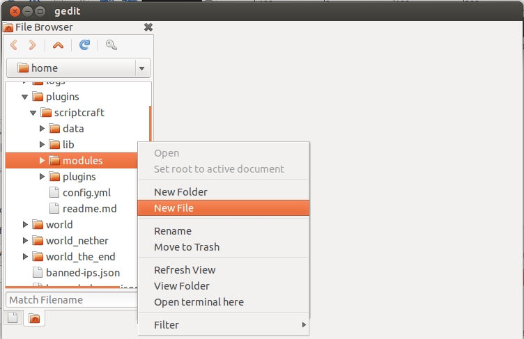

Important: You must select the scriptcraft/modules folder not the scriptcraft/plugins folder!

Right-click and choose 'New File' from the menu. Call your new file 'dice.js' then double-click it to open it (a single click will do for TextWrangler).

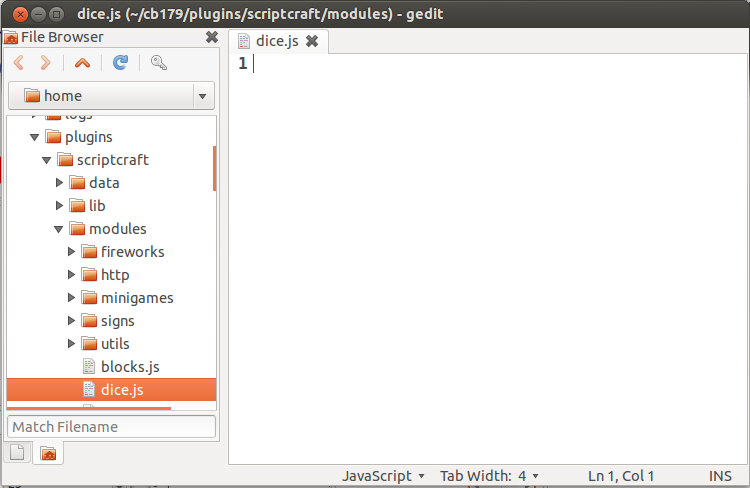

Type the following code into the newly created file...

@@listing dice_v1.js Rolling Dice

We'll talk about this code later. For now, type the code as you see it above. Once you've typed the code, save your work (go to the File menu and choose 'Save').

Once you've saved your work go back to Minecraft and at the in-game command prompt (remember, you can bring up the prompt by pressing the / key on your computer's keyboard) type the following...

    /js refresh()

The refresh() function is a ScriptCraft function which reloads all of the Javascript code. The server has a built-in */reload* command which will reload **all of the server plugins** but for our purposes we only need to reload ScriptCraft to reload our Javascript. /js refresh() is like reload but it only reloads ScriptCraft and Javascript code.

The refresh() function is important, you should execute it every time you change your Javascript code because changes to your code won't be activated in the game until you do so.

Tip: While working on a Minecraft plugin, if the plugin isn't working as you expect, make sure you've run the /js refresh() function first.

Once you've executed the /js refresh() function, you're ready to try out your new function. Try issuing the following command:

    /js dice.roll()
    
You should see an error message like this: ReferenceError: "dice" is not defined. OK. Let's try calling roll() on it's own so:

    /js roll()
    
You'll see another error message: ReferenceError: "roll" is not defined. Why doesn't this work?

If you remember, the new file we just created, dice.js, was saved in the scriptcraft/modules folder not the scriptcraft/plugins folder. The scriptcraft/plugins folder is special for a couple of reasons:

1. All Javascript files in the scriptcraft/plugins folder are automatically loaded and executed when the server starts.
2. All variables 'exported' from files within the scriptcraft/plugins folder become what are called 'global' variables. That means they are public for all the rest of the system to see. 

There are other folders in scriptcraft. The 'modules' folder is much like the plugins folder. It's a folder where you can create new Javascript files. It's similar to scriptcraft/plugins except:

1. Javascript files inside the scriptcraft/modules folder are *not* automatically loaded or executed when the server starts.
2. Variables exported from files in the scriptcraft/modules folder are not automatically available everywhere - they are not 'global' variables.

So this leaves us in a bit of a pickle. We've written some useful code, but how do we get to use it?

### Modules
What is a module? A module in ScriptCraft is simply a Javascript file. Throughout this book I will use the words module and file interchangeably because in ScriptCraft they mean the same thing. ScriptCraft uses a commonly used module system called CommonJS which is also used by NodeJS - an increasingly popular Javascript programming environment. In a nutshell, modules provide yet another way to make your code 'reusable'. We've already used functions to package up statements that we want to call over and over. Well, modules provide a way to package up functions. So far we've only written one function in our file but in later chapters we'll create modules which have many functions.

Modular systems are good when programming. They're good because modules (much like the command, lander and service module in the above diagram) can be combined together to form larger systems. Modules usually perform a set of related functions to serve a single purpose. So for example, in the diagram above the lunar lander module was only used to land on the moon. That was its only purpose. Similarly, when writing Javascript modules, it's considered good practice to have the module serve a single purpose. If you're interested in learning more about modules check out the CommonJS website http://www.commonjs.org/specs/modules/1.0/ for more information. We'll learn some more about modules throughout this book.

Getting back to our earlier problem - how do we use the new dice.js module we just created? Remember earlier we learned about the special 'exports' variable which is used to expose private variables for use by others? Well you may be wondering how we get at variables exposed in this way. Fortunately there's a special function called 'require()' which lets us do just that. The 'require()' function is the counterpart to the 'exports' variable. We use 'exports' to say "here's some of my code you can use" and we use require() to say "Hey I'd like to use the code in such-and-such module". 

So to use the code we just wrote inside the dice.js module we first need to 'require()' it. We do so using a statement like this:

    /js var dice = require('dice')

The above statement loads your newly created dice.js module into the computer's memory. The require() function is how ScriptCraft loads Javascript modules. You'll notice I didn't need to include the '.js' suffix (the last part of the filename). This is because the require() function is smart enough to know that it should only look for '.js' files anyway. It's also smart enough to know it should look in the modules folder so we didn't need to write `require('/modules/dice.js')`. After you load your module using the require() function you should almost always assign it to a variable. In this case the variable has the same name as the module but it doesn't have to be. I could have written `var steve = require('dice')` and it would work just as well. 

You'll notice that the above statement doesn't appear to have called `roll()` yet. Loading a module will execute any code in the module but remeber, our module just defines a function. **Defining a function and calling a function are not the same thing.** To call the roll function on the module we just loaded, issue the following command:

    /js dice.roll()

A random number between 0 and 5 should be displayed. Try running the above command a couple of times. Each time you should see a different number returned. Remember, you can run the previous command quickly by typing / then pressing the UP Arrow key.

Troubleshooting: If you don't see a number or if the /js var dice = require('dice') command didn't work (you saw an error), take a look at the Server console window to see what kind of error occurred. More than likely there was a typing error when entering the code. Double-check the code to make sure it's exactly the same as the code in listing @@listref{dice_v1.js}.

You may be wondering why we call the *roll* function the way we do, `dice.roll()` , why couldn't we just have used `roll()` ? We can't just call it like that would only work if the dice.js file was located in the *scriptcraft/plugins* folder. When we *require* a module, what we get back is an *Object*. An object remember is a special type of variable that can hold more than one value in what are called properties. So `require('dice')` actually returns an object - the `exports` object that we used inside the module itself to make public the *roll* function. When you call a function that's attached to an object you have to call it by putting the object name in front, then a full-stop, then the function name. So we say `console.log()` because `console` is an object, and `log()` is a function attached to the object. Similarly we say `dice.roll()` because `dice` is an object and `roll()` is the function attached to it. This can take a little getting used to but becomes second nature over time.

Major Kudos! You've create created your first Javascript module, loaded it and used it! You've taken your second giant step to creating reusable code. 

### Digging Deeper
Let's look at the code we've just added to Minecraft. The code is reprinted below...

@@listing dice_v1.js Rolling Dice

A Javascript module is a file with one or more related functions. In the above file we have one single function called roll. We let others use functions by exporting them. We'll dive deeper into the exports object and modules in later chapters, for now let's look at the function body itself (lines 2 through 5). 

1. The first statement of the function, `var result = Math.random();` declares a new variable called 'result' and assigns a random number to it. Remember: Math.random() will return a random number between 0 and 1. 
2. The next statement `result = result * 6` takes the number and multiplies it by 6. Remember; the `*` symbol is used in Javascript to multiply numbers. 
3. Next we convert the number to a integer by passing it to the `Math.floor()` function and storing the result. Math.floor() is used to round down a number. Math.floor() will chop off the fraction from any number so for example, 3.5 becomes 3.0, 4.9 becomes 4.0 , 1.1 becomes 1.0 and so on. The Math object is a built-in object and comes with many functions for performing math operations. 
4. Finally the last statement in the function uses the special `return` statement to return a value from the function. The function stops executing when it hits the `return` statement and either returns an expression if one is provided or returns no value (undefined) if no expression is given. In this example, we want the roll() function to return the `result` variable.

As in the previous plugin, the last line of the file makes the *roll* function avaiable for use outside of this file by *exporting* it. Note that we don't *invoke* the function in this last line ( to *invoke* a function means to *call* it or to *run* it), we just attach it to the special `exports` variable whose sole purpose is to reveal what your file can do. `exports.roll = roll` effectively says, this file has a *public* function called *roll* (exports.roll) which is actually the same as the *private* function of the same name (the function declaration which begins on line 1 of the file).

Don't worry if this seems confusing at first. We'll use the `exports` variable throughout this book and its purpose should become clearer with repetition. 

#### Rounding Numbers
All numbers in Javascript are floating point numbers, that is they have an integer part (the part before the dot) and a fractional part (the part after the dot). The number 'two and a half' is represented in Javascript as:

    2.5
    
This number is a floating point number. The integer part is 2. In Javascript if we want to 'round up' or 'round down' a number to its nearest integer we use one of the Math functions.

* Math.floor(n) - Takes a number and chops off the fractional part. It rounds down the number. For example, 2.5 becomes 2.0.
* Math.ceil(n) - Rounds up a number to the nearest integer. For example 2.5 becomes 3.0, 2.1 becomes 3.0  and so on.
* Math.round(n) - Will round up or round down a number to the nearest integer. It will round up any fraction part greater than .5 so for example, 2.5 is rounded up to 3.0 but 2.4 is rounded down to 2.0.

#### Math 
The built-in Math object has many other useful properties and functions, here are just some...

* Math.PI - The number value for &pi;, the ratio of the circumference of a circle to its diameter, which is roughly 3.1415926535897932. This value is used for example when constructing spheres, cylinders and arcs in ScriptCraft. 
* Math.abs(n) - The absolute value of a number is its value as a positive number. Math.abs() is used to convert negative numbers (numbers less than 0) to positive numbers so for example, `Math.abs(-3)` returns 3.
* Math.max(n,m,...) - Math.max() will take any number of numbers and will return the largest number. So for example, `Math.max( 3, 9, 2, 5)` will return 9.
* Math.min(n,m) - Math.min() will take any number of numbers and will return the *smallest* number. So for example, `Math.min( 3, 9, 2, 5)` will return 2.
* Math.sqrt(n) - will return the square root of a number. For example, `Math.sqrt(9)` returns 3, `Math.sqrt(4)` returns 2, `Math.sqrt(16)` returns 4 and so on.

I encourage you to try out each of the above properties and functions at the in-game prompt. Remember that in interactive mode you must prefix each Javascript statement with `/js `.

For more information about the Math object visit http://www.ecma-international.org/ecma-262/5.1/#sec-15.8

#### The return statement
The return statement is used inside functions to:

1. Stop execution of the function. 
2. Return a value to the caller of the function.

The `return` statement can only be used inside a function. It's possible to have functions which don't have a return statement at all in which case the function stops executing when it runs the last statement in the function. Functions don't *have* to return a value, in fact, many of the functions we'll write later won't. 

### Summary
In this chapter we created our first truly reusable module. We learned about Modules, Random numbers and the Math object. In the next chapter we'll enhance this module further and in the chapter after we'll use the module to create custom greetings for players joining the server.

## @@nextChapter{chapter-07}: Multi-sided dice
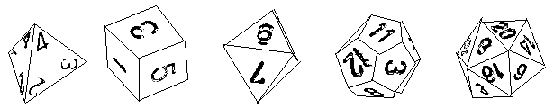
### Introduction
In this chapter we'll build on the code written in the previous chapter to let us roll a dice of any number of sides. Sometimes we want a random number that doesn't fit in the range 1 to 6. Ideally we'd like our virtual dice module to return a random number for any range we give it. We're going to take our 6-sided dice from the earlier chapter and enhance it so it can change shape to any number of sides like the multi-sided dice used in some table-top and role-playing games.
### Flexible Functions
If we wanted to expand on what we've already done to support dices of 4, 6 and 8 sides we might write new functions for each dice...

    function rollSixSided(){ 
      ...
    }
    function rollFourSided(){
      ...
    }
    function rollEightSided(){
      ...
    }
    exports.rollSixSided = rollSixSided;
    exports.rollFourSided = rollFourSided;
    exports.rollEightSided = rollEightSided;
    ...
    
... and so on. That would be time-consuming, repetitive and laborious, and the whole point of programming is to **make the computer do the work!**. The problem with this approach (apart from being time-consuming to type) is that every time we want to support a new type of dice - say 10, 12 and 20 sided dice - we have to write a new function. If we wanted to simulate the roll of a 24 sided dice, we'd have to write *yet another* function. Fortunately there's a better way. 

What if, when we call the *roll()* function, we could tell the function how many sides the dice has and the *roll()* function behaved accordingly? If we could say 'Hey throw a 6-sided dice' or 'Hey throw a 20-sided dice' and *roll* would do the right thing (return a random number between 0 and 5 for the first call and return a random number between 0 and 19 for the second call). This is where *Parameters* come in. 

### Term: Parameter
*Parameters* provide a way to give some instructions to functions. We can pass values to a function and the function will treat them like variables. There's another word often used in programming which can mean the same thing: Arguments. We say that we pass arguments to functions and the function receives them as paramaters. The distinction isn't very important. You can use the words *arguments* or *parameters* when talking about passing values to functions.

We've already been using parameters in earlier code examples. In an earlier chapter we used the *console.log* function and passed it a parameter. Try issuing the following statements at the server console window:

    js console.log('Hello world');

You should see the message 'Hello world' appear in your server window. 'Hello world' is the instruction (or *parameter* to use the formal term) you gave to the *console.log* function when you ran it. Try again with the following command:

    js console.log( 5 + 9 );
    
You should see '14' appear in your server window. The expression `5 + 9` is the parameter you gave to *console.log* and the *console.log* function just printed the resulting value. An important point: console.log did not do the math, that was done just before the function was called so the parameter which *console.log* received was 14. It had no knowledge of the math that was done before it was called - console.log only saw 14, it did not see `5 + 9`. The *console.log* function is commonly used for *logging*. Logging is the practice of printing output to screen usually for the purpose of debugging or better understanding your code's behaviour.

Just as *console.log* and many other functions can take parameters, we can write our own functions so that they take parameters when they are called. Let's take a look at a slightly modified version of the code from the previous chapter. You don't have to type this code, I just want to highlight some changes:

@@listing dice_v2.js Rolling Dice - sides as a variable.

The above code is similar to code from the previous chapter except I declare a new variable called *sides* and the number 6 is assigned to it. On the following line the math used is `result = result * sides` instead of `result = result * 6` as in the previous chapter. So all we've done is create a new variable called *sides* to store the number of sides. This function behaves absolutely the same as the previous chapter. But what if we could somehow change the value of the *sides* variable before each call to *roll* ? Let's change the code once more:

@@listing dice_v3.js Rolling Dice - sides as a parameter.

Can you spot the difference? I removed the `var sides = 6;` statement and put a new name `sides` between the function's curly brackets. The `sides` variable is no longer a private variable and is instead a parameter. Because it's a parmeter we can say what it should be each time we call the *roll* function. The following diagram illustrates the changes the function has just undergone.

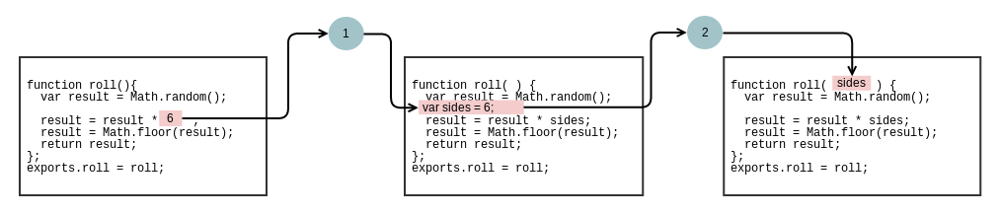

The first change was to make the number 6 used in the computation a variable. The next change was to make the variable a parameter. Parameters are like variables. In the first version of this program (on the left hand side) the number 6 is 'hard-coded'. 'Hard-coding' is when you have a specific number or text or other data in your function which at the time seemed like it might never need to change (this would be true if we assumed we'd only ever need a number between 0 and 5). It's usually a good idea to instead turn these values into parameters so you don't have to change your code every time the data changes. Once you've edited your dice.js file to match the version on the right, save it and then type `/js refresh()` at the in-game prompt and try each of the following commands in turn:

    /js var dice = require('dice');

    /js dice.roll(6);
    /js dice.roll(20);

Try calling `dice.roll(20)` a couple of times to confirm that it does in fact choose random numbers between 0 and 19. 

Our updated roll() function now takes a parameter which says how many sides the dice should have. The type of parameter this function takes is of type 'Number'. Functions can take parameters of any type, Numbers, Strings (text), Booleans (true or false), even other functions! We'll see an example in the next chapter of a function which takes another function as a parameter. Remember - functions are just values like anything else in Javascript so they too can be assigned to variables (as we've already seen) or passed as parameters (as we'll soon see). 

### Default parameter values
What happens if you call dice.roll() *without* passing a parameter? You can see for yourself by issuing this command at the in-game prompt:

    /js dice.roll()

You should see `NaN` as the result. *NaN* is short for *Not a Number* in Javascript and it means the computed value - the result of the math operations that is - was not a number. Do you know why? Our function always expects a number (how many sides the dice has) and if we don't give it one then the math won't work as expected. Wouldn't it be nice if, when no number is passed to `dice.roll()` it just assumes that we want the roll of a six-sided dice? Six-sided dice are after all the most common type of dice. Let's make another minor change to the *roll* function:

@@listing dice_v4.js Rolling Dice. Default Parameters

What I've done here is add 3 new lines of code near the top of the *roll* function. The rest of the function remains unchanged.

    if ( typeof sides === 'undefined' ) {
      sides = 6;
    }

The *if* statement is how decisions are made in Javascript. It's used to test something (a condition) and if the test is true then the code inside the `{` and `}` curly braces (called the 'if block') is executed. In english, we'd write the above code like this.

    if there is no 'sides' parameter then
       let sides be equal to 6
       
We'll look at the `if` statement in more detail in later chapters. All you need to know for now is that it can be useful for controlling how our programs behave under different conditions. The code inside the round brackets `typeof sides === 'undefined'` returns the type of the sides parameter. If no parameter was supplied then it will be of type *undefined* in which case we set the sides parameter to a default value of 6. Once you've edited and saved your dice.js file, make sure to issue the `/js refresh()` command at the in-game prompt and then issue the following statements:

    /js var dice = require('dice');
    /js dice.roll(20);
    /js dice.roll();
    /js dice.roll(4);
    /js dice.roll();

You should see a random number output for each of the above calls. The *roll* function is now robust enough to handle parameters and use a sensible default value of 6 if no parameters are given when it's called.

### Assiging to the exports variable
Since the only purpose of the roll variable inside of our modules is to be attached to the exports variable we can save ourselves a line of code by simply assigning the function expression directly to exports.roll without using the intermediate `roll` variable.

@@listing dice_v5.js Exporting a function Expression.

The above listing is one line shorter than listing @@listref{dice_v4.js}. If it isn't clear what has changed let me illustrate with another example. Let's say we want to create a new module that provides farm animals. We could write it like this:

    var cow = 'Cow';
    var sheep = 'Sheep';
    var pig = 'Pig';
    exports.cow = cow;
    exports.sheep = sheep;
    exports.pig = pig;
    
But since the first 3 parameters aren't really used except to assign to exports, we could simply write:

    exports.cow = 'Cow';
    exports.sheep = 'Sheep';
    exports.pig = 'Pig';
    
and save ourselves some typing. There may be times when this isn't suitable. If the *cow* variable is used inside the module then it makes sense to declare it and assign to the exports variable. If not then it's simpler to just assign the value directly to the exports variable rather than creating an extra variable which won't be used for any other purpose.
    
Before we move on to the next chapter, I want to talk more about Comments. 

### More on comments
In the very first Javascript file we created, we started with a single line:

    // TO DO : Add some code later

This is called a comment. Comments are notes we write in our code to help us remember things. Source code can be difficult to understand even when you yourself have written it. In the heat of tackling a tricky problem or coding up a cool new plugin you might end up writing some very clever code but you'll often find that after you come back to it a couple of days or weeks later, you no longer understand what you've written. This is where comments come in. It's a good habit to write comments alongside your code, particularly if your code is particularly tricky. 

Comments aren't read by the computer so you can write whatever you like in a comment. Comments should be helpful and provide sign-posts to yourself and others about what the code does. You can comment as much or as little as you like. When working with others on the same source code it's considered good practice to comment your code but again, how much you comment your code seems to be a matter of personal taste. Commenting can be really useful for *documenting* your code. For example, the ScriptCraft API reference documentation available at https://github.com/walterhiggins/ScriptCraft/blob/master/docs/API-Reference.md is created automatically from comments in the scriptcraft source code. 

#### Single-line comments
You can make any line into a comment by starting it with two `/` (forward-slash) characters:

    // this is a Javascript comment
    console.log('... while this is not a comment');
    
If you were to run the above code you'd get the following output:

    ...while this is not a comment
    
The first line is ignored and is only readable by programmers.

#### End-of-line comments
You can also add comments to the end of lines like this:

    console.log('The rain in spain'); // falls mainly in the plain
    
If you run the above code you see:

    The rain in spain
    
Everything before the `//` is regular code, everything after the `//` is a comment.

#### Multiline comments
Sometimes you will want to write a lot of comments in your code. You might have a section of code which requires some explaining. You can do so using multiple `//` comments like this:

    // ---------------------------
    // Drone Plugin
    // The Drone is a convenience class for building. It can be used for...
    // 1. Building
    // 2. Copying and Pasting

or if your comments span more than one line (like above) you can use opening and closing comments which must begin with `/*` and end with `*/` like this:

    /* ---------------------------
       Drone Plugin
       The Drone is a convenience class for building. It can be used for...
       1. Building
       2. Copying and Pasting
    */

Most programming editors will display comments in a different color so that they stand out from the rest of the code. Comments can be really helpful in reading and understanding code (both your own and others).

#### Commenting out code
You can also use comments to *turn off* the execution of code. This can be useful if you want to temporarily change your code or if you have sections of code which you no longer need but do not want to remove just yet.
 
     console.log('Pig says: Oink');
     // console.log('Cow says: Moo');
     console.log('Sheep says: Baa');
     
The output from the above code would be:

    Pig says: Oink
    Sheep says: Baa

The second statement is ignored because it has a `//` in front of it. Remember, everything after `//` on a line is treated as a comment.
  
#### Comments in this book
Most of the source listings in this book will not include comments because the code is explained throughout. If you look at the ScriptCraft source code you will see that the code is commented.
    
#### Commenting dice.js
Open dice.js in your editor and add a comment section at the top of the file. The comment section should briefly describe what the module does. You can use either `//` comments or `/* */` style comments. The comment text can be as short or as long as you like. Here is an example:

@@listing dice_v6.js Commenting Code

Make sure to save the file after you've changed it, run `/js refresh()` at the in-game prompt then run the following commands to ensure your code still works:

    /js var dice = require('dice');
    /js dice.roll();
    /js dice.roll(20);
    

Congratulations. You've taken another step towards becoming a responsible plugin developer. Your code is robust and well commented. Commenting code is really important if you want to share your work with others.

### Summary
You've seen that functions can both return *and take* a value as a parameter. Parameters can be really useful when we want to provide information to a function. It's usually a good idea to have default values if your function is called without parameters. We've also learned about comments and how they can be used to add useful notes for ourselves and others to help understand our code.
    
## @@nextChapter{chapter-08}: Greeting Players
### Introduction
In this chapter we'll change the Minecraft game for all players. The best plugins enhance the Minecraft experience and at the same time feel like they are an intrinsic part of the game. In this plugin each player will be greeted with a new random message each time they join the server. This will be the first plugin that uses *event driven programming* which is a way to listen for and react to happenings or events in the game. Along the way, we'll learn about Arrays, a special type in Javascript for storing lists of items.

### Term: Event Driven Programming
Back in the early days of programming there was no such thing as Event Driven Programming. Programs were started and ran to completion, then exited. If your program needed to ask the user a question, it did so using a command prompt and did not resume until the user had typed a response and hit enter. With the advent of Graphical User Interfaces in the 80s and 90s, the possibilities for what users could do exploded. Programs and user-interaction became more sophisticated. Programs had to be written differently to accomodate the new ways users could interact with programs (Menus, Buttons, Windows and so on). When you click a link or a button on a web page or other application, that click is an *event*. In Minecraft, when you fire an arrow, break a block, open a door, join the server or do pretty much anything, that's an *event*. Event driven programming lets programmers write functions which listen for and react to such events.

In the first part of this chapter we're going to write a module with a single function which will return a random greeting each time it's called. This new module will depend on the module we created in chapter @@chapter{chapter-07} to return a random number for us. Create a new file in the *scriptcraft/modules* folder and call it *greeting.js* then type in the following code and save your file:

@@listing greetings_v1.js Random Greetings

We're already getting the benefit of modules and reuse in that we can reuse the *dice* module we created earlier. This is the first statement in our new module. If your module depends on other modules, it's usually a good idea to load those modules at the top of your code. It's another of those good habits you should adopt as a Javascript programmer because in the long run it will make programming easier. 

The next statement declares a new variable called *greetings* and assigns a list of greetings in different languages to it. We haven't seen arrays before so they need some explanation. 

### Arrays
So far we've used variables to store single items in memory. Those items have been numbers and strings (text). It's useful to be able to store lists of items in memory too. For example, in Minecraft, the server stores a list of players who are currently playing, a list of worlds on the server and many other lists. Lists are useful in that they let us keep track of groups of things. In Javascript, lists are called *Arrays*. An *Array* is a collection of items. For example, if you wanted to create a list (or Array) of farm animals in Minecraft, you'd do so like this:

    var farmAnimals = [ 'Sheep', 'Cow', 'Pig', 'Chicken' ];

An array starts with `[` (open square bracket) and ends with `]` (close square bracket) and each item in the list is separated with a `,` (comma). The last item in the list should not have a comma after it. Let's do some server console experimentation with arrays. Issue the following commands at the server console prompt:

    js var farmAnimals = [ 'Sheep', 'Cow', 'Pig', 'Chicken' ];
    js console.log(farmAnimals);
    
The output should be:

    Sheep,Cow,Pig,Chicken
    
Arrays have a special property which tells us how many items are in the array. Issue the following command at the server console:

    js farmAnimals.length
    
The output should be:

    4
    
The `length` property tells us how many items are in the array and is very useful as we'll see later. Okay, now for the tricky part. We use the `[]` characters when constructing a new array but it's also possible to get a particular item from the array using those same `[]` characters if we put a number between them. Let's try it out. If we wanted to get the 1st item from the array (Sheep) a non-programmer would naturally write something like this:

    js farmAnimals[1]
    
Go ahead and issue that command now before reading any further. 

Were you surprised by the result? If you're new to programming you should be. The result is `Cow` and not `Sheep` as most of us expect. That's because in Javascript (and many other programming languages too), indexes start at 0 not 1 so if I want to get the *first* item in the farmAnimals array I say `farmAnimals[0]`. If I want to get the second item I say `farmAnimals[1]` , for the third item I say `farmAnimals[2]` and so on. This can be a constant source of confusion for even experienced programmers. The reason why arrays start at 0 and not 1 harks back to the old days of computing when computer memory was not as abundant and cheap as it is today. Having arrays start at 0 rather than 1 was slightly more efficient. 

Here's another question: How might I get the *last* item in an array? If we know the length of the array we could try this:

    js farmAnimals[ farmAnimals.length ]

But that won't work. Remember, arrays begin at 0 not 1 so if we have 4 items in the array then the *index* of the last item will be 3 so we need to write:

    js farmAnimals[ farmAnimals.length - 1 ]

I told you arrays were tricky! Just remember the golden rule of arrays: *Arrays begin at 0 not 1*. This is what the list of farm animals might look like with the indexes listed beside each animal:

    [0] 'Sheep'
    [1] 'Cow'
    [2] 'Pig'
    [3] 'Chicken'

Okay. Having explained the basics of how arrays work, the *greetings.js* listing should be a little easier to understand now. The *random* function rolls a dice (whose sides are the length of the array : 4) and then assigns the random number returned to a variable called *index*. We then use that index to get an item from the *greetings* array. We are effectively plucking a random item from the list of greetings. Try it out for yourself by issuing the following commands at the in-game prompt.

    /js refresh(); // reloads plugins
    /js var greetings = require('greetings');
    /js greetings.random();
    /js greetings.random();
    /js greetings.random();

You should definitely call `greetings.random()` a couple of times to verify it returns a random greeting each time. Remember, you can call up the previous command at the in-game prompt by pressing `/` then pressing the UP arrow key. 

So far we've only looked at constructing arrays and getting individual items from arrays. Arrays are very powerful and there are many things you can do with them. 

Once you've constructed an array you can add new items to the end of the array using a function called *push*. The *push* function is used like this to add a new item:

    /js farmAnimals.push('Horse');

'Horse' is added to the end of the array. After the above command is executed, the *farmAnimals* array would look like this:

    [0] 'Sheep'
    [1] 'Cow'
    [2] 'Pig'
    [3] 'Chicken'
    [4] 'Horse'   <=== New item appended

The length of the array would change from 4 to 5. You can check this by issuing the command `/js farmAnimals.length`. The *push()* function cannot be called on its own. It's a special type of function called a *method* which means it's a function that belongs to a particular object so it can only be called using the form *object.method()*, 'object' in this case being 'farmAnimals' and 'method()' being 'push()'. We'll explore Objects more in later chapters.

The *push()* function always *appends* items to the end of the array. If you want to insert an item into the array at a position other than the end, you'll need to use the *splice()* function instead. Here's how you insert a new animal into the farmAnimals array at position 2:

    /js farmAnimals.splice( 2, 0, "Cat" );
    
This is what the array will look like after you run the above command:

    [0] 'Sheep'
    [1] 'Cow'
    [2] 'Cat'     <=== New item inserted
    [3] 'Pig'
    [4] 'Chicken'
    [5] 'Horse'

You can see that the new item is inserted at position 2 and that the indexes for all of the items after position 2 have changed. 'Pig' is bumped from index 2 to index 3, 'Chicken' from index 3 to index 4 and so on. The *splice()* function lets you insert items anywhere in an array. The first parameter is the position you want to insert the items, the second parameter is how many items you want to remove - if you're only inserting items then leave this as 0, and the third and subsequent parameters are the items you want to insert. You can insert one or more items at a time:

    /js farmAnimals.splice( 1, 0, "Ocelot", "Wolf" );
    
This is what the array would look like after running the above command: 

    [0] 'Sheep'
    [1] 'Ocelot'  <=== New items inserted
    [2] 'Wolf'    <=== New items inserted
    [3] 'Cow'
    [4] 'Cat'     
    [5] 'Pig'
    [6] 'Chicken'
    [7] 'Horse'

Now let's say we want to remove some items from an array. The list of farm animals we've constructed so far is starting to look crowded and there are definitely some animals in that list which shouldn't be there (Wolves and farm animals don't mix). As hinted at previously, the *splice()* function can also be used to *remove* items from the array. Let's start by removing the 'Cat' item from the array:

    /js farmAnimals.splice( 4, 1 );

The output from the above command will be an array of items removed so in your display you'll see something like this: 

    [ "Cat" ]

That's because the *splice()* function does not return the array it spliced, instead it returns the items it removed from the array. Remember, the first parameter you pass to *splice()* is the index of the item, and the second parameter is always the number of items you want to remove. If no additional parameters are provided, then splice will only remove items and not insert new items. To see what your farmAnimals array looks like now run the `/js farmAnimals` statement. Your array will look something like this in memory:

    [0] 'Sheep'
    [1] 'Ocelot'  
    [2] 'Wolf'    
    [3] 'Cow'
    [4] 'Pig'
    [5] 'Chicken'
    [6] 'Horse'

Now let's tidy up the array some more by removing the pesky Ocelot and Wolf :

    /js farmAnimals.splice( 1, 2 );
    
The above statement says 'starting at index 1, remove 2 items'. The array will now look like this:

    [0] 'Sheep'
    [3] 'Cow'
    [4] 'Pig'
    [5] 'Chicken'
    [6] 'Horse'

There are a couple of other useful Array insertion and removal functions:

* unshift() Is like the push() function except it is used to **add** items at the *start* of the array.
* shift() Is used to **remove** the *first* item from the array.
* pop() Is used to **remove** the *last* item from the array.

You can learn more about the Array object and its functions and properties at https://developer.mozilla.org/en-US/docs/Web/Javascript/Reference/Global_Objects/Array. In later chapters we'll learn how to process all of the items in an array using Javascript's looping statements.

@@table array_methods.org Array Methods

### First steps with Events
So we have a new module *greetings.js* with a single function *random()* which returns a random greeting. What we want is for every player who joins the game to be greeted with a random greeting. Let's dive right in and create a new module called *greetPlayers.js* . Important: This new *greetPlayers.js* module should be saved in the **scriptcraft/plugins** folder, *not* the scriptcraft/modules folder because we'll want this module to load automatically when the server starts up. Type the following code into your new greetPlayers.js file:

@@listing greetPlayers_v2.js Greeting Players as they join the Server.

Make sure to save your file then run the Javascript `refresh()` function to reload ScriptCraft (`/js refresh()` from the in-game prompt or `js refresh()` from the server prompt). Now disconnect from your server and rejoin the server. You should see something like this in your screen when you join the server:

    Konnichiwa walterh

The message will of course be different for you. The screenshot below shows where you should expect the greeting to appear when you join the server:

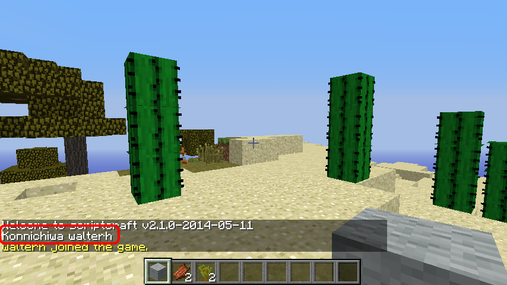

ScriptCraft comes bundled with a built-in variable called *events*. The *events* variable is used to listen for and react to events in the game. There are approximately 200 different types of events that you can register for in Minecraft. When you *register* for an *event* in your code you are telling the server that you want to be notified when a particular type of activity occurs in the game. You register by giving the server a function which won't be called immediately but will only be called when the activity occurs. In the code above we are basically saying to Minecraft "Hey, whenever someone joins the game, I want you (the server) to call this 'greetPlayer' function" . 

This is the first time we've seen functions used as parameters to another function call. We call the `events.playerJoin()` function passing it another function as a parameter. This style of coding - passing functions as parameters to other functions - is called *functional programming*. The important thing to note here is that at no point in this module is the *greetPlayer* function actually called. All we do is register it using the `events.playerJoin()` function so that it will be called later each time a player joins. The `greetPlayer` function is called an *event-handling* function because its purpose is to handle - that is: react - to events, specifically the event which is fired by the server whenever a player joins the game. 

We'll look more closely at events and event-handling functions in a later chapter.

### More on Modules

From looking at the *greetPlayers* module you can see the first thing it does is load another module: *greetings* which we created earlier in this chapter. If you remember, the *greetings* module in turn loads yet another module - the *dice* module we worked on in the previous chapters. This is a classic example of how programming is typically done. We start with small dedicated modules and then work on bigger and bigger modules piecing them together to solve a problem. In programming, a big part of problem-solving is breaking problems down into smaller and smaller problems and solving each of these smaller problems then piecing together the solutions. Programming can often feel like playing with toy building bricks except *you* get to design the bricks and put them together. When a program module relies on another module we say it *depends* on the module. A module which loads another module *depends* on that module and that module in turn will *depend* on other modules. All of the modules which are required - either directly or indirectly - by a program are called *dependencies*. You can see in the diagram below the relationship between the *greetPlayers*, *greetings* and *dice* modules. 

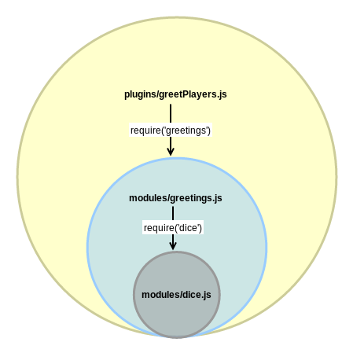

The *greetPlayers* module depends on *greetings* but it does not know or care that *greetings* depends on the *dice* module. This is an important principle in programming. The *greetings* module, by exporting just a single `random()` function, is defining what programmers call an *Interface*. The *Interface* is the contract or agreement a module has with other modules. It's a way of declaring what your module is to be used for - what its purpose is. When defining an Interface, a module should hide the details of *how* it works and just say *what* it does. Modular systems work because parts can be swapped out and changed without affecting the entire program. You can think of an individual module (a Javascript file) as working like an individual Lego brick. Modules can be pieced together to form larger modules and programs, eventually creating something truly awesome.

Minecraft is often described as 'Virtual Lego', Programming is similar and offers the same rewards, It is enormously creative and can be great fun.

### Greeting Players in Style
As a final fluorish to this plugin let's add something a little more spectacular than a simple text message. Let's greet each new player with a firework which launches when and where they join the server. 

@@listing greetPlayers_v3.js Greeting Players with Fireworks

We'll use and explore the ScriptCraft *fireworks* module again in a later chapter. Events and event-handling functions can be used to trigger all kinds of cool new game mechanics.

### Achievement Unlocked!

Major Kudos! You've created your first custom event handler and have had your first encounter with event-driven programming. Soon you'll be putting event-handling to use to protect your server and add your own fun effects.

### Summary
In this chapter you learned about how to create and manipulate lists of items using Javascript Arrays. You also learned about Event programming and wrote your first event-handling function to greet players when they join your server. In the next chapter we'll explore events further and play with Sounds in Minecraft.

## @@nextChapter{chapter-09}: A Guessing Game
### Introduction
One of the great things about computers is that they can make decisions and take different paths through a program based on those decisions. If computer programs did the exact same thing every time then they would be pretty boring. Can you imagine playing a computer game which always did the same thing? Computers make decisions all the time. When you're playing minecraft, the server is constantly checking to see if any players have died or if their health or hunger levels are low. It's checking to see if a creeper is about to explode or if a villager will accept a trade offer. All of these decisions are made using the humbly named `if` statement. The `if` statement is such a useful statement that it's available in pretty much every programming language including Java and Javascript.

In this chapter we'll create a simple number-guessing game using the `if` statement to figure out if the player guesed correctly. Let's dive right in and write the code for the number guessing game. Type the following code into a new file called numberGuess.js and save it in the scriptcraft/plugins folder:

@@listing guess_v1.js A Guessing Game

In this program the *guessTheNumber()* function rolls a 6-sided dice, then asks the player to guess the number. If the player guesses correctly `You guessed correct!` is displayed. After the player has guessed (either rightly or wrongly) the message `Thanks for playing` is displayed. You can try out this code by issuing the following commands at the server console prompt:

    js refresh();
    js guessTheNumber( self )
    
The *guessTheNumber()* function needs a Player as a parameter. The special ScriptCraft variable `self` is a variable whose type is 'Player' and refers to you the person issuing the command. That's why we pass `self` as the parameter to *guessTheNumber()* . You can try running the *guessTheNumber()* function a couple of times and the number should be different.

Let's take a closer look at how this function works by first looking at how ScriptCraft asks questions of players.

### Asking questions

Most programming languages provide a function which can be used to ask a question. Javascript runs in many different environments. The most common way to run Javascript is in Web Browsers where Javascript comes with a special *prompt()* function which can be used to ask website visitors questions by displaying a small window (known as a *dialog box*) with a question, an *input field* where you type the answer and OK and Cancel buttons. This style of user interaction is called *modal* because the user cannot do anything else until they close the *dialog* window. You can see an example of what a modal dialog looks like below:

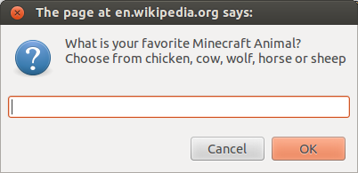

The problem with modal dialogs is that they interrupt the program and the program can't resume until the user closes the dialog by clicking either OK or Cancel. This could be a problem in a fast-paced game like Minecraft where you wouldn't want such a question to appear while you were fighting off a horde of zombies. Unlike Javascript in the browser, Javascript in Minecraft does not have a *prompt()* function but in ScriptCraft you *can* ask players questions using the *input* module. The questions will not appear in a modal dialog instead appearing as a message on the player's screen. What's more, Players do not have to answer the question immediately. The *input()* function takes 3 parameters:

1. The player you want to ask a question of.
2. The question you want to ask.
3. The function you want to call when the player has answered the question. The function when called will have the answer and the player who answered as parameters.

This is the second example we've encountered of functions which take other functions as parameters - we saw an example of this in chapter @@chapter{chapter-08} when we passed an event-handling function. You can try out the *input* module yourself at the server or in-game command prompt:

    js var input = require('input');
    js function respond( answer, player ) { player.sendMessage("Wow. " + answer + " that's old!" ) };
    js input( self, 'How old are you?', respond )

The important thing to keep in mind when writing code that depends on asking players questions is that you can't force players to answer questions right away or even answer at all, they could be busy fighting spiders, trading with villagers, climbing, building or simply ignoring the question altogether. In the commands above, the *respond()* function will be called by *input()* when the player has answered the question. There's a name often used for functions which are called by other functions - they're called *Callbacks*. The *input()* function when called will return immediately and it does not return any value. Instead, it waits in the background (remember, there's a lot going on in Minecraft so we can't stop the game in its tracks) until the player eventually answers the question and then calls the *Callback*. A *Callback* is literally a function which will be called back later on. *Callbacks* are also used when writing Javascript code for web browsers. For example, functions can be written which will only be called when a visitor clicks a button. *Callback* functions are super useful and part of what makes Javascript such a flexible language. 

So we've seen how to ask a player a question. Now let's take a look at how we check to see if the answer is correct.

### The if statement
In @@chapter{chapter-03} we briefly looked at comparing numbers at the server console prompt. When we *compare* something to something else there can only be two possible answers: `true` or `false`. For example, if I issue the command `js 5 == 3` to ask the computer is 5 equal to 3 the answer will be `false`. If I ask the computer a different question `js 5 > 3` - is 5 greater than 3 - the answer will be `true`. When asking such questions there is no *I don't know* or *Sometimes* or *Maybe*. The answer will always be `true` or `false`. When we *compare* things we *test* for true or false. We can compare not only numbers but any variable. We can write code in such a way that it will only execute if some test passes. Try the following commands at the server console prompt:

    js if ( 5 > 3 ) { console.log('test is true') }
    js if ( 5 > 13 ) { console.log('test is true') }
    js if ( 5 == 18 ) { console.log('test is true') }
    js if ( 5 < 18 ) { console.log('test is true') }
    
The message `test is true` should only be displayed for the first and last commands. The *if* statement uses the form:

    if ( condition ) {
        // code to execute if condition is true
    }

So in the number guessing game the code...

    if ( answer == randomNumber ) {
      player.sendMessage('You guessed correct!');
    }

... compares two numbers - the number returned by the dice roll and the number guessed by the player - and if they are equal then the code between the `{` and `}` curly brackets is executed (the player is sent a message saying they guessed correctly). The code between the `{` and `}` will not be executed if the numbers are not the same. It's important in Javascript when asking the question is something equal to another, that you use `==` rather than a single `=`. The single `=` sign is used when you want to assign a value to a variable. We say `name = 'steve'` but we ask the question `name == 'steve'`?. This can be a source of bugs for for even experienced programmers.

The test is always placed between the `(` and `)` round brackets. There are many other kinds of tests you can use other than comparisons. If you use just a single number it can be tested. Any single number except 0 will resolve to `true` when used inside an `if` test, while any non-empty text will resolve to true. Try issuing the following commands at the sever console prompt:

    js var gems = 5;
    js if ( gems ) { console.log("you have gems"); }
    js gems = 0;
    js if ( gems ) { console.log("you have gems"); }

If `gems` is 0 then the if statement does not execute the code inside the *if block* (the code which appears between the `{ }` curly brackets). Now try the following statements to see how String variables are resolved to true or false:

    js var name = "steve"
    js if ( name ) { console.log("you have a name and it is " + name ); }
    js name = "" 
    js if ( name ) { console.log("you have a name and it is " + name ); }
    
The last command will not output anything because a variable which is "" (empty string) or 0 will resolve to `false` if used as a condition in an `if` statement. We can test to see if name is equal to steve like this:

    js if (name == "steve'){ console.log("Hey steve!"); }
    
What if we want to test that something is *not* true? To test that something *isn"t* true you *enclose* the test in `()` round brackets and put a `!` (exclamation mark) in front ...

    js if (! (name == "steve') ) { console.log("Hey, you're not steve!"); }
    
The `!` operator *negates* (that is - makes the opposite of) any boolean expression which appears after it so all of the following expressions would return false...

    js ! (5 > 2)
    > false
    js ! (5 < 8)
    > false
    js ! (8 < 5)
    > true
    js ! (name == "steve")
    > false

### The if-else construct
Let"s say we want the program to output one message if the player guesses correctly and a different message if the player guesses incorrectly. This is where the `else` statement comes in. You can see it in use in the following updated code for the number guessing game:

@@listing guess_v2.js Guessing Wrong.

Change your existing numberGuess.js file to match the code above, save it then issue the following commands to test it:

    js refresh()
    js guessTheNumber( self )
    
Now when you guess incorrectly you should see a message `Better luck next time.` appear.

### The if-else-if construct
So far the guessing games gives players just one shot at guessing the number. In the following listing @@listref{guess_v3.js} the code is changed further so that players get to make a couple of guesses and are told when they've guessed too high or too low. The following code uses the *if - else - if* form which is quite common in Javascript:

@@listing guess_v3.js Too High, Too Low.

In this revision of the number guessing game, we're using an extra parameter called *repeat* which is a parameter passed by the *input()* function to our input handler function *checkAnswer()*. We didn't use this parameter in the previous version of the game because we didn't need it. The *repeat* parameter is itself a function which when called will repeat the question. That's why we call it when the answer is too high or too low. The *repeat* function when called will ask the player the same question again and when the player answers, will call your *callback* function again. 

Another change in the above function is that we've given the player the option of simply quitting the game by typing `quit` as an answer to the question. You may be wondering why there's a check to see if the guess is too low but no equivalent check to see if the guess is too high. The resaon is, if the guess is not the same or less than the randomNumber, then it *must* be too high - there are no other options.

How a program behaves while running is often called its *flow*. *Flow Diagrams* help programmers sketch out how they want or expect a program to behave when it's running. In a *Flow Diagram* the start and end of the program are represented by boxes which look like capsules at the top and bottom of the diagram. Decisions which need to be made in the program are represented by Diamonds and usually have 2 or more lines leading to other parts of the diagram. Processes are represented by plain boxes. The diagram below is a flow chart of how listing @@listref{guess_v3.js} behaves while running. Flow charts can be useful in helping to understand a program or in designing a new program.

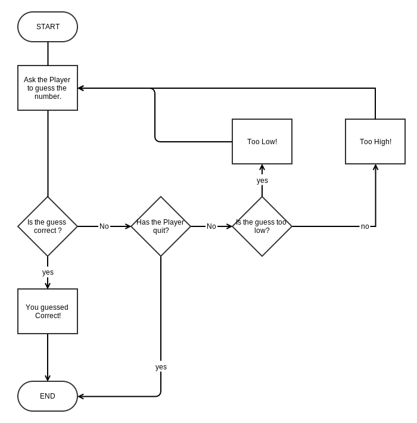

### Nested blocks
The `if` statement is one of several *block* statements in Javascript, that is, statements which have an accompanying block of text. Other example of *block* statements in Javascript are the `for`, and `while` statements which we'll explore later. Any *block* statement can have within its block, other block statements. When you have one or more blocks inside another block it's called *nesting*. The updated `numberGuess.js` file below adds a cool enhancement for players who play the game at the in-game prompt rather than at the server console window. Update your code to match the code below:

@@listing guess_v4.js Fireworks for Winners.

Now jump into the game and at the in-game prompt issue the following commands:

    /js refresh() // to load the changes
    /js guessTheNumber( self ) 

When prompted, press the T key to start typing your guess. You may need to re-run the guessTheNumber() function a couple of times before you guess the right answer but this time, when you do get it right, a firework will launch directly above your head. Pretty cool huh?

Now the code checks to see if you guessed correctly and if so sends a message to the guesser. Then another *nested* if statement tests to see if the guesser is an actual player in the game (and not just the server console user) and launches a celebratory firework at the player's location. 

### Combining conditions
If we want to check to see if it's night or day in minecraft we need to get the game world's time and test it. In Minecraft, time is measured differently and is on a completely different scale to time in real life. A day in Minecraft lasts only 20 minutes in real time. Minecraft measures time not in hours and minutes but in *ticks* and there are 24,000 ticks in a Minecraft day. 

You can see a chart of the day-night cycle in Minecraft at <a href="http://minecraft.gamepedia.com/File:Day_Night_Clock_24h.png">http://minecraft.gamepedia.com/File:Day_Night_Clock_24h.png</a>.

To test to see whether it is night or day in the game issue the following commands at the in game prompt:

    /js var world = self.world;
    /js if ( ( world.time > 13000 ) && ( world.time < 23000 ) ) { self.sendMessage('Night!') } 
    
### Logical AND
You can combine one or more tests to perform more complex tests. In the statements above you check to see if the time is greater than 13000 *AND* less than 23000 and if the test passes we know it's Night. If you are combining tests like this, it's a good idea to enclose each test in its own `( )` round brackets pair. That's why we write:
    
    ( world.time > 13000 ) && ( world.time < 23000 )
    
rather than just:

    world.time > 13000 && world.time < 23000 

The `&&` (two ampersand symbols side-by-side) operator combines the expressions on the left and right of it and if both are true then it evaluates to true. If either the left hand side or right hand side expressions evaluate to false then the whole test is false. When you combine tests using the `&&` (*AND*) operator, the test only passes when *all* of the expressions evaluate to true.

### Logical OR
There's more than one way to combine tests. You can use the `||` (*or* operator) to test if *any one* of 2 or more conditions are true. Let's say we want to add a new rule to the game. The rule is this:

    if a player breaks a block while either sneaking OR flying then 
        the block yields 2 cookies.
    
How would we write such a rule in Javascript? Well let's refine the statement above. Remember, Minecraft is event-driven so we want our rule to be enforced whenever any block is broken. The statement might be better written in English as:

    when a block is broken
        if the player is flying or the player is sneaking then 
           the block yields 2 cookies. 

In Javascript you write it like this:

@@listing stealthCookies_v1.js Cookies for Ninjas.

If you like you can save the above code into a file called stealthCookies.js in your *scriptcraft/plugins* folder, reload your plugins (using `/js refresh()`) and try breaking some blocks while flying or sneaking to see the code in action.

The test `breaker.sneaking || breaker.flying` checks to see if the player who broke the block is either sneaking *or* flying and if so, the broken block will give up a cookie. We use the *items* module here which includes functions for all of the possible items you might keep in your inventory in the game. You can see a list of all of the items functions in the appendices at the back of the book.

### Complex logic
So we've seen the use of the `&&` (logical AND) operator and the `||` (logical OR) operator. These two operators can be combined to form even more complex logic. Let's say for example we want to refine the earlier rule so that cookies will only be given up when the player breaks a block of sand. In English we might write such a rule like this:

    when a block is broken
        if the block is sand AND the player is flying or the player is sneaking then 
           the block yields 2 cookies. 

To you and I that rule might look clear enough but the computer would be confused. There are actually two possible ways to interpret the above rule:

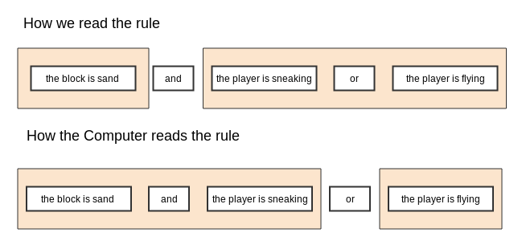

We have to be careful when writing test conditions in Javascript. It's very easy to write a test condition which seems clear to us but results in unexpected behavior when executed. We need to use `( )` round brackets inside of the if condition to tell the computer exactly how the rule should be interpreted. So we would need to write the following Javascript code:

@@listing stealthCookies_v2.js If X and ( Y or Z )

Notice the additional `( )` round brackets around the test `breaker.sneaking || breaker.flying`. These are needed so that we can phrase the rule in a way which the computer will read it the same way we do.

### Summary
In this chapter you learned how to use *if* statement to make decisions and make your program do different things based on tests. You also learned about combining different tests for true and false and about ScriptCraft's *input* function which is used for asking for input from players. 

## @@nextChapter{chapter-10}: Animal Sounds
### Introduction
In this chapter we'll create a simple program to ask players a question and play back sounds based on the answer given. You'll learn about Javascript's *switch* statement and ScriptCraft's *sounds* module. The new program will ask players what their favorite animal is and play back that animal's sound.

### The switch statement
In chapter @@chapter{chapter-09} you learned how to get input from players and how to test the input using Javascript's *if* statement. Javascript provides an additional statement for testing values: the *switch* statement. The switch statement is useful when you want to make decisions by testing a single value. The switch statement is best explained by example. Create a new file called *animalSounds.js* in the *scriptcraft/plugins/* folder and type the following code:

@@listing animalSounds_v1.js Animal Sounds

Save your file then issue the `js refresh()` or `reload` command to reload all Javascript code. Then at the in-game prompt issue the following command:

    /js animalSounds( self );

You will be prompted to type the name of your favorite animal. Press the *T* key to enter text then type in any of the following: cat, chicken, cow, horse, pig, sheep, wolf. When you hit enter you should hear an appropriate sound - a wolf bar, cow moo and so on. If you don't enter any of the above animals, then the program responds with a message saying it never heard of whatever it was you typed.

The switch statement works much like the *if-else-if* construct we used in chapter @@chapter{chapter-09} . We could have written the *animalSounds.js* module using an if-else-if form:

    if (animal == 'cat') { 
        sounds.catMeow(player.location);
    } else if (animal == 'chicken') { 
        sounds.chickenIdle(player.location);
    } else if (animal == 'cow') { 
        sounds.cowIdle(player.location);
    ...

But since every test is on the same *animal* variable it makes more sense to use a *switch* statement instead. Some things to note about the switch statement:

* The switch statement is used for testing a single expression against many possible values. 
* It has one or more *case* labels each of which must be followed by a value and the `:` (colon) .
* The block of code after the `:` is only executed if the value matches. All code up to the special `break` statement will be executed.
* If none of the cases match then the `default` case is executed.

The `default` case is executed when you enter an animal that isn't one of cat, chicken, cow, horse, pig, sheep or wolf.

A common pitfall when using the switch statement is forgetting to include the `break` statement at the end of each case. As an exercise try commenting out the `break` statement inside of the block for 'sheep'. Remember: to *comment out* a line of code, just put `//` at the start of the line. Save and reload then run the program again `/js animalSounds( self );` and this time enter 'sheep' as your favorite animal. What happens? The following output will appear in your screen:

    A sheep says 'baa'
    A wolf says 'woof'

And you will hear both a sheep bleat *and* a wolf bark! That's because in a case block, the code will keep executing until it hits a `break` statement and if it doesn't hit one it carries right on through to the next case statement. 

### The sounds module 
There are many sounds in Minecraft and the list of sounds available in the game changes with each new release. ScriptCraft provides a *sounds* module which makes it easy to play any of the in-game sounds. At the time of writing there are approximately 200 different sounds in Minecraft and the *sounds* module provides a function for each one. Each of the functions in the *sounds* module takes up to 3 parameters:

1. The location where you want to play the sound. This parameter is optional - if left out then the sound will be played for all online players to hear.
2. The volume at which you want to play the sound. This parameter is optional, if left out then it defaults to 1.0 (full volume). Volume is in the range 0 to 1 with 0 being no sound at all and 1 being maximum volume. For example, if you wanted to play a Cat's Meow at half volume you would write `sounds.catMeow( location, 0.5 );`
3. The Pitch at which you want to play the sound. The parameter is also optional and if left out will default to 1.0 (moderate pitch). Pitch can vary between 0 and 4.

This is a table of all of the possible sound functions available at the time of writing. This list may not be up to date because new sounds are being added on an ongoing basis while some sounds may also be removed.

@@table all_sounds.org Sound Functions

The *sounds* module is not a built-in variable in ScriptCraft so you'll need to load the module first so you can use it. At the in-game prompt you play various sounds like this:

    /js var sounds = require('sounds');
    /js sounds.catMeow( self.location );
    /js sounds.burp( self.location );
    /js sounds.villagerNo( self.location );    

In Minecraft Players, Blocks, Monsters, Animals and Villagers all have a location property which can be passed to any of the sounds module functions.

### Improving the code
When running the *animalSounds()* function what happens if you enter 'Cow' instead of 'cow'? Try it and see.

If you enter 'Cow', or 'COW', the function says it hasn't heard of a 'Cow' or 'COW'. To you and I, a Cow is a COW is a cow ,but to a computer they are 3 different strings. That's because computers are *case-sensitive* - they don't see the word 'Cow' and know that whether it's spelt with capital letters or lowercase letters, it means the same thing. The computer only sees a sequence (or list) of letters and as far as the computer is concerned, `C` and `c` are completely different. You can see this for yourself by issuing these commands at the in-game prompt:

    /js 'COW' == 'cow'
    > false
    /js 'Cow' == 'cow'
    > false

How do we make the *animalSounds()* function understand that when a player types 'COW' it should be treated the same as 'cow'? Fortunately there's a String function that helps solve this problem. Issue the following command at the in-game prompt:

    /js 'COW'.toLowerCase() == 'cow'
    > true

The *String.toLowerCase()* function will convert any string to its lowercase equivalent so 'COW' becomes 'cow' and 'Cow' also becomes 'cow'. This can be really useful when we want to test text values but don't care whether they're uppercase or lowercase. Let's look at the improved *animalSounds* module:

@@listing animalSounds_v2.js Case-insenstive Animal Sounds.

The only change to this module is a new statement just before the switch statement:

    animal = animal.toLowerCase();

This statement ensures that the *animal* parameter is converted to lowercase first so the program won't report silly messages about not knowing what a 'Cow' or 'HORSE' is. 

### More on Strings
All Strings in Javascript also have a *toUpperCase()* function which returns an UPPERCASE version of the string. Note that neither the *toLowerCase()* nor *toUpperCase()* functions change the original string, they just return a new string which is why I need to assign the *animal* variable to the returned value. If I simply used:

    animal.toLowerCase();
    
The switch cases would still fail for 'COW'    because the value of *animal* does not change when you call its *toLowerCase()* function. If you use the *toLowerCase()*, *toUpperCase()* or *any of the String* methods remember that none of them change the original string. In Javascript any String is *immutable* - that is - none of its methods change it in any way. In chapter @@chapter{chapter-08} we saw that you could add a new item to an array by calling its *push()* method. Arrays are *mutable* objects - that is - the methods can change the object on which they're called. Let's see an example at the in-game prompt:

    /js var animals = ['cow','pig'];
    /js animals.push('sheep');
    /js animals[2]
    > sheep
    
The above `animals.push('sheep');` statement actually *changes* the animals value. With Strings, this never happens. None of the String methods (and there are quite a few) change the value for which they are called. For example there is a *String.concat()* function which adds another string:

    /js var name = "steve ";
    /js name.concat("crafter");
    > steve crafter
    /js name
    > steve

You can see that while `name.concat("crafter");` returns a value `steve crafter`, the original *name* variable remains unchanged. If we wanted to change the name variable we'd have to do it like this:

    /js var name = "steve ";
    /js name = name.concat("crafter");
    > steve crafter
    /js name
    > steve crafter

Listed below is a table of the most common String methods.

@@table string_methods.org Commonly used String Methods

A full reference of all String methods is available online at https://developer.mozilla.org/en-US/docs/Web/Javascript/Reference/Global_Objects/String .

### Summary
In this chapter you learned how to use the *switch* statements to make decisions. You also learned how to play sounds using ScriptCraft's *sounds* module. In an upcoming chapter we'll learn how to simplify this module even further using Objects.

## @@nextChapter{chapter-11}: Leaderboards - More fun with Arrays
### Introduction
One of the really cool things about Arrays in Javascript is that they can be sorted. Sorting is the process of looking at each item in an array and deciding whether it is greater than or less than another item in the same array. When all of the items in an array are sorted the array is like a leaderboard - a ranked list of items. In this chapter you'll create a ranked list of players based on who has jumped most.

### Array.sort() 
The Array.sort() method is used to sort items in a array. Let's see it in action. Issue the following commands at the server console prompt:

    js var animals = ['pig','wolf','cow','cat','sheep'];
    js console.log( animals );
    > pig,wolf,cat,cow,sheep
    js animals.sort();
    js console.log( animals );
    > cat,cow,pig,sheep,wolf
    
You can see from the output that Array.sort() will sort a list of Strings alphabetically - that is in the order that the letters appear in the alphabet. So 'cat' is moved to the 1st position in the array while 'wolf' is moved to the last position in the array and all of the animals in between are sorted alphabetically too. What happens if you try to sort an array of Numbers?

    js var luckyNumbers = [ 9, 23, 5, 40, 21 ];
    js luckyNumbers.sort();
    js console.log( luckyNumbers );
    > 21, 23, 40, 5, 9

... well that makes no sense! In Javascript, the default way to sort items in an array is alphabetically. It even does this when the items in an array are all numbers. In Javascript, arrays can contain *anything*, numbers, strings, objects, other arrays and even a mixture of all of these types. If you want the *Array.sort()* method to sort by any way other than alphabetically, you have to tell it how. Let's see an example. Issue the following commands at the server console prompt:

    js function numerically( a, b ) { return a - b };
    js luckyNumbers.sort( numerically );
    js console.log( luckyNumbers );
    > 5, 9, 21, 23, 40

Now the `luckyNumbers` array is sorted in the correct order. The *numerically()* function we created in the first command above is a function which takes two parameters, *a* and *b* and compares them. This function is then passed to the *Array.sort()* method and will be called many times by *Array.sort()* is it plucks two items from the array and asks the *numerically()* function 'Which item is bigger - a or b?'. You can see that your *numericall()* function will get called many times if you add a *console.log()* statement...

    js function numerically( a, b ) { console.log('a = ' + a + ', b = ' + b); return a - b }
    js luckyNumbers.sort( numerically );
    > a = 9, b = 5
    > a = 21, b = 9
    > a = 23, b = 21
    > a = 40, b = 23

The exact output you see probably won't be the same as above but the point of adding the *console.log()* statement is to illustrate that the *numerically()* function will be called many times over during the course of an Array sort. 

#### How to compare items in an Array

The *numerically()* function we created above is called a *Comparator* function because it's only job is to *Compare* things to one another. The rules which *Array.sort()* uses when sorting are simple. The *Array.sort()* method plucks two items from the array and calls the comparator (the comparing function) passing the two items. It repeats this process until all of the items in the array have been compared to each other. Comparator functions typically just name their parameters *a* and *b*. 
* If the comparing function returns the number 0 then it means that *a* and *b* are the same (in ranking at least). 
* If the comparing function returns a number less than 0 then it means that *a is less than b* so *a* should appear before *b* in the array.
* If the comparing function returns a number greater than 0 then it means that *a is greater than b* and so a should appear after *b* in the array.

Let's look at these rules and see how they're used in the *numerically()* function:

    js function numerically( a, b ) { return a - b ; }

Sorting numerically is relatively easy. For numeric sorts we just need to subtract one number from another to give  the *Array.sort()* method the information it needs to sort. So plucking any 2 numbers from the array and passing them to the *numerically()* function should give the correct order...

* 21 - 40 is -19 which is less than 0 meaning 21 will be listed *before* 40 in the array
* 21 - 9 is 12 which is greater than 0 meaning 21 will be listed *after* 9 in the array
* 5 - 9 is -4 which is less than 0 meaning 5 will be listed *before* 9 in the array and so on...

The *Array.sort()* method takes the results of all these calculations to move each item into its correct position in the array. At first glance, it might seem that the Array.sort() method is pretty dumb - after all, it doesn't even understand how to sort numbers and has to be explicitly told how to do so - but actually it's pretty flexible and powerful. Array.sort() can sort anything really, you just need to tell it what rules to use for sorting. 

Let's look at a slightly more complex example. Typically, your server will have 3 worlds created when it starts up. The worlds are usually called 'world', 'world_nether' and 'world_the_end'. If you wanted to sort these worlds based on their populations (how many living entities - animals, mobs and players are present) you could do so by creating a new *byPopulation()* function that would look something like this:

    js function byPopulation( a, b ) { return a.entities.size() - b.entities.size() }

The *byPopulation()* function takes 2 parameters a and b both of which it assumes are Minecraft worlds. Each Minecraft world object has an *entities* property which is a Java list of living things. The entities property in turn has a *size()* function so if we want to find out how many living beings are on a world we call the world's *entities.size()* method. We can compare the populations by subtracting one population size from another. 

#### Term: Java Collection
A Java Collection is like a Javascript Array - it is a collection of items. However, it does not have the same methods or functions and can't be used the same same we we use a Javascript Array. For example, in Javascript, you can find out how many items are in an array using the array's *length* property. A Java Collection has no such property. To find out how many items are in a Java Collection you need to call a *size()* method instead. This can be a source of problems. Many of the objects you'll use in your plugins are Java objects. As a general rule, the *server* variable and any of its properties are Java objects. Similarly, Events and Players and Block objects are also Java objects so any of their properties will be Java objects too. If you want to sort a Java Collection, it's easier to first convert it to a Javascript Array. ScriptCraft comes with a *utils* module which has a *array()* function to do just that.

The code to use your new *byPopulation()* function would look like this:

    js var worlds = bukkit.worlds();
    js worlds.sort( byPopulation );
    js console.log( worlds );

The *bukkit.worlds()* function returns an array of all of the worlds on the server. It is sorted and the results are printed to the console. The above example demonstrates how you can apply whatever rules you like to sorting items in an array. Now let's talk about sorting Players...

#### Sorting Players by name
One way to sort players is by name. This isn't strictly a leaderboard in the truest sense of the word but it does demonstrate how to sort based on a player's attribute - his name. Create a new file called *playerSort.js* in the *scriptcraft/modules* folder and type in the following code:

@@listing playerSort_v1.js Sorting Players by name.

This module is the first module we've written which exports more than one function. Here's how you might use the module:

    js var playerSort = require('playerSort');
    js var players = bukkit.players();
    js players.sort( playerSort.byName );
    js console.log( players );

The *byName()* function performs a couple of comparisons of the name of each player. When comparing two strings using the `<` and `>` operators, the comparison is always based on the alphabetic sequence of characters so `'cat' < 'cow'` will return true while `'cat' > 'cow'` will return false. However, we don't want the comparator function *byName()* to return true or false, we want it to return a number. This is a common mistake even experienced programmers make when writing functions for use in sorting. They forget that the comparing function must return a number not simply true or false.

To try out this module, issue the following commands at the server console prompt - Make sure there's at least two players on your server or the results won't be very interesting:

    js var sortPlayers = require('sortPlayers');
    js var players = bukkit.players();
    js players.sort( sortPlayers.byName );
    js console.log( players );

#### Sorting Players by experience

Let's face it, a leaderboard based on player names would be both boring and unfair. Let's try one based on a player's experience points. Update your *playerSort.js* file adding a new *byExp()* function (exp is short for experience):

@@listing playerSort_v2.js Sorting players by Experience.

The new *byExp()* function just does a numeric sort - that is it returns the result of subtracting player a's totalExperience from player b's totalExperience. One thing to note is that although there is only one single function used for sorting by experience, we *export* it twice - under the name *byExp* and also under the longer name *byExperience*. This gives programmers who use this module the option of using the short name or long name for that function - whichever name they use it will be the same function being called. Issue the following commands to see this function in action - again - it helps if there's more than one player on your server :-) ...

    js var sortPlayers = require('sortPlayers');
    js var players = bukkit.players();
    js players.sort( sortPlayers.byExp );
    js console.log( players );

When I ran this code with just two players I got the following output.

    [walterh, sean_higgins]

Our actual experience points at the time were:

    Player      Total Experience
    ----------------------------
    walterh        52
    sean_higgins   103

You should be surprised by the results. In any leaderboard based on player experience, the *most* experienced players - that is, the players with the highest experience number - should be placed first ahead of lesser experienced players. However , our *byExp()* function sorts in ascending order; that is, from lowest to highest so the *players* array will list least-experienced players first. That's not what we want for a leaderboard. 

### Reversing Arrays

You can easily reverse an array by calling the *reverse()* method...

    js players.reverse()

The reverse() method reverses an array in place. The first array element becomes the last and the last becomes the first. This is exactly what we want for a leaderboard where the highest score - that is; the larger numeric value - should be in the first position in the array.

There is another way we can sort players for inclusion in a leaderboard without using the reverse() method. We can change the sort order in the comparing function itself. To sort items numerically we compare the first parameter (usually called *a*) to the second parameter (usually called *b*) by subtracting a from b. When we say `return a - b` we are sorting in *ascending* order from lowest to highest. If we want to sort in *descending* order (most leaderboards are presented in descending order) then we say `return b - a` instead. For now, you can continue to write comparing functions using ascending order and use the *reverse()* function to change the order from ascending to descending.

### Sorting Players by other rules
There are many different player statistics we can use for sorting players. We can have a leaderboard of players who have jumped the most, have flown the most, have caught the most fish, have spent most time riding horses, have crafted the most items or mined the most blocks. In short there's plenty of statistics to use for display in leaderboards. 
### Player statistics
In Minecraft each player is an *Object* in the game. *Objects* in Javascript are variables which have both data and behavior. A player has a name (data) and amongst other things can shoot arrows (behavior). You can see this by issuing the following commands at the in-game prompt:

    /js self.name
    /js self.shootArrow()

The first command will display your name. The second command will make you shoot an arrow so be careful who you point at when you issue this command. In the first command we access a *property* of the object called *self* and in the second command we call a *method* on the object called *self*. *Properties* are just variables which belong to objects. *Methods* are just functions which belong to objects. In later chapters I'll show you how to discover all of the properties and methods of the *Player* object and other in-game objects. For now we're going to use another player method called *getStatistic()* which returns a statistic for a player. You use it like this:

    /js self.getStatistic( bukkit.stat.JUMP );

This command calls the *.getStatistic()* method on the *self* object which refers to your in-game character and displays the number returned by that method. Now jump again and issue the same command once more (remember, you can issue the previous command by pressing / then the UP arrow key). The number returned should be greater by 1. We're going to use each player's JUMP statistic to display a leaderboard of players who have jumped the most. Open up your *playerSort.js* file in the editor and update it adding the *byJumps()* function:

@@listing playerSort_v3.js Sorting players by number of jumps.

Save the file then issue the `/js refresh()` command to reload ScriptCraft. Test your new function by issuing the following commands at the server console prompt:

    js var playerSort = require('playerSort');
    js var players = bukkit.players();
    js players.sort( playerSort.byJumps );
    js console.log( players );

The output from the last command doesn't look much like a leaderboard, it simply prints all of the Player objects on a single line with a `,` comma between each player. Let's make it look better...

### Displaying the Leaderboard
So far we've just been using the *console.log()* function to display the entire contents of the array on a single line. The output when display the array of players using *console.log()* might look something like this:
    
     CraftPlayer{name=abcdefg}, CraftPlayer{name=hijklmn}, CraftPlayer{name=opqrst}
   
For a leaderboard display you'll want something a little more sophisticated. In this chapter we'll create a function which displays each player's name and number of jumps on a single line. To do that we'll need to process each item in the array one at a time. One of the ways you can process items in an array is using *loops*. Computers are very good at repeating the same thing over and over. In programming repeating the same thing over is called *looping*. There are two *looping* statements in Javascript, the *for* statement and the *while* statement.

### The *for* Loop
The *for* loop is usually used to process each item in an array. For example, if we have an array of animals `['cat','cow','pig','sheep','wolf']` we could print out each animal using the following code:

    js var animals = ['cat','cow','pig','sheep','wolf'];
    js console.log( animals[0] ); //  < --- 'cat'
    js console.log( aniamls[1] ); //  < --- 'cow'
    js console.log( aniamls[2] ); //  < --- 'pig'
    js console.log( aniamls[3] ); //  < --- 'sheep'
    js console.log( aniamls[4] ); //  < --- 'wolf'

This would get really repetitive and tiring to type. Fortunately there's an easier way to print out each item in the array on its own line. The best way to see how the *for* statement works is with an example. Issue the following commands at the server prompt and see what happens:

    js var animals = ['cat','cow','pig','sheep','wolf'];
    js for (var i = 0; i < animals.length; i++ ) { console.log( animals[i] ); }

The *for* loop is used for looping over or repeating a block of statements over and over. Did you notice how quickly the array of animals was printed? Let's try using the *for* statement again, this time just to print all of the numbers from 0 to 99 ...

    js for (var i = 0; i < 100; i++ ) { console.log(i); }

On a modern computer those 100 numbers are printed in the blink of an eye. If you're curious, try running the command again, this time changing the number from 100 to 1 million (that's 1 with six zeros after it). It should take a good deal longer but will still complete before you or I could count to one hundred. Computers are fast - now you're starting to get a feel for just how fast! Let's take a closer look at the first *for* statement we used:

    js for (var i = 0; i < animals.length; i++ ) { console.log( animals[i] ); }

The part of the *for* statement in round brackets `(var i = 0; i < animals.length; i++ )` sets up some rules for the *for* loop. Each rule is separated by a `;` semicolon. 

* The first rule `var i = 0` is called the *initialize* expression and is run only once before the loop begins.
* The second rule `i < animals.length` is called the *test* expression and is run at the start of each time through the loop to see if the loop should end.
* The third rule `i++` is called the *increment* expression and is run at the *end* of each time through the loop.

Following the for statement you usually have a block of one or more statements contained inside curly brackets. These statements will be executed each time through the loop. Let's put *for* loops to use to create a more pleasing leaderboard display of players who jump the most. Create a new file called *leaderboard.js* in the *scriptcraft/modules* folder and type in the following code:

@@listing leaderboard_v1.js A Simple Jumps Leaderboard: for loop.

To try out the new module save it, issue the `js refresh()` command to reload ScriptCraft then issue the following commands at the in-game prompt:

    /js var leaderboard = require('leaderboard');
    /js leaderboard.jumps( self );

The list of all players on the server and the number of times they've jumped should be displayed in descending order - that is - the players who have jumped the most will be at the top of the list. In a later chapter we'll revisit this module to display the leaderboard using an on-screen scoreboard as seen on popular player vs. player servers.

The *jumps()* function takes a single parameter called *sender*. *sender* is short for CommandSender, a ComandSender is anything in the game capable of sending commands. For examples, Players are command senders since they can send commands using the in-game prompt. What we want to do in this function is send output to the player who issued the command. That's why we use *sender.sendMessage()* instead of *console.log()* to display the leaderboard. If we used *console.log()* then players would not see the leaderboard because *console.log()* only writes messages to the server console window, not to players. In the above *jumps()* function we sort the players by how many times they've jumped, then reverse the array so that the higher numbers are at the front of the array, then we *loop* over the array using the *for* loop. Inside the for loop we have a block of statements:

    var player = players[i];
    var jumpStats = player.getStatistic( bukkit.stat.JUMP );
    sender.sendMessage( player.name + ' ' + jumpStats);

The above block of code gets executed a number of times - the number depends on how many players are connected to the server. The variable *i* is the current position in the *players* array. This variable's value will change each time through the loop. The first time through the loop it will be 0, then 1, then 2 and so on until it reaches the end of the array and there are no more players to process. The first statement gets the player at the current position ( `players[i]` ) and assigns it to a new variable called *player*. We then get this player's jump count and name and display them on screen. 

### The *while* Loop

The second kind of loop is called the *while* loop. The *for* loop is very useful for *iterating* (a fancy word for looping) over arrays or if you know in advance how many times you need to loop. Sometimes you won't know how many times you need to loop, you'll want to keep looping until something happens and you don't know how many times you'll need to loop until it does. A *while* loop is also called a *conditional* loop - it's like the *if* statement except it will keep repeating the same block of code over and over until a *test condition* is no longer true. The best way to understand this is by example. Let's look at the leaderboard module again - this time it's been written using a *while* loop instead of a *for* loop. The code behaves *exactly* the same, it just uses *while* instead of *for*.

@@listing leaderboard_v2.js A Simple Jumps Leaderboard: while loop.

#### Breaking out of loops
There are times when you'll want to break out of a loop early. If for example, you only want to display a list of players who have actually jumped - that is - players whose jump count is greater than zero. You can break out of a loop early using the Javascript *break* statement. Take a look at the following listing to see an example of the *break* statement:

@@listing leaderboard_v3.js Breaking out of loops.

In the above code, the while loop will stop when it encouters the first player who has not jumped. 

#### Skipping a turn in a loop.
The *break* statement will break out of a loop effectively ending the loop so that the block of code in the loop won't be executed again. Sometimes you just want to skip an iteration (a turn) on the loop. Let's say we have an *unsorted* list of players and only want to display players who have jumped. The *continue* lets you skip on to the next iteration of the loop. In the following listing, only players who have jumped will be displayed. This isn't a leaderboard because players are displayed in no particular order:

@@listing leaderboard_v4.js Skipping a loop iteration.

#### Infinite Loops
Within any loop block there must be a statement which will affect the loop's condition. For example, in the above code we check the value of the *i* variable each time round the loop. If we never changed the *i* variable, what do you think would happen? If *i* never changed then the test `i < players.length` would always be true (unless of course there were no players on the server in which case the code inside the *while* block would never execute). A loop which keeps running and never stops is called an *infinite loop*. Infinite loops usually happen because a programmer forgot to increment a counter variable or because the loop condition is wrong. An infinite loop is usually a sign that something went wrong - that there's a bug in the code. There are infinite loops which aren't accidental. Most games and programs which have a user interface (windows, buttons etc) have an *event loop* which is a loop that's constantly running and listening for incoming events from the user or other parts of the system. A game's event loop might listen for key presses from the user, check to see if any collisions between objects in the game have occurred, check the player's health and so on. The Minecraft server has just such a loop.

### Creating a new command for players.
So far in this chapter we've been creating Javascript functions which can be invoked by anyone on the server who is an operator. Only operators can and should be able to execute Javascript code at the in-game or server prompts. *The ability to execute code is potentially dangerous so you definitely don't want to grant that permission to everyone on your server*. The `js` command will take any Javascript code and try to execute it. There's another command provided by ScriptCraft and that's the `jsp` command. The `jsp` command is available for *everyone* to use. Unlike the `js` command, the `jsp` command *does not execute* Javascript code so it can be used safely by players without operator privileges. The `jsp` command lets you create your own custom commands which can be used by all players. 

We want *all* players to be able to call up the leaderboard with a simple in-game command and we want them to be able to do so without them needing to know Javascript. In the next part of this chapter we're going to change the *leaderboard.js* file so that anyone can call up the leaderboard using this command:

    jsp leaderboard

When a player issues this command at the in-game prompt, a leaderboard of players who have jumped most will be displayed to the player who issued the command. Don't try this just yet - we haven't created the `leaderboard` command yet.

### jsp 
The `jsp` command by itself doesn't do much. It's just a placeholder, a dummy command which can be extended to support new types of commands. In Minecraft server, commands have a *name* and one or more arguments. For example in the following command:

    /gamemode creative walterh

... `gamemode` is the name of the command and `creative` and `walterh` are the command's arguments. The purpose of the `jsp` command is to make it easy to create your own custom commands using Javascript. The `jsp` command name was made deliberately short because it's really just a prefix for custom commands. We want to be able to create custom commands with a `jsp` prefix so that our custom commands don't conflict with commands provided by other plugins. 

In ScriptCraft you create new commands for use by everyone using the *command()* function. The best way to see how the *command()* function works is with a simple example:

    /js function boo( params, sender ) { sender.sendMessage('Boo!') }
    /js command( boo );

In the first command I create a new function called *boo()* which will simply say Boo!. In the second command I call the ScriptCraft *command()* function passing the newly created function *boo()* which will be called whenever any player issues this command:

    /jsp boo
    > Boo!

The important points to note are:

* Any player can now issue this new `jsp boo` command and will see a message on their screen. They don't have to be operators to do so.
* The *command()* function lets you - the Javascript programmer - safely provide new commands for use by all players.

Now let's dive in and create a new `jsp leaderboard` command. Create a new file called *leaderboardCmd.js* in the *scriptcraft/plugins* folder and type in the following code:

@@listing leaderboardCmd_v1.js Adding a custom command for all players.

This file must be saved in the *scriptcraft/plugins* folder so that it will be automatically loaded and run at startup. This module loads the *leaderboard* module we created earlier, creates a new *leaderboard()* function and calls ScriptCraft's *command()* function passing the new *leaderboard()* function which will be run whenever any player invokes the command. You may have noticed there's no *exports* in this new module. That's because we don't need to *export* anything for this particular module - we provide a new command for use by all players through the *command()* function instead. Now let's see this new command in action. Issue the `js refresh()` command to reload ScriptCraft then at the in-game prompt issue the following command:

    /jsp leaderboard

The list of player names and jump counts should appear as messages on screen. Now try the following: type `/jsp le` then press the TAB key. Pressing the TAB key should fill in the rest of the command name for you just as it does with regular Minecraft commands! The `jsp` command makes use of *TAB Completion* - that is the ability to fill in the remaining parts of a command or cycle through command argument values by just pressing TAB repeatedly.

### Achievement Unlocked!

You've just learned how to provide new custom commands in Minecraft!

### Summary
In this chapter we learned how to loop over each item in an array using *for* loops and *while* loops. We also learned how to sort and reverse arrays and how to provide new custom commands using ScriptCraft's *command()* function. 

## @@nextChapter{chapter-12}: Building a Skyscraper
### Introduction
In this chapter we'll build a 10-story Skyscraper using just a couple of lines of code and *loop* statements. In this chapter we'll use *for* and *while* loops combined with ScriptCraft's *Drone* functions to build large structures in Minecraft. 

### Building using Drones
In Minecraft Building by hand is fun but can be tedious when you want to build big structures - Towers, Castles and Fortresses.  ScriptCraft includes a module for building large structures in Minecraft using Javascript. The *Drone* module has many functions for use in building. You can use the *Drone* module at the in-game prompt to build right within the game or you can create a *blueprint* for a more complex structure by using the Drone functions in a Javascript file. It's useful to think of the drone as an invisible remote control plane which can place blocks anywhere and that you control using Javascript. Let's start by creating a simple structure at the in-game prompt. The first thing you should do when building using the *Drone* module is look at (also known as *target*) a block. In the screenshot below, the targeted block is outlined in a slightly darker color than the surrounding blocks.

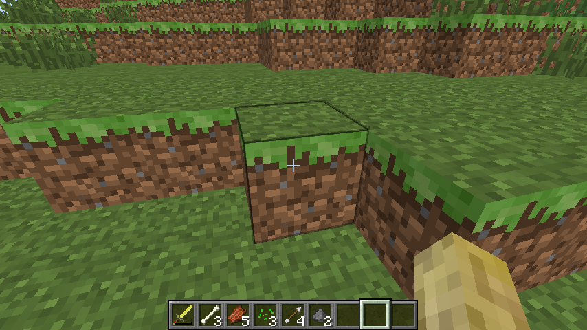

Once you've targeted a block - pick any block you like but preferably one just above ground level - issue the following command at the in-game prompt:

    /js box( blocks.gold, 1, 3);

The targeted block will disappear and a column of gold blocks 1 block wide and 3 blocks high will instantly appear in its place. 

The *box()* function is used to place blocks in the game. It takes 4 parameters:

1. Material - The type of material you want the blocks to be made from.
2. Width - How wide you want the box to extend. The box will extend from the targeted block to the right.
3. Height - How high you want the box to extend. The box will extend from the targeted block upwards.
4. Length - How far away you want the box to extend. The box will extend from the targeted block away from you.

The *box()* function is used to create cubes and cuboids of any size. A cube is a 3 Dimensional shape whose sides are all the same length. A cuboid is a 3 Dimensional shape whose width, height and length can differ.

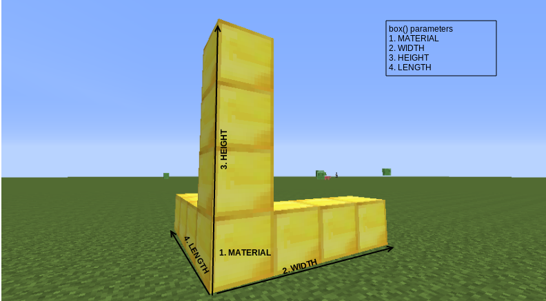

Let's try a couple of more examples. While targeting the original block (it's gold now) issue the following command to turn the column from Gold to Iron.

    /js box( blocks.iron, 1, 3)

If you are unsure which material to use, you can use *TAB completion* to fill in the material. Just type `box (blocks.` then press TAB to see a list of possible materials. Now target a different block - this time one that is at ground level preferably - and create a stone path 2 blocks wide and 10 blocks long by issuing the following command:

    /js box( blocks.stone, 2, 1, 10)

This will create a stony path that extends 10 blocks away from you. 

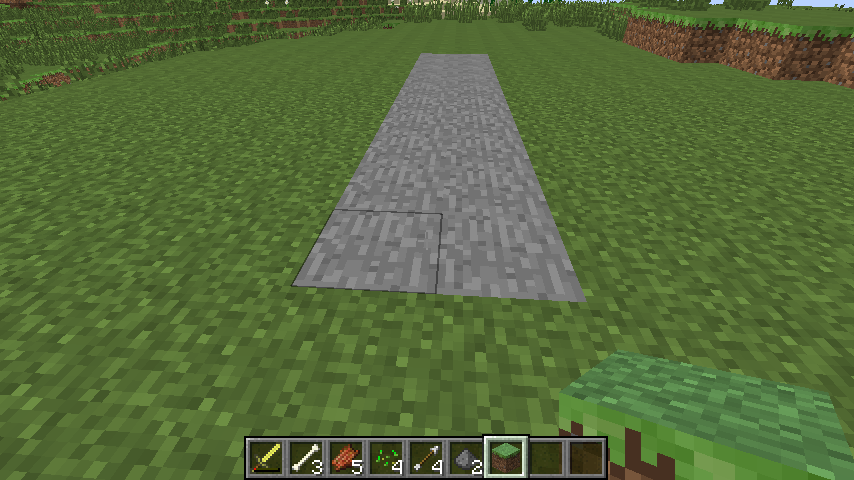

If you leave out any of the width, height and length parameters they will default to 1. So `box( blocks.gold, 5, 3)` will create a box 5 blocks wide, 3 blocks high and 1 block long, `box( blocks.gold, 5)` will create a box 5 blocks wide, 1 block high and 1 block long, and `box( blocks.gold )` will create a gold box 1 block wide, high and long. For the first parameter - the Material - you can use any of the values in the special *blocks* variable. The table below lists all of the possible block materials which can be used for building.

@@table block_materials.org Building Materials

#### Moving your Drone
A Drone which didn't move about and only built on one location wouldn't be very interesting. You can direct the Drone to move about and even turn and place blocks in any direction. There are a couple of functions which you can use to move the drown along any axis.

##### Term: Axis
When drawing on paper you draw in two dimensions. The two dimensions are Width which is along what's called the *X Axis* and Height which is along the *Y Axis*. In real life there is a 3rd dimension, Length which along the *Z Axis*. The X axis, Y axis and Z axis make up the 3 dimensions.

Let's get familiar with some of the movement functions by using them first at the in-game prompt. To place a block of gold then move 2 places to the right and place another block of gold, target a block then issue the following command:

    /js box(blocks.gold).right(2).box(blocks.gold)

The statement above might look odd but it's perfectly valid Javascript. This style of calling functions one after another is called *chaining* because each `.` forms a link in a chain of function calls. You can't call *all* functions in Javascript like this but can call all of the Drone's functions this way. Another term used by programmers to describe this style of function calling is *Fluency*. As we'll see later you can extend the abilities of the Drone by adding your own functions which can be called in the same *fluent* way.

In the above statement there are 3 different function calls being made, the first call `box(blocks.gold)` creates a gold block. The `box()` function returns a Drone object which can be used to call other Drone functions. The next call `.right(2)` moves the Drone right 2 blocks and it too returns the same Drone object. The last call `.box(blocks.gold)` creates another gold block. If we were to plot this out on graph paper it would look like this:

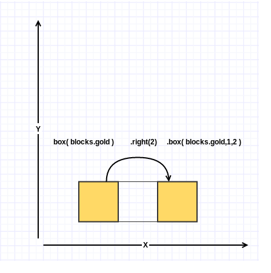

We could also write the above code as 3 distinct statements like this:

    /js var drone = box(blocks.gold);
    /js drone.right(2);
    /js drone.box(blocks.gold);

I personally prefer to write it using a single statement `box(blocks.gold).right(2).box(blocks.gold)` as it fits on one line and is slightly shorter than the 3 separate statements. Be careful though when writing such statements because the in-game command prompt only accepts a maximum of 100 letters for each command. 

##### The Corner Stone
If building just above ground level it's a good idea to always place a block where you would like to build, then target that block before issuing any Drone functions. Think of the targeted block as the *Corner Stone* of your building. If building on a flat world, you will first need to manually place a corner stone block or else your building will begin in the ground instead of just above ground level.

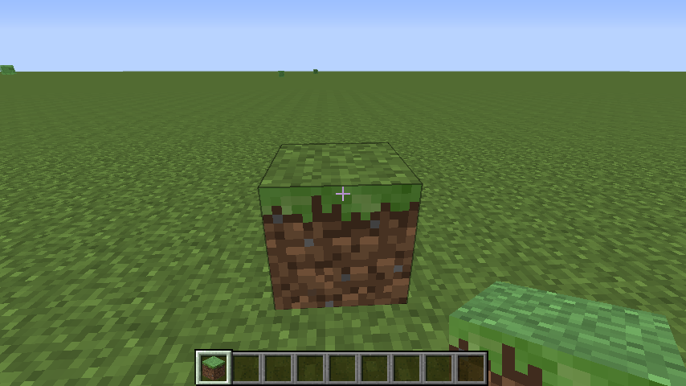

Let's use more chaining to create a series of 3 parkour platforms each of which are 2 blocks apart. Target a block then issue the following command:

    /js box(blocks.gold).fwd(2).box(blocks.gold,1,2).fwd(2).box(blocks.gold,1,3)

This statement will create 3 platforms. The first platform will be 1 block high, the second platform 2 blocks high and the third, 3 blocks high. Since each platform is 2 blocks away they are perfect for in-game parkour practice.

In the digram below you can see how the pillars are constructed and in the screenshot that follows, how the parkour platforms look in the game.

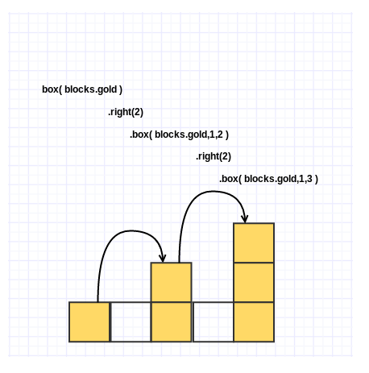

#### Turning your Drone
In addition to moving, you can make your Drone change direction too. To change direction use the *turn()* function. When turning you always turn right 90 degrees. To turn around so you're facing the opposite way turn twice `turn(2)`. To turn left you need to turn right 3 times `turn(3)`. You can combine turning and movement and building in a single chained statement like this:

    /js box(blocks.gold,1,1,4).fwd(4).turn().box(blocks.iron,1,1,3).fwd(3).turn().box(blocks.ice,1,1,2)

This command creates 3 small walls of gold, iron and ice. In the diagram below you can see how the walls are constructed using a combination of *box()*, *turn()* and *fwd()* function calls:

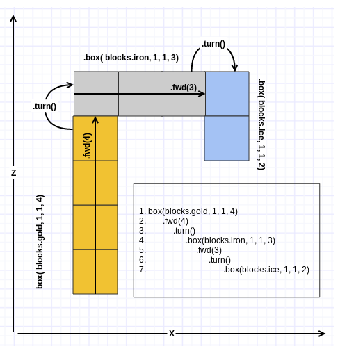

And here is the result in Minecraft:

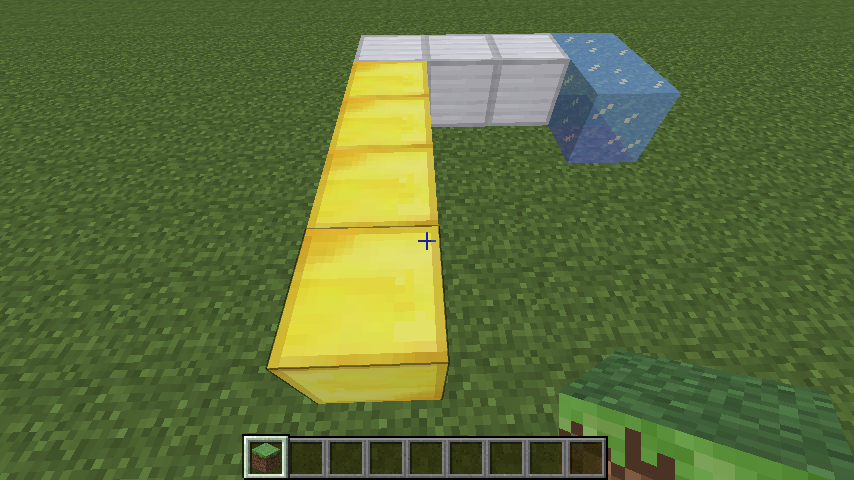

All of the Drone's functions return the Drone itself so each function can chain directly onto another. Presented below is a table of Drone functions and brief descriptions of each. If you want to find out more about the Drone object and its functions you can refer to the Drone API Reference in the Appendices.

@@table drone_functions.org Drone Methods

### Blueprints
A *Blueprint* is a technical drawing of a building. Blueprints are created by Architects when designing buildings. They are visual instructions used by the construction team to make sure they build what the Architect designed. You can think of code you write as a blueprint for the computer to execute. You are the designer of your program and the computer must use those instructions to execute it. When we talk about building in Minecraft using a Drone, your code is a blueprint the Drone uses to build. How do we create a blueprint for a Drone? A Drone blueprint is just a Javascript module. Listed below is an example blueprint for a pyramid. You can see that it's not very different from the modules we've already been writing:

@@listing pyramid2.js A Blueprint for a Pyramid.

The listing above will let you create pyramids by simply targeting a block in the game and issuing this command at the in-game prompt:

    /js pyramid()

You can what the result looks like in the screenshot below:

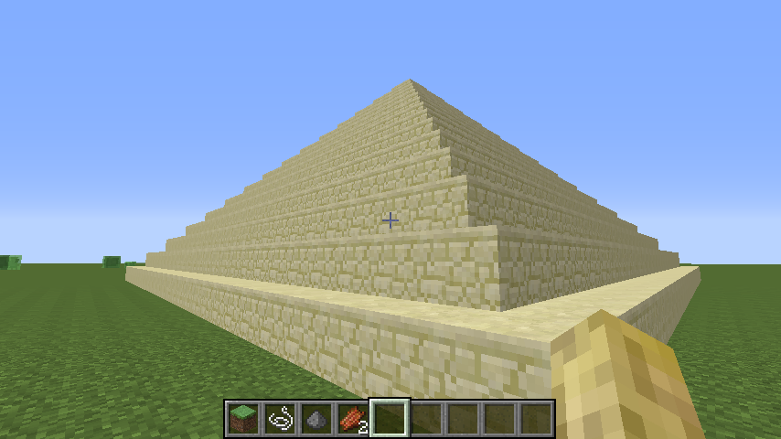

We'll dive deeper into Drone blueprints in the next exercise - Blueprint basics.

### Blueprint basics
Before designing our skyscraper let's start with something a little smaller so we can better understand the basics of adding new blueprints for building in Minecraft. We'll start with a simple structure we'll call *monolith*. It will be a large black slab 4 blocks wide X 9 blocks high X 1 block long. The *monolith* is from an old movie called '2001: A Space Oddyssey'. In the movie, astronauts discover this large black slab of stone on the moon. I use it as an example here because it can be created using a single call to Drone's *box()* method. 

You've seen already that the Drone has many functions for building, moving and turning and that these functions can be chained together to perform complex building operations. What you haven't yet seen is that the Drone can be extended - that is - new functions can be added to the Drone and combined with existing functions. For example: wouldn't it be cool if, once you have created a blueprint for a monolith, you could build a couple of them side by side using a single command? Well the Drone API has a function called *extend()* which lets you do just that. Once we've created the Monolith blueprint we should be able to perform any of these commands (*don't try to execute these - we haven't yet defined the monolith() function*) :

    /js monolith()
    /js monolith().fwd(4).monolith().fwd(4).monolith().fwd(4).monolith()

In the first example we just call *monolith()* because any function which belongs to the Drone API is a *global* function meaning it can be called without first calling *require()*. In the second example you can see that once we've created the *monolith()* function we'll be able to use it in a Drone building chain that forms part of a series of building commands. The second command sets up a series of monoliths like a line of dominoes. I'll explain how this works but first let's create a new module called *monolith.js* and save it to the *scriptcraft/plugins/drone/contribs* folder:

@@listing monolith_v1.js A Blueprint for a Monolith.

Once you've saved the file issue the `js refresh()` command to reload your plugins and then find a nice clear parcel of land in the game, place a cornerstone and then issue this command:

    /js monolith()

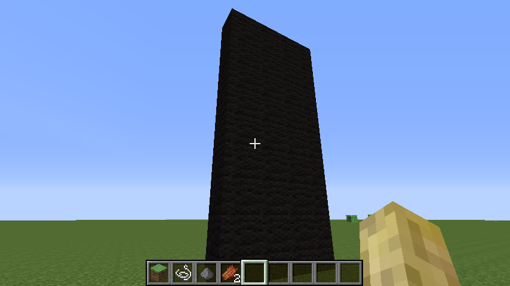

In a very short time, an imposing black Monolith will appear. Now let's take a closer look at the *monolith.js* source code...

#### Modules needed for Blueprints
The first two lines of the *monolith.js* module load both the *Drone* and *blocks* modules. You may be wondering why I required `'../drone'` and not simply `'drone'`. The `../` part means look for the drone module in the folder above this one (also known as the *parent folder*). Remember - the *monolith.js* module is saved in the *scriptcraft/plugins/drone/contrib* folder. The Drone module is located in the *scriptcraft/plugins/drone* folder so `require('../drone')` effectively says 'load the drone.js module from the parent folder scriptcraft/plugins/drone'. The `../` part of the string means this is what programmers call a *relative path*. A *relative path* is how you say that one folder is *related* to another. In this instance we're saying we want to load a module from the parent folder. 

The other thing to note about the first require statement is the trailing `.Drone` just after the call to *require()*. Every call to *require()* returns a module object with zero or more properties and methods. If we're only interested in 1 of the returned object's properties or methods then we can just grab that one property using the dot-notation (adding a `.` and getting the property or method by name). The statement:

    var Drone = require('../drone').Drone;

... is how all blueprints usually begin and access the Drone API so if you're creating a blueprint of your own you'll want to do this too.

The second *require()* call loads the *blocks* module which provides useful names for all of the possible materials used for building - without the blocks module you would need to memorize all of the data values for the building materials in minecraft. There *are* online resources on the Minecraft wiki but it's nice to be able to use memorable names in your code.

The next section of the code is the monolith() *method*. I call it a *method* because this function is not going to be a standalone function, instead it will be attached to a Drone. A *method* is just a function that belongs to an object. How does a method *know* what it belongs to? In Javascript there is a special keyword *this* which refers to the object a function belongs to. I've mentioned objects previously and we'll explore them in more detail in chapter @@chapter{chapter-14}. For now, all you need to remember is that when you create a new function for building stuff in minecraft, your function will in fact be a *method* and as such has privileged access to the Drone object. 

Inside the body of the *monolith()* method we see the *this* keyword. Inside of a Drone method, the *this* keyword always refers to a Drone object. In order to build a monolith we need to be able to manipulate and control an existing Drone object just as we've already done in the command-prompt examples earlier. The difference is, within a method we must use the *this* keyword at the start of each Drone function call. It's very important that inside the method we don't simply use `box()` but instead use `this.box()`. A call to the global `box()` function will actually return a brand new Drone object. When inside of a Drone method you work under the assumption that a Drone object is already present and you access it using the *this* keyword. When you use any of the Drone methods at the in-game prompt you are controlling the Drone from outside whereas when you use the Drone inside your method, you are effectively in the cockpit piloting the Drone from within. That's why you need to use the *this* keyword.

Having declared the *monolith()* function we turn it into a Drone method using the *Drone.extend()* function which takes a function and turns it into a method effectively attaching that function to itself so it can form part of a chain of calls. The Drone is extensible - it is capable of taking on new blueprints and building using those blueprints. When you add a new function to the Drone using the *extend()* method it is as if the function were an integral part of the Drone. As if by magic, the function becomes global and chainable and can be chained with any other Drone methods:

    /js box(blocks.gold).fwd(2).monolith().fwd(4).turn().fwd(4).monolith()

So now you can see how easy it is to extend the Drone to build new interesting things in Minecraft. Let's build a skyscraper!

### A Blueprint for a Skyscraper
In this chapter we're going to create a blueprint for a skyscraper so that you can place skyscrapers anywhere in your world with just a single Javascript function call. Let's create a new module called *skyscraper.js* and save it to the *scriptcraft/plugins/drone/contribs* folder:

@@listing skyscraper_v1.js A Blueprint for a Skyscraper.

Once you've saved the file issue the `js refresh()` command to reload your plugins and then find a nice clear parcel of land in the game, place a cornerstone and then issue this command:

    /js skyscraper()

In a very short time, a 10 story skyscraper will appear. Pretty impressive huh? You might already be thinking of new and wonderful buildings and structures to add to Minecraft but before you start coding, let's take a close look at the skyscraper code.

#### The skyscraper method
The first few lines of the *skyscraper()* method declare a variable *i* and check to see if the *floors* parameter is set, if it isn't then a default of 10 floors will be created. Next we see the first occurrence of the *this* keyword in this method. The *.chkpt()* method - which is short for 'checkpoint' - bookmarks the drone's current location so it can return there later. It's a good idea to bookmark the drone's current location at the start of any method and to return to that location at the end of your method because - ideally - your method should only be used for building and not moving or turning the drone. You can of course turn and move the drone within your method but you should return the drone to where it was before your method was called. The *.chkpt()* and *.move()* pair of functions will respectively save a drone's location before it goes on an excursion and return to the location when the excursion is done. 

The next section of the method is a *for* loop which repeatedly (for each floor) :

1. Builds an iron floor 20 blocks wide by 1 block high by 20 blocks long
2. Moves up one block
3. Builds a glass pane wall 3 blocks high on all 4 sides.
4. Moves up another 3 blocks

The above 4 steps are repeated for each floor so that when the *for* loop is done an entire skyscraper has been constructed. You can see what just one floor of the skyscraper (one pass through the *for* loop) looks like in the screenshot below:

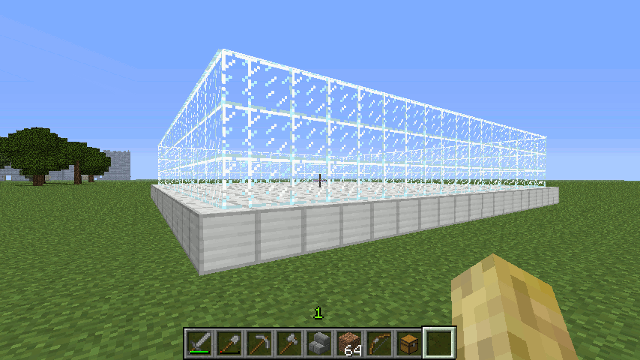

At the end of the method, an entire skyscraper is constructed. This is what the result looks like in the game:

##### Chaining in source files.
At the in-game prompt we are limited to a single line for our code so when chaining together a couple of Drone method calls we need to write code like this:

    /js box(block.iron, 20,1,20).up().box0(blocks.glass_pane, 20, 3, 20).up(3) 

... which can be difficult to read and understand. Fortunately we have no such limits when writing code in source files and can have statements which span more than one line like this:

    this          
      .box( blocks.iron, 20, 1, 20)  
      .up()       
      .box0(blocks.glass_pane, 20, 3, 20) 
      .up(3);

This is actually a single statement - notice that there's only a semicolon after the last line above. The above code could also be written on a single line but breaking up the statement as above makes the code more readable. Another alternative way of writing the above code would be as a series of statements:

    this.box( blocks.iron, 20, 1, 20);
    this.up();
    this.box0(blocks.glass_pane, 20, 3, 20);
    this.up(3);

Since each of the Drone methods returns the drone object it's possible to chain methods using the `.` character so in the example above there's strictly no need to repeatedly use the *this.* prefix after the first line. I personally prefer the former approach but it's largely a matter of personal taste. What's important is that your code is readable and understandable.

##### The *box0()* Method.
The *box0()* method is another method provided by the Drone, it's similar to *box()* except it only creates 4 walls and does not fill in the 4 walls. The *box0()* method is especially useful for construction dwellings. It takes the same parameters as the *box()* method.

### Achievement Unlocked!

Congratulations Master Builder, You've just discovered how to build massive structures using Javascript and some Object extension magic. 

### Summary
In this chapter you learned how to build large and complex buildings in Minecraft using ScriptCraft's Drone functions. We used Javascript's *for* statement to construct a skyscraper with many floors. We touched on objects and methods and Javascript's *this* keyword and what it means when used inside a method. 

## @@nextChapter{chapter-13}: Create a Fireworks Show
### Introduction
In this chapter we're going to write code to create a spectacular fireworks show in Minecraft. We'll learn about ScriptCraft's built-in *fireworks* module, the *setTimeout()* function and use a powerful programming technique called *recursion*. We'll begin by writing code to launch a single firework after a delay of 2 seconds, then build on that code to launch many fireworks.

### The fireworks module
ScriptCraft includes a *fireworks* module which can be used to launch a single firework at a given location. You can use the fireworks module directly at the in-game commmand prompt like this:
    
    /js var fireworks = require('fireworks')
    /js fireworks.firework( self.location )
    
The fireworks module's *firework()* function takes a single parameter - a Location - and launches a firework at that location. A Location in Minecraft is any place in the game. Most objects - players, animals, blocks etc - have a location. When I pass the parameter `self.location` I am passing my own location meaning the firework will launch from where I am in the game. I urge you to run the above commands and then look directly up to see the firework explode. 

### Deferred Execution
In the commands you just executed at the in-game prompt, the firework launches immediately. What we'd like to do is delay the launch by a couple of seconds so that we can move to a safe position with a better view. Fortunately there's a way to delay the execution of a function. Create a new file called scriptcraft/plugins/fireworkshow.js and type in the following code:

@@listing fwkshow_v1.js A Short Fireworks Show.

Save the file then issue the `js refresh()` command to reload your Javascript plugins. Now issue this command to launch a firework:

    /js fireworkshow( self.location )
    
Move back a couple of steps so you can better see the firework. Did you notice the firework did not launch immediately? There was a delay of 2 seconds.     

#### The setTimeout() function
The *setTimeout()* function lets you delay calling of a function. It takes two parameters:

1. A function which it should eventually call.
2. A delay. The delay is measured in milliseconds - that's 1/1000th of a second. There are 1,000 milliseconds in a second so a delay of 2,000 is equal to 2 seconds.

*setTimeout()* returns a value which can be used to stop the timed function from executing. To stop a function you've scheduled to execute you need to store the value returned by setTimeout() in a variable and pass this value to the *clearTimeout()* function like this:

    js function later(){ console.log('I ran!') };
    js var scheduled = setTimeout( later, 1000 );
    js clearTimeout( scheduled );

The *later()* function above will never get to execute because the *scheduled* task for running that function is canceled when we call *clearTimeout( scheduled )*.

Although setTimeout() is not part of the Javascript Language, it is provided with web browsers and Node.js and it's implemented in ScriptCraft too. A common mistake when using *setTimeout()* is to assume that the delay is in seconds rather than milliseconds.

### A fireworks show
I promised you a fireworks show at the start of this chapter. A single firework which launches isn't much of a show is it? Let's fix that. The next step is to change our code so that it launches many fireworks with a 2 second gap between each launch. Change your fireworkshow.js so it matches the following listing: 

@@listing fwkshow_v2.js A Longer Fireworks Show.

Then issue the `/js refresh()` command and at the in-game command prompt issue the following command:

    /js fireworkshow( self.location, 5 )

Move back a couple of steps and watch the show as 5 fireworks are launched one after another. The show should end after the 5th firewok has launched. You can change the number of fireworks launched by changing the second parameter. 

#### Me, a name I call myself...
A function which calls itself is called a *recursive* function. Recursive functions can be very powerful. They can be used for visiting all of files and folders on a hard drive or drawing pretty fractal diagrams. Recursion is beyond the scope of this book so I won't go into great detail. To get a taste for what recursion is about, imagine a computer program which controls a robot arm that opens a Russian Doll and keeps opening any Russian Dolls inside that until there are no more Russian Dolls inside. The code for such a program might read like this:

    function openRussianDoll( doll ){
      console.log( doll.size );
      if ( doll.inner ) {
        openRussianDoll( doll.inner );
      }
    }

The *openRussianDoll()* function wouldn't be called just once or twice but would be called every time a new doll was uncovered. This is the power of recursion. 

If you're curious about recursion, a few people have created some very cool Fractals in Minecraft using recursion. Malin Christersson has some example code at https://github.com/malinc/MinecraftFractals . You can see an example of one of Malin's fractal creations below:

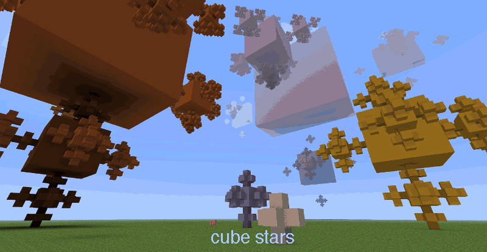

### Cancelling the Fireworks show
Let's say you kicked off a long running fireworks show and after a while you get bored and want to *cancel* the show. There are two ways to schedule a repeating task in Javascript, one way is to use *setTimeout()* and have a function which calls itself. We've already seen this in the earlier example. Another way is to use the *setInterval()* function which is like *setTimeout()* except it will keep on executing the task after each delay instead of only executing once after the delay. Let's take a look at an example of using *setInterval()* at the server console prompt:

    js function askQuestion(){ console.log('Are we there yet?') }
    js var scheduled = setInterval( askQuestion, 1000 )

Run the above commands and you will see an 'Are we there yet?' message appear every second. 

    [19:24:00 INFO]: [scriptcraft] Are we there yet?
    [19:24:01 INFO]: [scriptcraft] Are we there yet?
    [19:24:02 INFO]: [scriptcraft] Are we there yet?
    [19:24:03 INFO]: [scriptcraft] Are we there yet?
    [19:24:04 INFO]: [scriptcraft] Are we there yet?
    [19:24:05 INFO]: [scriptcraft] Are we there yet?
    [19:24:06 INFO]: [scriptcraft] Are we there yet?

The message will keep printing out for as long as the server is running. Fortunately there's a way to cancel this scheduled function. At the server console prompt issue the following command:

    js clearInterval( scheduled )

... and the messages will stop appearing. Phew! The *setInterval()* function is useful for scheduling tasks that you want the computer to do every so often. Let's update the *fireworkshow.js* module so that it looks like the following listing:

@@listing fwkshow_v3.js Using setInterval() and clearInterval() to create a Fireworks Show.

In listing @@listref{fwkshow_v3.js} we no longer rely on recursion to repeatedly launch fireworks. Instead we use the *setInterval()* function to repeatedly call *launch()*. Inside the *launch()* function we subract 1 from the count and if count is zero then we cancel the show using the *clearTimeout()* function. The difference between this version of the *fireworkshow* module and the previous version is that now we can cancel the show earlier than planned because the *fireworkshow()* function returns the scheduled task which we can cancel at any time. Save the above file and issue the `/js refresh()` command to reload your plugins. Then at the in-game prompt issue the following command to launch an extended firework show:

    /js var show = fireworkshow( self.location, 300 );

The above statements start a firework show in which there'll be 300 launches each 2 seconds apart. The show will go on for about 10 minutes if left alone but we're going to cancel the show early. Issue the following command to cancel the show:

    /js clearTimeout( show );

And the fireworks will cease. If you ever schedule tasks using the *setInterval()* or *setTimeout()* functions it's always a good idea to keep the value returned by these functions so that you have the option of canceling the task using *clearInterval()* and *clearTimeout()* respectively.

### Summary
In this chapter you learned about the *setTimeout()* function and how to use it to delay or "defer" execution of your code. You also learned about how to give functions names using function declarations and how to make a function call itself, and how to schedule repeating tasks using the *setInterval()* function.

## @@nextChapter{chapter-14}: Animal Sounds Revisited
### Introduction
In this chapter we'll revisit the Animal Sounds plugin from earlier but this time, instead of using a switch statment we'll use a lookup table instead. 
### Objects
I've mentioned objects a couple of times in this book. It's time to take  a closer look. 

An object in Javascript is something which can hold both data and functions. We've already been using objects throughout this book. We've used the *console* object to *log()* messages to the Minecraft server log and console window. We've use the *exports* object to provide new properties and functions for others to use. We've used array objects to *sort()* arrays. Last but not least we've used some of Minecraft's built-in objects such as Player and Event to respond to events that happen in the game. 

Objects are very useful in programming. Java - the language Minecraft is written in - is an *Object Oriented* language which means that in Java *everything* is an object - Players, Worlds, Blocks, Tools, Recipes and so on. Objects let you group together related *properties* and *functions*. For Example a Player:

* has a food level (how much food they have)
* has a bed (or not)
* has an experience level 
* can perform commands
* can fly
* can sneak
* can shoot arrows

... and so on. In programming terms, something which the player *has* is called a *property* while something which the player *does* is called a *method*. Methods are just functions which belong to an object.

#### How to make an Object
In Javascript creating a new object is easy. Here's an example you can try at the in-game prompt:

    /js var myFirstObject = { name: 'steve', job: 'minecrafter' }

To create an object in Javascript you start with the curly bracket `{` followed by a *key* , a colon `:`and then a value. You can separate each key-value pair using the comma `,`. You finish the object definition with a closing curly bracket `}`. The object example above has 2 key-value pairs. It has a *name* and a *job*. You can find out what's inside an object if you know its keys:

    /js myFirstObject.name
    > "steve"
    
    /js myFirstObject.job
    > "minecrafter"

Javascript is quite a flexible language. We've already seen how you can use square brackets `[]` to access items in an array. You can use the same square bracket notation to get object values:

    /js myFirstObject["name"]
    > "steve"
    
    /js myFirstObject["job"]
    > "minecrafter"

... which means you can also access object keys using variables rather than string literals...

    /js var key = "name";
    /js myFirstObject[key]
    > "steve"

Even if you don't already know what keys an object has, you can find out using a special form of *for* loop:

    /js for (var key in myFirstObject){ self.sendMessage( key ) }

... you can even use this form of *for* loop to process all of the keys *and values* of an object:

    function displayObject ( object ) {
      var value = null;
      var key = null;
      for ( key in object ) { 
        value = object[ key ]; 
        console.log( key + ' = ' + value );
      }
    }

When we create an object like this:

    /js var myFirstObject = { name: 'steve', job: 'minecrafter' }

this form of creating an object is known as an *object literal*. There are other ways to create objects in Javascript but in this book we'll focus on obect literals only. We can add a new key to an existing Javascript object easily:

    /js myFirstObject.toolOfChoice = 'Axe'

and you can delete a key from an object using the *delete* keyword:

    /js delete myFirstObject.toolOfChoice

There are no rules about what keys you can add or remove from a Javascript object because Javascript does not enforce strict rules about such things. Javascript is a *dynamically typed* language which means you can create new objects on the fly and add and remove keys from them and change the key's value types while your program is running. 

#### Two kinds of Objects
When programming plugins using ScriptCraft, we have 2 different types of objects available to us. ScriptCraft uses Javascript - a special version of Javascript which is available from within any Java program. That means that from within our Javascript plugins we can not only use Javascript objects but can also access and use all of the *Java* objects available via the *Bukkit* API. Unlike Javascript, Java *does* have strict rules about what you can and cannot do with Java objects. Java is said to by *strictly typed* because it does not let you add and remove keys from Java Objects and enforces strict rules about types. For example, the *self* object which we've used for some command-prompt examples in this book is a *Java* object so while we can access the object's keys like this:

    /js self.flying
    > false

... we could not *add* new keys to the object like this:

    /js self.favoriteFood = 'Pizza'

... this would display a Java error, while attempting to delete a key from a Java object:

    /js delete self.flying

... will fail silently. The key will *not* be deleted. 

### Objects as Lookup tables
In Javascript it's easy for programmers to create objects and Javascript can *lookup* object keys very quickly. A lookup table is anything you *look up* to find information. For example you look up a word in a dictionary to find out what the word means or you look up a name in a phone book to find out that person's phone number. 

In the following chapter we're going to change the *animalSounds.js* module from chapter @@chapter{chapter-10} and use an object instead of a *switch* statement. Open up the *animalSounds.js* file located in the *scriptcraft/plugins* folder and edit it so it matches the following:

@@listing animalSounds_v3.js A lookup table of Animal Sounds.

In the above listing we've created a new object and called it *noises* :

    var noises = {
      cat: sounds.catMeow,
      chicken: sounds.chickIdle,
      cow: sounds.cowIdle,
      'ender dragon': sounds.enderDragonGrowl,
      horse: sounds.horseIdle,
      pig: sounds.pigIdle,
      sheep: sounds.sheepIdle,
      wolf: sounds.wolfBark
    };

There are a couple of points to note about this statement:

* The statement creates a single object. Like many statements in Javascript, it can span more than one line. Having the object definition span more than one line makes the code more readable.
* The *noises* object has the following keys: cat, chicken, cow, horse, pig, sheep, wolf. Keys are always on the left hand side in an object literal. 
* The keys do not need to have quote marks around them but if the key contains whitespace - for example 'ender dragon' (the space between 'ender' and 'dragon' is whitespace) - then it should be enclosed in either single or double quotes. 
* You cannot use Javascript keywords as keys in an object so the literal values *true*, *false*, *default* etc can't be used. 
* Keys must be of type number or string. You cannot have another object as a key in an object - you can however have another object as a value in an object.
* Values in objects *can* be of any type - even functions and other objects! When an object contains another object as a value, that value is called a nested object. We'll see an example of a nested object later.
* Every key-value pair must be separated with a single comma `,`. Try to avoid putting an extra comma at the end of the last key-value pair. There is no comma after the last key-value pair `wolf: sounds.wolfBark` because it is not needed and some versions of Javascript will report an error if they see an extra comma just before the closing curly bracket `}`.

Having created the *noises* lookup table we use it in the *onInput()* function. The first use is to check to see if the animal the player typed in is in the *noises* object. The *if* statement below...

    if ( animal in noises ) {

... checks to see if the animal is in the noises table. This *key in object* construct will lookup the object and return true if *key* is in it. If the animal is not in the lookup table the function reports it hasn't heard of that animal. If it *is* in the lookup table it gets the appropriate noise function:

    makeNoise = noises[ animal ];

Each value in the *noises* table is a function so when we lookup an animal in the *noises* table what we get back is a function which when called will emit that animal's noise. So *makeNoise* is a variable which will point to a function which emits an animal noise. This is yet another example of the use of functions as data. In this case the functions are values in a lookup table. This is a very powerful idea in computer programming. In the next statement in the function:

    makeNoise( player.location );

... we invoke the function we've just found in the lookup table, passing in the player's location as the place where we want the sound to play. The remaining parts of the module are unchanged from the previous version.

#### Why use a lookup table instead of *switch* statement?
There are a couple of reasons why we should do this:

* Adding new sounds is easier if we only need to change the data in the lookup table, not the code in the *onInput* function. 
* Changing code is error prone. Every time we have to change the *onInput* function because we want to support a new sound, we run the risk of introducing errors into the code.
* There are many sounds in Minecraft, if we were to support each sound using a *switch* statement, we'd need to add a case for every sound. The switch statement would grow quite large. On the other hand, adding a single key-value pair to the lookup table is comparatively easier. Because it's data, would could expose the lookup table for use outside of this module and allow other modules or parts of the program to add and remove sounds. The *onInput()* function no longer needs to concern itself with what's in the lookup table meaning the function is shorter and more maintainable.

### Objects and References
One thing to note about objects and variables is that when we assign a new variable to an existing object, we don't make a copy of the object. For example, in ScriptCraft, when you execute Javascript statements at the in-game or server prompt, there's a special variable available. The *self* variable refers to the player (or console operator) who is currently executing the statement. If we assign a new variable to be the same as *self* then we are really only adding a new name for the same thing. We're not making a copy. So for example:

    /js var me = self;

Does not create a clone of the player. It merely adds a new Javascript name for the player object. We are adding a new *reference* to the player. The variables *me* and *self* both point to the same thing. The same is true no matter how many variables we add.

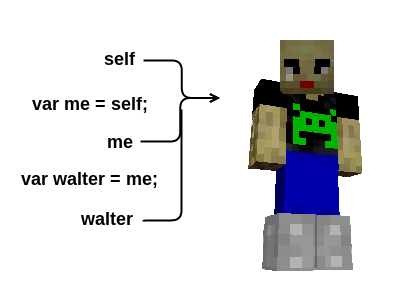

If I have more than one variable that refers to the same object then I can control or change that object through any of the variables that refer to it (also known as references). What this means is that if I have 3 variables *self*, *me* and *walter* all of which refer to the same player, I can make that player shoot an arrow by using any of the following statements:

    /js me.shootArrow();

or 
    
    /js self.shootArrow();

or 
   
    /js walter.shootArrow();
    
This is an important point to remember when passing around variables which refer to objects. When you change the *.flying* property for *any* of the *self*, *me* and *walter* variables, you effectively change it for *all* of them because they all refer to the same object. Try the following as an exercise. Execute each of the following commands and make a note of the results:

    /js var player = self;
    /js player.customName;
    /js self.customName;
    /js player.customName = 'steeeeve';
    /js player.customName
    /js self.customName

When you change the *player* object or call any of its methods, the changes are reflected in all of the variables which refer to the object.

### Obects as Parameters
In Javascript, when you pass an object as a parameter to a function, the object is passed *by reference*. This means a reference to the original object is passed, not a copy of the object. To illustrate this, let's imagine we have a function which will force a player to drop to the ground if they are currently flying. If a player is flying, we can disable flight by setting the player's *.flying* property to false. Try this yourself at the in-game prompt. Make your gamemode creative by issuing the `/gamemode creative` command then press the SPACE bar twice to start flying. While in mid-air issue the following command:

    /js self.flying = false;

... and you will drop to the ground. Now let's create a function called drop which we can use to drop a player. The first draft of the function will look like this:

    /js function drop( flying ) { flying = false; }

Now try to run this function (while flying) by issuing the following command:

    /js drop( self.flying );

Did anything happen?

The reason nothing happens when you call the *drop()* function is because in this first draft of the function, we only change the boolean value passed in as a parameter. Setting the *flying* parameter to *false* has no bearing on the object because we haven't passed the object as a reference. Instead we've passed the object's *flying* property. Let's revisit the *drop()* function this time changing it so that it takes an object instead:

    /js function drop( player ) { player.flying = false; }

We're also going to change how we call the *drop()* function. This time we'll pass the *self* variable instead.

    /js drop(self);

Now the *drop()* function works because we've passed a reference to the object so any changes to the object inside of the function act upon the object. This is an important point to remember, if you want to change an object within a function, you must accept the object as a parameter not just the object's property you want to change.
	
### Nested Objects
Objects in Javascript can contain *any* kind of data. Even - as previously mentioned - other objects! If you recall the Russian Doll code from chapter @@chapter{chapter-13} when we talked about Recursion. If we were to *model* the data for a Russian Doll, it might look something like this:

    var largeDoll = {
       size: 'large',
       inner: {
          size: 'Medium',
          inner: { 
             size: 'Small',
             inner: {  
                size: 'Tiny',
		inner: null
             }
          }
       }       
    };

This is an example of an object which has objects *nested* within it, just as a Russian Doll has other dolls inside it. In this example we have a 'Large' doll housing a 'Medium' doll housing a 'Small' doll and so on. The innermost 'Tiny' doll has an *inner* property of null meaning there's nothing inside. The above code could also be written as a series of statements each creating a distinct object like this:

    var tinyDoll = { size: 'Tiny', inner: null };
    var smallDoll = { size: 'Small', inner: tinyDoll };
    var mediumDoll = { size: 'Medium', inner: smallDoll };
    var largeDoll = { size: 'Large', inner: mediumDoll };

Regardless of how the *largeDoll* object is created, its structure will be the same in both cases. We could use this *largeDoll* object as a parameter to the *openRussianDoll()* recursive function we defined earlier in chapter @@chapter{chapter-13}. To put this to the test, create a new file *russiandoll.js* in the *plugins/scriptcraft/plugins* folder and type the following:

@@listing russiandoll.js A Russian Doll

Save the file and issue the `js refresh()` command to reload your plugins, then at the server console issue the command:
    
    js openDoll()

You should see the following output on your screen:

    > Large
    > Medium
    > Small
    > Tiny

Try changing the value passed to openRussianDoll from `largeDoll` to another value and see what the output looks like.

### JSON
I can't talk about Objects in Javascript without mentioning JSON. JSON is short for *Javascript Object Notation* and refers to how objects are constructed using the object literal style we've already seen. JSON has become very popular among web programmers because it is an efficient way to send data back and forth between a web browser and a web server. Any time you see an object literal like this, you're looking at JSON:

    var steve = { "name": "steve", "occupation": "miner" }

There is also a built-in *JSON* module which provides methods to:

1. Let programmers print out an object in a way which is *somewhat* readable by humans.
2. Read a string of JSON output and convert it from a string back into an object.

We'll learn more about JSON, and loading and saving data later in the book.

### Achievement Unlocked!

Congratulations! You've discovered the power of Objects in Javascript and how to create efficient lookups. Your plugin development apprenticeship is complete!

### Summary
In this chapter you learned how to create objects and how to access and lookup objects based on property names. You also learned about nested objects. This is the final chapter in the Basic Modding section of the book. Next, we move on to advanced modding.

# Part III Advanced Modding
## Overview
The latter half of the book will focus on Event-Driven Programming and using Bukkit's API. The Minecraft game is very customizable because Bukkit provides so many ways to change the game. This flexibility is what makes Bukkit such a popular choice for multi-player servers. The Bukkit API is a collection of functions and data types that let Plugin developers create exciting new additions to Minecraft. The API is vast. In the following chapters we'll learn how to explore the Bukkit API using the online documentation and how to better understand the types of data provided by Bukkit.

## @@nextChapter{chapter-15}: Saving Player preferences.
### Introduction
In this chapter we'll learn how to load and save player preferences. We'll create a new player command which lets them choose which color they would like to use for in-game chat. The color they choose will be saved so that when the player disconnects or the server is restarted, the player's choice of text color is restored. 

### A day in the life of a Minecraft Plugin
Minecraft Plugins lead a busy life behind the scenes. A typical large public server might have many minecraft plugins installed and some or all of those plugins might be turned on or off while the server is running. All Plugins are *loaded* automatically when the server starts up and all plugins are *unloaded* automatically just before the server shuts down. During the server session, the administrator might *reload* plugins using the *reload* command which will cause all plugins to be unloaded and then loaded again, while the server is running. This is usually the best way for an administrator to add new plugins as it means the server does not have to be taken down. Plugins are executable code which add behaviour and settings to the game. Plugins often have to manage *data*, player preferences, settings and so on. What happens to that data when the plugin is loaded and unloaded? This is the question we'll answer in the coming sections. 

### Chat colors
In this chapter we're going to add a new command to the game so that players can choose the color they'd like to use in chat messages. Players will be able to choose from among over a dozen colors. We want the player's choice of color to be saved so that when the server shuts down and is started up again, the same color is chosen for that player. The new command will be called */jsp chatcolor* and will support TAB-completion so that when the player hits the TAB key a list of colors will be displayed. We've encountered the */jsp* command before in chapter @@chapter{chapter-11}. This commmand is a prefix (something which is added at the start) for new custom commands. 

### TAB completion for custom commands
One of the nice things about issuing commands at the in-game or server console prompt in Minecraft is TAB completion - the ability to have the program fill in the remaining parts of a command without you having to type the entire command yourself. You can create your own custom commands which support TAB completion quite easily in Javascript. Let's create an example command at the in-game prompt which avails of TAB completion. This custom command will be called *jsp icecream* and will prompt the player to enter a flavor when the TAB key is hit. The first thing we need to do is say what the possible flavors can be. We'll do this by creating an array called *flavors*:

    /js var flavors = ['chocolate','strawberry','vanilla'];

Next we create a new function which will be executed when a player issues the command:
  
    /js function icecream( args, player ){ player.sendMessage('Yum ! ' + args[0] ) }

And finally we create a new custom command which will allow players to issue an *icecream* command that prompts them to choose flavors:

    /js command( icecream, flavors );

Now try it and see what happens when you type the following and hit the TAB key:

    /jsp ice

Hitting the TAB key should complete the first part of the command so now your command prompt input looks like this:

    /jsp icecream

Now press the SPACE key and then press the TAB key once more and you'll see a list of possible flavors to choose from. You can cycle through the list of flavors by repeatedly pressing the TAB key. How did we do this? The secret is in how we created the new */jsp icecream* command using the *command()* function. The command function takes 2 parameters:

1. The function which will be executed when a player issues the command. This function in turn takes 2 parameters, *args* which is an array of strings, and *player* which is the player who issued the command. The function *must* have a name as the function's name is used by the *command()* function to present a new command name for players with a prefix of 'jsp '. So while the name of the command we define is *icecream*, players must use *jsp icecream* when issuing the command.
2. A list of possible options for the command. This is the list of strings used by Minecraft's TAB completion feature.

In upcoming sections we're going to create a new command which provides a list of colors as possible options that will display when the player hits the TAB key.

### Choosing Chat Color
The color of text messages in Minecraft can be changed by using a special  symbol known as the 'Section' symbol. This symbol can't be entered in Minecraft itself, it's only used internally by Minecraft and Plugin developers. There are 16 different colors you can use for chat messages, and each color must use a special *code*. For example to say "Hello" using Yellow text, you would need to put the special code `\xa7a` in front of the message. You can try this out by issuing the following command at the in-game prompt:

    /js self.sendMessage('\xa7aHello');

The text `\xa7` is just another way of writing the  symbol in Javascript. The first character following `\xa7` should be a number between 0 and 9 *or* a letter in the range a through f. 

#### How we count
We typically count in what's called *Base 10* which means our numbers start at 0 and go all the way up to 9. If we want to write a number bigger than 9 then we add another digit on the left. So a number 475 is:

* 4 times 100 +
* 7 times 10 +
* 5 times 1

We count in base 10 because that's the numbering system the Romans used. Why did they use base 10? It might be because of how many digits we have on our hands but I don't know for sure. There are other ways to count. Base 2 - also known as binary - has just two numbers 0 and 1. How would you count to 5 with just two numbers? When we reach 1 we can add a digit on the left so:

*   0 in binary is equal to 0 in decimal
*   1 in binary is equal to 1 in decimal
*  10 in binary is equal to 2 in decimal
*  11 in binary is equal to 3 in decimal
* 100 in binary is equal to 4 in decimal
* 101 in binary is equal to 5 in decimal and so on.

Another base that's more commonly used by programmers is Hexadecimal or Base 16. In hexadecimal (often shortened to just 'hex') the numbers 10 through 15 are substituted with the letters a through f so the a sequnce of numbers 0 through 32 looks like this:

@@table hex.org Hexadecimal Numbers and their Decimal Equivalents    

#### Character Codes
The characters displayed in Minecraft and in other programs on your computer each have a *code* or number which the computer uses internally. The letter 'A' has the character code 65, 'B' is 66 and so on. The lowercase alphabet starts at number 97 so 'a' is character code 97, 'b' is 98 and so on. You can see a full list of characters and their codes at http://en.wikipedia.org/wiki/ISO/IEC_8859-1 .

#### Text colors in Minecraft.
The special  symbol has the character code 167 and Minecraft uses this special character at the start of a String to mean the String should be displayed in a certain color. The exact color is one of 16 possible colors listed below:

@@table textcolors.org Text Colors and their Hexadecimal equivalent http://minecraft.gamepedia.com/Formatting_codes

In the first part of this chapter we'll create a module which will be used to provide a list of color names and a *colorize()* function which will add color to any chat message. In your editor, create a new file called *textcolors.js* in the *plugins/scriptcraft/modules* folder and type in the following code:

@@listing textcolors.js Text Colors Module

Once you've saved this file and reloaded the plugin using `js refresh()`, test it by issuing the following commands at the in-game prompt to display a message in gold:

    /js var textcolors = require('textcolors');
    /js var goldText = textcolors.colorize( 'gold', 'I am gold!' );
    /js self.sendMessage(goldText);

The module in listing @@listref{textcolors.js} exports the *names* array and the *colorize()* function for use by others. The *names* array will be used later to provide hints to players who want to change their chat color using TAB completion. The *colorize()* function will take a color name and text and add the necessary color codes to the start of the text so that it will be displayed in color in the chat window. It does this by searching for the color in the *names* array using the *Array.indexOf()* method which will return the position of the matching color in the array. For example, names.indexOf('darkgreen') would return 2. Remember: Arrays begin at index 0 not 1, so 'black' is at index 0, 'darkblue' is at index 1 and so on. The *Array.indexOf()* method will return -1 if the item is not found in the array. If the *colorize()* function is passed a color which does not exist in the *names* array, then the text is unchanged - no color code will be added to the text.

The index of the color is important because that number is converted to a hexadecimal value using the *Number.toString(16)* method. This value along with the special  symbol which is written as `\xa7` combine to form the color code which is prepended to the original text. The *colorize()* function is a perfect example of how functions can be used to package up tricky code which you don't want to have to write more than once. It's much easier to simply write `colorize('gold','I am gold!')` than to write `\xa76I am gold!'`. Having to memorize all 16 color codes and the special `\xa7` prefix code every time you wanted to write colored text would be difficult. That's why we wrap up this code inside an easy to use function and *export* it so other modules and plugins can use it. 

The next steps in writing the Chat Color plugin are:

1. Provide a new command so players can choose their color and ...
2. Add an event handler so that chat messages are colored according to a player's preferences.

In your editor, create a new file called *chatcolor.js* in the *plugins/scriptcraft/plugins* folder and type the following:

@@listing chatcolor_v1.js Setting and Applying Player Chat Color Preferences

In this plugin we use the *textcolors* module we created earlier, and we create a new *preferences* variable which is an empty object `{ }`. This *preferences* object will be used to store each player's prefered color. Let's say we have a server with 3 players who have chosen custom chat colors. In such a scenario the *preferences* object might look something like this:

    {
       "steve1901": "blue",
       "jane1908": "gold",
       "john1911": "red"
    }

... where "steve1901" is the name of a player and "blue" is his chosen chat color, "jane1908" is the name of another player and her chosen chat color is "gold" and so on. The *preferences* object is a lookup table of player names and their colors. If I wanted to find out what player jane1908's chosen color was, I'd do so using the expression `preferences["jane1908"]` which would return "gold".

The *chatcolor()* function is a *callback* which will be called when a player issues the `jsp chatcolor` command. The name of the player who issued the command and the color they chose are stored in the *preferences* object using the statement:

    preferences[ player.name ] = color;

We can add any property we like to an object using the `[]` square brackets and putting the property name inside the square brackets. The property name does not have to be an object literal like `'age'` or `'address'`, it can be any Javascript expression which evaluates to a string. So in this case, whatever the player's name is becomes a new property of the preferences object - a key by which the preferences can be looked up. 

The *command()* function creates a new `/jsp chatcolor` command which will invoke the *chatcolor()* function and which will provide the *textcolors.names* array as a list of color names as hints when the player hits the TAB key. 

The first section of listing @@listref{chatcolor_v1.js} up to and including the call to *command()* sets up the preferences and a command to set color preferences. The next section of the module is concerned with what happens when a player chats in minecraft and ensures that player color preferences are applied to any chat messages:

    function onChat( event ) { 
      var player = event.player;
      var playerChatColor = preferences[ player.name ];
      if ( playerChatColor ) {
        event.message = textcolors.colorize( playerChatColor, event.message );
      }
    }
    events.asyncPlayerChat( onChat );

The *onChat()* function is another callback function. This function is invoked whenever a player chats in the game. The function gets the player who is chatting, checks to see if they have a prefered color and if they *do* have a prefered color, changes the event's message property (the .message property of the event is the text of the message which the player is about to send) by adding the player's chosen color using the super useful *textcolors.colorize()* function we wrote earlier.

Once you've saved the *chatcolor.js* file, reload the plugins using */js refresh()* or */reload* and at the in-game prompt type:

    /jsp chatcolor

Press the SPACE key then the TAB key and you should see a list of possible colors to choose from. You can cycle through the list of colors by repeatedly pressing TAB. Choose a color, then press T to begin chatting. Type a message and the message should appear in the color you've chosen.

Cool! You've just created a useful new command which a lot of players are going to like. Plugins like the one you've just created are very popular on multiplayer servers. Try changing the chosen color a few times using the `/jsp chatcolor` command to make sure all of the colors work.

What happens if you issue the `/reload` command?

Right now, our plugin does not save the chat color preferences so when the plugin is reloaded or the server shuts down, the color preferences for each player are lost. The player's chat colors will revert to the default color. It would be nice if it was possible to load and save preferences for our plugin so color preferences weren't lost when the server stops. Not only is it possible, it's super easy too!

### Plugin Data
For any Minecraft Javascript Plugin we want to be able to load plugin data when the plugin code is loaded and automatically save plugin data when the plugin coded is unloaded. That way we can be sure that plugin-specific data is never lost when the server is shut down. Let's look first at loading data.

#### Loading Plugin Data
Scriptcraft provides a *persist()* function which handles saving and loading of data. Let's take a look at the *chatcolor.js* file again. The only data in that file we'd like to *persist* is the *preferences* object declared near the top of the file and assigned a value of `{ }` which means it is an empty object. 

    var preferences = { };

The above code *initializes* the plugin's data to an empty object. What we'd like to do instead is:

* Check to see if there is saved data in a file.
* Load the data from the file if a save file is present or...
* Initialize the data to a default value defined by the plugin.

This is where the *persist()* function helps - it performs all of the above functions (and more). To understand how to call the *persist()* function, let's look at an example. Open up the *chatcolor.js* function in your editor and change the following line:

    var preferences = { };

... to ...

    var preferences = persist('chatcolor-prefs', { } );
	
The *persist()* function takes up to 3 parameters but only the first parameter is required. The parameters are:

1. A unique filename to use when loading or saving data. The filename should be unique so avoid using generic names like 'data' or 'preferences'. In the example above we use the name 'chatcolor-prefs'. 

2. An object which will be used as the initial value for the data. If no object is provided then the default value is `{ }` (empty object). 

3. A write flag. The write flag indicates whether or not the data should be written to the file right now. The write flag should be *true* or *false*. If no write flag parameter is provided then the default is *false* - that is - data will be read not written.

The *persist()* function returns an object which will be either of two things:

1. The data loaded from the file if the file exists merged with the data provided in the 2nd parameter or... 
2. The data in the second parameter if the file does not yet exist.

The statement `var preferences = persist('chatcolor-prefs', { } )` in plain english says: Set the preferences variable to whatever's in the 'chatcolor_prefs' file or an empty object if there's no file.

Save the *chatcolor.js* file and reload your plugins using the `/reload` command. At this point you'll notice that the chat color preferences still have not been preserved. Change your color preferences at the in-game prompt using the following command:

    /jsp chatcolor yellow
	
Type a message or two to verify the chat messages appear in the chosen color then issue the */reload* command and type another message. You'll notice that the chat color preferences have been preserved. 

#### Saving Plugin Data
At this point you might be wondering how chat color preferences were preserved after the server plugins were unloaded and reloaded. The *persist()* function in addition to loading data, marks data for saving when the plugin is unloaded. This means that any data returned by the *persist()* function is *automatically* saved when the plugin is unloaded. As a Javascript plugin developer you don't need to worry about saving your plugin's data because it will be saved automatically once you load it using the *persist()* function. Any changes you make to the object returned by *persist()* will be saved. You can verify this at the in-game prompt by trying the following commands:

    /js var test = persist('testpers', {});
    /js test.name = 'Your name here';
    /js refresh();

The *refresh()* function will cause ScriptCraft to reload. Now issue the following commands:

    /js var test = persist('testpers', {});
    /js test.name

The name you entered earlier should display. It's important to note that only changes to the object returned by *persist()* will be saved. In the above example, if you were to later reassign the *test* variable to another object and make changes then those changes would not be saved. The following code *would not work*:

    /js var test = persist('testpers', {});
    /js test = { name: 'Your name here' }; // WARNING: changes to test will not be saved.

You may be wondering 'Where is the plugin data saved to?'. Let's take a look...

### Saved Data
ScriptCraft saves plugin data in the *plugins/scriptcraft/data* folder. If you open the folder in your editor you'll notice there's now a *chatcolor-prefs-store.json* file already present. Open this file in your editor and you'll see something like this:

    {
      "walterh": "blue"
    }

The *.json* at the end of the filename means this is a JSON file. JSON remember is short for Javascript Obect Notation and is just a way to load, store and send Javascript data. When you call *persist()* it takes the filename parameter (for example: 'chatcolor-prefs') and appends '-store.json' to the filename and saves the file. The data is saved in JSON format because that's the easiest way for Javascript to store and load data. 

#### More on JSON
When we create a new object in Javascript with name and value pairs we can do so like this:

    var player = { name: "steve" }
	
... or like this:

    var player = { "name": "steve" }

That is; we can do so with or without quotes around the *name* property. However, when saving data, the built-in JSON module will write out *player* like this:

    { "name": "steve" }
	
... adding double-quotes around each of the object's keys. This is just a standard JSON uses. The builti-in JSON module has 2 important functions which are used by ScriptCraft's *persist()* function:

1. JSON.parse(string) Takes a string and tries to convert it to a Javascript object. For example: `JSON.parse("[9,5,3]")` will take the string "[9,5,3]" and return an array with 3 items: 9, 5 and 3.
2. JSON.stringify(object) Does the opposite of JSON.parse(). It takes a Javascript object and converts it to a string so for example: `JSON.stringify([ 9, 5, 3])` takes an array and returns a string "[9,5,3]".

If the *JSON.parse()* function encounters an object key without surrounding quotes it complains and refuses to try to convert the string to an object.

### JSON, Persistence and Java Objects
If the data you want to save includes references to Java objects then saving and loading of data will not work using the standard *persist()* function which is provided by ScriptCraft. The *persist()* function uses the popular JSON module's *stringify()* and *parse()* functions to save and load data and these functions *only work with native Javascript objects*. If you want to save Java objects, consider instead saving a unique identifier for that object. For example, instead of storing the *org.bukkit.entity.Player* object, store only the player's name. If you want to save a *Location* object then consider using the *utils* module's *locationToJSON()* and *locationFromJSON()* pair of functions for converting the *Location* Java object to and from JSON:

    var utils = require('utils');
    var locationAsJSON = utils.locationToJSON( player.location ); // convert from Java to JSON
    var locationObject = utils.locationFromJSON ( locationAsJSON ); // convert from JSON to Java

### Summary
In this chapter you learned about providing TAB-completion hints for your own custom commands and you learned about persistence - saving and restoring state. Persistence is a useful feature to have in your own plugins. Many plugins allow players to set preferences and it's useful to be able to save and restore player preferences and other settings when your plugin is loaded and unloaded.

## @@nextChapter{chapter-16}: Add new Crafting Recipes: The Ender Bow
### Introduction
All fun Minecraft Plugins begin with a simple question: What if ... ? Minecraft has become such a popular game because the possibilities are endless. For Minecraft Plugin Developers it's even more fun because the programming API allows for endless creativity in customizing the game. In this chapter we're going to use the Bukkit API to create a new Crafting Recipe - one which will produce a new in-game item - the *Ender Bow*. What's an Ender Bow? It's a bow which shoots arrows which will teleport the shooter to where ever the arrow lands! This could be a handy tool to have if you're in a tight spot surrounded by monsters on all sides and need to make a quick getaway. With Ender Bow in hand, you just draw your bow, aim at where you want to teleport and shoot. As soon as the arrow hits, you'll be teleported. 

In this chapter we're going to add a new crafting recipe which will construct an *Ender Bow* and we're going to start exploring the Bukkit API in more detail and I'll explain how to go about exploring and discovering features of the API which you can use in your own plugins. We'll learn more about Java *Classes* and *Inheritance* and how these ideas help us figure out the Bukkit API's capabilities. In the follow-up chapter we'll add teleporting behaviour to the bow.

Before we get into the 'How' of adding the new Crafting Recipe to the game, let's first consider the 'What' - what ingredients will be required for the new recipe and how we go about choosing them.

### Crafting an Ender Bow
A regular bow in Minecraft is crafted using 3 bits of stick and 3 bits of string. By arranging each piece in a certain formation in the Crafting Grid, a Bow is crafted. The Ender Bow we'll add to the game is special though. It will require some extra ingredients to add teleporting magic to the bow. I call this new item the 'Ender Bow' after the 'EnderMan' monster type in Minecraft. An EnderMan can teleport from one location to another at random which is what makes him such a terrifying and unpredictable opponent. If you're lucky enough to defeat an EnderMan in battle, they drop *Ender Pearls* which can be thrown by hand to teleport a short distance. The range of the Ender Bow will obviously be longer than throwing by hand and - unlike throwing Ender Pearls - it won't deal any damage to the shooter when they are teleported. This is what the Crafting Grid for a regular Bow looks like in Minecraft:

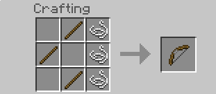

In the next section we'll look at how we can use this information to craft a new type of Bow.

#### Choosing what materials should be used
It's a good idea to base a new Crafting Recipe on an existing Recipe. Server plugins cannot add new Graphics to the Minecraft Client. For example we couldn't add a completely new Item like a Portal Gun because even if you were a Graphics Whizz, the Bukkit API provides no way to add new item graphics to the client. Another reason to base new Crafting Recipes on existing items is that players are already familiar with many of the crafting recipes and if you add a new recipe which is just a little twist on an existing recipe, it makes the recipe and the resulting item easier to remember and master.

For the Ender Bow recipe, we're going to base our new recipe on the existing Bow recipe but add some ingredients to give the Bow its special powers. You'll notice that for a standard Bow recipe, there are 3 empty slots in the grid. We're going to use these slots adding a new ingredient to each of the 3 empty slots to craft an Ender Bow.

The ingredient we're going to add is *Ender Pearls*. These are obtained from teleporting Endermen so it makes sense they should be ingredients for an Ender Bow. You could of course choose whatever material you like. You could for example decide that an extra block of grass in the middle is all that's needed to create an Ender Bow. For players that might not make the new Item very interesting. Any new item you add to the game should be interesting both in what it does *and* how it's constructed. New items should not be *too* easy to make - especially if they're powerful like the Ender Bow. Ender Pearls are difficult enough to obtain in survival mode that they make for good ingredients for the Ender Bow. So our Ender Bow will be constructed using the following recipe:

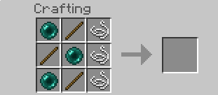

You'll notice in the above screenshot that no item appears in the right hand side. That's because we haven't yet instructed the server to recognize that recipe. Now that we've figured out what we want our new Crafting Recipe to look like from a Player's point of view, let's dive in to how we'll program this new behavior into the game.

### Exploring the Bukkit API.
So we've answered the question of *What* we want to do, now we must ask *How* are we going to do it? This is a list of what we want to do:

1. Add a new Crafting Recipe to the game 
2. Add new Teleoporting behavior for arrows fired from an Ender Bow.

We'll tackle the 2nd item in the next chapter so let's look at how we add a new crafting recipe to the game. 

Bukkit has been around for a few years and has a large community of developers who have been using the API and posting questions and answers on the Bukkit forums. If there's something you want to do in Bukkit, a good place to start (apart from books like the one you're holding right now of course) is by searching online. A quick search online for 'bukkit add recipe' at the time of writing yields as the first result a link to the Bukkit forums where one poster asks a question about adding custom recipes:

https://forums.bukkit.org/threads/am-having-trouble-adding-custom-recipes.102722/

Very often such results can be very useful when starting down the path of creating your own plugin.

What's even more useful is the comprehensive API reference available at http://jd.bukkit.org/rb/apidocs/. This API reference is a set of interlinked web pages which are generated automatically from comments in the Bukkit source code. The reference lists all of the *Classes*, *Packages* and *Methods* in the Bukkit API. A Java *Class* is much like a Javascript Module while a Java *Method* is much like a Javascript Method or Function. A Java *Package* is a folder of Java *Classes*, it's just another way of organizing large numbers of source files. Java programs can be quite large, much larger than their Javascript equivalents so the source files must be organized in folders and sub folders. Each folder and subfolder is known as a *Package* in Java terms. 

For example, in Minecraft there are hundreds of different types of *events* which can occur in the game. It would be difficult for the Bukkit development team and for Plugin developers if all of the event source code was in a single folder called *events* so it makes sense to create subfolders for categories of events.

If you visit http://jd.bukkit.org/rb/apidocs You'll see a web page with 3 distinct areas.

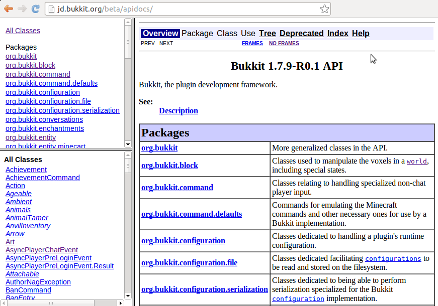

The area on the top left is the list of packages. This area provides a high-level overview of the entire API. You can quickly move from one package to another by clicking any of the packages listed in this area.

The area on the bottom left is the list of classes in the current package (the package selected in the top left pane). Clicking on any of the items in this area will display more details about the chosen item in the main display pane on the right.

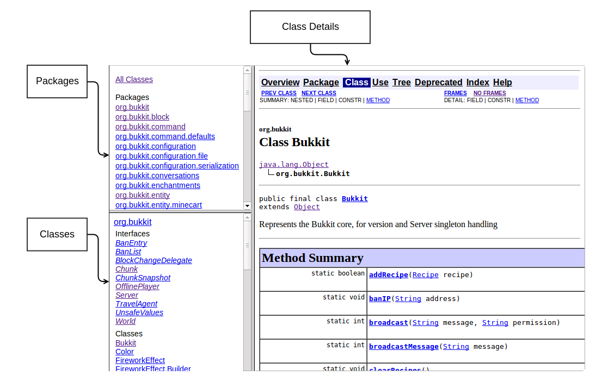

Clicking on any of the method links in the right hand side of the page will take you to more information about the method. 

You can call any of the Java classes and methods from within Javascript - in fact - that's what we've been doing throughout this book. 

One of the key differences between Java and Javascript is that Java is 'strictly-typed'. That means it has no `var` keyword. Instead when variables are declared, their type must also be declared. So while in Javascript you could write:

    var myString = "Hello World";
	
... in Java you would have to write:

    String myString = "Hello World";

You'll notice when browsing the Bukkit API that many methods include both the types parameters they expect and the type of data they return. For example, the Bukkit Class found in the *org.bukkit* package has an *addRecipe()* method whose method summary looks like this:

    static boolean addRecipe(Recipe recipe)

Let's look at this piece by piece. The *static* keyword means the method is really a function. It can be called without first creating a Bukkit object. The *boolean* to the left of the method name is the type of data the method returns. The *Recipe recipe* inside the round brackets says that the method takes one parameter named *recipe* of type *Recipe*. This is the conventional way that Java parameter documentation is presented. The parameter type is shown along with the parameter name. 

Every Type name in the Java documenation page is a link to more information about the Type. So if I want to find out more information about the *Recipe* Java type, I just click on that link. 

#### Interfaces, Classes, Enums, Exceptions and Annotations
Java has a couple of different Object types but you don't have to worry too much about the differences. Still, it's useful to know what the different terms mean.

##### Interfaces
A Java interface is an *Abstract* type. That is - it says what the object *should* do but now *how* it should be done. Interfaces are used quite a lot in Java and throughout the Bukkit API. For example, the *Recipe* type is an *Interface*. It has a single empty method called *getResult()* which should return the Item crafted by the recipe. The *Recipe* type has sub-types called *FurnaceRecipe*, *ShapedRecipe* and *ShapelessRecipe* each of which provide their own *getResult()* method implementations. 

In Java, if a method takes an Interface type as a parameter, it will also take any sub-types too. That's one of the nice features of Java and Object-Oriented programming. 

##### Classes
Classes are like Interfaces except they are *concrete* types. That is , they have methods which are not empty. A Java class is much like a module in Javascript, it is a way to package up a collection of related functions and variables into a single logical unit. 

##### Enums
Enums are like Classes except they are usually just a collection of named properties. For example, the *org.bukkit.GameMode* enum has 3 possible values which correspond to the supported game modes in Minecraft:

* org.bukkit.GameMode.ADVENTURE
* org.bukkit.GameMode.CREATIVE
* org.bukkit.GameMode.SURVIVAL

Another example of an Enum is the *org.bukkit.Difficulty* enum which has the following values:

* org.bukkit.Difficult.EASY
* org.bukkit.Difficult.HARD
* org.bukkit.Difficult.NORMAL
* org.bukkit.Difficult.PEACEFUL

##### Exceptions
Exceptions are error types in Java. They work much like errors in Javascript. In both Java and Javascript, you can *throw* an exception when some unexpected condition occurs in your code.

##### Annotations
You don't need to worry about Annotation types when calling Java code from Javascript.

### The Code
That's just enough Java for now. Before we explore the Bukkit API further let's fire up the programming editor and write some code. Create a new folder in the *plugins/scripcraft/plugins* folder and call the new folder *enderbow*. Then inside the *enderbow* folder create a new file called *recipe.js* and add the following code:

@@listing recipe.js The Ender Bow Recipe

Save the file, reload using the `/reload` command and then bring up the crafting grid by right-clicking on a crafting table. When you place Ender Pearls, String and Sticks in the Grid you should see an shimmering bow appear in the right hand side. See the screenshot below:

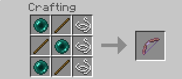

Put the crafted Ender Bow in your inventory but don't try using it just yet. It will still behave just like a regular bow. We'll add the teleportation magic in the next chapter.
### Using Bukkit Classes and Enums in Javascript
On lines 2 and 3 of listing @@listref{recipe.js} we declare 2 variables:

    var bkEnchantment = org.bukkit.enchantments.Enchantment;
    var bkShapedRecipe = org.bukkit.inventory.ShapedRecipe;

The names of classes in Java can be quite long-winded because you have to include the package name and the class name. Java programmers call this the *fully qualified name*. In Java programmers will often save themselves the need to use fully qualified names by *importing* packages. The Javascript engine which runs inside Java has an *importPackage()* function but this function is not supported in later versions of Javascript for Java. I personally like to avoid using fully qualified names throughout Javascript code which is why whenever I need to refer to a Bukkit Type I declare a short-named variable at the top of the module which refers to the longer fully-qualified name of the Bukkit Type. I also put a *bk* at the front of the variable name so I know I'm working with a Bukkit object and not a regular Javascript object. This is just a personal preference. I've found it helps me when I'm writing plugins in Javascript. It may be useful to you too.

### Enchantments
One way you can mark an item as having special powers is to add an enchantment to it. Enchanted items shimmer and glow in the game. An Ender Bow should shimmer so that the player knows they're not holding a regular bow. For most of the activities you can do in the game, there are equivalent classes and methods in the Bukkit API. For example: In the game players can *add enchantments* to *items*. If we browse the Bukki API reference we see there's an *inventory* package which has a couple of classes one of which is called *ItemStack*. An ItemStack is a collection of one or more *Items* which can be placed in one of the player's inventory slots or held in the player's hand. This *ItemStack* class has *addEnchantment()* and *addUnsafeEnchantment()* methods which we can use to add special powers to items in the game. I'll get into why I chose *addUnsafeEnchantment()* over *addEnchantment()* in a moment but first let's figure out what we want to do:

1. We want to *enchant* the item created from the recipe so that it shimmers and is visually distinct from a regular Bow.
2. We're going to use a ShapedRecipe object. The ShapedRecipe constructor - that is the function which will create a new Recipe() object, takes an *Item* as a parameter - this item will in turn be created each time a player uses the recipe in the in-game crafting table.
3. We know (from browsing the API reference) that we can add a new recipe to the game using Bukkit.addRecipe() or Server.addRecipe()

The first thing we do is load ScriptCraft's *items* module. This module simplifies the creation of Java ItemStack objects. If you want to create ItemStack of 1 Bow. You call *items.bow(1)* and it will return a Java ItemStack object to which enchantments can be added. The *items* module has roughly 350 different functions - 1 for each of the materials in Minecraft. You can call each of these functions in 3 different ways. Let's take the *items.bow()* function as an example:

* items.bow() when called without parameters will return the value *org.bukkit.Material.BOW*. This is a *Material* object which is used throughout the Bukkit API.
* items.bow() when called with a number as a parameter e.g. *items.bow(2)* will return an *org.bukkit.inventory.ItemStack* object of 2 Bows. The *ItemStack* type is also used throughout the Bukkit API.
* items.bow() when called with a *Material* as a parameter e.g. *items.bow(material)* will compare the material to the material for this function (each function has its own material) and return true if it's the same or false if it isn't. We saw an example of this in listing @@listref{stealthCookies_v2.js} when we wanted to check if a broken block was of type SAND.

There are many different *Enchantments* in Minecraft some of which are designed for use with Bows. We want to use an enchantment which is not already designed for a Bow because we don't want to interfere with existing enchantment rules. The problem is, if we add an enchantment which was not designed for the item, the enchantment might not stick. For this reason, we use the *addUnsafeEnchantment()* method because we want to add an enchantment which was not designed for the Bow item. If we look at the list of possible *Enchantments* in the Bukkit API docs, there are no obvious teleportation-related enchantments so I chose the *LUCK* enchantment as it's normally for use with Fishing Rods. 

Adding a Level 3 LUCK enchantment to a Bow minimizes the risk that this particular configuration of Item, Enchantment and Level will conflict with existing Item/Enchantment game rules.

### The Recipe
Having created and enchanted the item which will be cooked every time the player uses the recipe, the next step is to setup the ingredients for the recipe.

#### A *new* way to create objects
In Javascript we can create objects using *Object Literals* like this:

    var myNewObject = { name: 'Ender Bow' }

... but there's another way to create objects we haven't mentioned yet. The *new* keyword in Javascript can be used to create a new Javascript Ojbect. For example Javascript has a Date function which when you call it like this returns the current date and time as a String (In Java 7 for Linux the following code throws an exception but the official Javascript Specification says you should be able to call Date() as follows) :

    var today = Date();

... However, when you add the *new* keyword in front of the call to Date() it behaves differently. When called like this, the *Date()* function returns a new Object of type Date:

    var today = new Date();

The *new* keyword in Javascript means the Date() function becomes a *constructor*. A constructor is any function which returns a new object. In *Java* there are only limited ways to create objects using Object Literals so the most common way to construct a new object in *Java* is using the *new* keyword. The statement below:

    var enderBowRecipe = new bkShapedRecipe( enderBow );

... creates a new Java object of type *org.bukkit.inventory.ShapedRecipe* (remember: we declared the bkShapedRecipe variable as short-hand for *org.bukkit.inventory.ShapedRecipe*), passing the *enderBow* object as a parameter.

#### The crafting Grid
The Crafting Grid in Minecraft is what appears on screen when you right-click on a crafting table. It's essential for creating tools and weapons in the game. The Grid is 3 x 3. It consists of 3 rows each of which have 3 slots. We need to be able to define - in code - what combination of ingredients will result in a new Ender Bow. Fortunately this is relatively easy. The in-game grid can be mapped to an Array of Javascript strings which substitute each letter for a material. The following diagram shows the crafting grid with letters superimposed on each cell. 

Each letter corresponds to a material: E is for Ender Pearl, S is for Stick and W is for String (Web). If we were to imagine the recipe using just the letters E, S and W as shorthand for each material, the recipe might look like this:

    E S W
    S E W
    E S W

This is how we define the layout of a new shaped recipe in code too. The ShapedRecipe class has a *shape()* method which which takes an array of 3 strings:

    enderBowRecipe.shape([
      "ESW", 
      "SEW", 
      "ESW"
    ]);

#### Calling Variable Argument Java Methods from Javascript
In the *org.bukkit.inventory.ShapedRecipe* details page at http://jd.bukkit.org/rb/apidocs, the information about the *.shape()* method is presented as follows:

     ShapedRecipe   shape(String... shape) 
         Set the shape of this recipe to the specified rows.    

The `String... shape` within the parameters section means that the *.shape()* method takes 1 *or more* Strings as parameters. In Java, this style of parameter passing is called *varargs* which is short for *a variable number of arguments*. When you see a Java method which uses this style of argument passing - the `...` tells us there can be one or more parameters of that type. When calling such methods from Javascript we need to pass the parameters as an Array instead. That's why we call the *.shape()* method like this:

    enderBowRecipe.shape([
      "ESW", 
      "SEW", 
      "ESW"
    ]);

Notice the opening `[` and closing `]` array brackets. If we try to call the *.shape()* method as follows, it will fail:

    enderBowRecipe.shape(
      "ESW", 
      "SEW", 
      "ESW"
    );

Whenever you see a method which uses the `...` notation for a parameter, pass an Array in its place.

#### Setting ingredients
Now we've defined the shape of the recipe we need to say what each of the letters E, S and W mean. We do this using the *ShapedRecipe.setIngredient()* method which takes 2 parameters, a character and the material it which should be placed wherever that character appears in the shape.

    enderBowRecipe.setIngredient('E', items.enderPearl());
    enderBowRecipe.setIngredient('S', items.stick());
    enderBowRecipe.setIngredient('W', items.string());

### Inheritance
Finally, having set up the rules for the new Recipe we add it to the game using the *server.addRecipe()* method. Let's look at this method again in the online documentation:

1. Go to jd.bukkit.org/rb/apidocs
2. Click the *org.bukkit* link in the top left pane.
3. Click the *Server* link in the bottom left pane.
4. Click the *addRecipe* link in the right (main) pane.

The details in the right pane will look something like this:

    boolean addRecipe(Recipe recipe)
      Adds a recipe to the crafting manager.
      Parameters:
        recipe - the recipe to add
      Returns:
        true if the recipe was added, false if it wasn't for some reason

If the *server.addRecipe()* function expects a *Recipe* but we give it a *ShapedRecipe* (that's what enderBow is), why does no error occur? No error occurs because a *ShapedRecipe* is a sub-type of *Recipe*. In Java programming we say that *ShapedRecipe* **inherits** from *Recipe* or is a *Subclass* of it.

Inheritance is an important principle in programming and it's useful to understand what it is to better understand and navigate the Bukkit API Reference document. If we click on the *Recipe* link (the link inside the round brackets above) we're taken to the *Recipe* details page where you'll find the following information in the heading:

    org.bukkit.inventory 
      Interface Recipe
    
        All Known Implementing Classes:
          FurnaceRecipe, ShapedRecipe, ShapelessRecipe
        public interface Recipe
        Represents some type of crafting recipe.

Under *All Known Implementing Classes:* are a list of *Subclasses* or specialized types of *Recipe*. You can think of these classes as *children* of *Recipe*. Each of the classes *FurnaceRecipe*, *ShapedRecipe* and *ShapelessRecipe* are also *Recipe* objects and they *inherit* all of the parent Class's methods and properties, much like people inherit some of the characteristics of their parents: Eye color, Hair color and so on. Since the parent class *Recipe* only has one single method *.getResult()*, you can infer that there's a *FurnaceRecipe.getResult()* method and a *ShapedRecipe.getResult()* method and so on. You can click on the *ShapedRecipe* link to verify this. *ShapedRecipe* does indeed have a *.getResult()* method along with many other of its own methods. 

In programming, Inheritance diagrams like the one below are useful for understanding inheritance:

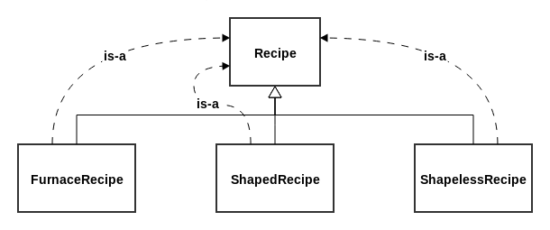

From this diagram we can see that *FurnaceRecipe*, *ShapedRecipe* and *ShapelessRecipe* share a common ancestor.

Ultimately the *server.addRecipe()* method *doesn't care* what type of *Recipe* is added, *FurnaceRecipe*, *ShapedRecipe* or *ShapelessRecipe*, it doesn't matter, all the *server* object cares is that it *is* a *Recipe* object so it can call the *Recipe.getResult()* method (which is common to all 3 subclasses) when someone uses the recipe in a crafting grid. We'll revist this topic in the following Chapter.

### Summary
In this chapter we covered a lot of ground. We learned how to explore the Bukkit API Reference documentation, how to use the *new* keyword and learned about *inheritance* and how to use it when calling Java code. in the next chapter, we'll build upon what we've done here and add Teleporting behavior to the Ender Bow.

## @@nextChapter{chapter-17}: Arrows that Teleport you.
### Introduction
In the previous chapter we learned how to add a new Crafting Recipe to the game. In this chapter we'll expand upon the work done previously by adding event-handling code which will listen for *Projectile Hit* events and teleport the player who shot the arrow, if it was fired from an Ender Bow. We'll also learn more about Inheritance and how to use the Bukkit API reference documentation.

### Making the Ender Bow work
The Ender Bow crafted from our new *Crafting Recipe* doesn't do much right now. If you fire an arrow using the Ender Bow, it behaves just like an arrow fired from a regular bow. We're going to change that. 

What we'd like is for players to be able to use the Ender Bow to shoot arrows which teleport them to where ever the arrow lands. To do this we'll need to:

1. Listen for the *Projectile Hit* events and when we receive such an event..
2. Get the player who shot the arrow
3. Get the item the player is currently holding
4. If it's an Ender Bow...
5. Remove the arrow and...
6. Teleport the player to the arrow's location

### Exploring Events
There are over 150 possible events which we can listen for in Minecraft. Event-driven programming means we can write functions which will automatically be called by the game when an event occurs. Such functions are called *callback* functions because the programmer does not call them directly, the program does. It's a case of "Don't call me. I'll call you!". In order to have your callback function be executed when an event occurs, you must *register* the function. ScriptCraft makes registering your callback function easy by providing a registration function for each of the 150+ types of events. You can register your own callback function to listen for *ProjectileHit* events by issuing the following commands at the in-game prompt:

    /js function ouch( event ) { event.entity.shooter.sendMessage('ouch!') }
    /js events.projectileHit( ouch );

Now every time you throw any projectile: a snowball, an egg or fire an arrow, you'll see 'Ouch!' appear on your screen. We'll dig deeper into how the above code works later.

You can see a list of all *events* functions in the Appendices at the back of the book. Each function of the *events* module corresponds to a type of Event in the game. There are so many types of events in Minecraft that they need to be grouped into Java packages:

* org.bukkit.event.block
* org.bukkit.event.enchantment
* org.bukkit.event.entity
* org.bukkit.event.hanging
* org.bukkit.event.inventory
* org.bukkit.event.painting
* org.bukkit.event.player
* org.bukkit.event.server
* org.bukkit.event.vehicle
* org.bukkit.event.weather
* org.bukkit.event.world

In each of these packages you'll find dozens of event types and each event type is different. So when we register for an event using one of the *events* module's functions we can be guaranteed that when that type of event occurs in the game, our callback will be executed and will be passed as a parameter, the event that was fired.

### The events module and event packages
The *events* module has hundreds of functions - one for each event type - and was designed to make event registration discoverable at the server or in-game prompt. If you type `events.` then press TAB at the server prompt you will see all 150 plus event registration functions. Each function lets you register for one type of event.

The *events.projectileHit()* function lets you register for events of type *org.bukkit.event.entity.ProjectileHitEvent*; the *events.playerJoin()* function lets you register for events of type *org.bukkit.event.player.PlayerJoinEvent* and so on. The *events.projectileHit()*, *events.playerJoin()* and most other *events* functions are short-hand functions. The function names are *deliberately* short to save typing and to make playing with events at the command prompt easier. There's another function you should know about if you ever need to register for events which are not part of the Bukkit Standard - e.g. events provided by other plugins.

### The events.on() function
The *events.on()* function lets you register for an event of *any* type. It takes 2 parameters:

1. eventType - This must be either a fully qualified Event Type name or a string with a value equal to a bukkit event class without the 'org.bukkit.event.' package prefix. This is better explained by the examples below.
2. callback - A function which will be invoked when the event occurs. This callback behaves exactly as it would when using one of the *events* module's short-hand functions.

So there are 3 possible ways in which a *Projectile Hit* event can be listened for. Imagine we have a listening function called *onProjectileHit* which looks something like this:

    function onProjectileHit( event ) { console.log('projectile hit') }

The first way to register is using the short-hand *events.projectileHit()* function:

    events.projectileHit( onProjectileHit );

The second way is to use the *events.on()* function passing a fully qualified Event Type name:

    events.on( org.bukkit.event.entity.ProjectileHitEvent, onProjectileHit );

The third way is to use the *events.on()* function passing part of the Event Type name as a String:

    events.on( 'entity.ProjectileHitEvent', onProjectileHit );

It doesn't really matter which of the 3 approaches you use but in the rare case you find you need to listen for events which are not part of the Bukkit standard events, you should choose method number 2 and pass the event type's fully qualified name to *events.on()*. 

Of the 3 ways to register for events, using one of the *events* module's short-hand functions is probably the easiest.

### Types of Events and Event properties
Once we register for an event the callback we provide will be executed whenever that event type occurs in the game. The callback is passed a parameter - the event which was fired. Typically, in your callback function you'll want to do something with the event. The event your callback receives as a parameter will usually have valuable information inside it - information you'll want to look at and use in your callback. How do we know what information is inside a given event? It's time to revisit a topic we touched on in the previous chapter - *Inheritance*.

### Digging Deeper into Inheritance
Every event callback function takes a single argument. You can call the parameter anything you like - *event* or you can shorten it to *evt* or even just *e*. We'll want to do something with the parameter in the function callback. In the case of the Ender Bow, we'll need to get some crucial information from the event so we can teleport the player. This is where - yet again - the Bukkit API Reference documentation and the ability to browse it, is essential. 

In this particular instance we're interested in exploring the properties and methods of the *org.bukkit.event.entity.ProjectileHitEvent* type in the online Bukkit Reference at http://jd.bukkit.org/rb/apidocs. Visit the link just mentioned in a web browser, click on the *org.bukkit.event.entity* link in the top left pane, then click on the *ProjectileHitEvent* link in the bottom pane and information about this type of event will appear in the right hand pane. The information we're interested in is the *Method Summary*:

    Projectile getEntity() 
      Returns the Entity involved in this event
    static HandlerList getHandlerList()
    HandlerList getHandlers()

The *getEntity()* method returns an object of type *Projectile*. If we click on the *Projectile* link we're taken to the information page for this type where we find the following:

    package: org.bukkit.entity 
    Interface Projectile

    All Superinterfaces:
      Entity, Metadatable
    All Known Subinterfaces:
      Arrow, Egg, EnderPearl, Fireball, Fish, LargeFireball, SmallFireball, Snowball, ThrownExpBottle, ThrownPotion, WitherSkull

The pieces of information which are useful here are the *Superinterfaces* - that is, the parents of this type, and the *Subinterfaces* or children of this type. The following inheritance diagram shows us the relationship better. In this diagram only some of the *Projectile* sub-types are shown for sake of clarity:

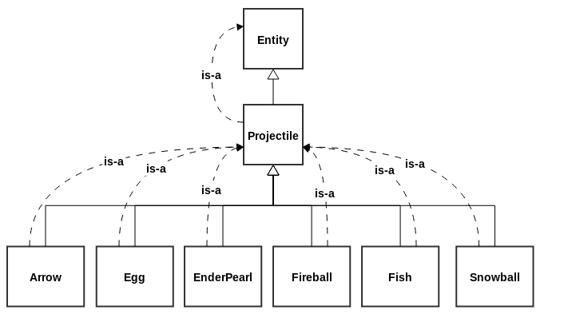

The *Superinterfaces* and *Subinterfaces* are important when browsing the Bukkit API types because they tell us about the type's *Ancestry*. The *ancestry* of a type is important because anything a Type's parent Type can do, the Type can do too. The same goes for the Type's children , they *inherit* the properties and methods of the type. From this you can infer that because the *Projectile* type has a method called *getShooter()*, then the *Arrow*, *Egg* and other other sub-types also have this *getShooter()* method. 

If we look at the *Projectile* type's *parent type* - *Entity*, listed under *All Superinterfaces* - we'll find a treasure trove of useful properties and methods. For example, we can find out where the projectile  is by calling the parent type's *.getLocation()* method. We can also *remove* the projectile by calling the parent type's *.remove()* method. Note that neither the *.getLocation()* method nor the *.remove()* method appear on the information page for the *Projectile* type. You need to click on the Projectile Type's parent link *Entity* to see all these super useful methods. Remember, because Projectile is a *child* or sub-type of the *Entity* type, it *inherits* or has all of these properties and methods too! That's the power of Inheritance in Java and it's useful to keep this rule in mind when browsing the Bukkit API Reference. Anything the *Parent Type* can do, the *Type* can do too! So anything an Entity can do, the Projectile can do too! 

If you browse around the Bukkit API and find a type (like *Projectile*) which only appears to have a handful of methods, look at the ancestry - visit the parent-type links under *extends* or *Superinterface*. If you don't find what you're looking for there, look at the parent type's parent type and so on. There are lots of useful properties and methods in the Bukkit API but it's often a matter of knowing where and how to look for them. Understanding *Inheritance* helps you dig deeper into the Bukkit API Documentation.

### The Code
We're going to put what we learned about inheritance to use in the following code which will add teleporting behavior to arrows fired by the Ender Bow. Launch your programming editor and create a new file called *arrow.js* in the *enderbow* folder you created in the previous chapter, then enter the following code:

@@listing arrow_v1.js Teleporting Arrows

Save the above code then reload the plugins using either `/reload' or '/js refresh()` then with Ender Bow in hand, fire an arrow to teleport! 

Now let's look at the above code in more detail. As in the previous chapter we load the *items* module because it has functions for comparing Minecraft items. Next we declare 2 variables which refer to Bukkit Java classes. I use the same naming convention as in the previous chapter, bkEnchantment is short for org.bukkit.enchantments.Enchantment and bkArrow is short for org.bukkit.entity.Arrow. Having the names begin with 'bk' is a reminder to myself that these are Bukkit classes.

The *onArrowHit()* function is a callback which will be executed by the server whenever a Projectile strikes something. In this function we need to: 

1. Get the event's projectile - the thing which was fired.
2. Get the projectile's shooter - the person or thing which fired the arrow.
3. Get the shooter's item held - the thing the shooter is currently holding.
4. Check if the item held is an Ender Bow and if it is teleport the player.

Like all event-handling callback functions it takes a single parameter: *event*. We know that, because we'll register using the *events.projectileHit()* function, this *event* will be of type *org.bukkit.event.entity.ProjectileHitEvent* and if we browse the online reference at http://jd.bukkit.org/rb/apidocs/ we'll see there's a *.getEntity()* method which returns the *Projectile* for this event. For the rest of this function every piece of information we need can be obtained via the *Projectile* object.

We test to see if the *projectile* variable is of type bkArrow and if it is we return - this function is only concerned with Arrows, not Eggs or Snowballs. 

Next we need to get the shooter - the person (or thing) which fired the arrow. The *.getShooter()* method returns an object of type *ProjectileSource* which is another abstract type - that is - there can be many possible sub-types. If we browse the online reference and look at *org.bukkit.projectiles.ProjectileSource* we see it has many *SubInterfaces* or Sub-types: Player, Animal, BlockProjectileSource etc. We test to see if the *shooter* is a *Player* which is a specific type of *ProjectileSource*. Again, we're only interested in teleporting players. 

Then we get the item currently held by the player by calling the *.getItemInHand()* method. This is yet another example where we need to use Inheritance rules to find out what methods a Player object has. If you look at the online reference for the *org.bukkit.entity.Player* object you will see that the *Player* object itself does not have *.getItemInHand()* method **but** one of its ancestory types does. A *Player* is a sub-type of *HumanEntity* which has a *.getItemInHand()* method. Because there's a *HumanEntity.getItemInHand()* method and *Player* is a sub-type of *HumanEntity*, we can call the *.getItemInHand()* method on Player too! The Inheritance Diagram for the *Player* type below shows just *some* of the player's ancestry:

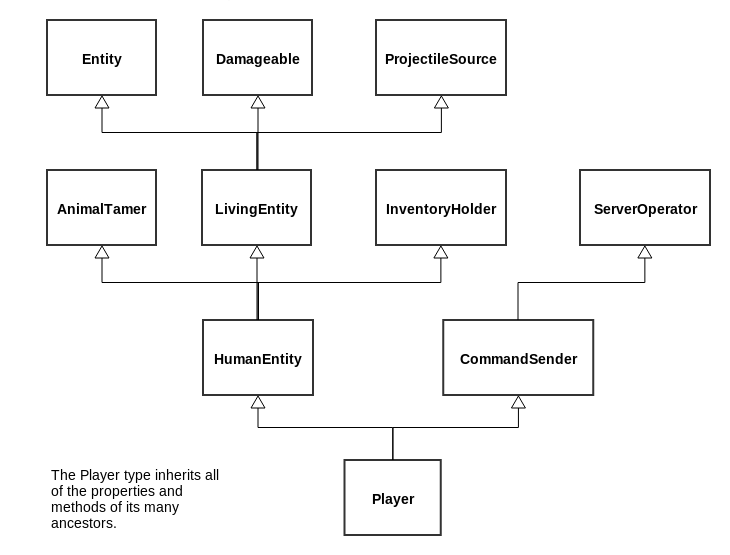

As you can see in the diagram above, each type in Java can have more than one direct ancestor. Every type inherits all of the properties and methods of its ancestry. So a *Player* object can for example use any of the *InventoryHolder* or *Entity* methods. The *Player* type in Minecraft is one of the most versatile object types because of its rich ancestry. 

Once we have the item the player is currently holding we pass it to a function we define called *isEnderBow()* . This function checks to see if the item is of type Bow and if it has a level 3 LUCK enchantment.

Finally, if the item held *is* an Ender Bow, we remove the projectile because we don't want the arrow left behind - it makes sense that an arrow which teleports you should disappear - then we teleport the shooter to the arrow's location.

### More on Types
The *instanceof* operator is an operator common to both Java and Javascript. It's used to test the *Type* of an object. It can be useful when calling the Bukkit API from Javascript when we want to identify the exact type of an object. In listing @@listref{arrow_v1.js} we use the operator to check if the projectile fired was an Arrow. It could be any type of projectile - an Egg, Fireball, Snowball etc - but we're only interested in handling the event if it was an Arrow. The *instanceof* operator will compare the expression on the left to the expression on the right and if they are of the same type will return true. You can test this at the command line:

    /js self instanceof org.bukkit.entity.Horse
    > "false"
    /js self instanceof org.bukkit.entity.Player
    > "true"

The *instanceof* operator lets us test a generic type against a specific type. Note that because of the way Java inheritance works, it's possible for an object to be an instance of more than one type. For example, both of these Javascript expressions will return true:

    /js self instanceof org.bukkit.entity.AnimalTamer
    > "true"
    /js self instanceof org.bukkit.entity.LivingEntity
    > "true"

Since a player is an instance of both types, AnimalTamer and LivingEntity. The *instanceof* operator is most commonly used to narrow down an object to a specific type so that we can be confident that we can call methods for that type without exceptions being thrown. If for example you wanted to be sure that a given object was an actual Player and not just any LivingEntity (all creatures and villagers are also of type LivingEntity) you would do so by testing like so:

    /js self instanceof org.bukkit.entity.Player

The *org.bukkit.entity* package is where you'll find all of the entity types. The *instanceof* operator can be used for testing *any* type of object in Java or Javascript.

### Java Beans
The type of functions we used to get information about the event, projectile and shooter in listing @@listref{arrow_v1.js} are called *getters*. They're called *getters* because they each *get* some property of the object they're called for; `event.getEntity()` gets the event's entity property, `projectile.getShooter()` gets the projectile's shooter property and so on. As you can probably guess there's also a family of functions called *setters* - that is - functions whose job is to *set* the property for an object. For example you can get your current food level using the *.getFoodLevel()* method:

    /js self.getFoodLevel()

... and you can *set* your current food level using the *.setFoodLevel()* method:

    /js self.setFoodLevel(20)

Java classes which use the convention of having *getters* and *setters* methods to get and set properties are knows as **Java Beans**. Javascript enables you to treat getter and setter methods in JavaBeans as equivalent Javascript properties. The name of the property is the name of the JavaBean method without the get or set suffix, and starts with a lowecase letter. For example you can call the getFoodLevel() and setFoodLevel() methods in an org.bukkit.entity.Player object using the foodLevel property as follows:

    /js self.foodLevel
    > "17"

To set the foodLevel property just assign a value to it.

    /js self.foodLevel = 20

This is a nice convenience when writing Javascript code which uses Java Types. Let's revisit the code from earlier, this time using just property names instead of *get()* methods:

@@listing arrow_v2.js Accessing JavaBean properties directly

I personally prefer using just the property names rather than the get and set methods because I think the code is more readable but it's a matter of personal taste. If you feel more comfortable sticking to the Java convention of using the getX() and setX() (where X is some property) when working with Java types from within Javascript, then by all means use those methods. 

### A Note on Style
At the start of this chapter I suggested running the following code and said I'd explain how it works:

    /js function ouch( event ) { event.entity.shooter.sendMessage('ouch!') }
    /js events.projectileHit( ouch );

The *ouch()* function above uses the Java Bean property shorthand notation described previously to get the *entity* property for the *event*, then the *shooter* property for the *entity* then sends a message using the *sendMessage()* method of the *shooter*. The entire function body is just a single Javascript statement:

    event.entity.shooter.sendMessage('ouch!')

I wrote it like this so I could create a short callback function at the in-game prompt. Functions at the in-game prompt are limited to just 100 characters on a single line. If I were writing the function in a module I might be more verbose and write it like this instead:

    function ouch( event ) {
      var entity = event.entity;
      var shooter = entity.shooter;
      shooter.sendMessage('ouch!');
    } 

The one-line version of the code avoids the need to create new variables for the entity and the shooter but is probably more readable - especially for beginning programmers. Once again, whichever style you use is up to you. You should experiment with different styles as you become more adept and comfortable writing Javascript code.

### Summary
In this chapter we completed all of the code needed to add a Teleporting Ender Bow to the game and learned more about Inheritance and how to use it when browsing the Bukkit API reference.

## @@nextChapter{chapter-18}: Protecting your Server against Griefing
### Introduction
One of the great things about running a Bukkit Server instead of the standard Minecraft Server is its customizability and the ability to add plugins. On a public non-whitelisted server where anyone can connect and play, one of the first things a Server Administrator will want to do is protect against griefing or wanton destruction. In this chapter I'll show you how to prevent players from destroying property and how to prevent them from placing destructive blocks such as TNT and Lava. 

### Simple Protection
The easiest way to prevent griefing is to prevent all players from breaking any blocks at all. This isn't very practical since breaking blocks and placing blocks is part of the process of building in Minecraft. The following code shows how to prevent any blocks from being broken:

    /js function cancel( event ){ event.cancelled = true; }
    /js var dontBreak = events.blockBreak( cancel );

### Canceling Events
If you run the above code then any attempt to break a block in the game will fail. The block will reappear just as it was about to be broken. This is because of the statement:

    event.cancelled = true;

This statement cancels the event preventing the normal procedure for breaking blocks from occurring. It was as if the block was never broken. Not all types of events can be canceled but most can. You can see a list of all of the types of events which can be cancelled at http://jd.bukkit.org/rb/apidocs/org/bukkit/event/Cancellable.html under the heading *All Known Implementing Classes*. 

Another type of Griefing is when players place blocks where they shouldn't - for example, filling up another player's house with brick or other materials. You can also prevent all blocks being placed using the same *cancel()* function defined above:

    /js var dontPlace = events.blockPlace( cancel );

If you run the above code then try to place any block, the block you try to place will disappear. This *cancel()* event handler isn't very practical but it does illustrate an important property of many types of events - they can be cancelled. 

### How to stop listening for events.
You'll notice that I stored the return value from  *events.blockBreak()* and *events.blockPlace()* in variables in the previous examples. When you call any of the *events* module functions, an object is returned. This object can be used to *unregister* the events listener. If you want listen for events only for a short while and then stop or stop listening when a condition occurs you can do so in one of two ways. You can call the *unregister()* method on the object returned by any of the *events* functions:

    var dontBreak = events.blockBreak( cancel );
    ... 
    dontBreak.unregister();

... or you can unregister from within the event handling function itself:

    var protectBlocks = 5;
    function cancel( event ) {
       if (protecBlocks > 0) { 
          protectBlocks = protectBlocks - 1;
          event.cancelled = true;
       } else {
          this.unregister();
       }
    }
    events.blockBreak( cancel );

In the above code the *cancel()* function will only cancel 5 block-break events and then will unregister() itself. By unregistering, the function is telling the server not to call it any more when a block-break event occurs. 
    
### Prohibiting TNT 
Prohibiting the placement of all blocks in the game wouldn't make for a very fun Minecraft experience. We can adapt the code used earlier to provide a very simple plugin which prevents anyone except operators from placing TNT. In your programming editor, create a new sub-folder in the *plugins/scriptcraft/plugins* called *protection* and in that folder create a new file called *no-tnt.js*, then type in the following code:

@@listing no-tnt_v1.js Preventing Placement of TNT

You can test this code by reloading the plugins using the */reload* or */js refresh()* commands. You'll also need to use the */deop* command to temporarily remove your operator privileges so you can verify that trying to place TNT when you're not an operator is impossible. You can re-enable your operator privileges later by running the *op* command at the server console prompt. With TNT in hand, try to place a block of TNT anywhere and the TNT will appear very briefly before disappearing. 

In listing @@listref{no-tnt_v1.js} we declare a new function called *noTNT* which will be called whenever a player tries to place a block in the game. The first thing the *noTNT()* function does is get the material which was placed. It gets this via the event's *blockPlaced* property. Remember from the previous chapter that properties of Java objects can be gotten either via their Java-style *get* methods - in this case the *.getBlockPlaced()* method - or using the property's name. As we learned in chapter @@chapter{chapter-17}, we can infer by the Java Bean rules that if there's a *.getBlockPlaced()* method of the *org.bukkit.event.block.BlockPlaceEvent* class (see http://jd.bukkit.org/rb/apidocs/org/bukkit/event/block/BlockPlaceEvent.html ) then there must be a property called *blockPlaced* which is of type *org.bukkit.block.Block* (see http://jd.bukkit.org/rb/apidocs/org/bukkit/block/Block.html). We can follow the same rule for the *blockPlaced* object and infer that since there's a *.getType()* method, there must be a *type* property which is the Material the block is made from. We could have written:

    var material = event.getBlockPlaced().getType();

... but Javascript lets us use the Java Bean properties without calling the getter methods:

    var material = event.blockPlaced.type;

Next we check to see if the player who placed the block is an operator. The Java Bean rules for boolean properties are slightly different. In the Player Inheritance Diagram in chapter @@chapter{chapter-17} you can see that a Player is a descendant of the ServerOperator type so it inherits all of its properties and methods. If you look at the Java Documentation for the ServerOperator type at http://jd.bukkit.org/rb/apidocs/org/bukkit/permissions/ServerOperator.html There are just 2 methods:

    boolean isOp()
    void setOp(boolean value)

The *isOp()* function returns true if the sub-type is an operator (A player with administrative privileges or the Console Operator). The *setOp()* function is used to turn on or off operator privileges for the sub-type. The *isOp()* and *setOp()* pair of functions both conform to the JavaBean standard for setting and getting properties. For boolean properties, there must be an *isX()* function where *X* is some property. So we can infer that because there's an *isOp()* and *setOp()* function, there must be an *op* property which we can access directly in Javascript. The expression:

    player.op

...evaluates to `true` if the player is an operator or `false` if they are not. If the player *is* an operator then we don't want to interfere with the normal course of events for placing blocks - that is - we don't want to prohibit operators from placing blocks. 

Finally We use the *items* module's *tnt()* function, passing the material as a parameter to test if the material is TNT. If it is then we cancel the event.

### Prohibiting Lava
The procedure for prevent the placement of Lava is slightly different but the principle is the same. We cancel the event if the event involves emptying Lava into the world. Lava is not a material that can be held in a player's hand, instead it's carried in a bucket and emptied from the bucket. The event we want to listen for is not the placement of blocks but the emptying of buckets. In your editor create a new file called *no-lava.js* and place it in the *plugins/scriptcraft/plugins/protection* folder and type the following code:

@@listing no-lava_v1.js Preventing placement of Lava

The code is very similar to the TNT-prohibiting code. We just listen for the Bucket Empty event instead of the Block Place event. You'll find a table of *events* functions and their corresponding event types in the appendices at the back of the book.

### Player Plots
Preventing the placement of TNT and Lava goes some way towards creating a safe server for players to create and collaborate. As the earlier examples demonstrated, in creating a safe environment where no griefing is possible, we can easily go too far and prevent any player from placing or removing blocks. What we want instead is to make it possible to create *Plots* where players can build and collaborate with other trusted players without fear of griefing by non-trusted players. 

In the following sections of this chapter we'll develop a set of functions that will enable operators to construct a *Safe Zone* where no one except operators can place or break blocks. Within this *Safe Zone* there will be *Plots* - small tracts of land - which can be claimed by a player and once claimed can be built on. Each *Plot* will have a surrounding path so players can amble around and between plots. We'll also need to provide some way for players to *claim* a plot of land and we'll need to keep a *registry* of players and their plots. We'll make it so players can only claim one plot.

### Safe Zones
The first step in creating a safe server is adding the ability to create Safe Zones. Outside of these safe zones it should be possible for any player to place and break blocks but inside the safe zones, only operators should be able to do so. We'll define a Safe Zone as an area of width and length and which - for the sake of simplicity - extends indefinitely up and down along the Z axis. So a Zone can be defined using just 2 points in 3D space - the bottom left corner and the top right corner.

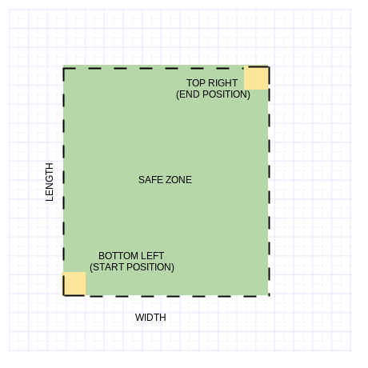

A Safe Zone starts at a location in the world and extends along the X axis and Y axis so a Zone will have a start location and an extent - how far away it extends. We'll need to use this information when testing if a broken or placed block is within the Zone. We need 3 different components to manage safe zones:

1. A module which will be responsible for creating zones, storing zones (persistence) and checking if a given block or location is within a safe zone.
2. A way to easily create safe zones - We'll add a new extension to the Drone object discussed in chapter @@chapter{chapter-12} to let us create zones without needing to work directly with Locations.
3. A few event listeners to prohibit block placement and breaking in safe zones.

The first step is to create a shared module which will be used in steps 2 and 3 above. Open your editor and create a new folder called *protection* in the *plugins/scriptcraft/modules* folder. Create a new file called *zones.js* and enter the following code:

@@listing zones_v1.js Safe Zone Management Module

This module lets us add zones which will be loaded at start-up (or when the module is first used) and saved automatically when the server is shut down. Persistence is definitely something we want for safe zones - we want them to last. The module's *add()* function takes 2 parameters both of them of type *org.bukkit.Location* and stores their 2-dimensional coordinates (the x and x properties). An additional function *getBoundingZones()* will return a list of encompassing zones for a given location. Zones can overlap so it's possible that a Location can be in more than one safe zone.

Next up we'll create a new Drone extension called *zonemaker()* . In your editor switch to the *plugins/scriptcraft/plugins* folder and create another sub-folder called *protection*, then create a new file called *zonemaker.js* and enter the following code:

@@listing zonemaker.js A Drone-based Zone Creator

As we saw in chapter @@chapter{chapter-12} it's possible to extend the Drone object to build whatever you want. In this case we want to be able to construct a bounding box in which no one except operators may place or break blocks. In addition to constructing a bounding box of whatever material you choose, the *zonemaker()* function also gets the Drone's starting location and the farthest corner location and calls the *zones.add()* function to add a new safe zone. Once you've saved this file (and the *zones.js* file), you can test it by reloading your plugins (using the */reload* command) and then at the in-game prompt, point at the ground and type the following command:

    /js zonemaker( blocks.brick.chiseled, 20 , 20 )

A bounding box similar to that shown in the screenshot below should appear.

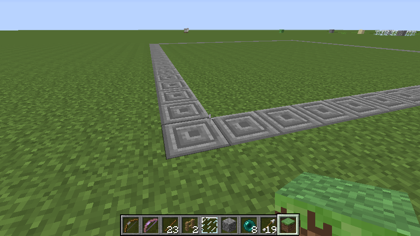

Right now you can still break and place blocks within the area. The next step to 'securing' the Safe Zone is to add event handlers which will prohibit placement and breaking of blocks. In your editor create a new file called *events.js* in the *plugins/scriptcraft/plugins/protection/* folder and enter the following code:

@@listing events_v1.js Event-handling for Protection

In the above code we listen for two events and cancel the events if the block being placed or broken is within a safe zone. If the player is an operator we return immediately as operators should be able to place and break blocks. Save these files then reload your plugins using the */reload* command, then temporarily */deop* yourself and try to place or break blocks in the safe zone you created earlier. You should not be able to do so. Once you're satisfied you can't break blocks as a non-operator player, re-enable your operator privileges by issuing the */op* command at the server console command prompt.

So far we have a way to create *Safe Zones* where non-operators can't break or place blocks. What we need to do next is provide a way to create *Player Plots* within this *Safe Zone* where players - once they've claimed a plot - can build.

### Refactoring
Before we get into the mechanics of creating, claiming and sharing player plots let's think about what a Player Plot is and how it's similar to something we've already created - Safe Zones. A Zone and a Plot are both *Regions* within the world where certain rules apply. A Region has a starting point and extends in two directions (along the X axis and the Z axis). So Zones and Plots are really just parcels (or *Regions*) of land. For any block placed or broken we'll want to test to see if the block is within a given region. There's going to be much in common between Zones and Plots so let's *refactor* the code we've alread written. *Refactoring* is the process of changing code you've already written so that it can be made more reusable. The goal of refactoring is to improve the code so we don't write the same code over and over. What we're going to do is take some of the code from the *zones.js* module we created earlier and move it into a new more reusable module called *region.js*. In your editor create a new file called *region.js* in the *plugins/scriptcraft/modules/protection/* folder and edit the file so it resembles the code in the listing below. 

You'll notice the *create()* function is *very* similar to the *addZone()* function from the *zones.js* module. That's because it is the same except the statement `store.push(result);` from the *addZones()* function is not present in the *create()* function. If you want to take a shortcut, I recommend copying and pasting the body of the *addZone()* function into the *copy()* function then removing the `store.push(result);` line from the *create()* function:

@@listing region.js Region Management Module

The *contains()* function can be copied directly from the *zones.js* file into the *region.js* file and requires no changes. Once you've saved changes to the *region.js* file edit your *zones.js* file so it looks like the listing below:

@@listing zones_v2.js Zones using Regions

The *addZone()* function is greatly simplified and the *getBoundingZones()* function has changed slightly. The statement:

    if ( contains(zone, location) ){
      result.push(zone);
    }

... changes to ...

    if ( region.contains(zone, location) ){
      result.push(zone);
    }

...since the *contains()* function now lives in the *regions* module. Now that we've completed the refactoring we're ready to begin working on Player Plots. There are a couple of things we'll want to be able to do with Player Plots:

* Operators will want to be able to *Create* Plots.
* Players will want to be able to *Claim* Plots.
* Players will want to be able to *Share* Plots with other trusted players.
* Players will want to be able to *Abandon* their claim to a plot.

Before we look at *Creating* plots, we'll need to create a *plots* module which will support each of these operations. In your programming editor, create a new file called *plots.js* in the *plugins/scriptcraft/modules/protection/* folder and enter the following code:

@@listing plots_v1.js Plot Management Module

So far the plots module looks very like the zones module. When we add a plot though there are 3 extra properties we want to store:

1. The plot's number ( the *.number* property ) The plot number is incremented (increased by 1) every time a new plot is added. The *.plotCounter* property of the store is persisted so that even across server restarts, each plot is guaranteed to have a unique number.
2. The name of the player who has claimed the plot ( the *.claimedBy* property). 
3. The list of players the plot is shared with (the *.sharedWith* property). We want players to be able to collaborate with other trusted players so they can build on the same plot.

Now let's flesh out the *plots* module some more by adding functions for claiming plots. Add the following code to your *plots.js* file:

@@listing plots-claims_v1.js Claiming Plots

### Creating Plots
We're starting to put in place, functions which will be used by operators and players to add and claim plots. The next step is to extend the *Drone* module yet again, this time adding a *plotmaker()* function which operators will use to create plots which players can later claim. In your editor, create a new file called *plotmaker.js* in the *plugins/scriptcraft/plugins/protection/* folder and add the following code:

@@listing plotmaker_v1.js Creating Plots

Once you've saved this file and reloaded your plugins using the */reload* command, you can create a plot using the following command (target a block at ground level first):

    /js plotmaker( blocks.brick.red, 10, 10)

A new plot outline will be created and a sign will appear with instructions for players. 

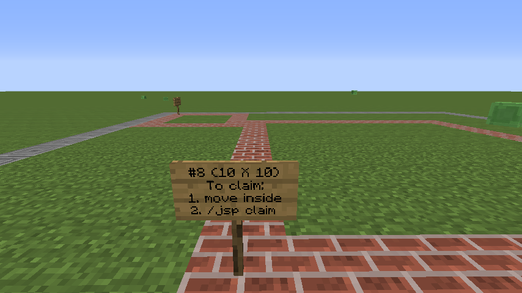

### Claiming Plots
Right now the instructions which appear on the sign (move inside the plot area and issue the */jsp claim* command) don't work. The next step is to provide a */jsp claim* command for players to claim plots in which they are standing. In your editor, create a new file called *claim.js* in the *plugins/scriptcraft/plugins/protection/* folder and enter the following code:

@@listing claim_v1.js The /jsp claim Command

Save the above code then reload your plugins using the */reload* command. 

### Preventing Griefing on Plots
When a player successfully claims a plot of land, they're sent a message of congratulations and a firework launches at their location. We're nearly there. Now all we need to do is update the *events.js* file in the *plugins/scriptcraft/plugins/protection/* folder so that it checks to see if the player is in a plot and owns it. Change the events.js file so it matches the following code:

@@listing events_v2.js Event-handling for Plots

Now we check to see if the block being placed or broken is in a player plot and if it the plot is owned by the player - if it is, then the event proceeds as normal. If the block is within a region and that region is not owned by the player then they cannot place or break and the event is cancelled.

So now we have a basic working protected server where operators can create safe zones and within those zones (or even outside them) create safe plots of land for claiming by players. Players build uninhibited in unsafe zones or off-plot but must claim a plot of land if they want to build without worrying about griefing. 

### Abandoning Plots
The next step is to provide a way for players to *abandon* their plots so they can claim new ones. We'll do this by providing yet another new command */jsp abandon* which will cause the player who issues the command to give up any claim they have on a plot so they are free to claim a new one. Open the *claim.js* file from earlier and add the following additional code:

@@listing claim-abandon.js The /jsp abandon Command

Now reload your plugins using the */reload* command and your players are now upwardly mobile and can move from plot to plot as different plots become available!

### Sharing Plots
We're almost there. We have one last feature to add to this protection plugin. We'd like players to be able to choose collaborators who are allowed build on their plots. To do this we need to:

1. Add a new */jsp share* command which will let players choose one or more trusted players.
2. Adjust the event-handling rules for block breaking and block placement to accomodate players who don't own a plot but who are trusted.

Let's start with the new */jsp share* comand. Open your *claim.js* file and update it adding the following code:

@@listing claim-share.js The /jsp share Command

Save the *claim.js* file and then reload your plugins and you can now share your plot with others by issuing the command:

    /jsp share [TAB]

If you hit the TAB key after typing '/jsp share ' (that's share followed by a SPACE), you'll notice that a list of player names will show up as possible completions for the command.

### Dynamic command options
We already covered the topic of the *command()* function, how it can be used to add new custom commands for players to use and how it can be provided a list of possible options for TAB completion. The *command()* function can take either a static list of options (as we saw previously with the *icecream* and *chatcolor* examples in chapter @@chapter{chapter-15}) or it can take another *function* as a parameter. If the *options* parameter is a list, then that list will be used for TAB completion. If the *options* parameter is a *function* then the function will be executed and should return a list of strings to be used for TAB completion. In listing @@listref{claim-share.js} we pass the *bukkit.playerNames* function as the 2nd parameter to *command()*. This means that the *bukkit.playerNames()* function will be invoked whenever a player issues the */jsp share* command and presses SPACE followed by TAB. If you don't know ahead of time what the possible options for your custom command will be then providing a function which will return a list of possible options when the player issues the command is the way to go. In the example above, we won't know what players are online at the time the command is issued so providing a static list of player names would not work. That's why we pass the *bukkit.playerNames* function as the 2nd parameter.

### Updating event-handling to accomodate trusted players.
Next we must update our event-handling code related to protection. We want to allow players to place or break blocks if they are within a plot and they are in the plot's *.sharedWith* list. Open the *events.js* file in the *plugins/scriptcraft/plugins/protection/* folder and update it as below:

@@listing events_v3.js Event-handling for Trusted Players

There's a new *playerIsTrusted()* function in this revision of the *events.js* file. This function returns true if the player is trusted to work on the plot. There's 2 interesting things to note in this function. The first is how we use the player's name to test if they are in the *sharedWith* list. 

#### Java Strings and Javascript Strings
The String type in Javascript and the String type in Java - they both share the same name - are slightly different so there are some things you can do with a Javascript string which you can't do with a Java string and vice versa. When comparing two strings - one of them a Javascript String and the other a Java String it's safest to convert the Java String to a Javascript string. The easiest way to convert a Java String to a Javascript string is to prepend an empty Javascript string to the front of the Java String like this:

    var jsString = '' + javaString;

This is what we do in the first statement of the *playerIsTrusted()* function:

    var playerName = '' + player.name;

... declares and assigns a new Javascript variable the value of player.name. The *player* variable is a Java object so it follows that all of its String properties are *Java* Strings. Unfortunately, different versions of the Javascript engine provided with Java on different platforms each behave slightly differently when comparing Java Strings to Javascript Strings so the only way to be sure is to convert a Java String to a Javascript string if you want to compare it with another Javascript string using the `==` operator or if you want to use it with standard Javascript string-based operations.

#### Loops within Loops
The second thing to note about about the *playerIsTrusted()* function is its use of nested loops. A nested loop is a loop within a loop. In this case we loop through all of the plots and for each plot we loop through all of the plot's trusted players:

    for (var i = 0;i < boundingPlots.length; i++){
      var plot = boundingPlots[i];
      var sharedWith = plot.sharedWith;
      if (!sharedWith ) {
        continue;
      }
      for (var j = 0; j < sharedWith.length; j++){
        if (sharedWith[j] == playerName){
          return true;
        }
      }
    }

In the inner-most loop we use a different looping variable to the outer-most loop. The outer-most loop uses the *i* variable as an index and counter while the inner-most loop uses the *j* variable. This is very important. When you have nested loops you must be very careful not to reuse the outermost loop's index variable in the innermost loop. This is a very common mistake and one which I made myself while writing this code.

It's possible to have any number of nested loops but if you find yourself writing a function which has many nested loops you should consider refactoring the function so it is easier to read and understand.

### Summary
In this chapter we walked through step by step the process of adding protection to our server. You can see from the amount of code and number of files we used that protecting servers is no easy task! However if you tackle the problem by breaking it down into smaller problems and solving each of these in turn, it becomes easier. Programming is an iterative process - we write some code, test it, make changes as we go, and gradually improve the code adding new features piece by piece until it does what we want. Throughout this chapter we revisited code we had written earlier, making gradual improvements and additions each time. This is how programming is typically done. Even the best programmers in the world don't arrive at a perfect solution first time!

While not a comprehensive protection plugin, the code we created in this chapter provides a good basis for a more fully-functional protected server plugin. There are a couple of outstanding features we'd need to address to make this plugin better, like what should happen to plots once they're abandoned? Right now there's no way for a player to tell if a plot which has buildings has been abandoned or not. Ideally there should be a sign put in place 'This plot is available' when plots have been abandoned.  That's just one of many possible improvements, I'm sure you can think of more!

## @@nextChapter{chapter-19}: Snowball Fight!
### Introduction
In this chapter we're going to create a Player vs. Player mini-game called Snowball Fight. The aim of the game is to hit your opponents with snowballs as many times as possible while avoiding being hit yoursel or hitting players on your own team. The game will be playable in either Team mode where players can form opposing teams or free-for-all mode where every player must hit other players.

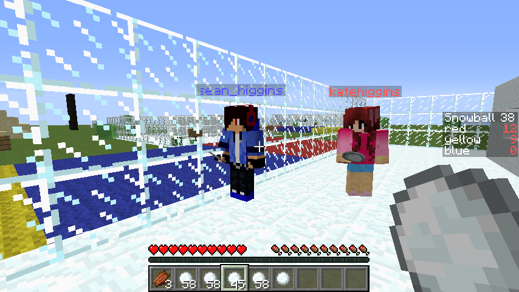

The game will be kept simple for the sake of providing example code which you might want to adapt and extend to create your own mini-game. 

The game will be started using a Javascript function and its duration and team structure will be passed as paramters. If no parameters are passed then the default game duration will be 60 seconds and the game will be in free-for-all mode - all players against each other.

First I'll present the game in a single Javascript module with a function which operators will use to start the game and later in this chapter we'll cover how players can start the game using in-game mechanisms. We'll also cover how to create an Arena for the game to be played in and a command for use by players to start the game.

### Game Rules
Before we begin coding let's lay down some of the rules of the Snowball Fight mini-game.

1. Players will each be allocated a number of snowballs when the game begins.
2. Each player will be a member of a team. There can be up to 3 teams: red, blue and yellow. Each player's name appears in the color of their team. 
3. Players gain a point if they hit an opponent.
4. Players lose a point if they hit a member of their own team.
5. When the game starts, players will enter Survival Mode. This is crucial to how the game works. When a player is hit by a snowball we need to be able to update the score. In creative mode, there's no way to listen for this event. 
6. When the game ends, players will return to the Game Mode they were in before the game started.
7. A scoreboard of players and their scores will be displayed during the game.
8. A count-down timer (in seconds) will be displayed at the top of the scoreboard.
9. At the end of the game, the scoreboard will remain on-screen for a few seconds so players can see the final score for each team/player.

### Logistics
For the game to work, players should be in close proximity to one another. Later in the chapter we'll construct a special arena for the game to make it more fun. Much of the fun of Minecraft mini-games comes from the anticipation of the game and the ceremony surrounding it. For example, many player vs. player mini-games have a holding area where players wait to jump into the mini-game or choose teams to participate in prior to the game starting. The mechanism for starting a game can vary from mini-game to mini-game. Initially we'll keep things simple - only the operator may start a Snowball Fight mini-game using the */js SnowballFight()* command. 

### Keeping Score
In chapter @@chapter{leaderboard1} we used a Javascript array to create a simple leaderboard which sorted players by how many times they had jumped. Minecraft has some built-in commmands which let you easily create and display an in-game translucent side-bar with a leaderboard or *scoreboard* of players. 

#### The /scoreboard command
The */scoreboard* command provides a neat way to specify what should be displayed in the in-game list view , side-bar view and also what can be displayed above player's heads. For example, revisiting the leaderboard code from the earlier chapter, we could display the same leaderboard using the following built-in commands in Minecraft:

    /scoreboard objectives add Jumping stat.jump
    /scoreboard objectives setdisplay sidebar Jumping

Notice that once you've run these commands, whenever you or any other player on the server jumps, the scoreboard is updated. 

This is a really nice feature and one we'll definitely want to use in our Snowball game. 

#### Executing commands from Javascript
It's possible to execute any built-in command from Javascript using the *server.dispatchCommand()* method. To execute the scoreboard commands already mentioned you'd use the following code:

    server.dispatchCommand(server.consoleSender, 'scoreboard objectives add Jumping stat.jump');
    server.dispatchCommand(server.consoleSender, 'scoreboard objectives setdisplay sidebar Jumping');

The *server.dispatchCommand()* method is really useful when you want to call built-in commands or commands provided by other plugins from Javascript. The appendices include more information on using other plugins from with Javascript.

#### The main scoreboard
The problem with using the */scoreboard* command is that it updates Minecraft's *main* scoreboard. That means that the scoreboard is changed for *all* players connected to the server. In a mini-game where only some of the players may be playing we don't want to update the scoreboard for *all* players, only those players who are playing the mini-game. 

#### The Scoreboard API
Fortunately Bukkit includes a set of Java classes for working with Scoreboards. As well as using Minecraft's *main* scoreboard, you can construct completely new scoreboards for use by only a select few players. This is what we'll do in the Snowball Fight mini-game since only those players who are in the mini-game will be interested in the leaderboard. The Bukkit *org.bukkit.scoreboard.ScoreboardManager* class has 2 methods:

    Scoreboard getMainScoreboard() Gets the primary Scoreboard controlled by the server.
    Scoreboard getNewScoreboard() Gets a new Scoreboard to be tracked by the server.

We'll use the *getNewScoreboard()* method to obtain a new scoreboard which will be used exclusively by the mini-game. 

### The game source code
We have a lot of ground to cover so let's dive right in and write the core game code. In your editor create a new folder called *snowball* in the *plugins/scriptcraft/plugins/* folder. Inside the *snowball* folder, create a new file called *game.js* and enter the following code:

@@listing game.js Snowball Fight core game source

### Running the game
Once you've saved the file, reload your plugins using the */reload* or */js refresh()* command and then with 2 or more Players connected to the server issue the following command:

    /js SnowballFight()

The game should begin. Each player is allocated a number of snowballs and as soon any player strikes another with a snowball, the scoreboard is updated. Every participant in the mini-game can see the scoreboard. The game will continue for 60 seconds. At the end of the game, the scoreboard remains for a couple of seconds so the victors can savour the moment. 

### Allocating Teams
The mini-game is created using the *SnowballFight()* function which takes 2 parameters: duration and teams. If neither a duration nor teams parameter is provided then the default values are 60 seconds for the duration and a set of teams comprised of all of the players on the server. The following section of code in the *SnowballFight()* function:

    if ( typeof teams == 'undefined' ) {
      teams =  {};
      players = server.onlinePlayers;
      var teamNames = ['red','blue','yellow'];
      var playerCount = players.length;
      for ( i = 0; i < playerCount; i++ ) {
        var playerName = players[i].name;
        teamName = teamNames[ i % playerCount ];
        teams[ teamName ] = [playerName];
      }
    }

...creates a set of up to 3 teams and each player is allocated to a team in turn. If you had 8 players online when the game started, the *teams* object might look something like this:

    { 
       red: ['sean', 'moe', 'curly'],
       blue: ['walter', 'larry', 'oliver'],
       yellow: ['john', 'paul']
    }

In this game there should ideally only be up to 3 teams where each team name is one of the following 3 colors: red, blue, yellow. Try to avoid having green and red teams because the colors can be difficult to tell apart for some players. Each player's name will appear in the color of their team to make it easier for players to tell who is an opponent and who is on the same team. Next we create a variable called *game* which will be used to store the state of the game and will be passed to other functions in the module.

### The game loop
The *loop()* function is called once every second using the *setTimeout()* function and subtracts 1 from the game's duration counter, updates the scoreboard and schedules another call to itself in 1 second. If the game's duration counter is 0 it means that time has run out and the game is over in which case the *end()* funciton is called. 

### Scope and functions
You might be wondering why the *loop()* function is declared inside of the *SnowballFight()* function. The *loop()* function must be declared inside of the *SnowballFight()* function because it needs to use the *game* variable. Because both the *game* variable and the *loop()* function are declared inside of the *SnowballFight()* function, the *loop()* function can *see* the *game* variable. If the *loop()* function was declared *outside* the *SnowballFight()* function, it would not be able to see the *game* variable because variables are *private* to the function in which they're declared. Normally we'd declare the function outside of the *SnowballFight()* function and pass the *game* variable as a parameter, except we schedule the call to *loop()* using a *setTimeout()* call. There are actually a couple of ways to handle scope and functions in Javascript but I think declaring the *loop()* function inside the *SnowballFight()* function so it can see and work with the *game* variable is the simplest.

### Listening for snowball hits
Next we declare a new Event-handling function called *onSnowballHit()* which will be called every time an entity damages another entity. The peculiarly named *events.entityDamageByEntity()* function can be used to listen for damage caused to living things in the game. In our case, we're only concerned with damage caused by snowballs thrown by mini-game participants. The *getPlayerTeam()* function will return the team a player belongs to. If the thrower and damaged player are on different teams then the thrower's team score is increased, otherwise it's decreased.

    if ( throwerTeam != damagedTeam ) {
      game.teamScores[ throwerTeam ]++;
    } else {
      game.teamScores[ throwerTeam ]--;
    }

### Starting the game
The main part of the *SnowBallFight()* function is at the end. The following 3 lines of code are responsible for starting the game, listening for events and starting the game's loop.

    start( game );
    game.eventListener = events.entityDamageByEntity( onSnowballHit );
    setTimeout(loop, 1000);

The *start()* function is responsible for initializing the game's scoreboard and team scores, storing each player's current game mode so it can be restored after the game, setting the player's game mode to SURVIVAL, and giving each player snowballs to throw. At the time of writing there was a problem with Scoreboards which made it necessary to first set each team's score to -1, update the scoreboard, then set each team's score to 0 and update again to force the scoreboard to display all teams' scores at the start of the game. Withouth this workaround, team scores only appeared when the team scored a point.

### Initializing and updating the Scoreboard
The first group of statements in the *start()* function use Bukkit's Scoreboard API to initialize the mini-game's Scoreboard:

    var bkScoreboard = server.scoreboardManager.getNewScoreboard();
    var bkObjective = bkScoreboard.registerNewObjective('win','dummy');
    bkObjective.displayName = ('Snowball ' + game.duration).underline().bold();
    bkObjective.displaySlot = bkDisplaySlot.SIDEBAR;
    game.objective = bkObjective;

Each Scoreboard object can have one or more objectives and each objective can be linked to a different *Display Slot*. There are 3 different display slots: BELOW\_NAME, SIDEBAR, and PLAYER\_LIST. In our game we use the SIDEBAR slot as it provides a nice leaderboard view which is always visible at the side of the screen. 

### Who's playing?
The next step in starting the game is to loop over all of the teams in the game and for each team, create a *org.bukkit.scoreboard.Team* object which is used to display each player's name in their team colors, then for each player in each team, save the player's game mode, and add the player to the *Team* object. The following lines of code:

    bkTeam = scoreboard.registerNewTeam( teamName );
    bkTeam.prefix = textcolors.colorize(teamName, '');

Construct a new Team object and set the team's *prefix*. The *prefix* is a special string which is placed in front of each player's name in the game. In chapter @@chapter{chapter-15} we created a *textcolor* module for changing chat message colors and here we re-use that module to change the color of the player's name as it appears above their head. When we call *textcolors.colorize('gold','')* it returns a special string which is empty except for the color-code used by minecraft. If this special string is placed in front of a chat message or used as a team prefix it will change the color of the message or team member name.

### Displaying the Score
The *updateScoreboard()* function is called twice at the start of the game because each score must first be set to -1 then 0 for the scoreboard to be refreshed. It's also called from within the *loop()* function every second of the game.

### Ending the game
The *end()* function is responsible for ending the game and ensuring that each player's game mode is restored. Any snowballs which were given to the player at game start are taken away. The event listener is unregistered and finally, after an interval of a few seconds the scoreboard disappears and the main scoreboard is restored for each player.

### Creating an Arena
So far we've created a single Javascript function for use by operators to start a new Snowball Fight game. The game works but could be made much more fun by constructing an arena to play in and making it fun and easy for players to join and start and game and choose a team. Let's use the Drone (again) to construct a simple 24 by 24 block arena of snow with some walls to make an interesting place to play the game. The Arena will have a glass wall so spectators can watch and will have 3 large colored waiting areas outside the walled arena where players can choose their team simply by waiting in one of the 3 colored zones. The entire arena and waiting areas will be protected from griefing using the *zonemaker()* and *region* functions we developed in chapter @@chapter{chapter-18} so if you haven't already added the protection modules from that chapter, I recommend doing so now.

Later on we'll add the ability for any player waiting in a colored zone can start the game using the `/jsp snowball` command which we'll develop later. First let's write the code to build an arena. In the *snowball* folder create a new file called *arena.js* and enter the following code:

@@listing arena.js plugins/snowball/arena.js Constructing an Snowball Fight Arena

The *snowballArena()* function is a new Drone extension and is meant for use by operators to create an arena for play. Operators can use this function as they would use any Drone function. In the game (with operator privileges) target a block at ground level and issue the following command:

    /js snowballArena();

An arena should appear shortly. The arena looks like this from above (plan view):

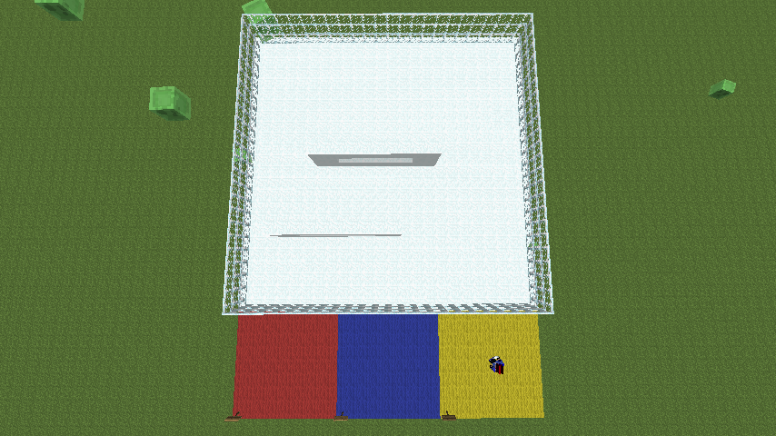

Unlike other Drone functions we've created, we want to save some information about the newly-created arena for later (so when we develop the */jsp snowball* command we can tell which players are on each team using the player's starting zone). We used the *persist()* function we first learnt about in chapter @@chapter{chapter-15} to load and automatically save the arena data. I recommend issuing the */js refresh()* statement after you create each snowball arena so that the arena data is saved immediately.

In each of the colored zones is a sign with instructions for players who want to play. The instructions read:

    Snowball Fight
    In color area:
    /jsp snowball

These signs are created using the Drone's *sign()* function which makes it easy to produce sign posts or hanging signs with messages. 

#### Protecting the arena
The arena is protected using the *zonemaker()* function which takes 3 parameters: A material, width and length. If no material is provided then the zone will be protected but no border blocks are laid down. For this arena, we only want to protect it, and don't need to lay down a border so we call it like this:

    this.zonemaker( null, 24, 32 );

When null is passed instead of a material, no border is built but the area is protected from block-break and block-place events by non-operators.

### Making it easy for players to start the game
Having created the core game code and an arena in which to play the game, the next step is to add some simple mechanics for starting and stopping the game, and choosing teams. The Drone's *snowballArena()* function creates not just the arena in which the game is played but a waiting zone outside the arena which is divided into 3 colored areas - one for each team. Players who wish to play the game simply move into one of the 3 colored areas - the area they choose is important because this will be the team they belong to once the game begins. 

Any one of the players in a waiting area can choose to start the game when other players are on at least one other color area by issuing the following command:

    /jsp snowball

Let's complete the game by writing the code which will handle this command. In the *snowball* folder, create a new file called *command.js* and enter the following code:

@@listing command.js command.js A New Command /jsp snowball

This module also uses the *protection/region* module we developed in chapter @@chapter{chapter-18} as well as the *game* module we developed earlier in this chapter.

#### Where is the player?
The first thing the *snowball* command does is check the location of the player who invoked the command. If the player who issues the */jsp snowball* command isn't on one of the 3 colored waiting areas then the game won't begin (we don't want just anyone starting a game - only those who want to play the game should be able to start it). We use the *region.contains()* function from chapter @@chapter{chapter-18} to see if the player is located in one of the 3 color waiting areas. 

#### Who wants to play?
If the player *is* in one of the waiting areas we keep a reference to the waiting area's *arena*. We then loop over *all* of the players on the server and if any player is in one of the *arenas* color zones we add them to the appropriate team:

    for (i = 0;i < allPlayers.length; i++) {

      participant = allPlayers[i];
      var loc = participant.location;
      isParticipant = false;
      
      if (region.contains( arena.redZone, loc) ){
        teams.red.push(''+participant.name);
        spawn = arena.redSpawn;
        isParticipant = true;
      } 
      ...
      if (isParticipant){
        pregameLocs.push({
	  player: participant, 
	  location: loc
        });
        gameLocs.push({
	  player: participant,
	  location: new bkLocation( loc.world, spawn.x, spawn.y, spawn.z)
        });
      }
    }

The *pregameLocs* array is a list of players and their locations just before the game begins. We need to keep a list of such locations because we'll teleport the players inside the arena when the game begins and would like to return each player to their original location when the game ends. Each arena also has 3 spawn points where players will be teleported when the game begins. 

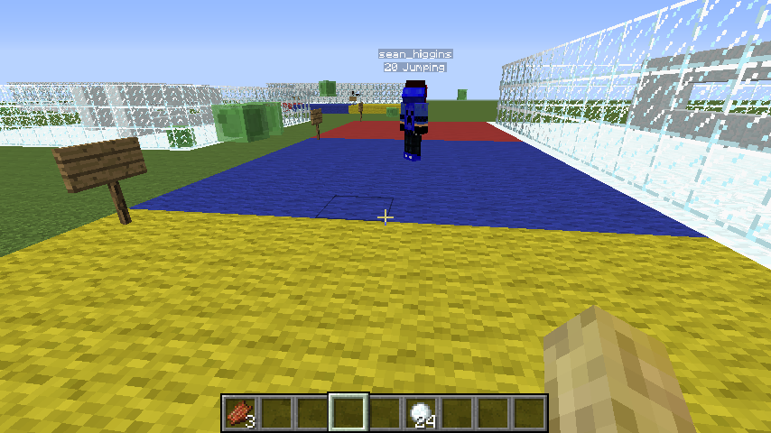

#### How many teams?
Next the *snowball* command function checks how many teams have players. If there's only one team then the game won't begin:

    if ( (teams.red.length == 0 && teams.blue.length == 0)
      || (teams.red.length == 0 && teams.yellow.length == 0)
      || (teams.blue.length == 0 && teams.yellow.length == 0))
    {
      player.sendMessage('Need more than one team to play. Someone choose a different color.');
      return;
    }

#### Starting and Stopping the game
Finally - assuming the player who issued the command wants to play and there are enough teams/players to play - we teleport the players into the arena and begin the game using the *SnowballFight()* function defined earlier in this chapter. 
We also schedule a deferred function call using the *setTimeout()* function. The *returnPlayers()* function will be invoked 5 seconds after the game has ended and will return each player to the waiting area they were in before the game started. A firework will launch above each player of the winning team so everyone - players and spectators - will know which team won the game. 

### Summary
In this chapter we built a player vs. player mini-game from scratch. We *re-used* many of the functions we wrote in earlier chapters and made good use of the Drone object to create an arena in which to play the game. This has been the most complex of the new features we've added to Minecraft over the course of this book, but it's also one which is fun to play with your friends. 

Playing games is fun but writing your own games can be hugely rewarding, especially when you get to see your friends play a game you created!

### Conclusion
While this brings us to the end of the book, we have only just begun to explore the world of Minecraft Plugin Development. My aim with this book was to provide a solid foundation from which to begin developing your own Minecraft Plugins. I've tried to cover all of the basics and some advanced topics, and provide examples along the way. There's still lots to learn about Minecraft Plugin development but I hope this book gives you the confidence to begin creating your own Plugins.

It's been a lot of fun writing this book and I hope you've enjoyed reading it and have learned something about Programming along the way. 

# Appendices

## Appendix A: ScriptCraft variables
### The *server* variable
The *server* variable is a global variable provided by ScriptCraft. It refers to the *org.bukkit.Server* object which is a Java object representing the Minecraft Server. Refer to http://jd.bukkit.org/rb/apidocs/org/bukkit/Server.html for full details of all of the methods available for this object.

### The *bukkit* variable
The *bukkit* variable is a global variable with just a handful of methods to make life easier for Javascript programmers. You can see the full list of methods at http://scriptcraftjs.org/docs/API-Reference.html#bukkit

### The ____plugin variable
This global variable is a reference to the ScriptCraft plugin. Some Bukkit API methods require an *org.bukkit.plugin.Plugin* object as a parameter. If you need to call such methods from Javascript you should provide the ____plugin variable where an object of type *org.bukkit.plugin.Plugin* is required.

### The *self* variable
The *self* variable is a *short-lived* variable which only exists briefly during the execution of a */js* command. The *self* variable refers to the *sender* - that is - the player or console operator who is issuing the */js* command. You should never use the *self* variable in your modules - *especially in multi-player mode*! It should not be used in any function which is deferred as it does not exist outside the scope of the in-game or server prompts.

## Appendix B: Using ScriptCraft with other Plugins
ScriptCraft can be used to work with and control other Bukkit Plugins. There are two ways ScriptCraft can interact with other Plugins:

1. By issuing plugin commands
2. By using the plugin's methods and classes.

### Issuing commands
The *server.dispatchCommand()* method can be used to issue both built-in commands such as */time set* or commands provided by plugins. ScriptCraft can be used to *drive* commands provided by other plugins. For example, if you wanted to use the *Essentials* plugin's */eco give* command to give a player in-game money via Javascript you'd write:

    server.dispatchCommmand( server.consoleSender, 'eco give walterh 5')

You could create an event listener function which listens for certain types of events and rewards or subtracts in-game currency from players who trigger those events. For example, you could reward players for crafting items like so:

    events.craftItem( event ){
      var crafter = event.whoClicked.name;
      var command = 'eco give ' + crafter + ' 5';
      server.dispatchCommand( server.consoleSender, command);
    }    

Many plugins provide their own set of commands all of which can be issued by the server console operator ( *server.consoleSender* ).

### Using plugin methods and classes
Another way to access and use another plugin is via the Java methods and classes provided by the plugin you want to control. In the following example, we're using the popular *PermissionsEx* plugin: a Bukkit plugin which provides fine-grained access control and permissions. You can explore the *PermissionsEx* API reference at http://ci.nixium.com/job/PermissionsEx/javadoc/.

    var playerName = 'walterh';
    var pexPlugin = server.pluginManager.getPlugin('PermissionsEx');
    var pexUser = pex.getUser(playerName)
    if (! pexUser.inGroup('moderator') ) {
       pexUser.player.sendMessage("You can't do that!");
    }

In the above example, we call the *server.pluginManager.getPlugin()* method to get a particular plugin object. Once we have the plugin object we can call any of its methods to work with the plugin.

## Appendix C: Events Reference
The following tables list all of the *events* module's functions which can be used to register event listeners. Alongside each function, the equivalent Java Event type is shown. You should refer to the Bukkit API Reference documentation at http://jd.bukkit.org/rb/apidocs/ for details about each Java Event type. Event types fall into a number of categories each of which are listed below.

@@include target/events-reference.html

## Appendix D: Items reference
The *items* module provides a suite of useful functions for creating *Item Stacks* - that is - collections of objects which are typically stored in a Player's inventory. Each of the functions in the following table can be called in 3 different ways:

1. If there is no parameter supplied the function will return the equivalent *Material* - that is - one of the values of the *org.bukkit.Material* type. For example, calling `items.diamondOre()` will return the *org.bukkit.Material.DIAMOND_ORE* value which is of type *org.bukkit.Material* and can be used anywhere the Bukkit API expects an *org.bukkit.Material* object.
2. If a number is supplied as the sole parameter, then a new *org.bukkit.inventory.ItemStack* object is returned. For example, calling `items.diamondOre(8)` will return an *ItemStack* composed of 8 blocks of diamond ore.
3. If a *Material* object is supplied as the sole parameter, then the material is compared with the material type associated with the given function and will return *true* if the materials are of the same type. For example, to see if a player is currently holding diamond ore: `var isDiamond = items.diamondOre( player.itemInHand.type )`.

Remember to load the *items* module using the following code before using any of its functions:

    var items = require('items');

Listed below are all of the *items* module's functions:

@@include target/items-reference.html

## Appendix E: Drone API Reference
@@include target/drone-api-reference.md

## Appendix F: Function Declarations vs Function Expressions
In Javascript the two most common ways to define functions are by using *function declarations* and *function expressions*. A function declaration looks like this:

    function myFunction(){
    }

...while a function expression looks like this:

    var myFunction = function(){
    };

Throughout this book I have defined functions using *function declarations* rather than *function expressions*. I've done so because:

1. This is a book for beginners. Wherever there are  2 or more possible approaches to doing something in Javascript, I've endeavored to present only the simplest approach so that beginners are not overwhelmed by Javascript's flexible syntax.
2. Function declarations *require* the function to have a name whereas function expressions do not. A named function - that is - a function which was given a name as part of its definition rather than merely assigned to a named variable - can call itself since its name is guaranteed to be in scope within the function's body. It's considered best practice to name functions whether they are defined as expressions or declarations.
3. A function declaration is slightly shorter to type than its function expression equivalent.
4. Named functions are useful when covering the topic of recursion and are also used throughout ScriptCraft. 

Even if you decide to use function expressions as you become more adept at Javascript programming, it's a good idea to give your function a name.
